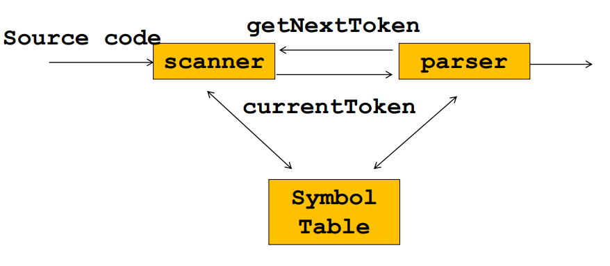
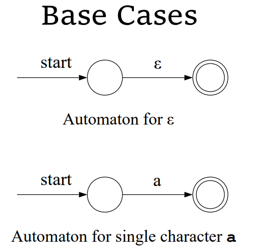
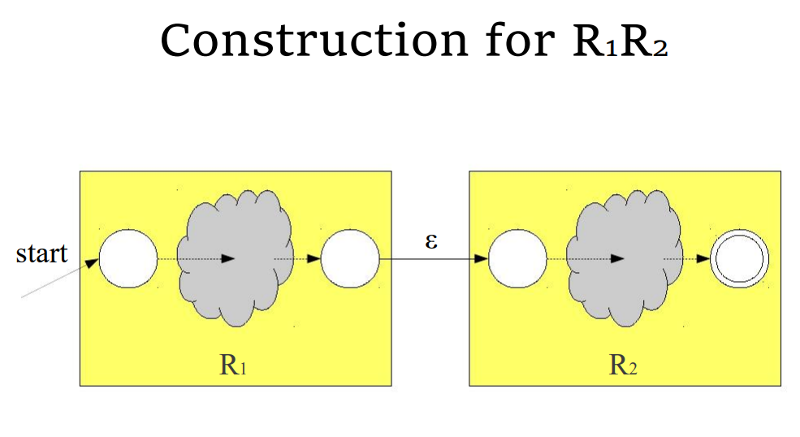
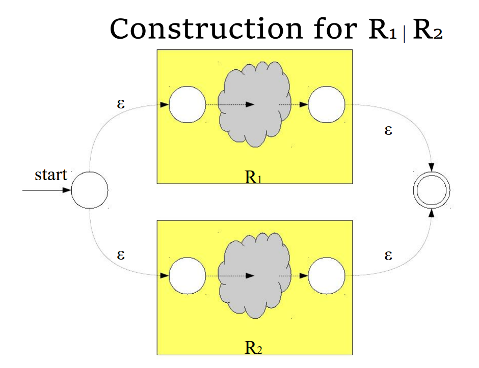
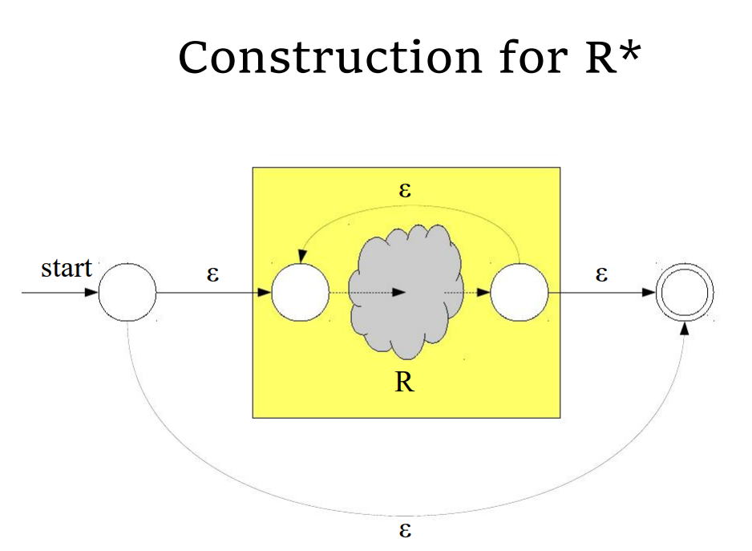
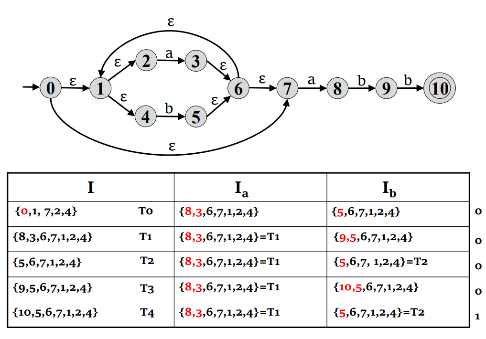
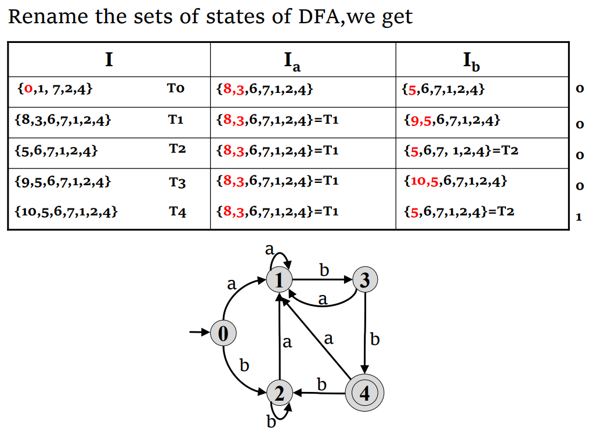
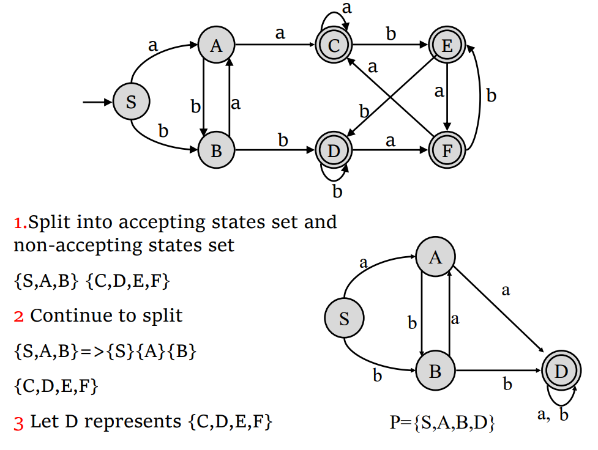

## 大纲

- 扫描过程 Scanning Process
- 正则表达式 Regular Expressions
- 有限自动机 Finite Automata(NFA(nondeterministic 非确定性有限自动机) and DFA(deterministic 确定性))
- RE转换NFA(McNaughton-Yamda-Thompson algorithm)
- NFA 转换DFA(子集算法 Subset construction Algorithm)
- 最小化DFA(State-Minimization Algorithm)

## 扫描过程

```c
 while(137<n) 
  ++i;
```

$\rightarrow T\_while \rightarrow( \rightarrow T\_IntConst+137\rightarrow<·····$



### 词元（tokens）

- 一个token表示源代码中的一个逻辑语义片段，可以是一个关键字、一个变量名，以$<token\_type,lexeme>$表示
- token表示一组符合特定规则的字符，例如标识符必须以字母开头并只包含字母和数字
- 每个token关联一个词素（lexeme）
  - lexeme即为token的字面值，如“137”，”int“等
- 每个token可能有属性（attributes）
  - 从字面值中得到的额外信息，一般是一个数值，如$137\rightarrow <T\_IntConst,137>$

## 正则表达式

### 形式化语言

#### 字符表（alphabet）

- 是指一个由符号（字符、数字、特殊符号）组成的有限集，例如
  
  $$\sum=\{0,1\},A=\{a,b,c\}$$

#### 字符串（string）

- 一个基于某个字符表的字符串是一个由字符表中给出的符号组成的有穷序列
- 特殊的$\varepsilon$ 表示一个空串，但不等价于空集
- 例如
  - 0，00，10是$\sum=\{0,1\}$的字符串
  - a，ab，aaca是$A=\{a,b,c\}$的字符串

#### 语言（language）

- 由基于某一给定的字符表的一系列字符串组成的集合
- $\{\varepsilon\}和空集\Phi$ 都是语言

##### 语言的运算

| $Operation$      | $Definition\;\; And \;\; notation$                              |
| ---------------- | ------------------------------------------------------ |
| $Union\;\; of\;\; L\;\; and\;\; M$ | $L\bigcup M = \left\{s\mid s\in L \lor s\in M\right\}$ |
|     $Concatenation\;\; of\;\; L\;\; and\;\; M$            |  $LM=\{st\mid s\in L \land t\in M\}$                                                      |
|   $Kleene\;\; closure\;\; of\;\; L$               |      $L^*=\bigcup^\infty_{i=0}L^i$                                                  |
|       $Positive\;\; closure\;\; of\;\; L$           |      $L^{+}=\bigcup^\infty_{i=1}L^i$                                                  |

### 正则表达式语法

#### 原子表达式

- $\varepsilon$匹配一个空串
- 字符表中的符号a只匹配a

#### 复合表达式

假设$R_1和R_2$是两个正则表达式，那么：

- $R_1R_2$是它们的级联
- $R_1|R_2$是它们的并集
- $R^*$是它们的Kleene闭包
- (R)可以提高运算优先级（$(R)>R^*>R_1R_2>R_1|R_2$）

#### 例子

- 中间包含00的任意串：$(0|1)^*00(0|1)^*$
- 包含最多一个零：$1^*(0|\varepsilon)1^*$或$1^*0?1^*$
- 标识符：$letter(letter|digit)^*$

## 有限自动机

### 概念

- 正则表达式可以用一个有限自动机来实现
- 有两种类型的有限自动机——NFA与DFA
- 核心思想$RE\rightarrow NFA\rightarrow DFA$

### 有限自动机的数学定义

是一个五元组(tuple)

$$\begin{array}{c}
M=(  \sum,S,F,S_{0},S_{a} )\\
F:S\times \sum \rightarrow S \\
\sum为符号表 \\
S为状态集 \\
F为状态转移函数 \\
S_0为初始态 \\
S_a为接受态
\end{array} $$

### NFA（Nondeterministic Finite Automata）

- 对于给定的状态，一个输入会有多个转移
- 可以有$\varepsilon$转移

#### NFA的执行

1. 维护一个下一状态的集合，初始为空
2. 对于每个当前状态，执行
   1. 对于当前输入执行全部转移
   2. 将所有转移的结果加入下一状态的集合中
3. 再将所有$\varepsilon$转移加入下一状态集合中

#### NFA时间复杂度

- 对一个长为$m$的字符串，并且有$n$个状态的自动机，时间复杂度为$O(mn^2)$

### DFA（Deterministic Finite Automate）

- 每个状态每个输入只会有一个转移
- 没有$\varepsilon$转移

#### DFA的执行

```cpp
int kTransitionTable[kNumStates][kNumSymbols]={
{2,1,3,0,0,3}
};
bool kAcceptTable[knumStates] = {
 true,
 true,
 false ...
}
bool simulateDFA(string input){
 int state = 0
 for(char ch: input)
  state = kTransitionTable[state][ch];
 return kAcceptTable[state];
}
```

#### DFA时间复杂度

- 对于任意复杂的自动机，都有$O(n)$的时间复杂度

## RE到NFA

### McNaughton-Yamada-Thompson 算法

#### 算法

- 将RE分为连续的子表达式(subexpression)，每个括号内表示一个子表达式，可以用一个一般树来描述，越靠近根节点运算优先级越低
$$ab|c^* \rightarrow ((ab)|(c^*))$$
- 构建起基本子表达式的NFA
- 再将构建起来的NFA结合起来，形成最终的NFA

#### 基本子表达式的NFA






- 对于一个长度为$m$的正则表达式和有$n$个状态的NFA，可以在$O(mn^2)$的时间里判断这个正则表达式是否被匹配

#### 特点

- 只有一个接收态
- 接收态没有出变迁(没有出边)
- 初始状态没有入变迁(没有入边)

## 冲突解决

- 最长子串(Maximal munch)：尽可能识别更长的子串
- 优先级系统(priority system 硬编码)：给不同的token设置不同的优先级

## NFA到DFA

- $\varepsilon$闭包：将NFA状态及其$\varepsilon$可达的加入当前NFA状态集中：$\varepsilon\_closure(I) =I\cup(U_{S\in I}edge(s,\varepsilon))$
- move方法：$move(I,a)=\{t|s\in I,t=T(s,a)\}$
- 子集构造法：$Subset\;I_a=\varepsilon\_closure(Move(I,a))$

### 子集构造算法

1. 计算$M$的初始状态$的\varepsilon\_closure$，并作为$M^{'}$ 的初始状态
2. 对于这个集合以及每个后续集合 S ，我们计算每个字符 $a∈Σ$ 上的转换 $S_a$，这定义了一个新状态以及一个新转换$S\stackrel{a}{\longrightarrow} S_a$
3. 不断进行这个过程，直到没有新的状态和转换生成
4. 标记包含接受态的状态




## 最小化DFA

- 等价状态：对于两个状态$S_a和S_b$，如果对于符号表中的每一个输入，$S_a和S_b$都有相同或等价的k个状态，则这两个状态是等价的

### Hopcroft算法

1. 将DFA中的状态划分为两个等价类：接受状态和非接受状态。
2. 对于每个等价类，根据输入字符的转移关系。如果对于某个字符使得一个等价类内的一个状态转移到另一个等价类中的状态，就将这个状态其进一步划分为更小的等价类。
3. 重复第2步，直到不能再划分为止。

```c
//基于等价类的思想
split(S)
    foreach(character c)
        if(c can split s)
            split s into S1, S2 
    //分别表示未迁出的状态集合和迁出的状态集合

hopcroft()
    split all nodes into N, A
    while(set is still changes)
        split(s)
```



- 不过一般做题直接颅内找等价就行了，不用一定按照这个划分一步步做下去。
