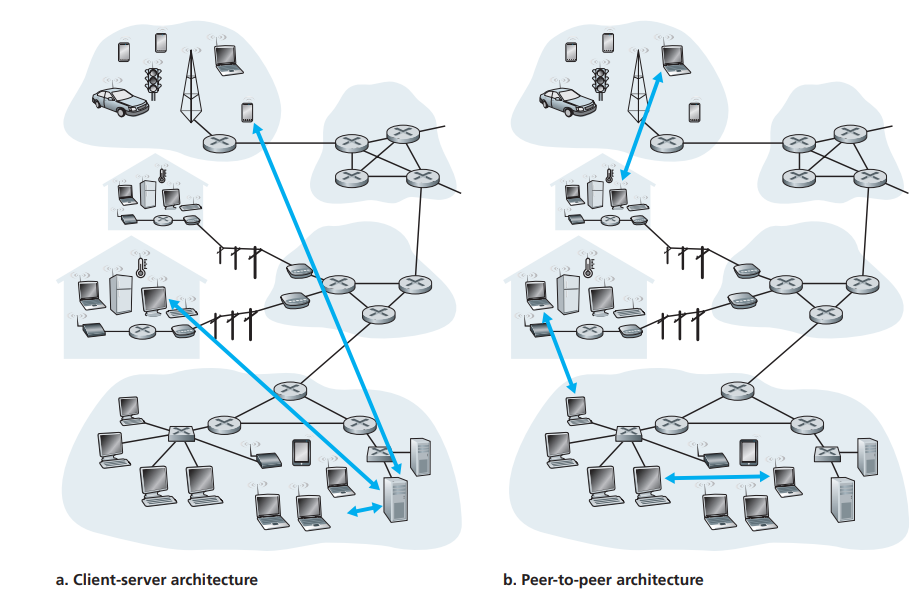

## 应用层协议原理

### 网络应用程序体系结构

#### 客户-服务器结构(Client-Server)

- Web、FTP、Telnet、电子邮件都是通过这种结构进行构建的，由一个总是打开的主机，称为服务器(Server)，用来服务来自许多被称为客户(Client)其他主机的请求。

- 而在这种结构下，单台主机通常会难以应付大量的请求，因此会在配备了大量主机的数据中心(data center)中创建虚拟服务器来满足客户端请求的需求。

#### P2P 体系结构(Peer-to-peer)

- 在这种体系结构中，对数据中心中的服务器有最小(或者没有)依赖，应用程序在间断连接到主机对之间直接通信，这些主机对被称为对等方(peer)。许多流量密集型的应用都采用了这种方法，例如文件共享(BitTorrent)，P2P 下载加速器(迅雷)，Internet 电话和视频会议(例如 Skype)。而且 P2P 结构有强大的自扩展性(种子越下越快)

- 而在某些应用中会使用混合结构，例如对许多即时讯息应用而言，会通过服务器来追踪用户的 IP 地址，而具体的数据传输则在 P2P 结构中传输。

### 进程通信

- 网络通信实际上是以进程而不是程序为单位的，两个主机间的两个进程通过在网络中不断交换报文而相互通信。

#### 客户与服务器进程

- 网络应用程序通常以成对的进程出现，例如在 Web 应用程序中，浏览器是客户进程，Web 服务器是服务器进程，在 P2P 中，上传文件的是服务器，下载文件的是客户，但是一个 P2P 进程可能既上传又下载，那么在这个过程中上传时作为服务器，下载时作为客户

#### 进程与计算机网络之间的接口

- 进程通过一个叫套接字(socket)的软件接口向网络发送报文和从网络接受报文。socket 的具体实现是由操作系统完成的，而 socket 也被称为应用程序和网络之间的 API。开发者可以控制 socket 在应用层的所有行为和在传输层的一点(几乎没有)行为：选择传输层协议和一部分传输层的参数(例如最大缓存和最大报文段长度)

#### 进程寻址

- 为了能正确发送 packet 到指定的进程，需要两个信息：主机的地址和目的主机中接受进程的标识符，前者我们通过 IP 地址来唯一确定一台主机在计算机网络中的地址，而后者通过目的地端口号(port number)来辨别，常见的有 Web 服务器的 80 端口和 SMTP 协议的 25 端口。

### 选择传输层协议

- 包括 Internet 在内的许多网络都提供了不止一种传输层协议。当开发一个应用时我们需要根据具体的需求来选择对应的协议
  
  

### 应用层协议

- 应用层协议定义了分布在不同主机上的应用程序进程要怎么相互传递报文，特别是定义了：
  - 交换的报文类型，例如请求(GET)报文和响应报文，
  - 各种报文类型的语法，如报文中的各个字段是什么
  - 字段的语义，即每个字段中的信息的含义
  - 确定一个进程何时以及如何发送报文，以及对报文进行响应的规则
- 有些应用层协议是由 RFC 文档定义的，它们就位于公共域中，例如 HTTP、SMTP 等，还有一些是专用的，例如 Skype 使用的专用应用层协议。

## Web 和 HTTP

### 持续与非持续连接

- 对每个请求/相应对，是经由一个单独的 TCP 连接发送，还是所有的请求及其相应经过相同的 TCP 连接发送，前者被称为非持续连接(non-persistent connection)，后者被称为持续性连接(persistent connection)。尽管 HTTP 默认采用持续连接，但是两者都能使用于 HTTP 连接中

#### 采用非持续连接的 HTTP

- 以传输一个包含十个 JPEG 图形的 HTML 页面为例，在传输的时候会有以下流程：

  1. HTTP 客户进程在 80 端口发起一个到服务器www.example.com的TCP连接，80端口是HTTP的默认端口。在客户端和服务器端分别有一个socket和这个TCP连接相关联
  2. HTTP 客户端经由他的 socket 向这个服务器发送一个 HTTP 请求报文。报文包含这个 HTML 的路径/Some/home.index
  3. HTTP 服务器进程经由他的 socket 接收报文，从其存储器中检索对象 <www.example.com/Some/home.index> ，并将其封装在一个 HTTP 相应报文中，并通过其 socket 向客户端发送响应报文。
  4. HTTP 服务器进程通知 TCP 断开该连接(但是直到 TCP 确认客户已经完整地收到响应报文，它才会实际中断连接)
  5. HTTP 客户端接受响应报文，关闭 TCP 连接。报文指出其封装的对象是一个 HTML 文件，客户从响应报文中提取出该文件，检查该 HTML 文件，得到对 10 个 JPEG 图形的引用。
  6. 对每个 JPEG 图形重复前面的四个步骤

- HTTP 并没有定义客户端如何解释一个 Web 页面，HTTP 规范仅仅是定义了一个通信协议。

##### RTT

- 指的是往返时间(Round-Trip Time)，指一个短 packet 从客户端到服务器然后再返回客户端所花费的时间。RTT 包括 packet 传播延迟、排队延迟和处理延迟。而在一次请求-响应中，涉及一次“三次握手”的过程，而前两次握手占用一个 RTT 的时间，第三次握手和返回数据占用了一个 RTT 和一个传输 HTML 文件的时间。因此总响应时间就是两个 RTT 加上服务器传输 HTML 文件的时间。
  

#### 采用持续连接的 HTTP

- 非持续连接有一些缺点，第一，必须为每个请求的对象维护一个全新的连接，客户和服务器都有分配空间用于 TCP 缓冲区和保存 TCP 变量，给服务器带来很大的负担。第二，每个对象都有两倍 RTT 的交付延迟，即一个 RTT 用于创建 TCP，另一个 TCP 用于请求和接收一个对象。
- 因此可以在发送响应后保持该 TCP 连接打开，后续的请求和响应报文可以通过这个 TCP 连接进行。更有甚者，位于同一台服务器的多个 Web 页面可以在单个持续的 TCP 连接上进行，而且对这些对象的请求可以连续发出，而不需要等待对未决请求的回答(流水线式处理)。HTTP 的默认模式就是带流水线的持续连接。

### HTTP 报文格式

#### HTTP 请求报文

- 请求行(Request line)：
  - method：定义了 GET, POST, HEAD 等行为
  - URL：请求的对象的路径(/Some/home.index)
  - HTTP 版本
- 首部行(Header lines)：
  - Host：指定目标主机地址(例如 <www.example.com>)，既然已经存在TCP连接，为什么还有这个字段，因为在后续的Web代理高速缓存中会使用到它
  - User-agent：用户代理，即向服务器发送请求的浏览器的类型。
  - Accept-language：表示用户想得到的语言版本
- 实体(entity body)：例如提交的表单、上传的文件。

#### HTTP 响应报文

- 状态行(Status line):
  - 版本：表示 HTTP 版本
  - 状态码(status code)和短语(phrase)：指示了请求的结果，常见的有 200-OK; 301-Moved Permanently; 404-Not found
- 首部行(Header lines)：
  - Content-length：指示了被发送对象中的字节数
  - Content-type：指示了实体中的对象格式
  - ....：还有一系列的属性
- 实体(entity body)：实际返回的响应对象

### 用户与服务器的交互：cookie

- cookie 包括四个组件：
  1. 在 HTTP 响应报文中有一个 cookie 首部行
  2. 在 HTTP 请求报文的一个 cookie 首部行
  3. 在用户端系统中保留有一个 cookie 文件，由用户的浏览器进行管理
  4. 位于服务器的一个后端数据库
     

### Web 缓存

- Web 缓存也叫代理服务器，在访问www.example.com的时候会发生如下情况：

  1. 浏览器创建一个到 Web 缓存器的 TCP 连接，并向 Web 缓存器中的对象发送一个 HTTP 请求。
  2. Web 缓存器进行检查，看看本地是否存储了该对象副本。如果有，Web 缓存器就向客户浏览器用 HTTP 响应报文返回该对象。
  3. 如果 Web 缓存器中没有该对象，它就打开一个与该对象的初始服务器(即www.example.com)的TCP连接，Web缓存器则在这个缓存器到服务器的TCP连接上发送一个对该对象的HTTP请求。在收到请求后，初始服务器向该Web缓存器发送具有该对象的HTTP响应。
  4. 当 Web 缓存器收到该对象时，它在本地存储空间存储一份副本，并向客户的浏览器用 HTTP 响应报文发送该副本(通过已经建立的 TCP 连接)

- 它有两个好处，一是可以提高响应速度，尤其是考虑到客户和初始服务器之间的速度瓶颈远低于客户和代理服务器之间的瓶颈。二是可以减少服务器的上行带宽成本。

### 条件 GET

- 然而有一种情况，存放在缓存器中的对象副本有可能是旧的文件，因此 HTTP 中引入了这种机制：如果请求报文使用 GET 方法，而且包含一个"If-Modified-Since："首部行，那么这就是一个条件 GET 报文。

- 来看一个例子：
  1. 代理缓存器向 Web 服务器发送请求报文
     
  2. 然后该 Web 服务器向缓存器发送具有被请求的对象的响应报文
  3. 该缓存器在将对象转发到请求的浏览器的同时，也在本地缓存了对象。重要的是还同时存储了最后修改时间(Last-modified)。一个星期后另一个用户再请求同一个对象，这时该缓存器通过发送一个条件 GET 来执行最新检查：
     
  4. 值得注意的是 If-Modified-since 字段的值恰好等于 Last-Modified，换句话说，该条件 GET 告诉服务器，仅当自指定日期后该对象修改过才发送该对象。假设没有被修改，那么 Web 服务器会向缓存器发送一个响应报文
     
- 我们看到，作为对条件 GET 的响应，Web 服务器依然发送一个响应报文，但是并没有发送一个对象。而且状态行中为 304-Not Modified。

## 电子邮件

- 暂略

## DNS：Internet 的目录服务

- 识别主机有两种方式，主机名或者 IP 地址，而路由器只能解析定长的 IP 地址，那么就需要进行转换

### DNS 提供的服务

- 为了进行主机名到 IP 地址的转换，域名系统(Domain Name System, DNS)是：
  1. 一个由分层的 DNS 服务器实现的分布式数据库
  2. 一个使得主机能够查询分布式数据库的应用层协议
- DNS 服务器通常是运行 BIND(Berkeley Internet Name Domain)软件的 UNIX 机器。DNS 协议运行在 UDP 上，使用 53 端口。
- 当客户主机请求 <www.example.com/index.html> 时，DNS 的做法如下：
  1. 同一台用户主机上运行着 DNS 应用的客户端
  2. 浏览器从上述 URL 中抽取出主机名 <www.example.com> ，并发送给 DNS 应用的客户端
  3. DNS 客户向 DNS 服务器发送一个包含主机名的请求
  4. DNS 客户端最终会收到一份回答报文，其中含有对应于该主机名的 IP 地址
  5. 一旦浏览器接收到来自 DNS 的 IP，它就能向位于该地址的 80 端口的 HTTP 服务器进程发起一个 TCP 连接。
- 除此之外，DNS 还提供了一些重要的服务：
  1. 主机别名(host aliasing)：例如一台名为 relay1.west-coast.enterprise.com 的主机，可能还有两个别名 enterprise.com 和 <www.enterprise.com> ，这种情况下，relay1.west-coast.enterprise.com 被称为规范主机名(cononical hostname)。主机别名更加容易记忆，应用程序可以通过调用 DNS 来获取主机别名对应的规范主机名的 IP 地址
  2. 邮件服务器别名：类似于主机别名和规范主机名，邮件服务器名也有这样的机制，通过 DNS 服务器来获取主机别名对应的规范主机名的 IP 地址。事实上，MX 记录(见后)允许公司有相同的邮件服务器和 Web 服务器的主机名
  3. 负载分配：在一个大型系统中，一系列主机(多个 IP 地址)会有相同的规范主机名(如 <www.baidu.com>)，而DNS数据库存储着这些IP地址集合，当客户对这个主机名做出请求时，会在这个集合中循环取出IP地址返回给客户，达到负载均衡的作用

### DNS 工作机理概述

- 因为 DNS 请求量大，且分布于全球各地，所以 DNS 是一个在 Internet 上实现的分布式数据库

#### 分布式、层次数据库

- DNS 服务器有三种类型：根 DNS 服务器，顶级域(Top-Level Domain, TLD)DNS 服务器和权威 DNS 服务器。这些服务器以下面的形式组织起来，例如要查询www.baidu.com的IP地址，客户将与分布在全球的DNS根服务器联系，然后根服务器返回顶级域名com的TLD服务器的IP地址，然后客户再与这些TLD服务器之一联系，它将返回baidu.com的权威服务器的IP地址，最后，该客户与baidu.com权威服务器之一联系，它为主机名www.baidu.com返回其IP地址。
  
- 本地 DNS 服务器(local DNS server)：每个 ISP(如一个居民区的 ISP 或者一个机构的 ISP)都有一台本地 DNS 服务器(也叫默认名字服务器)。当主机与某个 ISP 连接时，该 ISP 提供一台主机的 IP 地址，该主机具有一台或多台其本地 DNS 服务器的 IP 地址(通常通过 DHCP)。当主机发出 DNS 请求时，该请求被发往本地 DNS 服务器，它起着代理的作用，并将该请求转发到 DNS 服务器层次结构中。
  
- DNS 服务器也有缓存的功能，尤其是本地 DNS 服务器，既可以直接缓存目标服务器的 IP 地址，也可以缓存 TLD 服务器的 IP 地址，因此很多请求都绕过了根 DNS 而直接向 TLD 服务器请求。

### DNS 记录和报文

- DNS 分布式数据库中存储了资源记录(Resource Record, RR)，RR 提供了主机名到 IP 地址的映射，每个 DNS 回答报文都包含了一条或多条资源记录，资源记录是一个包含了下列字段的 4 元组
  $$(Name,\;Value,\;Type,\;TTL)$$
- TTL 时该记录的生存时间，决定了资源记录从缓存中删除的时间，我们暂时不讨论它，而 Name 与 Value 的值取决于 Type：
  1. 如果 Type = A，Name 是主机名，Value 是该主机名对应的 IP 地址。因此一条类型为 A 的资源记录提供了标准的主机名到 IP 地址的映射。例如(relay1.bar.foo.com, 145.37.93.126, A)就是一条类型 A 记录。
  2. 如果 Type = NS，则 Name 是个域(如 <foo.com>)，而 Value 是个知道如何获得该域中主机 IP 地址的权威 DNS 服务器的主机名。这个记录用于沿着查询链来路由 DNS 查询。例如(foo.com, dns.foo.com, NS)就是一条类型为 NS 的记录
  3. 如果 Type = CNAME，则 Value 是别名为 Name 的主机对应的规范主机名。该记录能够向查询的主机提供一个主机名对应的规范主机名，例如(foo.com, relay1.bar.foo.com, CNAME)就是一条 CNAME 类型的记录
  4. 如果 Type = MX，则 Value 是个别名为 Name 的邮件服务器的规范主机名，例如(foo.com, mail.bar.foo.com, MX)就是一条 MX 记录。MX 记录和 CNAME 记录用来区分同一个规范主机名的邮件服务器别名和普通服务器别名。意思就是如果是为了获取邮件服务器的规范主机名，DNS 客户应当请求一条 MX 记录，而为了获得其他服务器的规范主机名，DNS 客户应当请求 CNAME 记录。

#### DNS 报文

- 前 12 个字节是首部区域，其中有几个字段。第一个字段（标识符）是一个 16 比特的数，用于标识该查询。这个标识符会被复制到对查询的回答报文中，以便让客户用它来匹配发送的请求和接收到的回答。标志字段中含有若十标志。1 比特的“查询/回答”标志位指出报文是查询报文（0）还是回答报文(1)。当某 DNS 服务器是所请求名字的权威 DNS 服务器时，1 比特的“权威的”标志位被置在回答报文中。如果客户（主机或者 DNS 服务器）在该 DNS 服务器没有某记录时希望它执行递归查询，将设置 1 比特的“希望递归”标志位。如果该 DNS 服务器支持递归查询，在它的回答报文中会对 1 比特的“递归可用”标志位置位。在该首部中，还有 4 个有关数量的字段，这些字段指出了在首部后的 4 类数据区域出现的数量。
- 问题区域包含着正在进行的查询信息。该区域包括：1.名字字段，包含正在被查询的主机名字；2.类型字段，指出有关该名字的正被询问的问题类型，例如主机地址是与一个名字相关联（类型 A）还是与某个名字的邮件服务器相关联（类型 MX）。
- 在来自 DNS 服务器的回答中，回答区域包含了对最初请求的名字的资源记录。前面讲过每个资源记录中有 Type(如 A、NS、CNAME 和 MX)字段、Value 字段和 TTL 字段。在回答报文的回答区域中可以包含多条 RR，因此一个主机名能够有多个 IP 地址（例如，就像本节前面讨论的冗余 web 服务器）。
- 权威区域包含了其他权威服务器的记录。
- 附加区域包含了其他有帮助的记录。例如，对于一个 MX 请求的回答报文的回答区域包含了一条资源记录，该记录提供了邮件服务器的规范主机名。该附加区域包含一个类型 A 记录，该记录提供了用于该邮件服务器的规范主机名的 IP 地址。

#### 在 DNS 数据库中插入记录

- 在向注册登记机构(registrar)注册域名 example.com 时，需要向该机构提供基本和辅助权威服务器的名字和 IP 地址，对于每个服务器，机构都将确保将一个 NS 类型和一个 A 类型的的记录输入 TLD com 服务器。例如(example.com, dns1.example.com, NS)和(dns1.example.com, 123.456.789.1, A)，你还必须确保用于 Web 服务器www.example.com的类型A资源记录和用于邮件服务器的mail.example.com的类型MX资源记录被加入你的权威服务器中
