## 多路复用与多路分解

- 在接收端，运输层检查运输层报文中的几个字段——源端口号和目标端口号。来将报文定向到某个特定的 socket(注意，不是直接把数据发送到进程)的工作被称为多路分解(demultiplexing)。
- 在源主机从不同 socket 中收集数据块，并为每个数据块封装上首部信息从而生成报文段，然后将报文段传递到网络层的工作称为多路复用(multiplexing)
- 运输层和进程之间的数据交换是以 socket 为媒介实现的。
- 端口号是一个 16bit 的数，大小为 0\~65535。0\~1023 范围的端口号被称为周知端口号(well-known port number)，通常是被保留用作例如 HTTP、FTP 等协议使用

### 无连接的多路复用与多路分解

- 在创建 UDP socket 时，需要目的 IP 和目的端口号，而运输层会自动为该 socket 分配一个未被使用的 1024\~65535 的端口号作为源端口号。
- 而一个 UDP socket 是由一个二元组(目的 IP 地址，目的端口号)来唯一标识的。如果两个 UDP 报文段有不同的源 IP 地址和源端口号，而有相同的目的 IP 地址和目的端口号，那么就会被相同的目的 socket 定向到相同的目的进程。

### 面向连接的多路复用与多路分解

- TCP socket 是由一个四元组(源 IP 地址，源端口，目的 IP 地址，目的端口)来唯一确定，因此不同于 UDP，服务器程序会为有相同目的 IP 地址，目的端口，不同的源 IP 地址，源端口的连接开启一个新的进程和一个新的 socket

## UDP(User Datagram Protocol)

- 由程序解决重传等问题
- 在简单的请求——响应操作中使用 UDP，例如 DNS 服务，发送一个包含主机名的 DNS 请求，返回一个 IP 地址的响应
- 对于某些需要自定义阻塞控制、重传方法的场景下也会使用 UDP，例如一些实时视音频
- 无须建立连接，无连接状态(不需要维护连接状态)，packet 的 header 开销小(UDP-8 字节，TCP-20 字节)

### UDP 报头

- 源端口(Source Port)：
- 目标端口(Destination Port)：
- 长度(Length)：整个 UDP 报文的长度(报头加上数据)
- 校验和(CheckSum)：可选的，如果不校验就是全零，UDP 校验包括报文、数据和 IP 的源地址、目的地址、协议值(17 表示 UDP 协议)，用来报文不被传输到错误的地址中
  

### 校验和(Checksum)

- 需要对首部、数据、加上伪首部进行计算校验和：包括 4 字节的源 IP 地址和 4 字节的目的地址，1 字节的全 0，1 字节的 17(UDP 协议号)和两字节的 UDP 长度。如果数据不为偶数个字节，要补上全 0 字节，计算后删除。
- 对所有 16 位的字进行求和再反码，在每次求和过程中出现的溢出要进行回卷(wrap around)
- 例如：

$$
\begin{array}{c}
1100\;0000\;0000\;0000\\
1000\;0000\;0000\;0000\\
0000\;0000\;0000\;0000\\
求和得到:\\
1\;0100\;0000\;0000\;0000(有溢出的第17位)\\
回卷:\\
0100\;0000\;0000\;0000+1=0100\;0000\;0000\;0001\\
取反:\\
1011\;1111\;1111\;1110
\end{array}
$$

- 把取反之后的值放进 checksum 中
- 在接收方中，把所有的 4 个 16 位的字(包括校验和)相加，如果没有出错的话就是全为 1，如果有一位为 0，就说明出错了。
  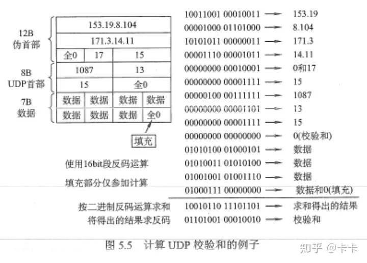

:::info 注意差错检测的适用范围
在 UDP 中实现的是传输层的差错检测，外面后面会看到链路层的差错检测 CRC。而且它对发生在内存中的位错误无能为力(因为已经被 unpackaged 和 repackage 了)
:::

#### 性质

1. 无连接的数据传输
2. 独立数据报：所有发送的数据没有顺序，如果要排序只能在应用层进行数据排序
3. 不可靠：没有确认，没有检测丢失的机制，没有流量控制(可能导致缓冲区溢出而丢失数据)，但是可以在应用程序中选择重新请求数据

## RDT(Reliable Data Transfer)

- 其不同版本（rdt1.0, rdt2.0 等）介绍了运输层实现可靠数据传输的各种组件：序号、计时器、ACK、重传等。rdt 是一个理解 tcp 协议的一个很好基石。 其他层的可靠传输协议，也可以藉由 rdt 思想演化。RDT 协议通过调用 UDP 协议的 seed_to 及 recv_from 函数进行数据包的发送和接收,在此基础上通过实现检验和,报文序列号,确认重传等机制为上层提供一条虚拟的可靠数据信道。
  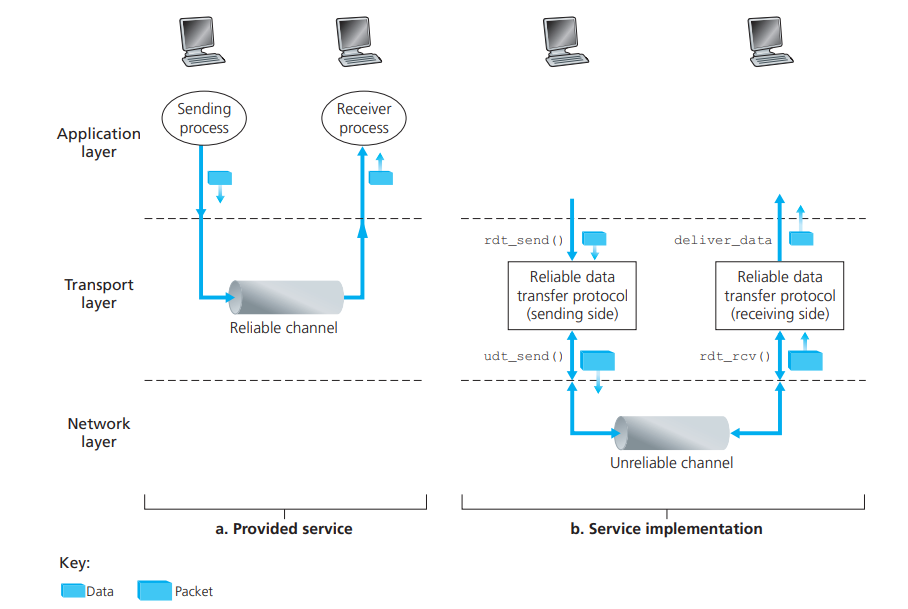

### 构造一个 RDT Protocol

#### 经完全可靠信道的 RDT: rdt1.0

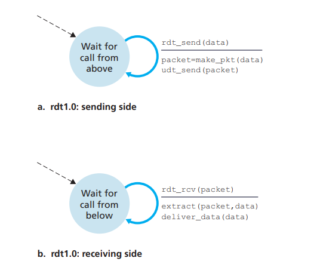

- 而且假定接收方接受数据的速率和发送方发送数据的速率一样快，就不会有接收方要求发送方慢一点的问题。

#### 经具有比特差错信道的 RDT: rdt2.0

- 这种模型中，需要控制报文来让接收方辨别哪些内容被正确接收，哪些内容有误而需要重传，这种 RDT 协议称为自动重传请求(Automatic Repeat reQuest, ARQ)协议。
- ARQ 协议还需要三种协议功能来处理存在 bit 差错的情况：
  1. 差错检测。从最简单的校验和到可能可以修复错误的一些技术。暂时以校验和为例
  2. 接收方反馈。例如 ACK 和 NAK 消息
  3. 重传方法。

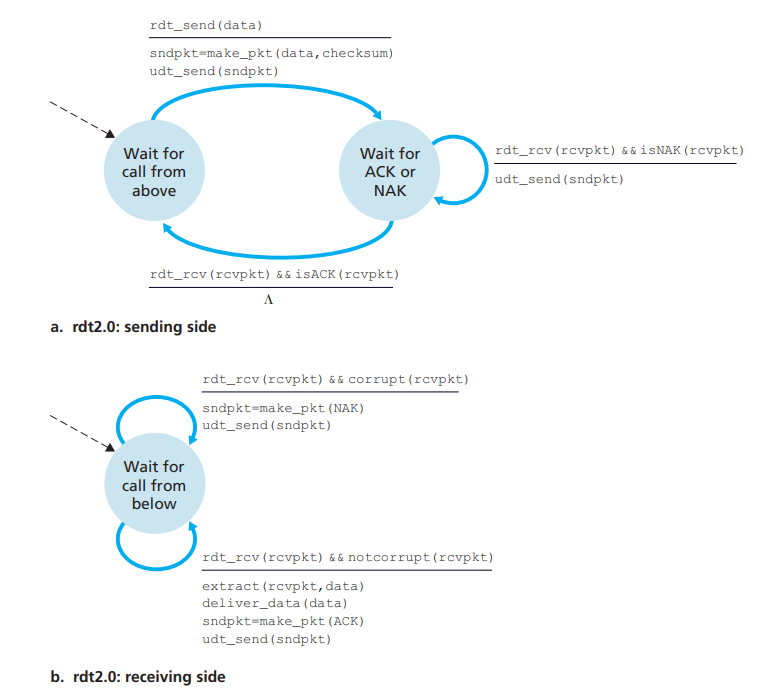

- 当发送方处于等待 ACK 或者 NAK 的状态时，它不能从上层获得更多的数据。就是说 rdt_send()事件不可能出现，除非接收到 ACK 并离开该状态。也就是说在发送方确认接收方已经正确接收当前 packet 之前不会发送新的数据。因为这种行为，rdt2.0 这样的协议被称为停等(stop-and-wait)协议
- 而在这种协议中有致命的问题——ACK/NAK packet 有可能受损！这样的话我们就无法得知是否正确接收 packet。而如果直接重传 packet 的话我们无法区分这个是重传的 packet 还是新的 packet
- 因此我们引入了序号来标识每个 packet 是新 packet 还是重传的 packet

#### 改进版 rdt2.0: rdt2.1 与 rdt2.2


- rdt 2.1 和 rdt 2.2 的细微差距在于，接收方此时必须包括一个由 ACK 报文所确认的序号(在 make_pkt()中包括参数 ACK 0, 或 ACK 1 实现)，发送方此时必须检查接收到的 ACK 报文中被确认的分组序号(在 isACK()中包括参数 0 或 1 来实现)。

#### 经具有比特差错的丢包信道的 RDT: rdt3.0

- 我们认为超过一定时间没收到就判定为丢包，尽管这有可能导致冗余 packet(即实际上没丢，但是重传了)，但是在 rdt2.2 中引入的序号为我们解决了这一问题
- 为了实现基于时间的重传，我们需要一个倒计时定时器，在一个给定的时间结束后，可以中断发送方。因此发送方需要做：
  1. 每次发送一个 packet 就启动一个定时器
  2. 响应定时器中断
  3. 终止定时器


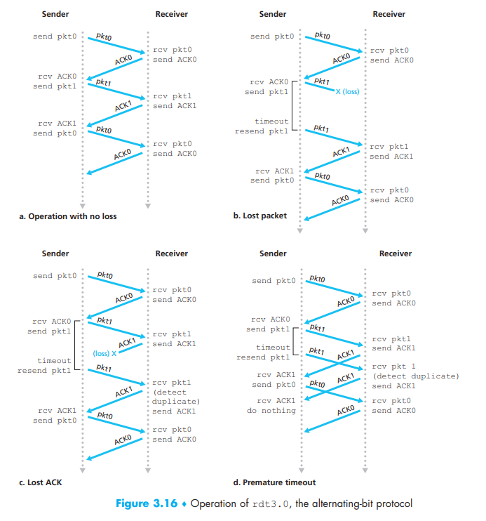

- 由于分组序号总是在 0 与 1 之间交替，有时 rdt3.0 也被称为比特交替协议(alternating-bit protocol)

### 流水线 RDT

- 在停等协议里，对信道的使用率极低
  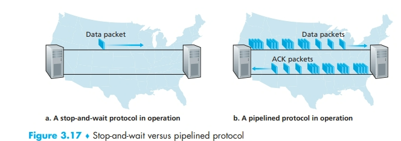

- 因此我们以流水线的方式——即在确认 ACK 抵达前就开始发送新的 packet
  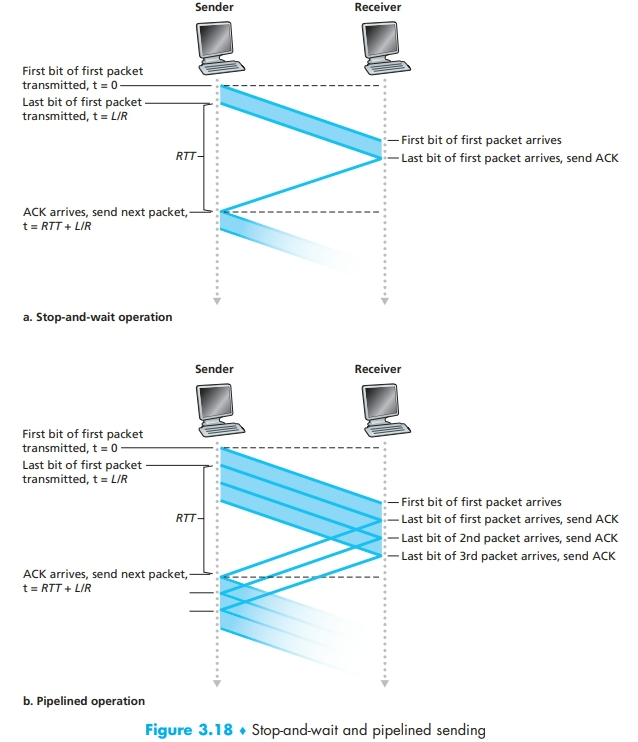

- 我们需要增加序号范围，因为每个运输中的 packet 都要有一个唯一的信号
- 协议的发送方和接收方也要缓存多个分组。发送方最少要缓冲那些已发送但是未确认的 packet，接收方要缓冲那些已经正确接收的 packet
- 所需序号范围和对缓冲的要求取决于数据传输协议如何处理丢包，也就是怎么处理重传。有两种基本方法：回退 N 步(Go-Back-N, GBN)和选择重传(Selective Repeat, SR)

### Go-Back-N

- 基序号(base)：定义为最早未确认 packet 的序号
- 下一个序号(nextdeqnum)：定义为最小的未使用序号，即下一个待发分组的序号
- N 表示流水线中能被允许的最大的未被确认的 packet 数量
- 也就是序号范围被分为 4 组
  $$
  \begin{array}{c}
  [0,\; base-1]段内的序号对应已经发送并被确认的packet\\
  [base,\;nextseqnum-1]段内对应已发送但未被确认的packet\\
  [nextseqnum,\;base+N-1]段内用于那些要被立即发送的pecket
  \end{array}
  $$
  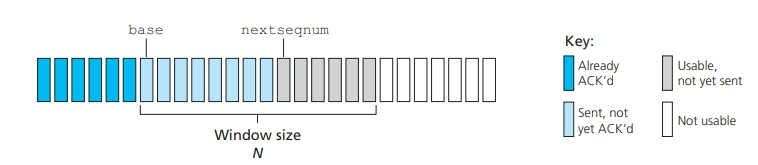
- 随着协议的进行，窗口在序号空间内滑动，因此 N 被称为窗口长度(window size)，GBN 协议也被称为滑动窗口协议(sliding-window protocol)
- 如果分组序号的字段是$k$位的，即序号范围是$[0,2^k-1]$，那么所有涉及序号的运算都要模$2^k$，也就是把序号空间当成环来处理。rdt3.0 的序号空间是$[0,1]$，TCP 中为$[0,2^{32}-1]$

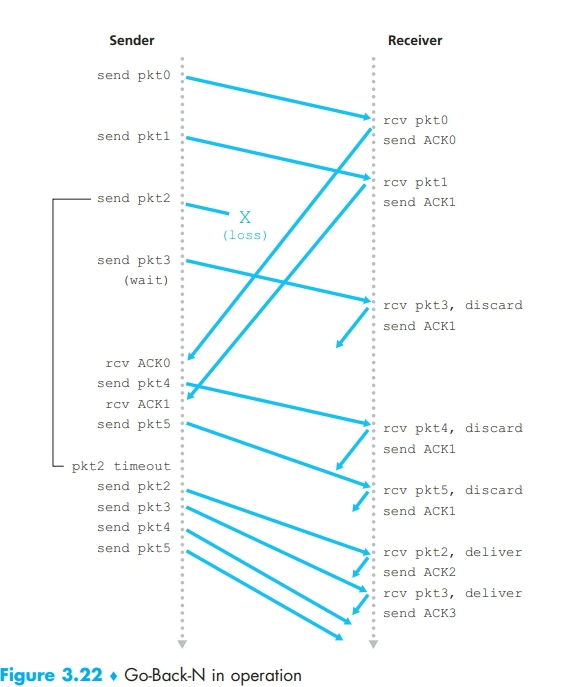

#### GBN 行为

##### GBN 行为——发送方

- 上层的调用。当上层调用 rdt send(）时，发送方首先检香发送窗口是否已满，即是否有 $N$ 个已发送但未被确认的分组。如果窗口未满，则产生一个分组并将其发送并相应地更新变量。如果窗口已满，发送方只需将数据返回给上层，隐式地指示上层该窗口已满。然后上层可能会过一会儿再试。在实际实现中，发送方更可能缓存（并不立刻发送）这些数据，或者使用同步机制（如二个信号量或标志）允许上层在仅当窗口不满时才调用 rdt_send(）。
- 收到一个 ACK。在 GBN 协议中，对序号为 n 的分组的确认采取累积确认（cumu lative acknowledgment）的方式，表明接收方已正确接收到序号为 n 的以前且包括 $n$在内的所有分组。相后讨论 GBN 接收方一端时，找们将再次研究这个主题
- 超时事件。协议的名字“回退 N 步”来源于出现丢失和时延过长分组时发送方的行为。就像在停等协议中那样，定时器将再次用于恢复数据或确认分组的去失。如果出现超时，发送方里传所有已发送但还禾被确认过的分组。如果收到一个 $ACK,$ 但仍有已发送但未被确认的分组，则定时器被重新启动。如果没有已发送但未被确认的分组，停止该定时器。

##### GBN 行为——接收方

- 对按序抵达的 packet 进行接收确认，其他的都丢弃
  

### Selective Repeat

- 同样是用窗口长度 N 来限制未完成、未被确认的 packet 数量。
- 不同的是 SR 的接收方会对失序的分组(即落在窗口内的非起始 packet)进行接收并缓存。
  

#### SR 行为

##### SR 行为——发送方

1. 从上层收到数据。当从上层接收到数据后，,SR 发送方检查下一个可用于该分组的序号。如果序号位于发送方的窗口内，则将数据打包并发送；否则就像在 GBN 中一样，要么将数据缓存，要么将其返回给上层以便以后传输。
2. 超时。定时器再次被用来防止丢失分组。然而，现在每个分组必须拥有其自己的逻辑定时器，因为超时发生后只能发送一个分组。可以使用单个硬件定时器模拟多个逻辑定时器的操作
3. 收到 ACK。如果收到 ACK，倘若该分组序号在窗口内，则 SR 发送方将那个被确认的分组标记为已接收。如果该分组的序号等于 send_base，则窗口基序号向前移动到具有最小序号的未确认分组处。如果窗口移动了并且有序号落在窗口内的未发送分组，则发送这些分组

##### SR 行为——接收方

1. 序号在$[rev\_base， rcv\_base +N-1]$内的分组被正确接收。在此情况下，收到的分组落在接收方的窗口内，一个选择 ACK 被回送给发送方。如果该分组以前没收到过，则缓存该分组。如果该分组的序号等于接收窗口的基序号（图 3-23 中的 $rcv_base$），则该分组以及以前缓存的序号连续的（起始于 $rcv\_base$ 的）分组交付给上层然后，接收窗口按向前移动分组的编号向上交付这些分组。举例子来说，考虑下图。当收到一个序号为$rcv\_base =2$的分组时，该分组及分组 3、4、5 可被交付给上层
2. 序号在$[rcv\_base -N，rcv\_base -1]$内的分组被正确收到。在此情况下，必须产生一个 ACK，即使该分组是接收方以前已确认过的分组。

3. 其他情况。忽略该分组。

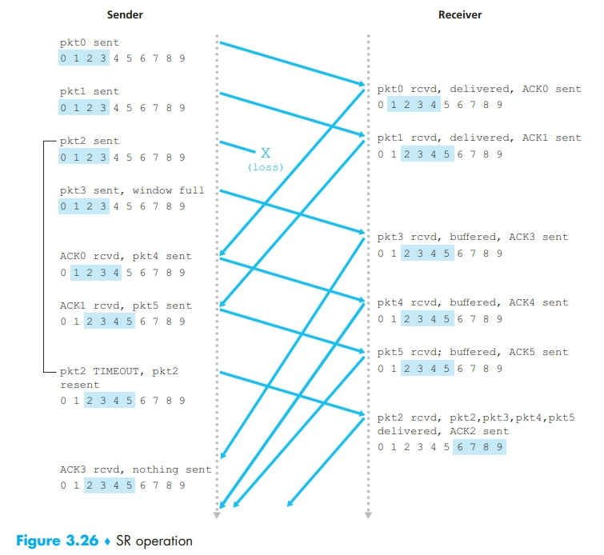

- 对 SR 协议来说，接收方和发送方的窗口并不相同，因此接收方行为的第二步十分重要，以 SR 序号空间的图为例，对于可能出现的 ACK 丢失行为，如果不对之前已经收到的 send_base 处的重传 packet 进行 ACK 响应，那么发送方的的窗口将永远不会向前滑动。

- 在 SR 协议中，窗口大小必须小于等于序号空间的一半，否则在发送方全部接收到最开始发送的一批分组的 ACK 的情况下，序号已经开始了第一次循环使用，这会出现序号重复的问题。

## TCP(Transmission Control Protocol)

- 被广泛使用的可靠的，端到端的(end-to-end)，双向的(birectional)，字节流(byte-stream)服务
- 每次建立 TCP 连接都会建立起一个双向连接，而且两端各自有一个状态机来记录连接的状态
- TCP 可以从发送缓存(send buffer)中取出并放入报文段中的数据数量受限于最大报文段长度(Maximum Segment Size, MSS)。而 MSS 通常又是由链路层的的最大帧长度，也就是所谓的最大传输单元(Maximum Transmission Unit, MTU)来限制。通常就是要 MSS 加上 TCP 的 Header 能等于 MRU 的大小。以太网和 PPP(Point-to-point Protocol)链路层协议都具有 1500 字节的 MTU，因此 MSS 的典型值位 1460 字节。现在有多种方法来获取路径 MTU，即能在路径所有链路上的 MTU，从而来配置 MSS。

### TCP 传输

#### 三次握手

TCP 三次握手是建立一个 TCP 连接时，客户端和服务器总共发送 3 个报文的过程。三次握手的目的是连接服务器指定端口，建立 TCP 连接，并同步连接双方的序列号和确认号，交换 TCP 窗口大小信息。在 socket 编程中，客户端执行 connect()时，就会发起三次握手。

第一次握手：客户端发送一个 SYN 包到服务器，告诉服务器我要发送数据了。
第二次握手：服务器收到 SYN 包后，回复一个 ACK 包和一个 SYN 包，告诉客户端我准备好了，你可以发送数据了。
第三次握手：客户端收到 ACK 包和 SYN 包后，回复一个 ACK 包，告诉服务器我也准备好了，可以开始传输数据了。

这个过程可以实现可靠数据传输，避免双方选择的序列号得不到确认的情况。三次握手后，双方可以知道对方的 MSS，接收缓冲区大小，以及是否支持 SACK，窗口缩放等选项。

- 少一次的话无法确定客户端能收到服务器信息，也无法确认对方能同步序列号等服务器端 TCP 信息。

#### 四次挥手

TCP 四次挥手是断开一个 TCP 连接时，需要客户端和服务端总共发送 4 个包以确认连接的断开。

第一次挥手：客户端发送一个 FIN 报文到服务器，告诉服务器我已经没有数据要发送了。
第二次挥手：服务器收到 FIN 报文后，回复一个 ACK 应答报文，告诉客户端我知道你要断开连接了。
第三次挥手：服务器发送一个 FIN 报文到客户端，告诉客户端我也没有数据要发送了。
第四次挥手：客户端收到 FIN 报文后，回复一个 ACK 应答报文，告诉服务器我知道你也要断开连接了。

这个过程可以拆除两条通道和释放资源。

### TCP 连接

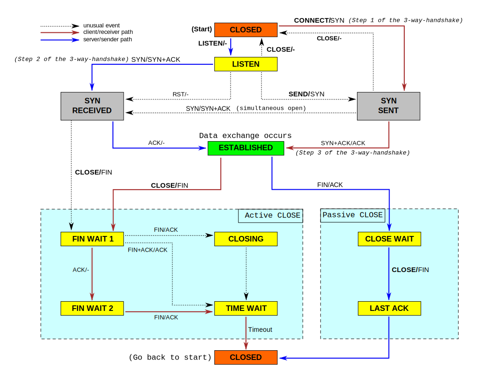

#### 关闭流程

1. 当一端调用$CLOSE$时，沿红色路径进入 FIN WAIT 1 状态，这会导致它向连接的另一端发送 FIN 数据包，这也是为什么被称为主动关闭器(Active Closer)，另一端接收到发送的 FIN 包，沿蓝色线进入 CLOSE WAIT 状态(此时主动关闭器已经关闭连接，无法再传输数据，但是被动关闭器中仍然可以继续传输数据)。
2. 在 FIN WAIT1 阶段，有三种情况：
   - 被动关闭器确认 FIN，但是不发送 FIN，此时被动关闭器处于 CLOSE WAIT 状态，并且可以继续发送数据，主动关闭器进入 FIN WAIT2，直到从另一端接收到 FIN 后，转换到 TIME WAIT 状态。
   - 被动关闭器也有可能接着就关闭它的这一侧，确认 FIN，并且发送自己的 FIN 给另一侧，主动关闭器进入 TIME WAIT 阶段
   - 也有可能双方几乎同时主动关闭，并发送了 FIN，此时两者都处于 FIN WAIT1 阶段，接收到彼此的 FIN 后，进入 CLOSING 阶段，然后确认 FIN 后就过渡到 TIME WAIT 阶段
3. 主动关闭器将在 TIME WAIT 中保持一段时间，直到可以安全过渡到关闭为止
4. 被动关闭器在可以关闭后，调用 CLOSE 并发送 FIN，进入 LAST ACK 阶段。当被动关闭器发送的 FIN 被确认后，它将从 LAST ACK 到 CLOSED 状态

- Client TCP：
  
- Server TCP：
  

#### TCP 传输性质

##### 字节流(Stream of bytes)

- 以字节流的形式传输数据

##### 传输可靠性(Reliable delivery)

1. 用 ACK 来保证数据正确的传输
2. 校验并检测损坏的数据，TCP 报头包含校验和字段来校验有没有段在传输中损毁
3. 序列号来检测丢失的顺序，每个段的标头都带有序列号来校验，出错就会重传
4. 流量控制来保证接收方不会过载运行，接受方在传输过程中会不断告诉发送方是否能继续传输，实际上是告诉发送方其缓冲区中有多少空间可以接受新数据

##### 有序性(In-Sequence)

- TCP 传输的顺序与发送方的应用层传输给传输层的顺序相同，如果各段乱序到达，TCP 会以序列号对各段进行排序

##### 控制阻塞(Congestion Control)

- TCP 通过控制阻塞，来尽量在所有 TCP 连接中均分网络容量

### TCP 段头

- 目标端口(Destination port)：用于将数据发送至接收方的对应应用程序中(例如 web 是 80)
- 源端口(Source port)：作为回传报文的目标端口，为了避免端口冲突，每个新的 TCP 连接会递增地使用一个新的端口
- 序列号(Sequence ##)：指示了 TCP Data 字段的第一个字节在字节流中的位置
- 确认序列号(Acknowledgment Sequencce ##)：当一端收到另一端发送的数据时，会向对方发送一个 ACK 报文，其中包含一个确认号。这个确认号表示期望收到对方下一个数据段的序号。例如，如果一端已经成功接收了序列号为 1000 的数据段，那么它期望下一个数据段的序列号为 1000+数据段长度。因此，它会向对方发送一个 ACK 报文，其中包含确认号为 1000+数据段长度的值。这样，对方就知道自己可以发送下一个序列号为 1000+数据段长度的数据段了。同样的，如果确认号为 1001，那么就说明我们最多已经接受了 1001 字节的数据(0~1001)。通常初始序列号是被随机生成的，来解决端口冲突的问题
- 校验和(Checksum)：在 TCP 协议中，每个数据段都有一个校验和。当一端收到另一端发送的数据时，会计算接收到的数据段的校验和，并将其与发送方计算出的校验和进行比较。如果两个校验和不相等，则说明数据段在传输过程中出现了错误，接收方会向发送方发送一个 NAK 报文(但是在 TCP 协议中不常用，只有确认收到会发送 ACK，否则重传)，要求重新发送数据。校验和的计算包括报头和数据，任一损坏都会导致错误。
- 数据偏移量(Data offset 或称 Header length)：用于指明 TCP 报头的长度，也就是有多少个字节
- 保留位(Reserved)和可选(Oprtion)：留给未来的 TCP 标准
- 标志位(Flags)：ACK、SYN、FIN、PSH(告诉另一端 TCP 层这是立即传输数据，接收方要立即处理，也就是把数据立即交给应用层，而不是等待后续的数据传输，通常用于按键等时间敏感的短数据)、RST(重置 TCP 连接)、URG(紧急指针有效)
- 紧急指针(Urgent Pointer)：在 TCP 协议中，紧急指针是发送端向接收端发送紧急数据的方法。当发送端 TCP 协议栈得知有紧急数据要发送时，将发送端紧急模式置为 1，同时将紧急指针的值(为紧急数据的后一位或者最后一位)记录在发送端紧急指针处，含有未发送字节到紧急字节之间数据的报文都会将 URG 位置为 1，设置紧急指针的值。 当读取到紧急指针所指向的位置之前，TCP 的接收进程都处于紧急状态。进入紧急模式后，不论数据是否正确传输(数据流可能因为流量控制而中止)，紧急通知(URG 位)都会被正常传输
- 实践中，PSH、URG 和紧急数据指针都没有被使用
- 窗口大小(Window Size)：指明接收方还有多少缓冲区空间接受数据。
  

### 往返时间的估计与超时

#### 估计往返时间

- 报文段的样本 RTT(Sample RTT)就是从某个报文段被发出(交给 IP 协议)到对该报文段的确认被收到之间的时间。
- 大部分 TCP 实现在某个时刻仅做一次 SampleRTT 测量，即任意时刻仅为一个已发送但未确认的报文段估计 SampleRTT。另外，TCP 不为重传的报文段计算 SampleRTT。
- 每获取一个新的 SampleRTT 时，TCP 就会根据以下公式来更新 SampleRTT 均值，也就是 EstimatedRTT：
  $$
  \begin{array}{c}
  EstimatedRTT=(1-\alpha)\cdot EstimatedRTT+\alpha \cdot SampleRTT\\
  在[RFC\;6298]中给出的\alpha 推荐值为0.125:\\
  EstimatedRTT=0.875\cdot EstimatedRTT+0.125 \cdot SampleRTT
  \end{array}
  $$
- 这种平均被称为*指数加权移动平均(Exponential Weighted Moving Average, EWMA)*，指数指的是过去的 SampleRTT 的权值在更新的过程中呈指数衰减。
- DevRTT 用于估算 SampleRTT 偏离 EstimatedRTT 的程度，$\beta$推荐值为 0.25.
  $$\mathrm{DevRT}=(1-\beta)\cdot\mathrm{DevRT}+\beta\cdot|\mathrm{SampleRT}-\mathrm{EstimatedRT}\mathrm{RT}|$$

#### 设置和管理重传超时间隔

- 初始的 TimeoutInterval 值为 1 秒。同时，当出现超时后，TimeoutInterval 将加倍，以免即将被确认的后续报文段过早出现超时。然而只要收到报文段并更新 EstimatedRTT，就将用一下公式计算 TimeoutInterval。
  $$TimeoutInterval=EstimatedRTT+4 \cdot DevRTT$$

### 可靠传输

#### 重传时机

##### 超时重传

- TCP 会为每个报文设置一个重传计时器，计时器的初始值为$$TimeoutInterval=EstimatedRTT+4 \cdot DevRTT$$
- 每当超时时间发生，触发重传时，会把下次的 TimeoutInterval 设置为当前的两倍

##### 快速重传

| 事件                                                                   | TCP 接收方动作                                                                                                   |
| ---------------------------------------------------------------------- | ---------------------------------------------------------------------------------------------------------------- |
| 具有所期望序号的按序报文段到达。所有在期望序号及以前的数据都已经被确认 | 延迟的 ACk。对另一个按序报文段的到达最多等待 500ms。如果下一个按序报文段在这个时间间隔内没有到达，则发送一个 ACK |
| 具有所期望序号的按序报文段到达。另一个按序报文段等待 ACK 传输          | 立即发送单个累积 ACK，以确认两个按序报文段                                                                       |
| 比期望序号大的失序报文段到达。检测出间隔                               | 立即发送冗余 ACK，指示下一个期待字节的序号（其为间隔的低端的序号）                                               |
| 能部分或完全填充接收数据间隔的报文段到达                               | 倘若该报文段起始于间隔的低端，则立即发送 ACK                                                                     |

- 一旦接收到 3 个相同的冗余 ACK，就立刻执行快速重传，即在定时器过期前就重传丢失的报文段
- 例如 0~3 被接收，随后分别收到 5~6, 7~9, 9~10，分别发送 3 个 ACK 4 之后就触发了快速重传。

#### 重传协议(Retransmission Strategies)

- 基于滑动窗口的可靠传输
- 使用累积 ACK
- 每个包有计时器进行计时
- 对包的状态进行保守估计，即超时未接收就认为其已丢失
- 有两个协议：

1.  Go-back N：一个包的丢失会引起整个窗口的重传
2.  Selective repeat：一个包的丢失只会引起丢失的包的重传

- 尽管由于 TCP 所维护的序号特性看起来更像是 GBN 协议，然而由于有缓冲区的存在，又让其能以 SR 的方式工作。

### 流量控制(Flow control)

- 指消除发送方使接收方缓存溢出的可能性。是一个速度匹配服务。而解决 TCP 发送方因为 IP 网络拥塞而被遏制的称为拥塞控制(Congestion Control)
- 在 TCP 报头中，包含一个 data sequence number(LastByteSent)，一个 acknowledgment sequence number(LastByteAcked)，还包含一个 window 字段来表示接收方的 window 的剩余大小，也就是说 TCP 接收器只会处理数据序列号等于$ACK\;number+window$的数据，也不允许发送方发送序列号超过$ACK\;number+window$的数据
- 接收方为连接分配的接收缓存大小为$RcvBuffer$，接收窗口$rwnd$的大小随着应用程序不断取走数据，IP 报文不断抵达不断变化
  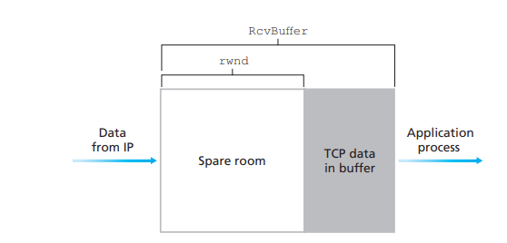
- TCP 规范中要求：当主机 $B$ 的接收窗口为 $0$ 时，主机 A 继续发送只有一个字节数据的报文段。这些报文段将会被接收方确认。最终缓存将开始清空，并且确认报文里将包含一个非 0 的 rwnd 值。(为了防止 rwnd=0 时，双方都不再发送报文)

#### Stop and wait

- 在任何时间内至多有、一个包正在传输过程中
- 发送方发送一个包，如果接收方成功接收，接收方发送确认包给发送方
- 在收到接收方发送的确认包后，发送方再发送一个新的包
- 如果超时，就重传刚才的包

##### 异常状况

// Todo 插入图片

- 而其中 ACK Delay 需要用一位 counter 来标记这个 ACK 包是当前传输的包还是之前传输的包
  // Todo 插入图片

- 但是基于假设：网络不会引起包的复制以及包延迟多个 timeout 时间(最多一个 timeout 时间内)

##### 缺点

- 传输能力极其有限，可能只有百 kb/s 级别的传输速度

#### Slide Window

//Todo 插入图片

##### Sender

//Todo 插入图片

- 每个段都有一个段号(SeqNo)
- 维护三个变量：Send window size(SWS)，Last acknowledgement received(LAR)，Last segment sent(LSS)
- 维护不等式$(LSS-LAR)\le SWS$成立
- Window delay：例如 SWS=3，现在发送了 0、1、2，而 1、2 都发送了确认包，0 还没有，在这种情况下，Window 会被卡在 0 的位置而无法跨过
- 至多可以发送信息到$LAR+window$

##### Receiver

- 维护三个变量：Receive window size(RWS)，Last acceptable segment(LAS)，Last segment received(LSR)
- 维护不等式$(LAS-LSR)\le RWS$
- 如果收到包$<LAS$ ：
- 发送累计(cumulative)ACK：例如收到 1、2、3、5，则发送 ACK3，表示对 3 和其之前所有接收的包的确认，而不会确认 5，又例如，发送 1、2、3、4、5，成功接受了 1、2、3 后，发送 ACK3，如果 4 丢包了，又收到 5，则会再次发送 ACK3 而不是 ACK5，因此 Sender 会因为超时重传第四个包，再次接收第四个包，然后传输 ACK5。
- 注意：TCP 中的确认值不是当前收到的值，而且期待收到的下一个值，例如收到 1、2、3，在 TCP 中的 ACK 字段应为 4

##### RWS，SWS，Sequence Space

- $RWS \ge 1,SWS \ge 1,RWS \le SWS$
- 如果$RWS=1$，就会产生$go\;back\;N$协议，例如$SWS=3，RWS=1$，先发送了 0、1、2，接收方确认了 0、1，继续发送了 3、4，而 2 由于一些原因丢包了，由于接收方的缓冲区大小为 1，无法缓冲后面发送的 3、4，因此发送方需要重发 2、3、4，而如果是$RWS=3$的情况，3、4 能被缓冲区接收，因此只需要重传包 2 即可。因此一共需要$SWS+1$个序列号来给发送的数据包和确认包进行编号
- 如果$RWS=SWS$则需要$2SWS$个序列号来对包进行编号
- 一般情况下需要$RWS+SWS$个序列号进行包的编号
- $RWS$发送的包是处于不确定状态的，可能是 ACK，可能是丢包了
- $SWS$发送的传输中的包不能超过序列号空间

## 拥塞控制

### 拥塞原因和代价

#### 两个发送方和无限大缓存路由器

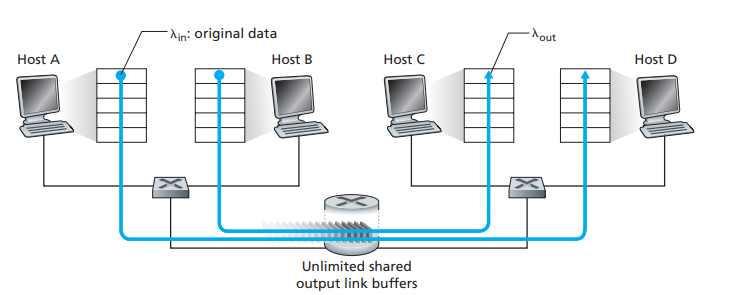

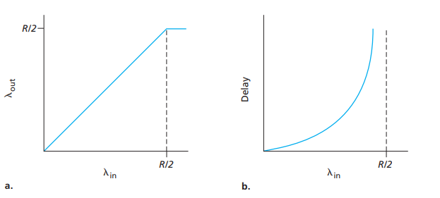

- 如图所示当链路吞吐量接近带宽上限时，带来了巨大的排队时延

#### 两个发送方和一个有限缓存的路由器

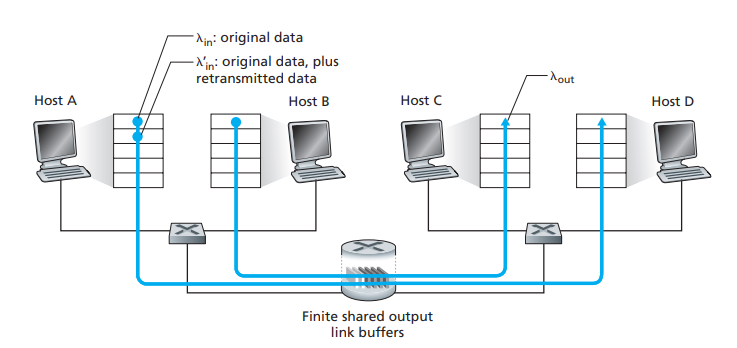

- 由于存在重传的 packet，因此$\lambda'_{in}$ (含有初始数据和重传数据)被称为*供给载荷(offered load)*。

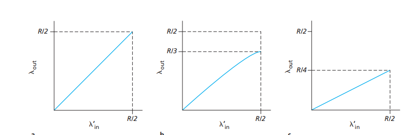

#### 四个发送方和多个有限缓存及多跳路径

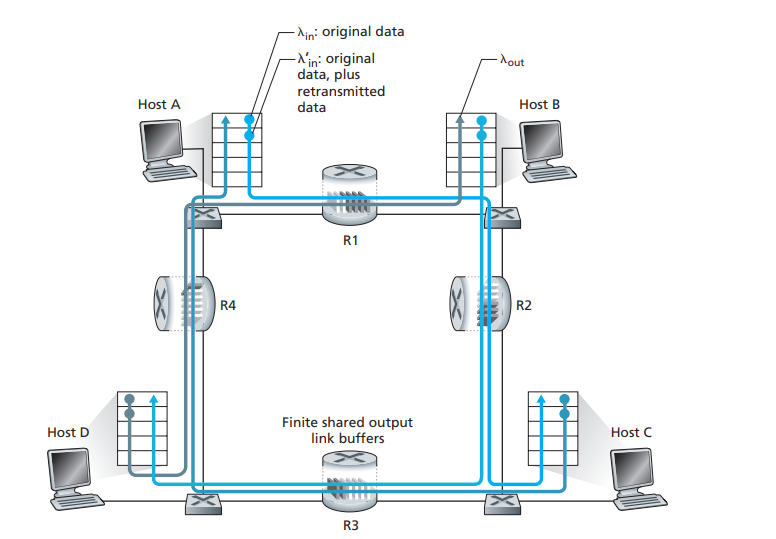
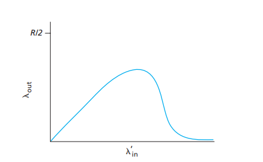

### 拥塞控制方法

- 端到端拥塞控制。在这种方法中，网络层没有为拥塞控制提供显式支持，需要我们观测网络状态，例如 TCP 的超时或者 3 次冗余确认而得知。
- 网络辅助的拥塞控制。路由器向发送方提供关于网络拥塞状态的反馈信息。可以简单地用一个比特来反映。其也有两种类型：
  - 一是直接由路由器发送信息给发送端
  - 而是路由器在发送端发往接收端的 packet 种做标记，让接收端向发送端发送网络拥塞提示，这种方法需要经过一个完整的往返时间。

## TCP 中的拥塞控制

### 如何限制速率

- TCP 发送方还追踪另一个*拥塞窗口*(Congestion window,cwnd) 变量，那么发送方要时刻满足：
  $$LastByteSent-LastByteAcked\le min\{cwnd,rwnd\}$$
- 为了与流量控制做区分，我们设$rwnd=\infty$ ，从而忽略接收窗口的限制
- 因此在每个 RTT 的起始时刻，TCP 的发送速率都被限制为$cwnd/RTT 字节/秒$

### 如何感知拥塞

- 当在数据传输的过程种发生了拥塞，就会导致路径上的路由器缓存溢出，就会引起数据报的丢失。因此 TCP 发送端通过超时或者 3 个冗余 ACK 来判断丢包，进而认为路径上出现了拥塞。
- 如果没有拥塞。那么 TCP 在收到确认后会增大它的窗口长度，TCP 也被称为*自计时的(self-clocking)* 。

### 如何调整速率

#### 慢启动

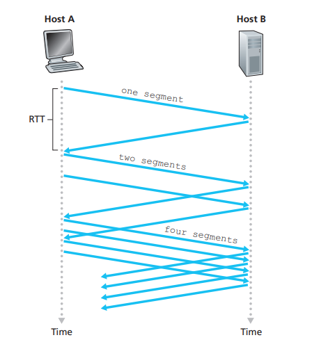

- 当一个 TCP 连接开始时，cwnd 的值设为一个 MSS(最大报文长度)，这使得初始发送速率大约为 MSS/RTT。而在收到一个 ACK 后窗口增加一个 MSS，发送两个报文，再确认，再增加 2 个 MSS。每过一个 RTT，发送速率就翻倍。
- 结束慢启动的方式：
  - 当一个丢包发生后，TCP 发送方将 cwnd 置为 1，并且重新开始慢启动。并把第二个状态变量 ssthresh("慢启动阈值"的缩写)置为 cwnd/2。
  - 二是当 ssthresh 被设值后，当 cwnd 到达或超过 ssthresh 的值时，结束慢启动，转到拥塞避免模式
  - 三是检测到 3 个冗余 ACK，TCP 执行快速重传，并进入快速恢复状态。
    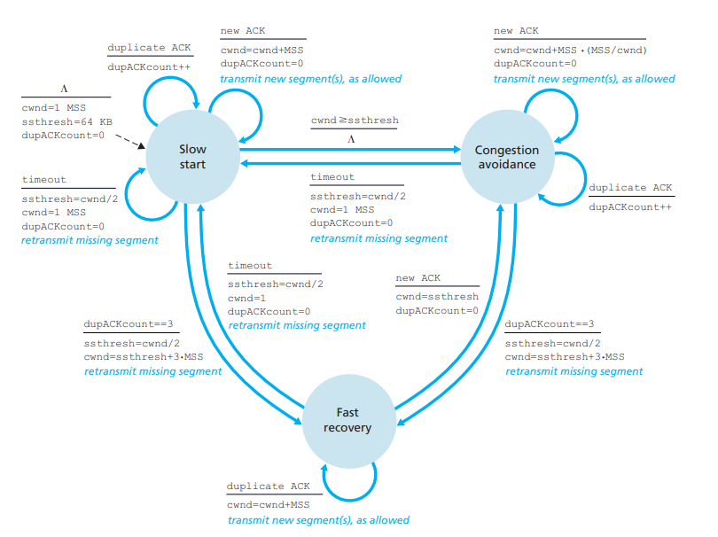

#### 拥塞避免

- 进入拥塞避免后，TCP 发送方只要收到一个 ACK，就把 cwnd 增加(MSS/cwnd)。例如，如果 MSS 为 100 字节而 cwnd 为 1000 字节，一个 RTT 内发送 10 个报文段。每个 ACK 增加 1/10MSS 的窗口长度。收到全部 10 个确认后，窗口增加了一个 MSS。
- 当出现超时时：
  1. 更新 ssthresh 为 cwnd 的一半
  2. cwnd 被设置为 1 个 MSS
  3. 重新进入慢启动过程。
- 当出现由三个冗余 ACK 指示的丢包时(快速重传)：
  1. 把 ssthresh 设置为 cwnd 的一半
  2. 把 cwnd 再设置为 ssthresh 的值(具体实现有些为 ssthresh+3)
  3. 重新进入拥塞避免阶段。
- 如果在实现了快速恢复的算法中，第三步会进入快速恢复

#### 快速恢复

1. 当收到 3 个重复 ACK 时，把 ssthresh 设置为 cwnd 的一半，把 cwnd 设置为 ssthresh 的值加 3，然后重传丢失的报文段，加 3 的原因是因为收到 3 个重复的 ACK，表明有 3 个“老”的数据包离开了网络。
2. 再收到重复的 ACK 时，拥塞窗口增加 1。
3. 当收到新的数据包的 ACK 时，把 cwnd 设置为第一步中的 ssthresh 的值。原因是因为该 ACK 确认了新的数据，说明从重复 ACK 时的数据都已收到，该恢复过程已经结束，可以回到恢复之前的状态了，也即再次进入拥塞避免状态。

- 快速恢复不是每个 TCP 实现里都有的

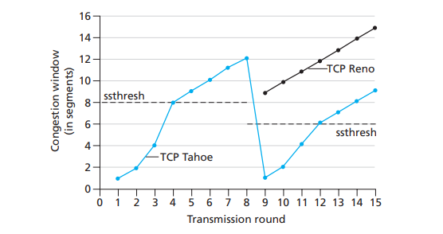

## ICMP(Internet Control Message Protocol)

### 网络层运转

1. IP 协议
2. 路由表(Routing Tables)
3. ICMP(严格来说属于传输层协议)

### 运作方式

- 当一个 IP datagram 产生异常，需要回传消息的时候，会按以下方法产生一个 ICMP 报文
  1. 把 IP datagram 的 IP header 和 IP datagram 的有效负载(data 部分)的前八个字节作为 ICMP message，也就是 ICMP 的有效负载
  2. 然后产生一个 ICMP header，包括：
     - 类型（Type）：8 位，表示 ICMP 报文类型，如请求回显（Echo Request）和回显应答（Echo Reply）等。
     - 代码（Code）：8 位，表示 ICMP 报文类型的子类型，如请求回显的代码为 0，回显应答的代码为 0。
     - 校验和（Checksum）：16 位，用于检验 ICMP 报文的完整性。
     - 标识符（Identifier）：16 位，用于标识发送的 ICMP 报文。
     - 序号（Sequence Number）：16 位，用于标识发送的 ICMP 报文序列号。
  3. 然后再封装进一个新的 IP datagram 中，设置源和目标 IP 地址，protocol 为 1 表示 ICMP

### Traceroute 实现方法

- traceroute 是一个可以追踪途径的所有路由的命令
- 具体方法为：

```cpp
 int TTL = 1;
 String desport = null(or some wrong port to rise a port unreachable);
 ICMP icmp;
 while(icmp!="port unreachable"){
  SendUDP(TTL++,desport);
  icmp = recieveICMP();
  /*output*/
 }
```

- 通过递增的 TTL 来表示第一跳、第二跳等经过的路由，并用 port unreachable 来表示抵达了终点

## 端到端原则(end-to-end principle)

- 指的是在网络端到端连接时应当遵守的原则
- 端到端连接指的是例如两机之间用 TCP 或 UDP 等协议建立起来的通信连接

### 弱端到端原则

- 在网络传输中可以实现功能以保证网络更高效的传输，例如压缩、重传等

### 强端到端原则

- 网络传输的工作是高效灵活地传输数据报，其他任何功能都应在通信端点的应用层实现而不是由网络或者中间节点(网关路由器)实现。
