## 路由器工作原理

### 输入端口处理和基于目的地转发

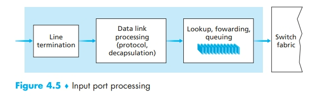

#### 最长前缀匹配(Longest Prefix Match LPM)

- 用来决定路由器如何进行转发，例如下表，其中 link 表示当前路由器连接到其他路由器的不同链路，当地址为 28.1.2.3 时，选择链路 3，当地址为 28.33.5.4 时，选择链路 4

| dest          | link |
| ------------- | ---- |
| default       | 1    |
| 171.33.0.0/16 | 5    |
| 23.0.0.0/24   | 2    |
| 28.0.0.0/24   | 3    |
| 28.33.5.0/8   | 4    |

- 在输入端口处理中，除了“查找”之外，还要进行：
  1. 物理层和链路层处理
  2. 检查 packet 的版本号、校验和以及寿命字段，并重写后两个字段(因为 TTL 递减了，所以要重算校验和)
  3. 更新用于网络管理的计数器。

### 交换

- 交换也就是转发(forward)，即从一个输入端口把数据转发到一个输出端口中，有许多实现方法

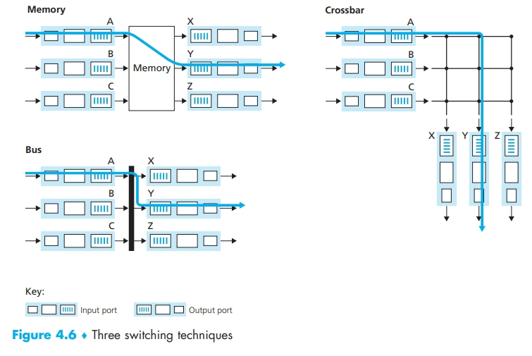

- 还有的会使用并行的方法，例如有 N 个并行的交换结构，在输入端口把 packet 分为 K 个块，通过 N 个交换结构中的 K 个把这些块发送到输出端口中，最后再在输出端口进行组装。

### 输出端口处理


### 排队产生

#### 输入排队

- 图示被称为线路前部(Head-Of-Line, HOL)阻塞，即虽然输出端口空闲，但是它被位于线路前部的一个 packet 所阻塞
  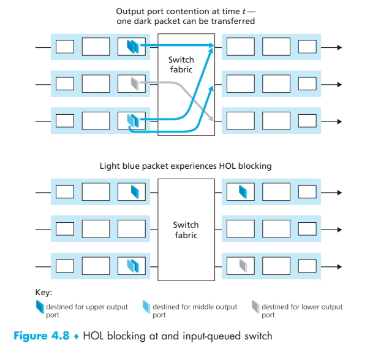

#### 输出排队

- 当输出端口没有足够内存来缓存一个新到的 packet 时，就必须做出决定：要么丢弃到达的分组（采用一种称为弃尾(drop-tail)的策略），要么删除一个或多个已排队的 packet 来腾出位置。这些策略被称为主动队列管理(Active Queue Management, AQM)算法。随机早期检测(Random Early Detection, RED)算法是广泛使用的算法。
  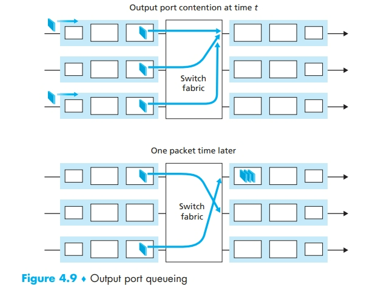
- 输出端口需要进行分组调度(packet scheduler)来从这个队列中取出一个 packet 进行传输
- 缓存的数量(B)应当由以下公式给出(C 为链路的容量)：

$$
\begin{array}{c}
B=RTT\cdot C(少量TCP流)\\
B=RTT\cdot C/\sqrt{N}(大量TCP流，N条)
\end{array}
$$

### 分组调度

- FIFO
- 优先权队列：通常是由网络操作员设定某些特定 IP/端口号的优先级，来识别类似网络管理信息的 packet
- 循环和加权公平排队：把 packet 分类，在每个类之间循环。

## IPv4、寻址、IPv6 及其他

### IPv4 数据报格式

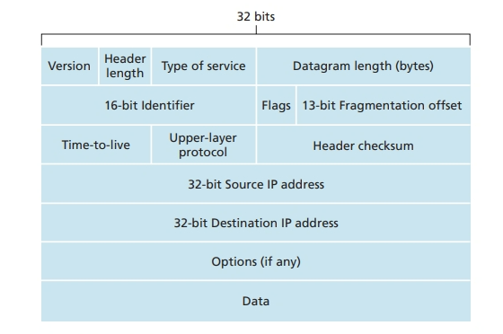

- 版本（号）。这 4 比特规定了数数据报的 $IP$ 协议版本。通过查有欣本号，路由器能够确定如何解释 $IP$ 数据报的剩余部分。不同的 $IP$ 版本使用不同的数据报格式 IPv4 的数据报格式如图 4-16 所示。新版本的 IP（IPv6）的数据报格式将在后面讨论。
- 首部长度。因为一个 $IPv4$ 数据报可包含一些可变数量的选项（这些选项包括在 IPv4 数据报首部中），故需要用这 4 比特来确定 $lP$ 数据报中载荷（例如在这个数据报中被封装的运输层报文段）实际开始的地方。大多数 IP 数据报不包含选项所以一般的 $IP$ 数据报具有 20 字节的首部。

- 服务类型。服务类型（10S）比特包含在 $IPv4$ 自部中，以便使不同类型的 $IP$ 数据报（例如，一些特别要求低时延、高吞吐量或可靠性的数据报）能相互区别开米。例如，将实时数据报（如用于 $IP$ 电话应用）与非实时流量（如 FTP）区分开也许是有用的。提供特定等级的服务是一个由网络管理员对路由器确定和配置的策略问题。

- 数据报长度。这是 $IP$ 数据报的总长度（首部加上数据），以字节计。因为该字段长为 16 比特，所以 IP 数据报的理论最大长度为 65 535 字节。然而，数据报很少有超过 1500 字节的，该长度使得 $IP$ 数据报能容纳最大长度以太网帧的载荷字段。

- 标识、标志、片偏移。这三个字段与所谓 $IP$ 分片有关，这是一个我们将很快要考虑的主题。有趣的是，新版本的 IP（即 IPv6）不允许在路由器上对分组分片

- 寿命。寿命（Time-To- Live，I1L）子段用来确保数据报不会永远（如由于长时的路由选择环路）在网络中循环。每当一台路由器处理数据报时，该子段的值减 1。若 TTL 字段减为 0，则该数据报必须去弃。

- 协议。该字段通常仅当一个 $IP$ 数据报到达其最终目的地时才会有用。该字段值指示了 $IP$ 数据报的数据部分成交给哪个特定的运输层协议。例如，值为 6 表明数据部分要交给 TCP，而值为 17 表明数据要交给 UDP。注意在 $IP$ 数据报中的协议号所起的作用，类似于运输层报文段中端口号字段所起的作用。协议号是将网络层与运输层绑定到一起的黏合剂，而端口号是将运输层和成用层绑定到一起的黏合剂。我们将在第 6 章看到，链路层帧也有一个特殊字段用于将链路层与网络层绑定到一起。

- 首部检验和。自部检验利用于带助路田番检测收到的 $\mathrm{IP}$ 效话报中的比特铺误。自部检验和是这样计算的：将首部中的每 2 个字节当作一个数，用带回卷的加法对这些数求和。如在 3.3 节讨论的那样，该和的反码（被称为因特网检验和）存放在检检机子段中。路由器要对每个收到的 $\mathrm{IP}$ 数据报计算其首部检验和，如果数据报自部中携带的检验和与计算得到的检验和不一致，则检测出是个差错。路由器一般会夫弃检测出错误的数据报。注意到在每台路由器上必须重新计算检验和并再次存放到原处，因为 TTL 子段以及可能的选项子段会改变。关于计算因特网检验和的快速算法的有趣讨论参见[RFC 1071]。此时，一个经常问的问题是：为什么 TCP/IP 在运输层与网络层都执行差错检测？这种重复检测有几种原因。首先，注意到在 IP 层只对 IP 首部计算了检验和，而 TCP/UDP 检验和是对整个 TCP/UDP 报文段进行的。其次，TCP/UDP 与 IP 不一定都必须属于同一个协议栈。原则上 TCP 能够运行在一个不同的协议（如 ATM）上「Black 1995，而 $IP$ 能够携带不一定要传递给 TCP/UDP 的数据。

- 源和目的 IP 地址。当某源生成一个数据报时，它在源 $\mathrm{IP}$ 子段中插人它的 IP 地址，在目的 $IP$ 地址字段中插入其最终目的地的地址。通常源主机通过 DNS 查找来决定日的地址，如在第 2 章中讨论的那样。我们将在 4.3.3 节中详细讨论 $IP$编址

- 选项。选项子段允许 $IP$首 部被扩展。自部选项意味看很少使用，因此决定对每个数据报首部不包括选项字段中的信息，这样能够节约开销。然而，少量选项的存在的确使问题复张了，因为数据报首部长度可变，故不能预先确定数据子段从何处开始。而且还因为有些数据报要求处理选项，而有些数据报则不要求，故导致一台路由器处理一个 $IP$ 数据报所需的时间变化可能很大。这些考虑对于高性能路由器和主机上的 $IP$ 处理来说特别重要。由于这样或那样的原因，在 IPv6 首部中已去掉了 IP 选项

- 数据（有效载荷)。我们来看看最后也是最重要的字段，这是数据报存在的首要理由！在大多数情况下，IP 数据报中的数据子段包含要交付给日的地的运输层报文段（TCP 或 UDP)。然而，该数据字段也可承载其他类型的数据，如 ICMP 报文

### IPv4 数据报分片

- 对于一个网络传输的过程，不同的链路层实现会对最大传输单元 MTU 由不同的限制，有可能出现 IP 数据报大于 MTU 的情况，这时候就要分片再重组
- $IP v4$的设计者将标识、标志和片偏移字段放在 $\mathrm{IP}$ 数据报自部中。当生成一个数据报时，发送王机在为该数据报设置源和日的地址的同时贴上标识号。发送主机通常将它发送的每个数据报的标识号加 1。当某路由器福要对一个数据报分片时，形成的每个数据报（即片）具有初始数据报的源地址、日的地址与标识号。当目的地从同一发送主机收到一系列数据报时，它能够检管数据报的标识号以确定哪些数据报实际上是同一较大数据报的片。由于 IP 是一种不可靠的服务，一个或多个片可能永远到达不了目的地。因为这种原因，为了让目的主机绝对地相信它已收到了初始数据报的最后一个片，最后一个片的标志比特被设为 0，而所有其他片的标志比特被设为 1。另外，为了让目的主机确定是否丢失了一个片（且能按正确的顺序重新组装片），使用偏移字段指定该片应放在初始 $\mathrm{IP}$ 数据报的哪个位置

### IPv4 编址

#### 组成

- 由 4 个八位组(octets)构成的 32bits 长的地址：a.b.c.d
- 例如：171.64.64.64、19.168.3.1、255.255.255.255

#### 子网掩码

- 是从最高有效位开始的一串连续的 1
- 用地址 1 与子网掩码进行位相与操作，如果和地址 2 与子网掩码进行位相与的结果一样，则说明这两个地址处于一个子网下，不会发送至 IP 路由器，而是会在本地网络中进行查找
- 例如：255.255.255.0 表示前三个八位组相同

#### 地址分配

##### A、B、C 分类(历史上的方法)

| Type    | Sign Bit | Network     | Host     |
| ------- | -------- | ----------- | -------- |
| Class A | 0        | network(7)  | host(24) |
| Class B | 10       | network(14) | host(16) |
| Class C | 110      | network(21) | host(8)  |

##### CIDR(Classless Inter-Domain Routing)

- 地址块是由地址(Address)和计数(Count)组成的
- CIDR 用斜线记法，又称斜线记法来表示网络前缀所占的比特数，因此 IP 地址被分为$<网络前缀>和<主机号>$两部分，例如 171.64.0.0/16 表示从 171.64.0.0 到 171.64.255.255 的全部地址，地址$A/n$能表示$2^{32-n}$个 IP 地址
- 所有地址被分为 A/8 分给各个大洲的 RIR，并由各自的 RIR 决定如何进行地址分配

- 特别的，255.255.255.255 这个地址会被交付给网络上的所有主机。路由器也会有选择地向邻近的子网转发该报文(虽然一般不这么做)

#### 获取地址

1. 获取一块地址：由 ICANN 向 ISP 提供一块地址，然后 ISP 再向其客户提供这一块地址中的一部分。
2. 获取主机地址：用动态主机配置协议(Dynamic Host Configuration, DHCP)来完成。DHCP 可以由配置来让某给定主机每次与网络连接都有一个相同的 IP 地址，或者某主机会被分配一个可变的临时 IP 地址。除此之外，DHCP 还允许一台主机获知其他信息，例如它的子网掩码、第一跳路由器地址(常称为默认网关)与它的本地 DNS 服务器地址。

##### DHCP 过程

- DHCP 协议是一个四步的过程，yiaddr 表示分配给该新到达客户的地址:

  1. DHCP 服务器发现。一台新到达的主机的首要任务是发现一个要与其交互的 DHCP 服务器。这可通过使用 DHCP 发现报文（DHCP discover message）来完成，客户在 UDP 分组中向端口 67 发送该发现报文。该 $UDP$ 分组封装在一个 IP 数据报中。但是这个数据报应发给谁呢？主机甚至不知道它所连接网络的 $\mathrm{IP}$ 地址，更不用说用于该网络的 DHCP 服务器地址了。在这种情况下，DHCP 客户生成包含 DHCP 发现报文的 IP 数据报，其中使用广播目的地址 255. 255,255. 255 并且使用“本主机”源 $IP$ 地址 0.0.0.0。DHCP 客户将该 $IP$ 数据报传递给链路层，链路层然后将该帧广播到所有与该子网连接的节点
  2. DHCP 服务器提供。DHCP 服务器收到一个 DHCP 发现报文时，用 DHCP 提供报文（DHCP offer message）向客户做出响应，该报文向该子网的所有节点广播，仍然使用 IP 广播地址 255.255. 255.255（你也许要思考一下这个服务器为何也必须采用广播）。因为在于网中可能存在几个 DHCP 服务器，该客户也许会发现它处于能在几个提供者之间进行选择的优越位置。每台服务器提供的报文包含有收到的发现报文的事务 ID、向客户推荐的 IP 地址、网络掩码以及 IP 地址租用期（ad-dress lease time），即 IP 地址有效的时间量。服务器租用期通常设置为几小时或几天。
  3. DHCP 请求。新到达的客户从一个或多个服务器提供中选择一个，并向选中的服务器提供用 DHCP 请求报文(DHCP request message)进行响应，回显配置的参数
  4. DHCP ACK。服务器用 DHCP ACK 报文(DHCP ACK message)对 DHCP 请求报文进行响应，证实所要求的参数。
     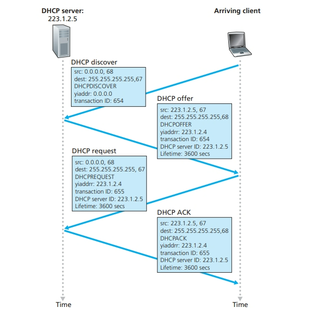

- DHCP 无法支持移动性的连接，因为每当连到一个新子网就要获取一个新的 IP 地址，之前的 TCP 连接也就无法维持了。

### 网络地址转换(NAT)

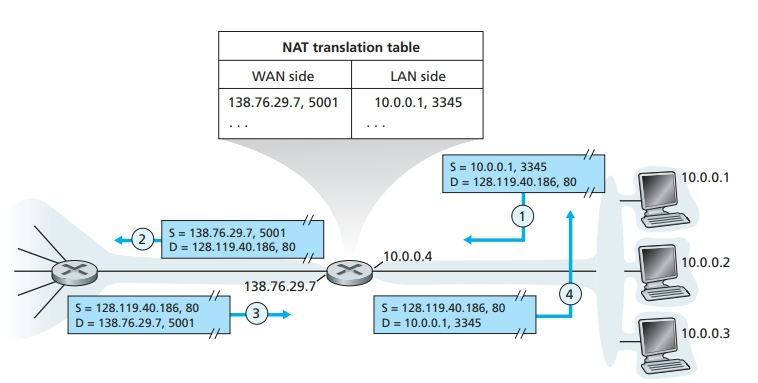

- 如上图，局域网内 10.0.0.1 的 3345 端口发出请求，经过 NAT 后，把源端口号修改为 5001，源 IP 地址修改为路由器的 IP 地址 138.76.29.7，这样一来，通过保存这个映射表(NAT 转换表)，就可以实现 NAT 的功能

### IPv6


#### 主要变化

- 扩大的地址容量：地址从 32 位变成了 128 位。还引入了任播地址(anycast address)，这种地址可以使数据报交付给一组主机中的任意一个
- 简化高效的 40 字节 header：删除了一些被舍弃的 IPv4 字段
- 流标签：用来给特殊流的 packet 加上标签，例如需要实时服务的流
- Hop limit 和 Next hdr 分别对应 TTL 和 upper layer protocol。
- 而且不再有分片(如果过大就发送一个“分组过大”的 ICMP 差错报文)、校验和、可选字段

## ICMP(Internet Control Message Protocol)

### 网络层运转

1. IP 协议
2. 路由表(Routing Tables)
3. ICMP(严格来说属于传输层协议，因为它是被 IP 协议使用的)

### 运作方式

- 当一个 IP datagram 产生异常，需要回传消息的时候，会按以下方法产生一个 ICMP 报文
  1. 把 IP datagram 的 IP header 和 IP datagram 的有效负载(data 部分)的前八个字节作为 ICMP message，也就是 ICMP 的有效负载
  2. 然后产生一个 ICMP header，包括：
     - 类型（Type）：8 位，表示 ICMP 报文类型，如请求回显（Echo Request）和回显应答（Echo Reply）等。
     - 代码（Code）：8 位，表示 ICMP 报文类型的子类型，如请求回显的代码为 0，回显应答的代码为 0。
     - 校验和（Checksum）：16 位，用于检验 ICMP 报文的完整性。
     - 标识符（Identifier）：16 位，用于标识发送的 ICMP 报文。
     - 序号（Sequence Number）：16 位，用于标识发送的 ICMP 报文序列号。
  3. 然后再封装进一个新的 IP datagram 中，设置源和目标 IP 地址，protocol 为 1 表示 ICMP

### Traceroute 实现方法

- traceroute 是一个可以追踪途径的所有路由的命令
- 具体方法为：

```cpp
 int TTL = 1;
 String desport = null(or some wrong port to rise a port unreachable);
 ICMP icmp;
 while(icmp!="port unreachable"){
  SendUDP(TTL++,desport);
  icmp = recieveICMP();
  /*output*/
 }
```

- 通过递增的 TTL 来表示第一跳、第二跳等经过的路由，并用 port unreachable 来表示抵达了终点

## 路由选择算法

- 简单来说就是想要在一个由路由器组成的图中找到一个开销最小的路径抵达目的地。

### 分类方法

#### 集中式 vs 分散式

- 集中式路由选择算法(Centralized routing algorithm)，计算时要求知道全局的路由状态，包括全局的连通性和链路开销信息。通常也被称为链路状态(Link State, LS)算法，因为该算法必须知道网络中每条链路的开销
- 分散式路由选择算法(Decentralized routing algorithm)。每次计算时只有预期直接相连的链路的开销信息。然后通过迭代计算以及与相邻节点的信息交换，逐渐计算出最低开销路径。后续会学习被称为距离向量(Distance-Vector, DV)算法。

#### 静态 vs 动态

- 静态路由选择算法 (static routing algorithm) 中，路由随时间的变化非常缓慢，通常是人工进行调整（如人为手工编辑 条链路开销）
- 动态路由选择算法 (dynamic routing algorithm) 随着网络流量负载或拓扑发生变化而改变路由选择路径 一个动态算法可周期性地运行或 直接响应拓扑或链路开销的变化而运行 虽然动态算法易于对网络的变化做出反应，但也 更容易受诸如路由选择循环、路由振荡之类问题的影响

#### 负载敏感 vs 迟钝

- 负载敏感算法 (load-sensitive algorithm) 中，链路开销会动态地变化以反映出底层链路的 当前拥塞水平 如果当前拥塞的一条链路与高开销相联系，则路由选择算法趋向于绕开该 拥塞链路来选择路由 而早期的 ARPAnet 路由选择算法就是负载敏感的 , 所以遇到了许多难题。
- 当今的因特网路由选择算法(如 RIP OSPF BGP) 都是负载迟钝的 (load-insensitive) , 因为某条链路的开销不明确地反映其当 前（或最近）的拥塞水平。

### 链路状态路由选择算法(LS)

- 实际上就是 Dijkstra 算法：
  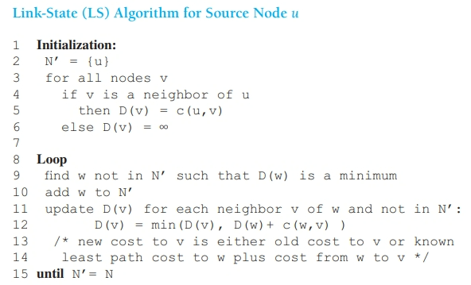
- 其中：

  - $D(v)$：到算法的本次迭代，从源节点到目的节点$v$的最低开销路径的开销
  - $p(v)$：从源到$v$沿着当前最低开销路径的前一个节点
  - $N'$：节点子集；如果源到$v$的最低开销路径已确定，则$v在N'$中。

- 例如：
  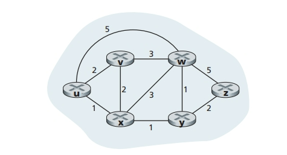
  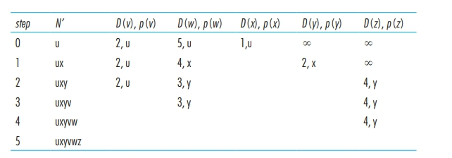

- 线性查找下有$O(n^2)$的时间复杂度，用最小堆维护$N'$则有指数查找时间，总的时间复杂度就为$O(nlogn)$

### 距离向量路由选择算法

- 最低开销路径有著名的 Bellman-Ford 方程
  $$d_x(y)=min_v\{c(x,v)+d_v(y)\}$$
- 其中$d_x(y)$是从节点$x$到节点$y$的最低开销路径的开销。$min_v$表示遍历$x$的每个邻居$v$取最小值。

#### 实际步骤

其基本思想如下。每个节点 x 以 $D_{x}\left(y\right)$ 开始，对在 $N$ 中的所有节点$y$，估计从$x$到$y$的最低开销路径的开销。令 $D(x)=[D_x(y):\;y\in N]$是节点$x$的距离向量，该向量是从$x$到在 $N$ 中的所有其他节点 $y$ 的开销估计向量。使用 DV 算法，每个节点 $x$ 维护下列路由选择信息:

1. 对于每个邻居$v$，从 x 到直接相连邻居 $v$ 的开销为 $c\left(x,v\right)$
2. 节点 x 的距离向量，即 $D_{x}=\left[D_{x}\left(y\right):y\in N\right]$ ，包含了 x 到 $N$ 中所有目的地 $y$ 的开销估计值。
3. 它的每个邻居的距离向量，即对$x$的每个邻居$v$，有$D_{v} =[D_v(y)：y \in N]$。

- 在该分布式、异步算法中，每个节点不时地向它的每个邻居发送它的距离向量副本当节点 $x$ 从它的任何一个邻居 t 接收到一个新距离向量，它保存 v 的距离向量，然后使用 Bellman- Ford 方程更新它自己的距离向量如下:
  $$D_{x}(y)=min_{v}\{c(x,v)+D_{v}(y)\}对 \text{N} 中的每个节点$$

如果节点 $x$ 的距离向量因这个更新步骤而改变，节点 x 接下来将向它的每个邻居发送其更新后的距离向量，这继而让所有邻居更新它们自己的距离向量。令人惊奇的是，只要所有的节点继续以异步方式交换它们的距离向量，每个开销估计 $D_x$ （y）收敛到$d_x(y)$,$d_{x}\left(y\right)$为从节点$x$到节点 $y$ 的实际最低开销路径的开销


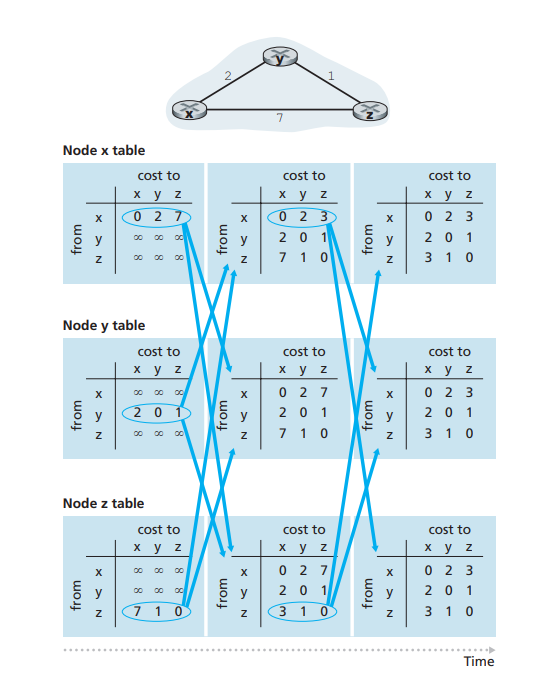

## 自治系统(Autonomous System, AS)

- 在互联网中，一个自治系统(AS)是一个有权自主地决定在本系统中应采用各种路由协议的小型单位。这个网络单位可以是一个简单的网络也可以是一个由一个或多个普通的网络管理员来控制的网络群体，它是一个单独的可管理的网络单元（例如一所大学，一个企业或者一个公司个体）。一个 ISP 可能就是一个 AS，也可能包含多个 AS。
- 自治系统之间使用被称为网关路由器(gateway router)的路由器进行连接。
- 自治系统中所有的路由器必须相互连接，运行相同的路由协议，被称为自治系统内部路由选择协议(intra-autonomous system routing protocol)，同时分配同一个自治系统编号。所有自治系统之间用边际网关协议(Broder Gateway Protocol, BGP)作为自治系统间路由选择协议(inter-autonomous system routing protocol)。

### 自治系统内部路由选择协议

#### Routing Information Protocol (RIP)

- 基于 DV 算法，并把相邻路由器的权重都置为 1，也就是说选取最少跳数的路径
- 在相邻的路由器之间传递信息。
- 大约每 30 秒更新一次

#### 开放最短路优先(OSPF)

- 基于 LS 算法，一台路由器构建了关于整个自治系统的完整拓扑图。于是每台路由器都在本地运行 Dijkstra 算法来确定一个以自己为根节点到所有子网的最短路径树。各条链路开销由管理员设定，或者直接设置为 1(最少跳路径选择)。
- 使用 OSPF 时，会向自治系统内所有其他路由广播状态信息。每当一条链路状态发生变化时，路由器就会广播链路状态信息。即使链路信息未变化，也会至少每 30 分组广播一次链路状态。而 OSPF 通告包含在直接由 IP 承载的 OSPF 报文中，因此 OSPF 协议要自己实现诸如可靠报文传输等功能。

### 自治系统间路由选择协议——BGP

#### BGP 的作用

- BGP 的路由目的地是一个 CIDR 化的前缀，例如 138.16.68/22，这个例子包含 1024 个地址。因此一台路由器的转发表将有$(x,I)$的表项，其中$x$是一个前缀，$I$是该路由器的接口之一的接口号。
- BGP 为每台路由器提供了完成以下任务的手段：
  1. 从邻居 AS 获得前缀的可达性信息
  2. 确定到前缀的“最好的”路由

#### 通告 BGP 路由信息

- 位于 AS 边缘的被称为网关路由器(gateway router)，否则就是一台内部路由器(internal router)
- 在 BGP 中，每对路由器通过使用 179 端口的半永久 TCP 连接交换路由选择信息，称为 BGP 连接。跨越两个 AS 的 BGP 连接被称为外部 BGP(eBGP)，在相同 AS 中的两台路由器之间的 BGP 会话称为内部 BGP(iBGP)连接。
  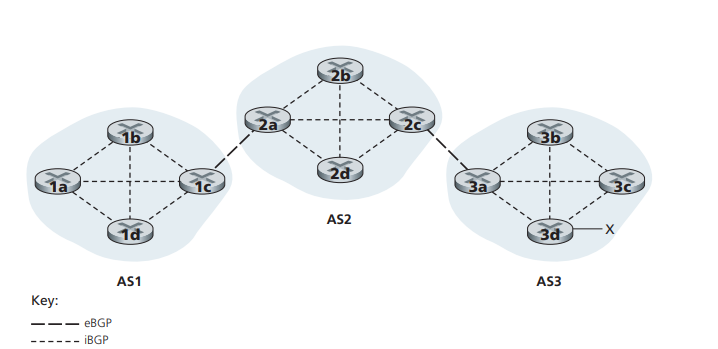

- 为了传播可达性信息，使用了 iBCP 和 eBGP 会话。再次考虑向 ASI 和 AS2 中的所有路由器通告前缀 $x$ 的可达性信息。在这个过程中，网关路由器 $3a$ 先向网关路由器 $2c$ 发送一个 eBGP 报文“AS3x”。网关路由器 2c 然后向 AS2 中的所有其他路由器（包括网关路由器 2a）发送 iBGP 报文“"AS3 x”。网关路由器 2a 接下来向网关路由器 $1c$ 发送一个 eBCF 报文“AS2 AS3 x”。最后，网关路由器 $1c$ 使用 iBGP 向 AS1 中的所有路由器发送报文“"AS2 AS3 x”。在这个过程完成后，在 AS1 和 AS2 中的每个路由器都知道了 x 的存在并且也都知道了通往 x 的 AS 路径

#### 确定最好的路由

- 当路由器通过 BGP 连接通告前缀时，它在前缀中包括一些 BGP 属性(BGP attribute)。用 BGP 术语来说，前缀及其属性被称为路由。两个较为重要的属性是 AS-PATH 和 NEXT-HOP。
- AS- PATH 属性包含了通告已经通过的 $AS$ 的列表，如我们在前面的例子中所见。为了生成 AS-PATH 的值，当一个前缀通过某 AS 时，该 AS 将其 ASN 加人 AS-PATH 中的现有列表。例如，在下图中，从 AS1 到子网 x 有两条路：其中一条使用 AS- PATH“AS2 AS3”；而另一条使用 AS-PATH“AS3”。BGP 路由器还使用 AS-PATH 属性来检测和防止通告环路；特别是，如果一台路由器在路径列表中看到了包含它自己的 AS，它将拒绝该通告。
- 在 $\mathrm{AS}$ 间和 $AS$ 内部路由选择协议之间提供关键链路方面，NEXT- PATH 属性具有敏感而重要的作用。NEXT-HOP 是 AS-PATH 起始的路由器接口的 IP 地址。为了深人理解该属性，找们冉次参考图 5-10。如图 5-10 中所指示的那样，对于从 AS1 通过 AS2 到 x 的路由“AS2 AS3 $x$，其属性 NEXT-HOP 是路由器 $2a$ 左边接口的 IP 地址。对于从 AS1 绕过 AS2 到 x 的路由“AS3 x”，其 NEXT- HOP 属性是路由器 3d 最左边接口的 $IP$ 地址。总的说来,在这个假想的例子中，AS1 中的每台路由器都知道了到前缀 x 的两台 BGP 路由。
  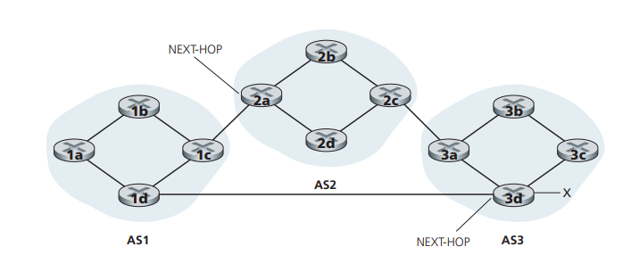

#### BGP 路由选择算法

##### 热土豆选择(hot potato routing)

- 尽快地把 packet 送出 AS，而不关心总体开销。
- 如上图所示，如果是$1b想访问x$，那么会经由$AS2\rightarrow AS3$ ，因为从$1c$能最快离开$AS1$。如果是$1d$想访问$x$那么会直接到$3d$ ，因为这是离开$AS1$最短路径。

##### 路由器选择算法

- 实践中 BGP 使用这种算法。对于任何给定的目的地前缀，进入 BGP 的路由选择算法的输入是到某前缀的所有路由的集合。如果仅有一条这样的路由，BGP 则显然选择该路由。如果有多条，就顺序调用以下规则来消除路由，直到只剩下一条路由：
  1. 路由被指派一个本地偏好 $(local \;preference )$ 值作为其属性之一(除了 AS- PATH 和 NEXT-HOP 以外)。一条路由的本地偏好可能由该路由器设置或可能由在相同 AS 中的另一台路由器学习到。本地偏好属性的值是一种策略决定，它完全取决于该 $AS$ 的网络管理员(随后将更为详细地讨论 BGP 策略问题)具有最高本地偏好值的路由将被选择。
  2. 从余下的路由中（所有都具有相同的最高本地偏好值），将选择具有最短 ASPATH 的路由。如果该规则是路由选择的唯一规则，则 BGP 将使用距离向量算法决定路径，其中距离测度使用 $\mathrm{AS}$ 跳的跳数而不是路由器跳的跳数。
  3. 从余下的路由中（所有都具有相同的最高本地偏好值和相同的 $AS- PATH$ 长度）,使用热土豆路由选择，即选择具有最靠近 NEXT-HOP 路由器的路由。
  4. 如果仍留下多条路由该路由器使用 BGP 标识符来选择路由

#### BGP 路由选择策略

- 指的是在路由选择算法中的第一步，即根据本地偏好属性选择路由，而本地偏好值由本地 AS 的策略所确定。
- 主要作用是用来过滤流量，例如接入 ISP 只能接收以内部为目的的流量或者发出以内部为源的流量。如果想以接入 ISP 作为中转是不被允许的。
