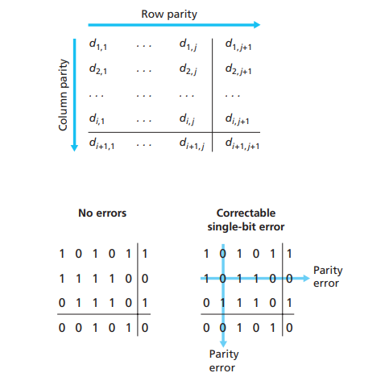
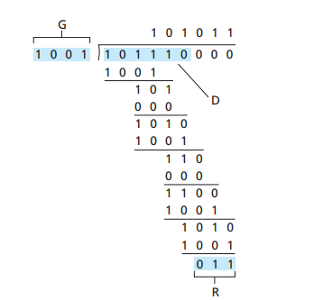
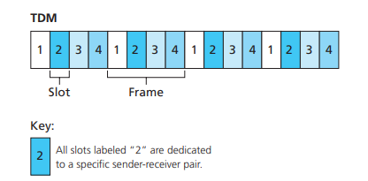
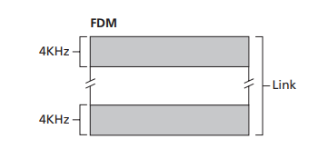
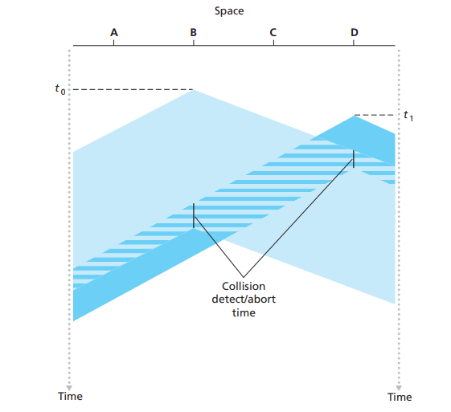

## 链路层概述

- 链路层中运行协议的设备被称为节点，而通信信道被称为链路。

### 链路层提供的服务

- 成帧(framing)。帧的结构由具体的链路层协议规定
- 链路接入(link access)。媒体访问控制(Medium Access Control, MAC)协议规定了帧在链路上传输的规则。MAC 用于协调多个节点的帧传输。
- 可靠交付(reliable delivery)。链路层协议保证无差错地经链路层移动每个网络层数据包。链路层的 RD 通常是通过在本地(发生错误的链路)确认重传，而不是在整个端到端路径上重传。因此在高差错率的链路，例如无线链路中广泛使用。而在低差错率的链路，例如光纤、电缆等有线链路中的链路层协议不提供 RD。
- 差错检测和纠正。链路层的差错检测通常更复杂，而且用硬件实现。而差错纠正意味着接收方不仅能检测出差错，还能够准确定位到帧中差错出现的位置。

### 链路层实现的位置

- 链路层的主体部分是在网络适配器(network adapter)中实现的，有时也叫网卡(Network Interface Card, NIC)，网卡中的核心就是链路层控制器，该控制器通常实现了许多链路层服务(framing, link access, error detectiong)，因此许多功能都是由硬件实现的。
- 但是部分链路层也是运行于主机 CPU 上的软件实现的，例如组装链路层寻址信息和激活控制器硬件。还有响应控制器中断(例如多个帧同时到达)，处理差错条件和传递数据报。也就是说链路层是硬件和软件的结合体，也是协议栈中软件与硬件交接的地方。

## 差错检测和纠正技术

### 奇偶校验(parity check)

- 加多一位校验位，使得数据与校验位拼接起来是一个偶数/奇数，这种方法有 50%的几率检测出错误。
- 把 d 个比特分为 i 行 j 列，通过二维校验，能对单个比特的错误进行纠错！以及对两个比特差错的任何组合进行检测。
  
- 接收方检测和纠正差错的能力被称为前向纠错(Forward Error Correction, FEC)。

### 校验和方法

- 在 TCP 中叙述过了，这里不再赘述
- 之所以在链路层不采用这种方法是因为链路层在硬件的加持下可以实现更加复杂的算法而且速度更快。

### 循环冗余检测

#### 实现

- 发送方和接收方先商量一个$r+1$位的生成多项式$G(x)$，其最高位是 1。核心思想就是对于给定的数据段$D$和附加比特$R$，使得拼接后的$d+r$位数能在模二算术下被$G(x)$整除。如果接收方检测的余数不为零，就说明出错了。
- 模 2 算术指在所有的加减法操作中没有进位和借位，也就是加法与减法都等价为异或运算。
  $$1011+1001=1011-1001=1011\;XOR\;1001=0010$$
- 计算：
  $$R=remainder \frac{D\cdot 2^r}{G}\;(模2除法)$$
  

#### 特点

- 每个 CRC 都能检测小于等于$r$位的突发差错，长度大于$r+1$位的差错也有$1-0.5^r$的概率被检测到。而且也能检测到任意长度的奇数个比特错误。

### 消息验证码(Message Authentication Code MAC)

- 用于 TLS 中

#### 实现

- 用信息 M 和密钥 s 通过算法 MAC 生成验证码 c，即$c=MAC(M,s)$
- 没有密钥 s 的情况下，很难生成 c，更难生成一个 M，其 MAC 为 c
- 如果同时持有 M 和 c，很大程度上说明这个人拥有密钥 s

#### 优劣

- 优点：提供了安全性保障，实际上 MAC 就是用来保证 Message 不被无意或有意地修改，一定程度上保证了信息的安全性。
- 缺点：MAC 算法并没有使用密码学算法， 因此无法保证消息的机密性，可以将 AES 或 DES 等加密算法与其结合使用。MAC 算法实际上无法保证检测任何错误。

### 错误检测算法对比

| 算法            | single bit error | 2 bit errors | 9 bit errors | Two bit errors 100bits apart |
| --------------- | ---------------- | ------------ | ------------ | ---------------------------- |
| 8-bit checksum  | ✓                | ×            | ×            | ×                            |
| 16-bit checksum | ✓                | ×            | ×            | ×                            |
| 8-bit CRC       | ✓                | ✓            | ×            | ×                            |
| 16-bit CRC      | ✓                | ✓            | ✓            | ×                            |
| 32-bit MAC      | ×                | ×            | ×            | ×                            |

- 虽然打 × 的部分无法保证检测出错误，但是仍然有很高的概率能检测出错误
- 因此在实践中我们会用多层错误检测，TCP、IP 层的 checksum，链路层的 CRC，以及应用层也会进行的错误检测，使得最终产生错误的概率极低

## 多路访问链路和协议(Multiple access protocol)

- 链路分为点对点链路和广播链路。而在广播链路中如何协调多个发送和接收节点对一个共享广播信道的访问就是多路访问协议的工作
- MAP 可以被分为三种类型之一：信道划分协议(channel partitioning protocol)，随机接入协议(random access protocol)和轮流协议(taking-turns protocol)。
- 而对于速率为$R\;bps$的广播信道，一个多路访问协议应该具有以下特性
  1. 当仅有一个节点发送数据时，该节点具有$R\;bps$的吞吐量
  2. 当有$M$个节点发送数据时，每个节点吞吐量为$R/M\;bps$，不要求每个节点都有$R/M\;bps$的瞬时速率，只要在一定的时间间隔内有$R/M\;bps$的平均速率
  3. 协议是离散的；不会因为某个主节点故障而导致系统崩溃
  4. 协议是简单的。

### 信道划分协议

#### 分时复用(TDM)

- 把时间分为时间帧(time frame)，再把时间帧分为 N 个时隙(slot)，在每个时隙内传输 N 个节点中的某一个。
  
- 它消除了碰撞且公平，但问题是当它是唯一有 packet 要发送的分组时，它仍然只有$R/N\;bps$的速率。

#### 分频复用(FDM)

- 把$R\;bps$信道划分为$N个$不同的频段，每个频段有$R/N\;bps$的带宽。
  
- 跟 TDM 一样，当它是唯一有 packet 要发送的分组时，它仍然只有$R/N\;bps$的速率

#### 码分多址(Code Division Multiple Access, CDMA)

- 给每个节点分配一种不同的编码，这样依赖不同的节点能够同时传输，而且接收方也能成功解析而不受其他节点传输干扰。

### 随机接入协议

#### 时隙 ALOHA

- 在对时隙 $ALOHA$ 的描述中，我们做下列假设:

  - 所有帧由 $L$ 比特组成。
  - 时间被划分成长度为 $L/R$ 秒的时隙（这就是说，一个时隙等于传输一帧的时间）。
  - 节点只在时隙起点开始传输帧
  - 节点是同步的，每个节点都知道时隙何时开始。
  - 如果在一个时隙中有两个或者更多个帧碰撞，则所有节点在该时隙结束之前检测到该碰撞事件。

- 令 $p$ 是一个概率，即一个在 $0$ 和 $1$ 之间的数。在每个节点中，时隙 ALOHA 的操作是简单的:

  - 当节点有一个新帧要发送时，它等到下一个时隙开始并在该时隙传输整个帧
  - 如果没有碰撞，该节点成功地传输它的帧，从而不需要考虑重传该帧。(如果该节点有碰撞，它能够为传输准备一个新帧。)
  - 如果有碰撞，该节点在时隙结束之前检测到这次碰撞。该节点以概率 $p$ 在后续的每个时隙中重传它的帧，直到该帧被无碰撞地传输出去。

- 通过计算得到，有$N$个节点时，任一节点成功传输的概率为

$$
\begin{array}{c}
Np(1-p)^{N-1}\\
且有:\lim_{N\rightarrow \infty} Np(1-p)^{N-1}=1/e=0.37
\end{array}
$$

#### ALOHA

- 在纯 ALOHA 中，完全不需要同步，高度分散化，不需要在时隙起点开始传输，只要帧抵达就开始传输。
- 同样的如果发生了碰撞，就以概率$p$立即重传，否则就等待一个帧传输时间再以概率$p$立即重传
- 经过计算，这种 ALOHA 成功传输的概率为：
  $$
  \begin{array}{c}
  Np(1-p)^{2(N-1)}\\
  有:\lim_{N\rightarrow \infty} Np(1-p)^{2(N-1)}=1/2e
  \end{array}
  $$

#### 载波侦听多路访问(CSMA)

- 说话之前先听。如果其他人正在说话，等到他们说完话为止。在网络领域中，这被称为载波侦听（carrier sensing），即一个节点在传输前先听信道。如果来自另一个节点的帧正向信道上发送，节点则等侍直到检测到一小段时间没有传输，然后开始传输。
- 如果与他人同时开始说话，停止说话。在网络领域中，这被称为碰撞检测（collision detection），即当一个传输节点在传输时一直在侦听此信道。如果它检测到另一个节点正在传输干扰帧，它就停止传输，在重复“侦听-当空闲时传输”循环之前等待一段随机时间
- 这两个规则就包含于 CSMA 和 CSMA/CD
- 由于传播延迟的存在(一说话不是马上能听到)，还是有可能出现传输干扰和碰撞。
  

- 如上面的时空图所示，$t_0$时刻 B 侦听到信道空闲，于是开始广播，而在$t_1$时刻，D 也侦听到信道空闲，开始传输。然而在之后，B 的传输就开始干扰 D 的传输了。

#### 具有碰撞检测的载波侦听多路访问(CSMA/CD)

- 加入碰撞检测之后，在检出碰撞后停止传输

##### 二进制指数后退

- 当检测到碰撞后，肯定不能两者中止相同的时间，这样会一直碰撞下去。
- 用于以太网以及 DOCSIS 电缆网络多路访问协议中的二进制指数后退（binary exponential backoff）算法，简练地解决了这个问题。特别是，当传输一个给定帧时，在该帧经历了一连串的$n$次碰撞后，节点随机地从$[0,1,2,...，2^n -1]$中选择一个 $K$ 值。因此，一个帧经历的碰撞越多，K 选择的间隔越大。对于以太网，一个节点等待的实际时间量是$K\cdot 512$ 比特时间(即发送 $512$ 比特进入以太网所需时间量的 $K$ 倍)，n 能够取的最大值在 10 以内

##### CSMA/CD 效率

$$Efficiency=\frac{1}{1+5d_{prop}/d_{trans}}$$

- 其中$d_{prop}和d_{trans}$分别信号是在两个适配器之间传输的最大时间和传输一个最大长度的以太网帧的时间

### 轮流协议

#### 轮询协议

- 由一个主节点轮询各个节点，通过观察信道情况，告诉它是否能传输，以及能传输的帧的最多数量
- 但是这带来主节点通信的时延，以及主节点失效后整个网络的失效
- 例如蓝牙协议

#### 令牌传递协议(token-passing protocol)

- 没有主节点，一个被称为令牌(token)的小的特殊帧在节点之间以固定顺序传递，当有帧发送时它持有这个节点，否则就马上传递给下一个。
- 如果一个节点故障可能导致整个循环的崩溃，以及如果节点忘记释放令牌，还需要进行额外的恢复步骤使循环恢复。

## 交换局域网

- 交换机工作在链路层，他们不识别网络地址，不适用 RIP 或者 OSPF 这样的路由选择算法来确定通过第二层交换机网络的路径。

### 链路层寻址和 ARP

#### 链路层地址(mac 地址)

- 在 link 层中，以 Ethernet 为例，每个网卡设备出场时都有一个 48 位的 Ethernet 地址，用 6 组，每组两个十六进制数，并以“：”分割的地址来表示(例如 00:13:72:4c:d9:6a)
- 一个 host 可能会有多个 IP 地址和 mac 地址，例如一个 gateway 中，为了分别与地址为 192.168.0.5 的 source 和地址为 171.43.22.5 的 dest 设备组成子网，就分别需要 255.255.255.0 和 128.0.0.0 这两个子网掩码，然而使用第二个掩码会导致 source 也被视作子网设备。因此在实践中，网关或者路由器不同的接口都有自己的链路层地址以识别网卡，也有自己的 IP 地址来识别该卡网络范围内的主机
- 例如我们现在有$$\begin{array}{c}
source\;A:192.168.0.1\quad0:0:0:0:0:1\\
gatewayleft:192.168.0.2\quad1:0:0:0:0:1\\
gatewayright:171.43.22.0\quad 1:0:0:0:0:1\\
dest\;B:171.43.22.1\quad 0:0:0:0:0:1
\end{array}$$
  当发送$source\rightarrow dest$的网络包时，会在链路层转为$source\rightarrow gateway\rightarrow dest$ 对应的报头依次为

|             | link    | network | link    | network |
| ----------- | ------- | ------- | ------- | ------- |
| source      | $mac_A$ | $ip_A$  | $mac_G$ | $ip_A$  |
| destination | $mac_G$ | $ip_B$  | $mac_B$ | $ip_B$  |

#### ARP

- 用来从第三层的 IP 地址获取第二层的 mac 地址，ARP 是一个简单的请求-应答协议，每个节点都保留了从其网络上的 IP 地址到链路层的映射的缓存
- 当需要向某个未映射的 IP 地址传输数据时，会在链路层网络中广播一个请求“谁有 XX 地址”，具有该地址的节点会向请求者(非广播)发送响应，就包括了链路层地址，然后请求者就可以生成映射并发送数据包
- ARP 有一定的数据冗余，其包括请求者的网络层和链路层地址，这样，当节点收到请求广播时，可以直接插入或更新其内部的缓存
- 主机或路由器内会有一个 ARP 表，存储的表项为$(IP地址,MAC地址,TTL)$ ，ARP 缓存会定时清空，例如在 macOS 中保存 20 分钟
- ARP 数据包包括 10 个字段(它们都以大端序，也就是网络传输序存储)：
  - $hardware$表示此响应或请求所在的链路层$(eg.\;Ethernet)$，
  - $Protocol$表示此请求或响应所针对的网络协议($eg.\;IP$)，
  - $Hardware\;length$和$Protocol\;length$表示其长度，
  - $Opcode$表示该包是响应还是请求，
  - 还有$Source/Destination\;$$hardware/protocol\;address$分别表示源/目的的链路/网络层地址，
  - 还有$Data$表示数据包携带的数据
- 免费 ARP(Gratuitous ARP)：当主机启动时，会发送一个 Gratuitous ARP 请求，来请求自己的 IP 地址的 MAC 地址

##### 子网内请求

- 如果要在子网内请求，那么会用 MAC 广播地址(FF-FF-FF-FF-FF-FF)作为链路层帧的目的地址，这使得在子网内的所有其他网卡都能收到这个请求。

##### 子网外请求

- 不能再使用 MAC 广播地址，也不能用目的子网的的任何一个地址(例如 1A-23-F9-CD-06-9B)。
- 因此应该是先用$111.111.111.110的mac地址$$E6-E9-00-17-BB-4B$ ，路由器在看到这个链路层帧内的数据报后会转发到端口$22.222.222.220$，这就完成了子网之间的转发。

### 以太网

#### 以太网帧结构

- 数据字段（46 ~1500 字节）。这个字段承载了 IP 数据报。以太网的最大传输单元(MTU)是 1500 字节。这意味着如果 $IP$ 数据报超过了 1500 字节，则主机必须将亥数据报分片，如 4.3.2 节所讨论。数据字段的最小长度是 46 字节。这意味看如果 $IP$ 数据报小于 46 字节，数据报必须被填充到 46 字节。当采用填充时，传递到网络层的数据包括 IP 数据报和填充部分。网络层使用 IP 数据报首部中的长度字段来去除填充部分。
- 目的地址（6 字节）。这个字段包含目的适配器的 MAC 地址，即 BB- BB- BB- BB-BB- BB。当适配器 B 收到一个以太网帧，帧的目的地址无论是 BB-BB- BB- BB- BB-BB，还是 MAC 广播地址，它都将该帧的数据字段的内容传递给网络层；如果它收到了具有任何其他 $MAC$ 地址的帧，则丢弃之
- 源地址（6 字节）。这个字段包含了传输该帧到局域网上的适配器的 MAC 地址在本例中为 AA- AA- AA-AA- AA- AA。
- 类型字段（2 字节）。类型字段允许以太网复用多种网络层协议。为了理解这点，我们需要记住主机能够使用除了 $\mathrm{IP}$ 以外的其他网络层协议。事实上，一台给定的主机可以支持多种网络层协议，以对不同的应用采用不同的协议。因此，当以太网帧到达适配器 B，适配器 B 需要知道它应该将数据字段的内容传递给哪个网络层协议（即分解）。IP 和其他链路层协议（例如，Novell IPX 或 AppleTalk）都有它们各自的、标准化的类型编号。此外，ARP 协议（在上一节讨论过）有目已的类型编号，并且如果到达的帧包含 ARP 分组（即类型字段的值为十六进制的 0806），则该 ARP 分组将被多路分解给 ARP 协议。注意到该类型子段和网络层数据报中的协议字段、运输层报文段的端口号子段相类似；所有这些字段都是为了把一层中的某协议与上一层的某协议结合起来。
- CRC（4 字节）。检测帧中是否引入了差错。
- 前同步码（8 子节）。以太网帧以一个 8 字节的前同步码（Preamble）字段开始该前同步码的前 7 字节的值都是 10101010:最后一个字节是 10101011。前同步码字段的前 $7$ 字节用于“唤醒”接收适配器，并且将它们的时钟和发送方的时钟同步。为什么这些时钟会不同步呢?记住适配器 A 的目的是根据以太局域网类型的不同，分别以 10Mbps、100Mbps 或者 1Gbps 的速率传输帧。然而，没有什么是完美无缺的，因此适器 $A$ 不会以精确的额定速率传输帧；相对于额定速率总有一些漂移，局域网上的其他适配器不会预先知追这种漂杉的。接收适配器只需遇过锁定前同步码的前 $7$ 字节的比特，就能够锁定适配器 A 的时钟。前同步码的第 8 个字节的最后两个比特（第一个出现的两个连续的 1）警告适配器 B,“重要的内容”就要到来

- 以太网想网络层提供不可靠服务。通过了 CRC 校验它不发送确认帧，没通过校验它也不发送否定帧，只是直接丢弃。
- 现在的以太网通产都是基于交换机的星形拓扑结构。次啊用的是存储转发分组交换，在任何时候都不会向相同的端口转发超过一个帧。此外现代交换机是全双工的，意味着一台交换机能与对方同时向彼此发送帧而没有干扰。这使得在基于交换机的以太网中 MAC 协议(CSMA 和 CSMA/CD)不再是必要的了。
- 在一个以太网标准下，包含着 MAC 协议、帧格式以及一系列物理层协议
  

### 链路层交换机

#### 转发与过滤

- 交换机对于路由器和主机来说是透明的。
- 交换机的主要功能是：
  - 过滤(Filtering)：决定一个帧应该转发到某个接口还是应当将其丢弃
  - 转发(forwarding)：决定一个帧应该被导向哪个接口
- 这两个功能借助交换机表来完成
  

- 假定目的地址为 DD-DD-DD- DD- DD- DD 的帧从交换机接口 $x$ 到达。交换机用 $MAC$ 地址 DD-DD-DD-DD- DD-DD 索引它的表。有 3 种可能的情况:
  - 表中没有对于 DD- DD-DD- DD- DD- DD 的表项。在这种情况下，交换机向除接口 x 外的所有接口前面的输出缓存转发该帧的副本。换言之，如果没有对于目的地址的表项，交换机播该帧。
  - 表中有一个表项将 DD-DD-DD- DD- DD-DD 与接口 x 联系起来。在这种情况下，该帧从包括适配器 DD- DD-DD-DD- DD- DD 的局域网网段到来。无须将该帧转发到任何其他接口，交换机通过去弃该帧执行过滤功能即可。
  - 表中有一个表项将 DD- DD-DD-DD- DD- DD 与接口 $y\neq x$ 联系起来。在这种情况下，该帧需要被转发到与接口 y 相连的局域网网段。交换机通过将该帧放到接口 y 前面的输出缓存完成转发功能

#### 自学习(self-learning)性

- 通过：
  1. 交换机初始为空
  2. 随着 packet 的交换，不断更新交换机表
  3. 一段时间没有收到以某地址为源地址的帧后就删除这个表项。

#### 比较

- 交换机可以消除碰撞、连接不同的物理链路以及提供管理一定的异常管理
- 但是交换机没办法解决广播风暴的问题，这个只能由路由器解决。
