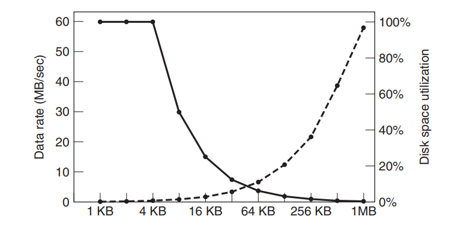

## 文件(Files)

### 目录

- 目录也是一个文件
- 目录保存了文件名和文件存储位置的对应关系

### 文件名

- 由有效名(Valid name)和扩展名(Extension)组成
- 至多 255 个字符
- 支持数字、字母、特殊字符，例如不支持冒号，因为冒号在 windows 系统中是路径分隔符
- Windows 不区分大小写，linux 区分

### 文件结构

1. 字、字节序列
2. 简单的记录结构：线性，定长
3. 复杂的结构：
   - 记录树
     

### 文件类型

- 普通文件：
  - ASCII 文件(字符文件)
  - 二进制文件：可执行文件、存档文件
- 目录文件：作为文件系统的一部分
- 字符特殊文件：用来建模串口 I/O 设备，例如终端，打印机，网络
- 块特殊文件：用来建模硬盘设备
  

### 文件访问

- 顺序访问：从文件的起始部位顺序读取全部字节，不能跳跃，可以倒带或者后退
- 随机访问：可以以任意顺序读取字节、记录，由两个方法执行：
  - read(file marker)然后 move(seek)，然后再读取。

### 文件属性

- 操作系统会把关于文件的一些信息和文件联系在一起，称为文件属性(file attributes)或者元数据(metadata)。

| Attribute  | Meaning                                 |
| ---------- | --------------------------------------- |
| protection | Who can access the file and in what way |
| Password   | Password needed to access the file      |
| Creator    | ID of the person who created the file   |
| Owner      | Current owner                           |
| ...        | ...                                     |

### 文件操作

- 对于顺序读取的文件有以下方法：

1. Create
2. Delete
3. Open
4. Close
5. Read
6. Write
7. Append
8. Seek
9. Get attributes
   10.Set Attributes
10. Rename

## 目录(Directories)

### Single-level Direcctory System

- 一个根目录下包含所有文件
  

#### 缺点

- 效率低、有命名冲突、没有分组

### Two-level Directoty System

- 根目录下划分用户目录，每个用户目录包含所有文件
  

#### 缺点

- 还是不能提供分组

### Hierarchical Directory System

- 允许任意深度、宽度的目录
- 每个用户有一个当前(工作)目录
- 叶子节点是文件，中间节点是目录

- 实现了名字冲突(不同用户可以有相同的文件名)，高效的查找，文件的共享和保护以及分组的能力。

## 文件系统实现(File System Implementation)

### 目录

### 文件系统的布局

- MBR(Master Boot Record)：主引导记录，位于扇区 0
- 分为多个 partion
- Boot block：可能是一些程序，用来引导系统启动
- Super block：记录一些信息，例如空闲空间等
- I-nodes：
  

### File Bytes vs Disk sectors

- 文件就是 bytes 序列，文件 I/O 的粒度是 bytes
- 硬盘是 sector(512bytes)的数组，I/O 的粒度是扇区
- 文件系统定义了块大小$=2^n\times sector\;size$ ，把连续的扇区分配给一个块
- 文件系统眼里的硬盘就是块的数组，所有文件操作都是以块为单位的。

### 文件的实现

- 文件的本质就是一个 bytes 序列，因为硬盘的单位是扇区(512bytes)，因此块大小$blcok\;size=2^n*sector\;size$ ，给每个文件分配的大小是以块为单位
- 有三种实现方法：连续分配(Contiguous Allocation)，链表分配(Linked List Allocation)，索引分配(Indxed Allocation)

#### 连续分配

- 目录需要记录文件的起始位置和大小

##### 优缺点

- 优点：易于实现，连续读取速度较快
- 缺点：硬盘碎片，必须要在创建文件的时候预先知道文件的最大大小，否则就不能增加文件大小
- 适用于例如 CD、DVD 等一次写入的只读存储介质。

#### 链表分配

- 每个文件都有一个链表来存储逻辑块和物理块的关系，物理块可以是分散存储的
- 目录存储的是文件的第一块(链表的起始项)和结尾值(可以缺省)

##### 优缺点

- 优点：没有外部碎片，目录项简单，只要硬盘有空闲空间文件就可以增长，顺序访问速度快
- 缺点：随机访问慢(随机访问都要从链表头开始遍历)，块中存储的数据小于$2^n$ 因为被 next 指针占据了空间

#### FAT(File Address Table)优化的链表

- 把硬盘块中的 next 指针移到一个 FAT(File Allocation Table)表中，FAT 是被存储在内存中的
- 每个表项对应硬盘中的一块，值为下一块的位置
- 用-1 来标记文件的结束，-2 标记空闲的块

##### 优缺点

- 优点：可以把整个块用来存储数据了，随机访问快一点了，因为 FAT 在内存中
- 缺点：FAT 占用大量内存空间，例如 200GB 的硬盘，如果一个块是 1KB，FAT 的一个表项占用 4bytes，FAT 表将占用 800MB

#### 索引分配(i-Node)

- i-node(index-node)存储了这个文件所有的逻辑块与物理块的对应关系
- 目录保存了文件对应的 i-node 的位置即可
- 还可以通过在 i-node 节点中保存其他 i-node 节点位置来实现多级索引
  

##### 优缺点

- 优点：支持直接访问，没有外部碎片，只有在文件打开的时候会把这个文件对应的 i-node 读进 内存中
- 缺点：需要内存空间保存 index

### 目录的实现

- 目录是跟普通文件一样存储的，目录项存储在 data 块中，一个目录文件包含一个目录项列表
- 当打开文件的时候，OS 通过路径名来定位目录项。
- 目录项为找到硬盘上的块提供了信息：
  - 整个文件的起始硬盘地址(连续分块方法)
  - 第一个块的数字(链表方法)
  - i-node 节点的数字(i-node 方法)

#### 文件属性与目录项

##### 实现 1

- 把文件名和文件属性包含在目录项中
- Windows 和 DOS 系统使用这种方法

##### 实现 2

- 把文件名和 i-node 位置包含在目录项中，文件属性又包含在 i-node 中
- 用于 UNIX 系统中

#### 文件名

##### 定长文件名

- 通常是 255 字符
- 最简单，但是浪费空间

##### In-line

- 目录项包括固定部分和可变部分
  

- 例如图中的定长部分是目录项长度和文件属性信息，可变部分就用来存储文件名，在文件名的最后会补齐一个字
- 好处是节约空间，缺点是当一个文件被删除，这个目录项也就被删除，新插入到这里的目录项只能小于等于删除的目录项的长度，就是产生了碎片，而且目录项可能跨页，就会引起 page fault

##### In-heap

- 目录项都是定长的，用一个指向堆中位置的指针来储存文件名
  

#### 在目录中搜索文件

- 线性查找
- 哈希表
- 查找结果缓存

#### 共享文件

- 指一个文件出现在多个目录中
- 问题是如果用户在某个目录更改了文件名，那么只有一个目录中的对应目录项会发生变化。
  

##### 硬连接(Hard Link)

- 用 i-node 方法，这两个目录都指向同一个 i-node，所以能解决这个问题
  

- 不能跨文件系统
- 只有超级用户才能创建目录的硬连接

##### 软连接(Symbolic Link or Soft Link)

- 创建一个类型为 LINK 的文件，这个文件包含了一个路径名，指向了 link 的文件，它们都有自己的文件和自己的 i-node

- 需要额外的硬盘空间来存储文件信息，遍历路径需要时间，如果源文件换了位置，基于路径的软连接将无法工作
- 好处是可以跨文件系统，软链接可以对一个不存在的文件名进行链接，硬链接必须要有源文件。 软链接可以对目录进行链接。

##### 共享文件的删除

- 对于硬连接，会在 i-node 中维护一个 count 字段来对引用进行计数，当在一个目录中删除时会 count-1，但是 owner 不变，count=0 时删除文件。
  
- 对于软连接，当移除源文件时，这个软链接就损坏了，而移除一个软链接对源文件没有任何影响。

## Disk space management

### Block Size

- 块大：数据传输率大，空间利用率小
- 块小：数据传输率小，空间利用率大
  

### 空闲块记录

#### 链表

- 用一个硬盘上的链表来记录，在空闲块中记录空闲块的块号
- 比如说一个 1Kb 的块，块有 32 位块号，那么一块可以存储 256 个块号，那么就用一个空闲块存储 255 个空闲块的块号，和一个 next pointer 指向另一个块

#### 位图

- 空闲块置 1，分配的块置 0，存储在内存中来方便快速读取。

#### 比较

- $16GB\;有2^{24}个1kb,$位图就需要$2^{24}bits=2048\;blocks$ ，链表需要$2^{24}/255=65793\;blocks$
- bitmap 会占用更少的空间，只有在硬盘几乎满了的时候(很少 free blocks)链表才会有更少的占用

## 文件系统可靠性

### 备份

- 不备份特殊文件(I/O 文件等)

### 文件系统的一致性

- Windows:scandisk UNIX:fsck

##### fsck：块级一致性检查

- 基本原则：硬盘上的每个块不是在文件或者目录中就是在 free list 中
- 维护两个表，每个表都有一个 n 位计数器(位图)，来记录每个块的使用情况
- 读取所有 i-nodes，标记使用的 block
- 读取 free list，标记所有的空闲块

###### 不一致的状态

- 块既不在文件或者目录里，也不在 free list 中：把这个块加入 free list
- 块在 free lisst 中出现了多次：不会在位图实现的 free list 中出现，只会出现在链表中，只需要删除多余的块来修复 free list
- 块同时出现在在多个文件中：

1.  Allocate 另一个块
2.  把块中的内容复制到新块中
3.  把新块放进文件中

- 块同时出现在 free list 和已使用块中：从 free list 中删除这个块
  

##### fsck：目录级一致性检查

- 每个文件有一个 counter 而不是每个块
- 递归地从根目录下降，把每个文件中的 counter+1，包括硬连链接，把最后得到的结果和 i-nodes 节点中存储的 reference counter 比较，如果 reference counter 偏大或者偏小，都去修改 i-nodes，使得其 reference number 和递归得到的值相同

## 文件系统表现优化

- 缓存：避免大量硬盘 I/O 的耗时
- 预读块(Block Read Ahead)：提高 cache 命中率
- 减少磁头移动：减少寻道时间

## 文件系统举例

### MS-DOS 文件系统

- 不同文件系统不同 block size 的最大分区大小

| Block size | FAT-12 | FAT-16 | FAT-32 |
| ---------- | ------ | ------ | ------ |
| 0.5KB      | 2MB    |        |        |
| 1KB        | 4MB    |        |
| 2KB        | 8MB    | 128MB  |        |
| 4KB        | 16MB   | 256MB  | 1TB    |
| 8KB        |        | 512MB  | 2TB    |
| 16KB       |        | 1024MB | 2TB    |
| 32KB       |        | 2048MB | 2TB    |

- FAT32 在 Win95 中推出，FAT32 有 28 位硬盘地址，理论上有最多 8TB($2^{28}\times 2^{15}\;bytes$ )，但是通常最大只有 2TB
  
- 对比 FAT-16，FAT-32 能支持更大的硬盘，而且一个 8GB 的硬盘在 FAT-32 下可以是一个 partion，而 FAT-16 就是 4 个 partion。而对于给定大小的 partion，FAT-32 使用更小的块大小。

### Win98 文件系统

- 对长文件名的存储
  
  

### UNIX V7 文件系统

- 只有一个 i-node 编号和 14 位的文件名
  

- 从路径访问文件
  
