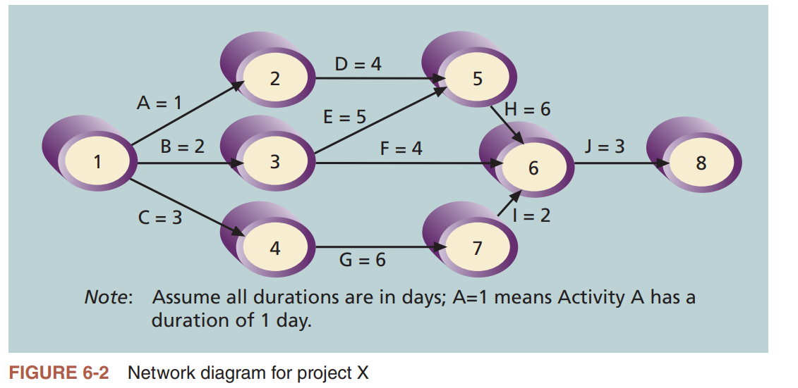
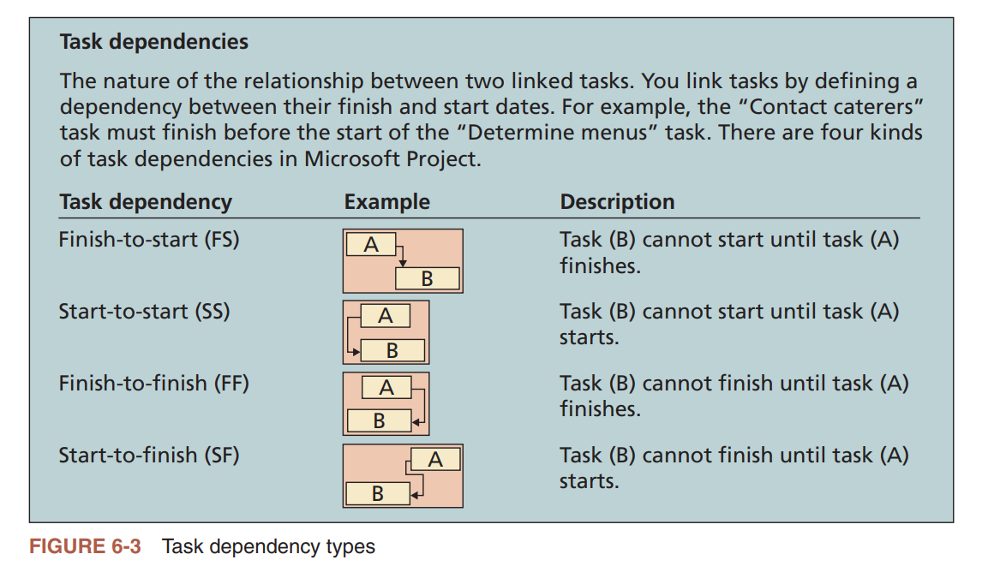
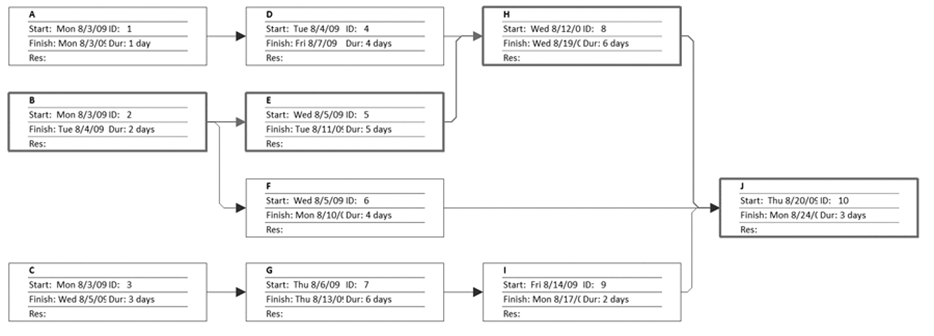
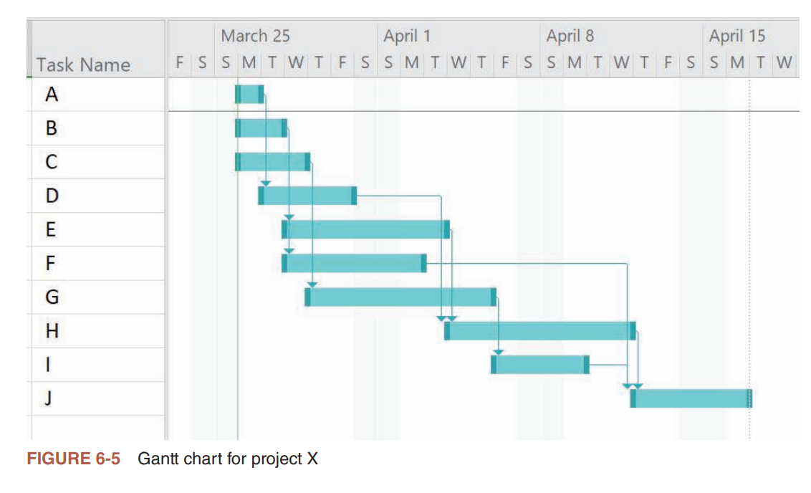
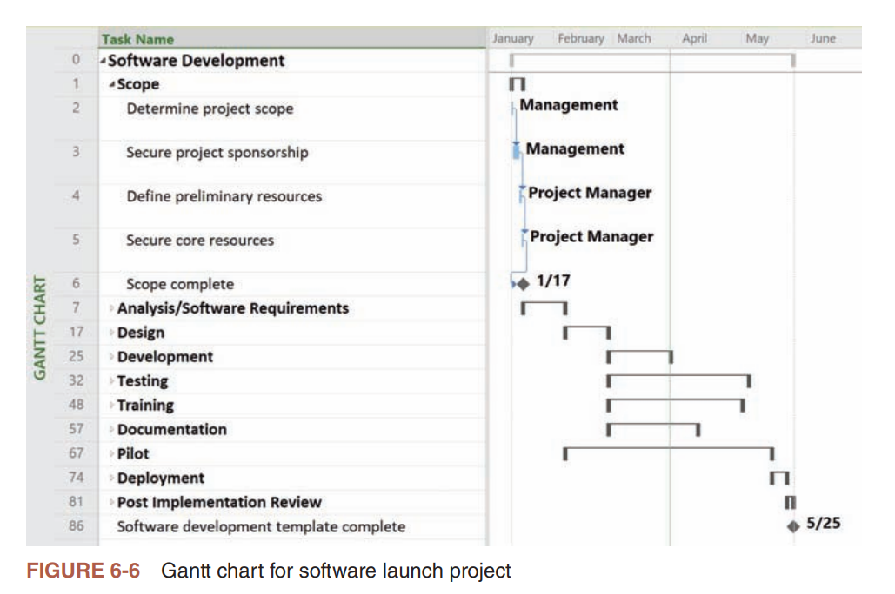
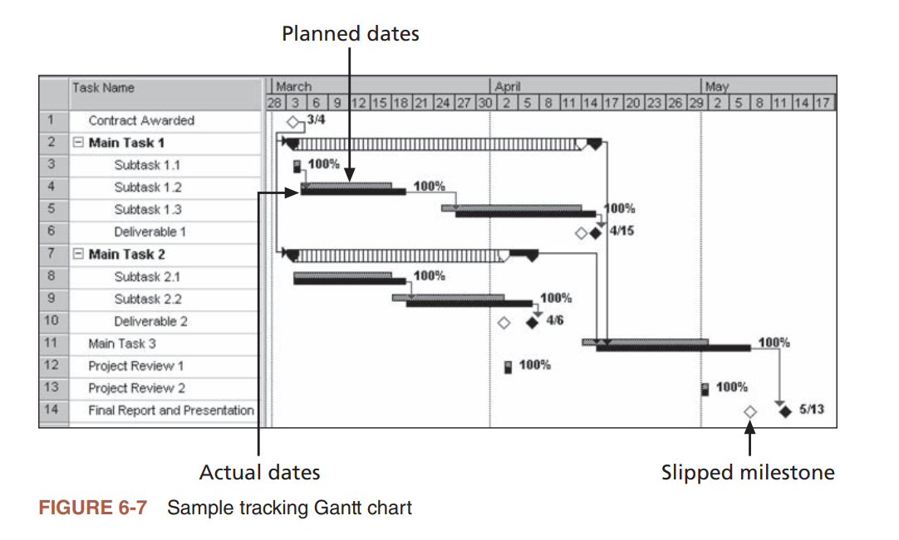
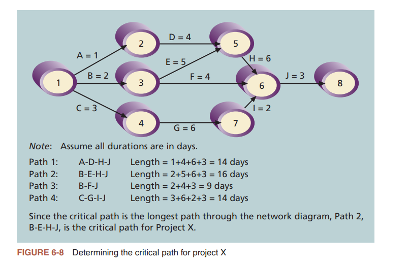
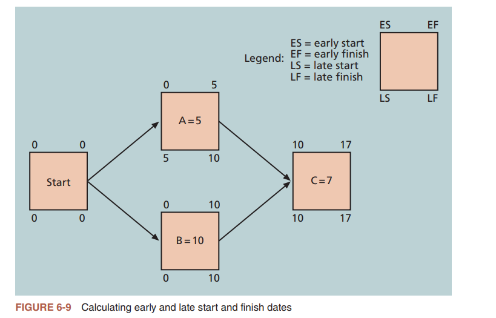
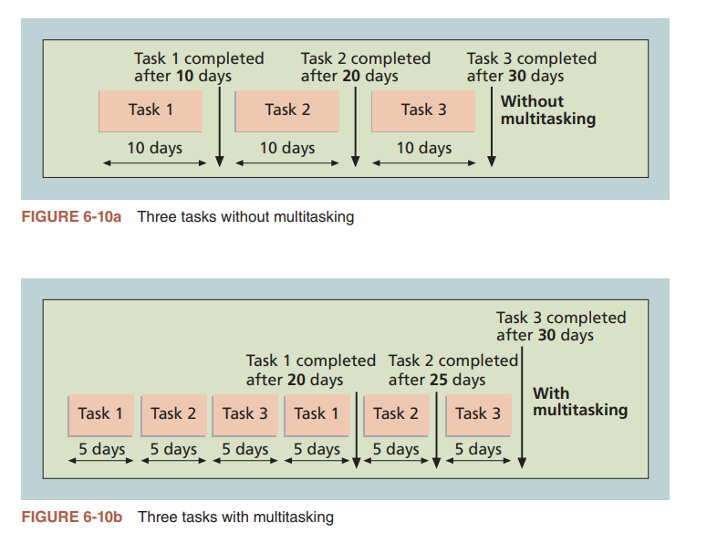
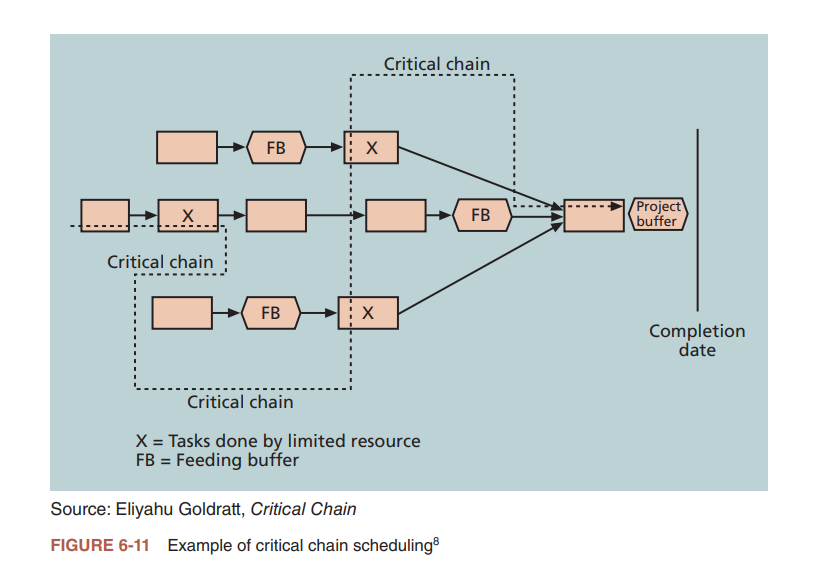

## 讨论问题

1. 项目进度管理中的6个主要过程
2. 一个进度管理计划应该包括哪些信息？
3. 依赖的四种类型
4. 辅助进度制订过程的工具和技术有哪些？
5. SMART准则是怎样定义里程碑的？
6. 使用关键路径来缩短项目进度有哪三个主要技术？

## 项目进度管理(Project Schedule Management)中的6个主要过程

1. `计划进度管理`是指确定将用于计划、执行和控制项目进度的政策、流程和文档。
2. `定义活动`是指识别项目团队成员和干系人必须执行并产生生项目的可交付成果的特定活动。`活动(activity)`或`任务(task)`是工作的组成要素,通常出出现在工作分解结构中,有预计的持续时间、成本和资源要求。
3. `排列活动顺序`是指识别和记录项目活动之间的关系,包括需求农、资源分解结构和项目文档更新。
4. `估算活动持续时间`是指估算完成单项活动所需的工作时间。
5. `制定进度计划`是指分析活动顺序、资源需求和活动持续时间估算来创建项目进度计划。
6. `控制进度`是指控制和管理项目进度的变更。

## 计划进度管理

- 项目进度模型的开发:许多项目都包括一个进度模型,进度模型包括持续时间估算、依赖关系和其他可以用来生成项目进度的信息。
- 准确度和计量单位:讨论进度估算的准确度并决定是否用小时、天或者其他单位来度量时间。
- 控制阅值:建立偏差阈值,如±10%,用于监测进度执行情况觉。
- 绩效评估规则:例如,如果希望团队成员跟踪工作的完成百分比,则绩效评估规则指明如何确定百分比。
- 报告格式:描述项目所需的进度报告的格式和频率。
- 过程描述:描述如何执行所有的进度管理过程。

## 定义活动

- `活动清单(activity list)`是包含在项目进度中的活动列表。这个清单应该包括活动名称、活动标识或者编号以及活动的简短描述。
- `活动属性(activityyattributes)`提供有关每个活动的进度相关信息,例如紧前活动、紧后活动、逻辑关系、提前量和滞后量、资源需求、约束、强制日期以及与活动相关的假设。活动清单和活动属性应该该与WBS和WBS词典保持一致。
- 项目中的`里程碑(milestone)`是项目中一个通常没有持续时间的重要事件。通常,完成个里程碑需要进行一些活动和大量的工作,但是里程碑本身是帮助识别必要活动的标记

- 定义活动的目标是确保项目团队完全理解他们必须做的所有工作是作为项目范围的一部分,以便他们能够开始安排工作进度。

## 排列活动顺序

在定义了项目活动后,项目进度管理的下一步是对活动进行排序或确定它们之间的依赖关系。活动排序过程的输入包括项目管理计划、项目文档(如活动属性、活动清单、假设日志和里程碑清单)、企业环境因素和组织过程资产。排序过程包括评估活动之间存在依赖关系的原因和不同类型的依赖关系。

### 依赖关系

- `依赖(dependency)`或`关系(relationship)`与项目活动或任务的排序相关。例如,一个特定的活动是否必须在另外一个活动开始之前完成?项目团队是是否能够同时进行多项活动?
- 项目活动之间有几种类型的依赖关系:
  - `强制性依赖关系(mandatory dependencies)`是项目中正执行的工作的固有本质。某些时候被称为硬逻辑关系。例如,在编写代码之前,你不能则试代码。
  - `选择性依赖关系(discretionarydependencies)`由项目团队定义。例如,项目团队可能遵循好的实践,并且在用户签署同意所有分析工作之前,项目团队不会开始新的信息系统的详细设计。选择性依赖关系有时又称为软逻辑关系,应该谨慎使用,因为它们将可能限制后续的进度安排。
  - `外部依赖关系(external dependencies)`涉及项目活动和非项目活动之间的关系。例如,新的操作系统和其他软件的安装可能依赖于外部供应商交付的新硬件。即使新硬件的交付可能不包括在项目范围内,你也应该为其添加外部依赖关系,因为交付延误将影响项目进度。
  - `内部依赖关系(internaldependencies)`涉及项目活动之间的关系,这些关系通常在项目团队的控制之内。例如,如果软件是由团队开发的,他们可以以创建依赖关系,如在系统测试之前执行单元测试。

### 网络图(network diagram)

- 网络图是表示活动排列顺序的首选技术。一个`网络图(network diagram)`是显示项目活动之间的逻辑关系及其顺序的示意图有些人将网络图你作项目进度网络图或者计划评审技术图
- 下图给出了项目X的一个网络图示例，该网络图的格式使用的是双代号网络图(Activity-On-Arrow, AOA)的方法或者箭线图法(Arrow Diagramming Method, ADM)

- 更常用的是——`紧前关系绘图法(Precedence Diagramming Method, PDM)`,PDM是一种网络图技术,使用方框表示活动。它在显示特定类型的时间关系时特别有用。
  - 它包含以下四种类型的依赖或者是关系：
    - 完成——开始(finish-to-start)：例如系统安装前不能提供用户培训
    - 开始——开始(start-to-start)：比如新系统运行后，许多任务才能开展
    - 完成——完成(finish-to-finish)：比如质量控制的投入不能在产品完成之前完成
    - 开始——完成(start-to-finish)：比如生产过程的开始会延误原料采购的完成
    
  - 下图是一个PDM网络图示例

:::info

活动和任务是可以互换使用的，关系和依赖也是

:::

- 紧前关系绘图法比AOA网络图更经常使用,而且比AOA技术有许多优势。
  1. 多数项目管理软件都使用紧前关系绘图法。
  2. 紧前关系绘图法可以避免使用虚活动。`虚活动(dummy activity)`没有持续时间而且没有资源,但是有时需要在ACA网络图上用虚活动表示活动之间的逻辑关系。这些活动是用虚的箭线表示,并且持续时间司估算是零。
  3. 紧前关系绘图法表示任务间的不同依赖关系,而AOA网络图只使用了完成-开始依赖关系。

## 估算活动持续时间

- 持续时间(duration)包括在活动上花费的实际时间加上占用时间。例如你说你两个月读完这本书，实际上可能总共只花了20小时
- 不要把持续时间和人力投入(effort)混淆，后者是完成任务所需要的工作天数或者工作小时数
- 估计活动持续时间最重要的是估算资源的可用性，特别是人力资源。
- `三点估算(three-point estimate)`，包括乐观、最可能和悲观的估算

## 制定进度计划

制定进度计划是依据前面所有项目进度管理过程的结果来决定项目的开始和结束日期。在最终确定项目进度之前,所有项目进度管理过程通常要经历几次迭代。这里会使用一些工具和技术来辅助进度制定的过程

### 甘特图(Gantt chart)

- `甘特图(Gantt chart)`提供了一套显示项目进度信息的标准格式,以日历的形式列出项目活动及其相应的起止日期。甘特图有时又称为条形图,因为为活动的开始和结束日期都用横条显示。图6-5给出了一个用Microsoft Project创建的项目X的简单甘特图。

- 注意软件发行项目的甘特图上的不同符号(见图6-5):
  - 黑的菱形符号表示一个里程碑。在图6-6中,任务6"范围完成"是一个发生在1月17日的里程碑。对于非常大的项目,高层管理者可能只想在甘特图上看到里程碑。
  - 开头和结尾处带有矩形的粗黑条表示概要任务。例如,第2~~5行中列出的活动是概要
  - 任务1,"范围"的所有子任务。WBS活动在多数项目管理软牛中也称为任务和子任务。
  - 任务2、3、4和5的浅灰色横条表示每个单独任务的持续时间。
  - 连接这些符号的箭线表示任务之间的关系或依赖。甘特图通常不能表示依赖关系，这是它最大的缺点。但是部分项目管理软件，例如MS Project可以提供绘制了依赖关系的甘特图

### 在甘特图上增加里程碑

- 为了使里程碑变得有意义,一些人使用SMART准则来帮且助定义里程碑。SMART准则是一些指导原则,认为里程碑应当是:
  - 明确的(Specific)
  - 可度量的(Measurable)
  - 可分配的(Assignable)
  - 现实的(Realistic)
  - 有时间限制的(Time-framed)

### 使用跟踪甘特图来比较计划和实际的日期

- 你可以使用甘特图的特殊形式,通过显示实际的进度信息来评估项目进展。图6-6展示了一张`跟踪甘特图(Tracking Gantt chart)`——一个比较计划和实际项目进度信息的甘特图。活动的计划进度日期被称为`基准日期(baselinedate)`,整个经过审批的计划进度被称为`进度基准(schedulebaseline)`。如图6-7所示

- 作为一个进展评估工具,跟踪甘特图使用了一些附加的符号：
  - 注意图6-6中的甘特图通常将任务表示为两个横条。上面的横条表示每个任务的计划或基准持续时间。下面的横条表示实际的持续时间。一个带状的横条,如主任务1和2所示,表示概要任务的计划持续时间。与它相交的黑色横条表示概要任务的进展。例如,主任务2清楚地表明,实际持续时间比话计划的要长。
  - 跟踪甘特图中的白色菱形表示一个偏移的里程碑。一个`偏移的里程碑(slipped milestone)`意味着里程碑活动的实际完成时间比原来计划的要晚。最后的任务提供了一个偏移的里程碑的例子,因为最终的报告和发布比计划的要晚。
  - 右侧横条的百分比显示每个任务完成工作的百分比。例如,100%意味着任务完成了，50%意味着任务仍在进行中,但工作已经完成了一半。

### 关键路径法

- `关键路径法(Critical PathMethod,CPM)`——也称为`关键路径分析(critical path analysis)`,是一种网络图技术,用来预测整个项目的持续时间。这种重要的工具将帮助你防止项目进度超期。
- 项目的`关键路径(criticaal path)`是指决定项目最早完成时间的一系列活动,是通过`网络图的最长路径`,其时差或者浮动动时间最少。
- `时差(slack)`或`浮动时间(float)`是指在不延误紧后活动或者项目完成时间的情况下,活动可以推迟的时间。
- 在项目中通常有多个任务同时进行,而且多数项目都有多条通过网络图的路径。最长路径或者包含关键任务的路径决定项目的完成日期。直到完成了所有的任务,你才能完成这个项目。

### 计算关键路径

- 关键路径是可以在执行过程中改变的，有多个关键路径时，项目经理需要同时关注它们

### 使用关键路径分析来权衡进度

- `自由时差(free slack)`或`自由浮动时间(free float)`是在不延误任何紧后活动的最早开始时间的情况下,一个活动可以被延误的时间。
- `最早开始时间(early start date)`是基于项目网络中的逻辑关系,一个活动可以开始的最早的可能时间。
- `总时差(total slack)`或者`总浮动时间(total float)`是在没有拖延计划项目完成日期的情况下(也就是不延误任何紧后任务的最晚开始时间的情况下),从活动的最早开始时间算起可以被耽误的时间。
- 可以分别通过`顺推法(forward pass)`和 `逆推法(backward pass)`来确定最早完成/开始时间和最晚完成/开始时间，进而得出浮动时间

### 使用关键路径来缩短项目进度

- `赶工(crashing)`是一种为了以最少的成本代价获得最大限度的进度压缩,而在成本与进度之间进行权衡的技术。例如,缩短关键路径中的任务时间
- `快速跟进(fast tracking)`包括并行执行那些通常以顺序方式执行的活动。例如,在项目分析结束前就开始一些编码工作

### 关键链进度计划

- `关键链进度计划(critical chain scheduling)`是一种进度计划方法,在创建项目进度时考虑资源的限制性,并且为了保护项目的完成日期,将缓冲也包括进来
- `多任务(multitask)`会造成任务延误，而且往往会浪费建立时间，如下图

- 而关键链进度计划假定资源不能同时执行托任务，或者至少最小化多任务
- 关键链进度计划去掉了单个任务的缓冲，而是创建了`项目缓冲(project buffer)`，项目缓冲是添加在项目完成日期之前的附加时间。关键链进度计划还可以使用`汇入缓冲(feeding buffer)`来保证关键链上的任务不被延迟,这部分缓冲来自非关键链进入关键链之前增加的时间。

### 计划评审技术

- 当个别活动的持续时间估算存在高度不确定性时,可以使用`计划评审技术(Program Evaluation and Review Technique,PERT)`来估算项目持续时间。PERT将关键路径法(CPM)应用于持续时间的加权平均值估计。PERT用`概率时间估算(probabilistic time estimate)`来估计时间，用以下公式来计算每个
$$\text{PERT加权平均}=\frac{\text{乐观时间}+4\times\text{最可能时间}+\text{悲观时间}} 6$$

### 敏捷和进度管理

- 简单来说就是先在短时间内为客户完成一些有用的工作,而不是先定义所有需要的工作,然后再计划何时完成。

## 进度控制

- 项目进度管理中最后一个过程是进度控制,像范围控制一样,进度控制也是项目整合管理下的整体变更控制过程的一部分。进度控制的目标是了解进度状态、影响造成进度变更的因素、确定进度变更决定和管理变更。
- 进度控制的主要输入是项目管理计划、项目文件(例如经验教训登记册、项目日历、项目进度、资源日历和进度数据)、工作绩效数据和组织过程资产。其中一些工具和技术包括:
  - 数据分析工具,包括
    - 挣值分析,如第7章所述
    - 迭代燃尽图,如第3章所述
    - 绩效评估
    - 趋势分析
    - 偏差分析
    - 假设情景分析
  - 关键路径法,本章前面已介绍
  - 项目管理信息系统
  - 资源优化,如第9章所述的资源平衡
  - 提前量和滞后量,如前所述
  - 进度压缩,如赶工和快速跟进
- 进度控制的主要输出包括工作绩效信息、进度预测、请求变更、项目管理计划更新和项目文档更新。

## 敏捷/自适应环境下的注意事项

进度计划管理在使用敏捷方法和Scrum方面有根本的不同。严重依赖关键路径法的项目将达到预计的完成日期视为成功的关键组成部分。另一方面,敏捷项目甚至根本不需要估计持续时间或项目进度。为什么?因为整个项目的完成时间并不重要。客户只是想要在每次迭代中都想看到他们想要的东西

## 本章小结

- 项目进度管理通常被认为是项目冲突的主要来源。多数IT项目实际标时间超出了时间估算。项目进度管理的主要过程包括计划进度管理、定义活动、排列活动顺序、估算活动持续时间、制定进度计划和控制进度。
- 计划进度管理涉及确定将用于计划、执行和控制项目进度的政策、程序和文档。主要的输出是进度管理计划。
- 活动定义包括识别必须完成的特定活动以产生项目的可交付成果。这一过程通常会产生一个更加详细的WBS。
- 排列活动顺序确定了活动之间的关系或者依赖关系。创建关系的3个原因是:它们是基于工作本质的强制性依赖;它们是基于项目团队经验的选择性依赖;它们是基于非项目活动的外部依赖。在使用关键路径分析之前必须完成活动排序。
- 网络图是显示活动排序的首选技术。用于创建这些图的两种方法分别是箭线图法和紧前关系绘图法。任务之间有四种关系:完成-开始、完成-完成、开始-开始和开始-完成。
- 活动持续时间估算是对完成每个活动需要花费的时间进行估算。这些时间估算包括实际的工作时间和占用时间。
- 制定进度计划就是根据所有其他项目进度管理中得到的结果来确定项目的开始和结束日期。项目经理通常使用甘特图来显示项目的进度。跟踪甘特图显示计划的和实际的进度信息。
- 关键路径法预测整个项目的持续时间。项目的关键路径是确定项目的最早完成时间的活动序列。它是通过网络图的最长路径。如果关键路径上的一个活动延误了,那么整个项目将会被延误,除非项目经理采取纠正措施。
- 赶工和快速跟进是两种缩短项目进度的技术。项目经理和团队成员必须对于接受项目中不合理的进度安排保持谨慎,特别是对IT项目。缩短进度计划大约有25%的实际限制,并且几乎总是会增加项目成本和风险。
- 关键链进度计划是约束理论(TOC)的一个应用,它使用关键路径分析、资源约束和缓冲来保证项目按时完成。
- 计划评审技术(PERT)是一种网络分析技术,在单个活动的待续时间估算具有高度不确定性时,用于估算项目的持续时间。PERT使用乐观的、最可能的和悲观的活动持续时间估算。现在很少有人用PERT图。
- Scrum之类的敏捷方法通过提供更大的灵活性,采用了不同的方法进行项目进度管理。每个冲刺的时间很短(通常是2~4周),并且每天都有Scrum会议为团队成员提供协作的环境,以便成员在该时间段内专注于完成特定的任务。产品责人确定每次冲刺期间要完成的任务并确定其优先级。
- 进度控制是项目进度管理的最后一个过程。虽然进度技术是非常重要的,但是许多项目的失败不是因为一个糟糕的网络图,而是人员问题。项目经理里必须让所有的干系人参与进度制定过程。制定切合实际的项目进度并使用纪律手段来达到进度目标是非常关键的。
- 如果使用得当,项目管理软件能够辅助项目进度管理。使用项目管理软件,可以避免执行烦琐的手工计算,并在活动持续时间估算或者活动间依赖关系出现改变的时候,执行假设情景分析。许多人错误地使用项目管理软件,因为他们不理解隐藏在项目管理工具背后的概念,这些工具包括创建网络图、确定关键路径或者设定进用基准。在创建特定的项目进度时,项目经理也必须避免过于依赖样例文件或者模板。
- 一定要考虑项目进度管理在敏捷/自适应环境中的差异。

## 关键术语

活动(activity)
活动属性(activity attributes)
活动清单(activity list)
双代号网络图(AOA)(activity-on-arrow,AOA)
分叉(burst)
赶工(crashing)
关键链进度计划(critical chain scheduling)
关键路径(critical path)
关键路径法(CPM)或关键路径分析(critical path method, CPM) or critical path analysis)
依赖(dependency)
选择性依赖关系(discretionary dependencies)
虚活动(dummy activities)
持续时间(duration)
最早完成时间(early finish date)
最早开始时间(early start date)
人力投入(effort)
外部依赖关系(external dependencies)
快速跟进(fast tracking)
汇入缓冲(feeding buffers)
完成-完成依赖(finish-to-finish dependency)
完成-开始依赖(finish-to-start dependency)
浮动时间(float)
顺推法(forward pass)
自由时差(自由浮动时间)(free slack,free float)
甘特图(Ganttchart)
内部依赖关系(internal dependencies)
最晚完成时间(late finish date)
最晚开始时间(late start date)
强制性依赖关系(mandatory dependencies)
汇聚(merge)
箭线图法(ADM)(arrow diagramming method,ADM)
逆推法(backward pass)
基准日期(baseline dates)
缓冲(buffer)
里程碑(milestone)
多任务(multitasking)
墨菲定律(Murphy'sLaw)
网络图(network diagram)
节点(node)
帕金森定律(Parkinson'sLaw)
PERT加权平均(PERT weighted average)
紧前关系绘图法(PDM)(precedence diagramming method,PDM)
概率时间估算 (probabilistic time estimates)
计划评审技术(PERT)(Program Evaluation and Review Technique, PERT)
项目缓冲(project buffer)
项目进度管理 (project schedule management)
关系 (relationship)
资源分解结构 (resource breakdown structure)
资源(resources)
进度基准 (schedule baseline)
时差 (slack)
偏移的里程碑 (slipped milestone)
SMART 准则 (SMART criteria)
开始 - 完成依赖 (start-to-finish dependency)
开始 - 开始依赖 (start-to-start dependency)
任务(task)
约束理论 (TOC)(Theory of Constraints, TOC)
三点估算 (three-point estimate)
总时差(总浮动时间)(total slack, total float)
跟踪甘特图(Tracking Gantt chart)
