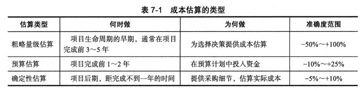
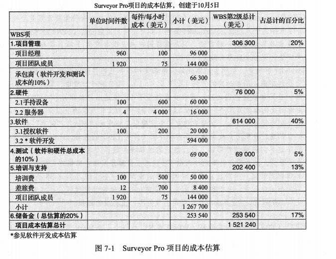
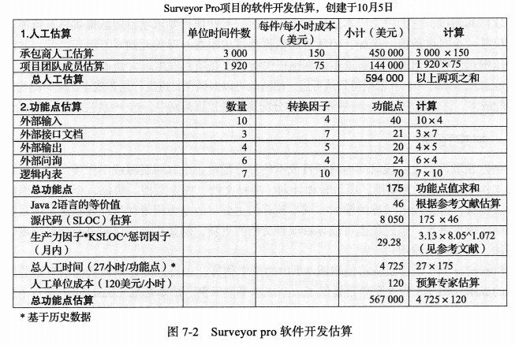
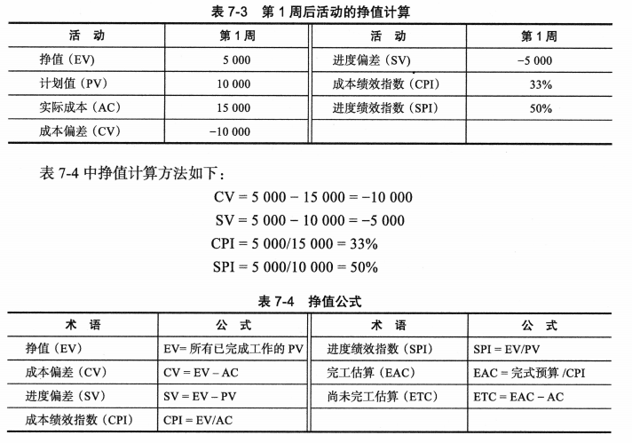
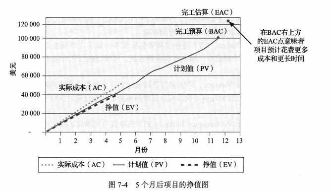

## 讨论问题

1. 项目成本管理的 4 个过程
2. 成本管理计划应该包括哪些信息？
3. 三种基本的成本估算类型
4. 成本估算的工具和技术有哪些？
5. 挣值公式（EV, CV, SV, CPI, SPI）

## 项目成本管理

- 成本`超支(overrun)`是实际成本超过估计的额外百分比或金额。
- 本章通过计划成本管理、创建良好的成本估算以及使用挣值管理(EVM)来辅助成本控制

### 项目成本管理是什么

- `项目成本管理(project cost management)`包含用来确保项目团队在批准的预算内完成一个项目的必要过程。请注意这个定义中的两个关键短语:"一个项目"和"批准的预算"。项目经理必须确保他们的项目有恰当的定义、准确的进度计划和成本估算,并有他们参与批准通过的、切合实际的预算。

### 项目成本管理的四个过程

1. 计划成本管理包括决定用于计划、执行和控制项目成本的政策、程序和文件。这个过程的主要输出是成本管理计划。
2. 估算成本包括对完成项目所需资源的成本进行近似计算。成本估算过程的主要输出是活动成本估算、估算依据和项目文档更新。
3. 制定预算包括将总体成本估算分配到各个工作项目,以建立立衡量绩效的基准。成本预算过程的主要输出是成本基准、项目资金需求和项目文档更新所。
4. 控制成本包括控制项目预算的变更。成本控制过程的主要转输出是工作绩效信息、成本预测、请求变更、项目管理计划更新,以及项目文档更新。

### 成本管理的基本原理

- `利润(profits)`是收入减去支出。
- `利润率(profitmargin)`是利润与收入的比率。
- `生命周期成本(life cycle costing)`是对整个项目生命周期成本的全局认识。例如项目开发一年，运行十年，那么就要对整个生命周期(十年)的成本和收益进行估算
- `现金流分析(cash flow analysis)`是确定项目的年度成本估算和收益以及由此产生的年度现金流的一种方法。项目经理必须进行现金流分析,以确定净现值。
- `有形成本或收益(tangible costs or benefits)`和`无形成本或收益(intangible costs or benefits)`分别表示容易和不容易用现金来衡量的成本与收益。
- `直接成本(direct costs)`是指那些与创造项目产品和服务直接相关的成本。比如员工的工资
- `间接成本(indirect costs)`与项目的产品或服务不直接相关,但它们与项目的工作绩效间接相关。例如,水电费、纸巾等必需品
- `沉没成本(sunk cost)`是过去已经花费的钱,它就像沉船一样消失了,永远也打捞不起来。在决定投资或继续哪些项目时,不应该考虑沉没成本。例如,赌徒因为输了钱而一直赌博就是因为没有忘记沉没成本
- `学习曲线理论(learning curve theory)`指出,当许多产品被重复生产时,这些产品的单
  位成本会随着产品数量的增加而有规律地降低。例如,假定 Surveyvor Pro 项目可能会生产
- `储备金(reserves)`包含于成本估算中,是为了消减由于未来难以预测而带来的成本风
  险而预先留出的资金。
- `应急储备金(contingency reserves)`为一些可以部分预计的未来情况(有时称为`已知的未知(known unknowns)`)做准备,它包含在项目成本基准中。例如,如果一个组织知道 IT 人员的流动率为 20%,它就应该准备应急储备金来支付 IT 人员的招聘和培训成本。
- `管理储备金(management reserves)`考虑到未来不可预测的情况(有时称为`未知的未知(unknownunknowns)`)。例如,如果一个项目经理生病了两周,或者一个重要的供应商

## 计划成本管理

成本管理计划，如范围管理计划和进度管理计划一样，可以是非正式的和宽泛的，也可以是正式的和详细的，这取决于项目的需要。一般来说，成本管理计划包括以下信息：

- 准确度：活动成本估算通常有四舍五人准则，比如四舍五人到最接近的 100 美元。关于应急储备金的数额也可能有指导方针，比如 10% 或 20%。
- 计量单位：定义用于成本计量的每个单位，如工时或天数。
- 组织程序链接：许多组织将用于项目成本核算的工作分解结构(WBS)的组成部分作为控制账户(CA)。每个控制账户通常被分配一个唯一编码用于使用组织的会计系统。项目团队必须正确理解和使用这些账户编码。
- 控制阅值:类似于进度偏差,成本变化在需要采取行动应对之前通常有一个允许变化区间,比如成本基准的 10%。
- 绩效评估规则:如果项目使用在本章后面所描述的挣值管理(EVM),成本管理计划将定义评估规则,例如跟踪实际成本的频率和详细程度。
- 报告格式:描述项目所需的成本报告的格式和频率。
- 过程描述:描述如何执行所有的成本管理过程。

## 估算成本

### 估算的类型

有三种基本估算

- `粗略量级(ROM)估算(Rough Order of Magnitude(ROM)estimate)`提供了一个项目的粗略估算。ROM 估算也可以称作近似估算、猜算、虚估或泛算。准确度通常为-50%~+100%
- `预算估算(budgetary estimate)`是用来分配资金到组织中的预算。许多组织制定至少未来两年的预算。预算在项目完成前 1\~2 年做出。预算的准确度一般是-10%\~+25%,
- `确定性估算(definitive estimate)`提供了对项目成本的准确估算。确定性估算用于做出许多需要准确估算的采购决策和估算最终的项目成本。
  

### 成本估算的工具和技术

- `类比估算(analogous estimates)`，也称为`自上而下估算(top-down estimates)`，使用以前类似项目的实际成本作为估算当前项目成本的依据。不准确
- `自下而上估算(bottom-up estimates)`，估算单个工作项或者活动的成本，相加得到整体估算。准确但是花费时间长，成本高
- `三点估算(three-point estimates)`包括估算项目最可能的、最乐观的和最悲观的成本。你可以使用第 6 章中描述的 PERT 加权平均公式,或者使用第 11 章中描述的蒙特卡罗模拟来进行成本估算。
- `参数估算(parametric estimating)`使用数学模型中的项目特征(参数)来估算项目成本。例如,参数化模型可能根据项目使用的编程语言、程序员的专业水平、所涉及数据的大小和复杂性等为软件开发项目提供每行代码 50 美元的估算。
- 实践中，混合使用以上方法可以提供最佳的成本估算。

### IT 成本估算的典型问题

- 估算的速度太快
- 由缺乏评估经验的人进行估算
- 人们有低估的倾向
- 管理层要求准确性

### 示例

## 制定预算(Budget)

- 制定预算涉及在一段时间内将项目成本估算分配给单个材料资源或工作项。这些材料资源或工作项以 WBS 为基础。项目管理计划、项目文档、商业文档、协议、企业环境因素和组织过程资产都是制定预算的输入。
- `成本基准(cost baseline)`是一个阶段性的预算，项目经理使用它来衡量并检测成本的执行情况，它包括应急储备金。
- 项目预算由成本基准加上管理储备金组成。控制账户是工作包成本估算加上应急储备金。工作包成本估算是活动成本估算加上活动应急储备金。

:::info 预算与估算
相同点：

1. 都运用类比估算、参数模型、自下而上等工具和技术。
2. 都是以 WBS 为基础的。

不同点：

1. 估算成本是对完成项目活动所需资金进行近似估算的过程(核心是近似估算)。而制定预算是汇总所有单个活动或工作包的估算成本，建立一个经批准的成本基准的过程(核心是建立成本基准)。
2. 估算成本其输出是成本估算，这种估算并未得到管理层的批准(核心是未得到管理层批准)。而成本预算输出的是成本基准计划亦即经过批准的成本预算(核心是经过批准的)。
3. 成本估算的精确程度以工作包为基础。而成本预算将基于工作包的成本估算分配到每项活动及相应时间段。(核心是分配到活动并按时间段分配)。

:::

## 控制成本

- 控制项目成本包括监测成本执行情况、确保修订的成本基准中仅包含适当的项目,并通知项目干系人那些经过批准的、将影响成本的项目变更。
- 项目管理计划、项目文档、项目资金需求、工作绩效数据和组织过程资产都是控制成本的输入。
- 这个过程的输出是工作绩效信息、成本预测、变更请求、项目管理计划更新和项目文档更新。

### 挣值管理(Earned Value Management, EVM)

- `挣值管理(Earned Value Management,EVM)`是一种集成项目范围、时间和成本数据的项目绩效度量技术。给定一个成本执行基准,项目经理和他们的团队可以通过输入实际信息,然后将其与基准进行比较来判断项目目前在多大程度上满足了项目范围、时间和成本目标。
- 挣值管理涉及计算项目的 WBS 中每项活动或概要活动的 3+4 个值。
  1. `计划值(Planned Value,PV)`是分配给计划工作的已授权预算。表 7-3 是挣值计算的一个示例。假设一个项目包括购买和安装新 web 服务器这样样一项概要活动。进一步假设,根据计划它将花费一周的时间,在工时、硬件和软件上总共花费 17 万美元。因此,该活动那一周的计划值(PV)是 1 万美元。
  2. `实际成本(Actual Cost,AC)`是在特定的时间段内对某一活动执行的工作所产生的已发生成本。例如,假设活动实际花费了两周时间,购买和安装新 web 服务器花费了 2 万美元。假定这些实际费用中 1.5 万美元发生在第 1 周,5000 美元发生在第 2 周。这些值是该活动在每周中的实际成本。
  3. `挣值(Earned Value,EV)`是对已完成工作的度量,以工作的授权预算表示。它通过已完成工作的 PV 总和计算,因此不能超过某个部分的授权 PV 预算。在表 7-3 中,一周后的挣值为 5000 美元。
     
  4. `成本偏差(Cost Variance,CV)`是挣值减去实际成本。如果成本偏差是为负,则意味着执行工作的成本超过计划成本。如果成本偏差为正,意味着执行工作的成本要比计划成本低。
  5. `进度偏差(Schedule Variance,SV)`是挣值减去计划值。如果进度偏差为负,则意味着执行工作所花费的时间比计划用时要长。如果进度偏差为正,则为意味着执行工作所花费的时间比计划时长要短。
  6. `成本绩效指数(Cost Performance Index,CPI)`是挣值与实际成本的比率,可以用来估算完成项目的预计成本。如果 CPI 等于 1 或者 100%,那么计划成我本和实际成本相等--即成本与预算完全一致。CPI 小于 1 或小于 100%,意味着项目成本超出预算。如果 CPI 大于 1 或大于 100%,则该项目成本低于预算。
  7. `进度绩效指数(Schedule Performance Index,SPI)`是挣值与计划值的比率,可以用来估算完成项目的预计时间。与成本绩效指数类似,SPI 为 1 或 100%,表示项目按进度计划进行。如果 SPI 大于 1 或 100%,则意味着项目提前完成。如果 SIPI 小于 1 或 100%,则项目进度落后于进度计划。
  8. `完工估算(Estimate At Completion,EAC)`是完工预算 BAC 除以成本绩效指数 CPI 计算出来的
  9. 尚未完工绩效指数(To-Complete PerformanceIndex,TCPI),这是一种度量成本绩效的方法,必须利用如 BAC 或 EAC 的剩余数值来实现相应计算。根据两个不同的目标有以下两个公式:

$$
\begin{array}{c}
\text{按计划完成或满足完工预算}(BAC):TCPI=(BAC-EV)/(BAC-AC)\\
\text{满足当前完工估算}(EAC):TCPI=(BAC-EV)/(EAC-AC)
\end{array}
$$

- 挣值图包括三条曲线和两个点：
  - 计划值(PV),即按月累计所有活动的计划金额。请注意,计十划值曲线随项目的估算时间延伸,并在完工预算点处结束。
  - 实际成本(AC),即按月累计所有活动的实际成本。
  - 挣值(EV),即按月累积所有活动的挣值。
  - 完工预算(BudgetAt Completion,BAC),即项目最初的总预算,在本例中为 10 万美元。完工预算点在图中原始时间估算的 12 月处。
  - 完工估算(EAC),本例估算为 122308 美元。这个数字是用完工预算 BAC(即 10 万美元)除以成本绩效指数 CPI(81.61%)计算出来的。图中完工估算点绘制于 12.74,表明预计完成时间为 12.74 个月。这个数字是用原始估计时间(在本例中为 12 个月)除以进度绩效指数 SPI(在本例中为 94.203%)计算出来的。
    

### 项目组合管理

- 许多组织将一批项目作为一组相互关联的活动——即项目组合进行管理，一个组织可以将项目组合管理从最简单到最复杂依次分为 5 个层次,如下所示:
  1. 将所有项目放在一个数据库中。
  2. 对数据库中的项目设置优先级。
  3. 根据投资类型的不同将项目分为 2~3 个预算,投资类型包括维持运行所需的设备和系统投资、增量升级投资和战略投资等。
  4. 自动运行知识库。
  5. 应用现代项目组合理论,包括使用风险收益工具绘制项目风险曲线。

## 总结

- 项目成本管理历来是 IT 项目的薄弱环节。IT 项目经理必须认 识到成本管理的重要性， 并且有责任理解基本的成本概念、成本估算、预算和成本控制。
- 为有效地管理项目成本，项目经理必须了解成本管理的几个基本原理。一些重要的概念包括利润和利润率、生命周期成本、现金流分析、沉没成本和学习曲线理论。
- 计划成本管理涉及确定的政策、程序和文档，这些将用于计划、执行和控制项目成本。这个过程的主要输出是成本管理计划。
- 估算成本是项目成本管理的重要组成部分。成本估算有几种类型，包括粗略量级估算(ROM)、预算估算和确定性估算。每一种估算在项目生命周期的不同阶段进行，并且具有不同级别的准确度。一些工具和技术可以辅助进行成本估算，包括类比估算、自下而上估算、 参数估算和计算机化工具。功能点分析也可以用来估算软件开发成本。
- 制定预算涉及在一段时间内将成本分配给各个工作项。重点是了解特定组织如何制定预算并做出相应的估算。
- 控制成本包括监测成本执行情况、审查变更以及通知项目干系人与成本相关的变更。项目成本管理与许多基本的会计和财务原则有关。挣值管理是衡量项目执行情况的重要方法。挣值管理整合了项目的范围、成本和进度信息。项目组合管理使组织将一批项目或投资作为一组相互关联的活动组织管理起来。
- 一些软件产品可以辅助进行项目成本管理。Project 2016 有包括挣值管理在内的许多成本管理功能。企业项目管理软件和项目组合管理软件可以辅助项目经理评估多个项目的数据。
- 一定要考虑项目成本管理在敏捷/ 自适应环境中的差异。

## 关键术语

实际成本 (actual cost (AC))
类比估算(analogous estimates)
基准(baseline)
自下而上估算(bottom-up estimates)
完工预算 (budget at completion, BAC)
预算估算 (budgetary estimate)
现金流分析(cash flow analysis)
应急储备金(contingency reserves)
成本基准(cost baseline)
成本绩效指数(cost performance index, CPI)
成本偏差(cost variance, CV)
确定性估算 (definitive estimate)
直接成本 (direct costs)
挣值(earned value, EV)
挣值管理(earned value management, EVM)
完工估算 (estimate at completion, EAC)
功能点(function points)
间接成本(indirect costs)
无形成本或收益 (intangible costs or benefits)
已知的未知 (known unknowns)
学习曲线理论 (learning curve theory)
生命周期成本(life cycle costing)
管理储备金 (management reserves)
超支(overrun)
参数估算(parametric estimating)
计划值(planned value, PV)
利润率(profit margin)
利润(profits)
项目成本管理(project cost management)
绩效比率 (rate of performance, RP)
储备金(reserves)
粗略量级估算(rough order of magnitude, ROM estimate)
进度绩效指数 (schedule performance index, SPI)
进度偏差 (schedule variance, SV)
沉没成本(sunk cost)
有形成本或收益(tangible costs or benefits)
三点估算 (three-point estimate)
尚未完工绩效指数(to-complete performance index,TCPI)
自上而下估算(top-down estimates)
未知的未知 (unknown unknowns)
