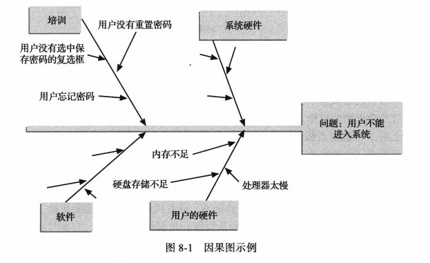
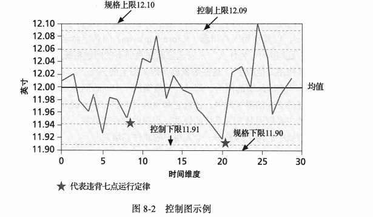
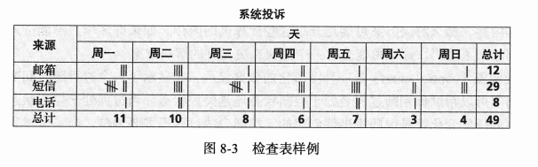
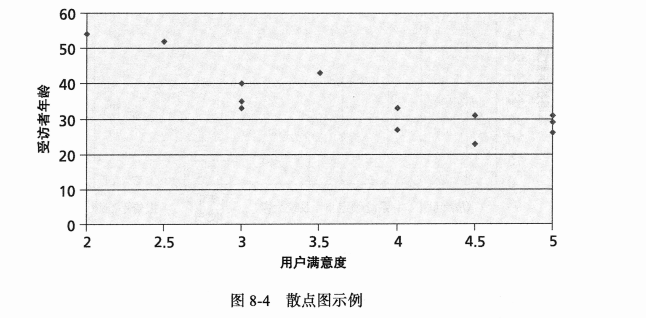
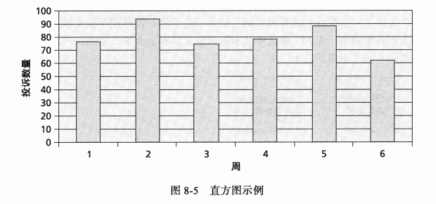
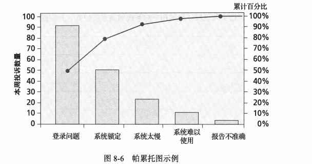
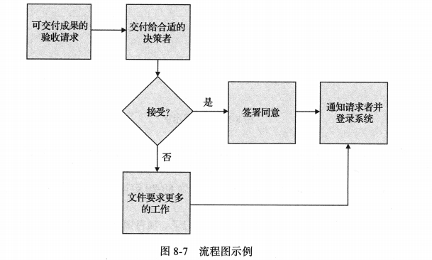
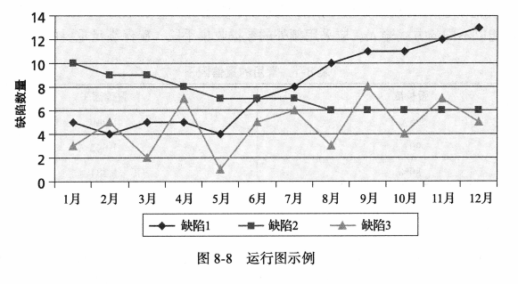
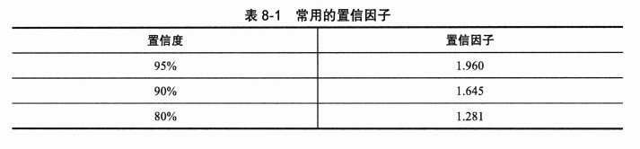
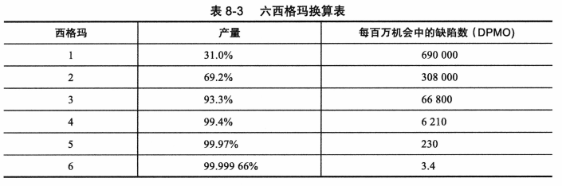

## 讨论问题

1. 项目质量管理的 3 个过程
2. IT 项目中影响质量的重要范围部分包括什么？
3. 质量控制过程的主要输出是什么？
4. 7 种基本的质量工具
5. DMAIC 改进过程代表哪五个阶段
6. CMMI 的能力层级有哪几个

## 项目质量管理

- `项目质量管理(project quality management)`的目的是确保项目满足它所应满足的需求。
- 项目质量管理包括 3 个主要过程:
  1. `计划质量管理`包括确定哪些质量要求和标准与项目相关,以及如何满足这些要求和标准。将质量标准纳入项目设计是质量计划的关键部分。质量计划的主要要输出是质量管理计划、质量度量标准、项目管理计划更新和项目文档更新。`度量标准(metric)`是一个测量标准。常见的度量标准包括产品的故障率、产品和服务的可用性以及客户满意度。
  2. `管理质量`包括将质量管理计划转换为可执行的质量活动。这些些活动必须遵守组织的质量政策。该过程的主要输出是质量报告、测试和评估文档、变更更请求、项目管理计划更新以及项目文档更新。
  3. `控制质量`包括监控具体的项目结果,以确保它们是完整的、正确的并满足客户的期望。这个过程通常与技术工具及质量管理技术相关,如帕累托图、质量控制图及统计抽样。质量控制的主要输出包括质量控制测量、经验证的可交付成果、工作绩效信息、变更请求、项目管理计划更新和项目文档更新。

## 计划质量管理

- 影响质量的重要范围因素有：
  - `功能性(functionality)`是一个系统实现其预期功能的程度。特性(features)是吸引用户的系统特点。
  - `系统输出(system output)`是系统能提供的屏幕显示和报告。必须清楚地定义屏幕显示和报告的样子。
  - `性能(performance)`是指产品或服务达到客户预期用途的程度。
  - `可靠性(reliability)`是指产品或服务在正常条件下按预期运行的能力。
  - `可维护性(maintainability)`是指在产品上执行维护的容易程度。

## 管理质量

- `质量保证(quality assurance)`通常用于描述与满足项目相关质量标准有关的所有活动。
- `标杆管理(benchmarking)`通过将特定项目的实践或产品特性与组织内外的其他项目的实践或产品特性进行对比,从而产生质量改进的想法和建议。
- `质量审计(quality audit)`是对特定质量管理活动的结构化审查,有助于确定经验教训,并且可以改善当前或未来项目的绩效。

## 控制质量

- 质量控制(quality control)的主要目标之一是提高质量,但此过程的的主要结果是验收决定、返工和过程调整。
  - 验收决定(acceptance decisions)确定是否接受或拒绝作为项目一部部分的产品或服务。如果被接受,产品或服务则被认为是有效的可交付成果。如果项目干系人拒绝项目的某些产品或服务,则必须进行返工。
  - 返工(rework)是指为使被拒绝的项目符合产品要求、规范或其他干系人的期望而采取的行动。返工通常会导致要求的变更和确认的缺陷修复,并且通常是来自被推荐的缺陷修复、纠正或预防措施。
  - 过程调整(process adjustments)是指基于质量控制的度量结果,纠正或预防出现更多的质量问题。过程调整通常会导致组织过程资产和项目管理计划划的更新。

## 质量控制的工具与技术

- 包括 7 种基本的质量控制工具、统计抽样及六西格玛

### 7 种基本质量控制工具

1. `因果图(cause-and-effect diagrams)`又称为鱼骨图(fish bone diagram)或石川馨图(Ishikawa diagram)，它揭示问题的根本原因
   
   :::info 5 whys 分析法
   对问题连续问 5 个"为什么"来追究根本原因，可用于因果图的绘制
   :::
2. `控制图(control chart)`，它显示了一个过程随时间变化的结果。图示为一台机器产物的误差图。
   
   :::info 七点运行定律(seven run rule)
   七点运行定律(seven run rule)指出,如果在一个质量控制图中,一行上的 7 个数据点都低于平均值或高于平均值,或者都是上升的,或者都是下降的,那么就需要检查这个过程是否存在非随机问题。
   :::
3. `检查表(chacksheet)`用于收集和分析数据。下图所示是一个追踪系统投诉来源的检查表
   
4. `散点图(scatter diagram)`用来显式两个变量之间是否存在关系。
   
5. `直方图(histogram)`是描述变量分布的条形图
   
6. `帕累托图(Pareto chart)`是一种可以确定问题区域和优先级的直方图。直方图所描述的变量按发生频率排序。`帕累托分析(Pareto analysis)`又是被称为 80-20 定律，这一位置 80%的问题通常是由 20%的原因造成的。
   
7. `流程图(flowchart)`是显示过程逻辑及流向的图形表示，这种工具又被称为分层。同样用于分层的`运行图(runchart)`展示了了一个过程随时间变化的历史和模式
   
   

### 统计抽样

- 统计抽样(statistical sampling)是指挑选一部分相关样本进行检查。
- 样本量取决于你希望样本相对于总体的代表性程度。决定样本量的一个简单公式如下:
  $$\text{样本量}=0.25\times\text{(置信因子/可接受误差)}^2$$
- 置信因子与置信度相关，如下表所示
  

### 六西格玛

- 使用六西格玛原则进行质量控制的项目通常遵循一个 5 阶段改进过程，称作 DMAIC
  (读作 de-MAY-ick), DMAIC 代表定义、度量、分析、改进和控制。 1. 定义：定义问题/机会、流程和客户需求。此阶段使用的重要工具包括项目章程、客户需求说明书、流程图和客户声音(VOC)数据。VOC 数据的例子包括投诉、调查、评论和市场调查，它们代表客户的观点和需求。 2. 度量：定义度量范围，然后收集、汇编和显示数据。根据每个机会的缺陷来定义度量。 3. 分析：仔细检查过程细节以发现改进机会。一个从事六西格玛项目的项目团队，通常称为六西格玛团队。团队通过调查和验证数据以确认出现质量问题的可疑根源，并证实潜在的问题。这一阶段使用的一个重要工具是本章前面所述的鱼骨图或石川馨图。 4. 改进：产生改进问题的方法和思路。最终解决方法由项目发起人确定，六西格玛团队制定计划对解决方案进行小规模测试。六西格玛团队商讨小规模测试的结果以完善解决方案，如果需要，那么在合适的地方实施解决方案。 5. 控制：跟踪并验证改进的稳定性和解决方案的可预测性。控制图是控制阶段使用的一种工具。

:::info 六西格玛不同于统计学上的六西格玛

- 统计学上的六西格玛为 10 亿单位仅有两个缺陷，而这里的六西格玛为每百万有 3.4 个缺陷
- `产量(yield)`表示通过工序正确处理的单位数量。`缺陷(defect)`是指产品或服务未能满足客户需求的任何情况。由于大多数产品或服务都有多个客户需求,因此出现缺陷的机会很多。例如,假设一个企业正在努力降低客户账单出错的数量。由于名称拼写错误、地址错误、计算错误等等情况，任何一个错误都会导致这个账单出错，一个账单上可能有 100 个机会导致缺陷发生。六西格玛不是测量每单位或每张账单的失误数目，而是根据所有机会测量出错数目
  
  :::

### 测试

- `单元测试(unit test)`是测试每一个组件(经常是一个程序),以确保尽可能没有缺陷。单元测试是在集成测试之前进行的。
- `集成测试(integration testing)`发生在单元测试和系统测试之间,用来测试功能性分组的组件。它确保整个系统的各个部分能集合在一起工作。
- `系统测试(system testing)`是指作为一个整体来测试整个系统。它关注宏观层面,以保证整个系统能正常工作。
- `用户验收测试(user acceptance testing)`是最终用户在验收交付系统之前进行的独立测试。它关注的是系统对组织的业务适用性,而非技术问题。
- `软件缺陷(software defect)`是程序交付前必须更改的任何东西

## 项目质量管理发展历史

略

## 提高 IT 项目的质量

### 领导

- 领导重视质量给组织提供了一个有利于提高质量的环境

### 质量成本

- `质量成本(cost of quality)`是一致性成本与非一致性成本之和。`一致性(conformance)`是指交付符合需求并适合使用的产品。这种成本的例子包括与制定质量计划相关的成本、分析和管理产品需求的成本以及测试的成本。`非一致性成本(cost of nonconformance)`是对失败负责或者因没有达到预期质量所造成的成本。
- 与质量有关的 5 大成本类别包括:
  1. `预防成本(prevention cost)`:计划和执行项目以使其无错误或在可接受的错误范围内
     的成本。
  2. `评估成本(appraisalcost)`:评估项目的过程和产出,确保项目没有差错或者在一个可
     接受的出错范围内,这些活动所产生的费用就是评估成本。
  3. `内部故障成本(internal failure cost)`:在客户收到产品之前,纠正已识别的缺陷所引
     发的成本。
  4. `外部故障成本(external failure cost)`:在交付给用户之前,房有未能发现和纠正的错
     误所涉及的成本。
  5. `测量和测试设备成本(measurement and testequipment costs)`:为了执行预防和评估
     等活动而购置的设备所占用的资金成本。

### 组织影响、工作场所因素对质量的影响

- 生产率和编程语言、工作年限或薪水之间没有相关性。另外,研究显示,提供无人打扰的工作场所和安静的工作环境是提高生产率的关键因素。

### 质量中的期望和文化差异

- 质量管理一个关键方面是管理期望，例如有的人无法忍受一两秒的登陆时间，而有的人觉得可以接收
- 又例如有的国家认为必须到工作区域上班，而有的国家可能觉得无所谓

### 成熟度模型

- 描述了一种演化路径，通常有 5 个层级，从一到五表示最无组织性、最低成熟度到最有组织性和最成熟的组织形态

#### 软件质量功能展开模型(SoftwareQuality Function Deployment model),SQFD 模型)

#### 能力成熟度模型集成(Capability Maturity Model Integration, CMMI)

CMMI 的能力层级为:

0. 不完整级:在这一层级,要么是没有实施过程,要么只是部分实实施了过程。这一层级不存在通用的目标,也没有达到过程域的一个或多个特定目标。
1. 执行级:已执行的过程满足流程领域的特定目标,并支持特生产产品所需的工作。尽管这种能力层级会导致改进,但如果不制度化,这些改进可能我会随着时间的推移而消失。
2. 管理级:在这一层级,过程会有合适的基础设施来支持。这一过程是根据政策来计划和执行的,并聘用了有经验的员工。这些员工有足够的资源产生受控输出。这一层级所反映
   出的过程纪律能够确保组织在持续的压力状态下仍能维持现行的做法。
3. 定义级:在此成熟度层级上,过程有严格的定义。每个项目的标准、过程描述及程序是通过对组织的系统标准过程进行剪裁而量身定制的。
4. 定量管理级:在这个层级上,过程是通过统计和其他定量技术来控制的。组织设定质量和过程绩效的量化目标,这些目标作为管理过程的标准。
5. 优化级:通过理解变化过程中固有的常见原因来提高优化过程。重点是通过增量和革新的改进来持续扩大过程绩效的范围。

#### 项目管理成熟度模型(OPM)

## 小结

- 质量是个严重的问题。一些关键任务的 IT 系统中出现的错误已经导致一些人死亡，许多业务系统中的质量问题已经引发了重大的财务损失。
- 客户最终负责定义质量。重要的质量概念包括满足规定的或潜在的干系人的需求、与需求相符，以及交付适用的物品。
- 项目质量管理包括计划质量管理、实施质量保证和控制质量。计划质量管理确认哪项质量标准与项目有关以及如何满足这些标准。实施质量保证是评价总体及项目的绩效，确保项目满足相关质量标准。控制质量是检验具体的项目结果、确保其符合质量标准、明确提高整体质量的方法。
- 项目质量管理的工具和技术有很多。质量 7 种基本的质量控制工具包括因果图、控制图、检查表、散点图、直方图、帕累托图及流程图。统计抽样帮助确定在分析一个总体时需要的样本的数量。六西格玛通过减少缺陷来帮助公司提高质量。标准差测量数据的变化。测试在开发和交付高质量 IT 产品中非常重要。
- 戴明、朱兰、克劳斯比、石川馨、田口及费根鲍姆等许多人为现代质量管理的发展做出了重要贡献。今天，许多组织仍使用他们的思想，这些思想也影响了六西格玛原则。马尔科姆·鲍德里奇国家质量奖和 ISO 9000 也帮助组织强调提高质量的重要性。
- IT 项目仍有很大的质量改进余地。强有力的领导有助于强化质量的重要性。理解质量成本为质量改进提供了动力。提供一个好的工作场所可以提高质量和生产率。理解干系人的期望和文化差异也和项目的质量管理相关。建立并遵循成熟度模型可帮助组织系统地改进其项目管理过程，提高项目的质量和成功率。
- 有些软件能够辅助项目质量管理。对项目团队来说，重要的是确定哪种软件对其特定的项目会有帮助。
- 一定要考虑项目质量管理在敏捷/适应性环境中的差异。

## 关键术语

“5 whys”法(5 whys)
接受决策(acceptance decisions)
评估成本(appraisal cost)
标杆管理 (benchmarking)
能力成熟度模型集成 (CMMI)(Capability Maturity Model Integration (CMMI))
因果图 (cause-and-effect diagram)
检查表(checksheet)
一致性(conformance)
需求一致性(conformance to requirements)
控制图(control chart)
非一致性成本(cost of nonconformance)
质量成本(cost of quality)
缺陷(defect)
实验设计 (design of experiments)
DMAIC (定义、度量、分析、改进、控制)(DMAIC (Define, Measure, Analyze, Improve, Control))
外部故障成本(external failure cost)
特征(features)
鱼骨图(fishbone diagram)
适用性(fitness for use)
流程图(flowchart)
功能性(functionality)
直方图(histogram)
集成测试(integration testing)
内部故障成本(internal failure cost)
石川馨图(Ishikawa diagram)
ISO 9000(ISO 9000 )
改善(kaizen)
精益(lean) 可维护性(majntainability)
马尔科姆·鲍德里奇国家质量奖( Malcolm Baldrige National Quality Award)
成熟度模型(maturity model)
均值(mean)
测量和测试设备成本(measurement and test equipment costs)
度量(metric)
正态分布 (normal distribution)
帕累托分析 (Pareto analysis)
帕累托图 (Pareto chart)
绩效(performance)
预防成本(prevention cost)
过程调整(process adjustments )
项目质量管理 (project quality management)
质量(quality)
质量保证(quality assurance)
质量审计(quality audit)
质量圈 (quality circles)
质量控制 (quality contro)
返工(rework)
稳健设计方法(Robust Design methods)
运行图 (run chart)
散点图 (scatter diagram)
七点运行定律 (seven run rule)
质量的六个九 (six 9s of quality)
六西格玛 (Six Sigma)
软件缺陷(software defect)
软件质量功能展开(SQFD) 模型(Software Quality Function Deployment (SQFD) model)
标准差 (standard deviatio)
统计抽样(statistical sampling)
系统输出(system outputs)
系统测试(system testing)
单元测试(unit test)
用户验收测试 (user acceptance testing)
产量(yield)
