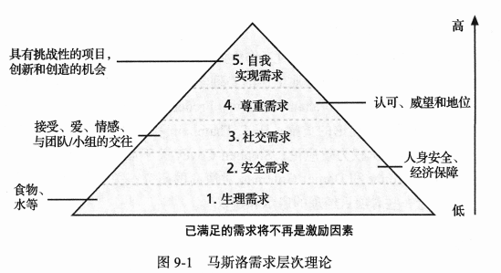
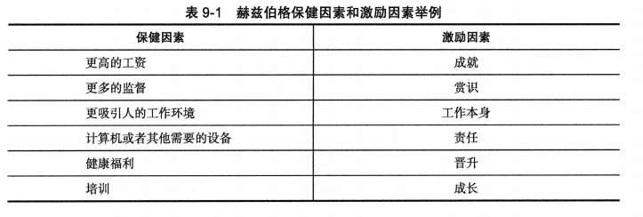
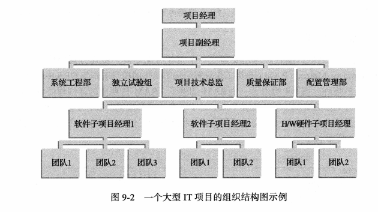
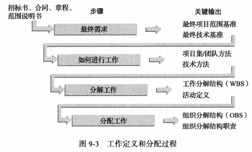
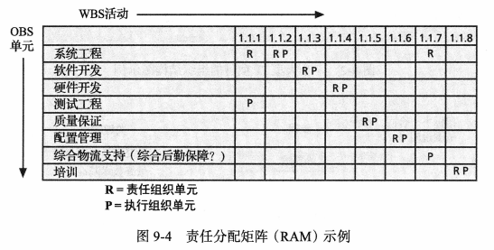
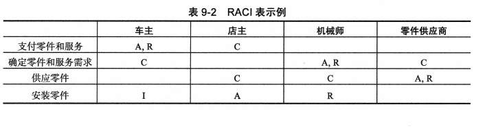
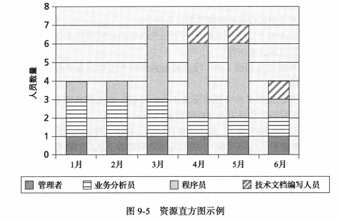

## 讨论问题

1. 项目资源管理的 6 个过程
2. 马斯洛需求层次理论从低到高是哪几层？
3. 项目经理运用哪 7 种习惯来提高项目工作的效率？
4. 资源平衡的优点是什么
5. 塔克曼模型描述的团队建设的 5 个阶段？
6. 管理项目团队的工具和技术

## 项目资源管理

- 项目资源管理包含使项目涉及的人力和物力资源(设施、设备、材料、物资等)得到最有效利用的全过程。人力资源管理包括所有的项目干系人:发起人、客户、项目团队成员、支持人员以及项目供应商等。项目资源管理包括以下 6 个过程:
  1. `计划资源管理`包括确定如何评估、获取、管理和使用项目资源。这个过程的主要输出是资源管理计划、团队章程和项目文档更新。
  2. `估算活动资源`包括估算完成项目工作所需的人力和物力资源。输出包括资源需求、估算依据、资源分解结构和项目文档更新。
  3. `获取资源`包括获取团队成员、设施、设备、材料、物资和其他所需资源。输出包括物力资源和项目团队分配、资源日历、请求更改和一些文档的更新。
  4. `建设项目团队`包括为了提高项目绩效而对个人技能和项目团队技能的建设。团队建设技能对许多项目经理来说通常是一个挑战。这个过程的主要输出是团队绩效评估、变更请求和一些文档的更新。
  5. `管理项目团队`包括跟踪团队成员绩效、激励团队成员、提供及时反馈、解决问题和冲突，以及协调变化来帮助提高项目绩效。这个过程的输出包括变更请求、项目管理计划更新、项目文档更新和组织过程资产更新。
  6. `控制资源`保证项目的物力资源能按计划获取，监控计划与实际的资源利用率，并在需要时采取纠正措施。输出包括工作绩效信息、变更请求、项目管理计划更新和项目文档更新。

## 管理和领导人员的关键

### 激励理论

- `内在激励(intrinsic motivation)`使人们根据自己的个人兴趣爱好而参与某一活动。
- `外在激励(extrinsic motivation)`使人们为了获得报酬或避免处罚而去做某些事情。

#### 马斯洛需求层次理论

- 在马斯洛需求层次中,底层的 4 种需求--生理需求、安全需求、社交需求和尊重需被认为是缺失需求,而最高层次的自我实现需求被认为是成长需求。只有在满足了缺失需求之后,人们才可能去追逐成长需求。

#### 赫兹伯格的"激励-保健"理论

- 激励因素(motivational factor)：那些能够使人们产生工作满意感的因素,
- 保健因素(hygienefactor)：那些造成员工不满情绪的因素。
  
- 它解释了缩短工作时间、提高奖励工资、提供额外福利是无法提供激励的，人们都想通过发挥创造性和从事具有挑战性的项目工作来实现自我。

#### 麦克利兰的"获取-需求"理论

- David McClelland 提出,人的特殊需求是通过后天培养或者长长期学习、由生活经验形成的。获取需求的主要类别包括成就需求、亲和需求和权力需求。一般情况下,其中一种或两种需求将占据个人需求的主导地位。
  - 成就需求:具有高成就需求(nAch)的人渴望成就,并努力避免低风险和高风险的处境来增加他们实现价值的机会。
  - 亲和需求:具有高亲和需求(nAff)的人渴望建立和睦的人际关系以及获得他人的认可。
  - 权力需求:具有权力需求(nPow)的人渴望拥有个人权力或制度权力。具有个人权力需求的人希望去引导和影响他人。
- 主题统觉测试(Thematic Apperception Test,TAT)是根据 McClelland 的理论对不同人的个人需求进行测试的工具。

#### 麦格雷戈的 X 理论和 Y 理论

- 相信 X 理论的人(大部分管理者)认为，员工不喜欢工作,并且只要可能就会逃避工作,因此管理者必须采取强迫、威胁以及各种控制方案才能使员工付出足够的努力来实现组织目标。他们认为一般的员工都喜欢被指挥、不愿意承担责任、缺乏上进心且安于现状。研究清楚地表明这些假设是不合理的。
- 相信 Y 理论的管理者认为,人们不是天生就不喜欢工作,而是把工作当成很自然的事情,就像玩耍或休息一样。正如 Maslow 所说,最有效的奖励就是满足尊重需求和自我实现需求。McGregor 希望管理者能在 Y 理论的指导下激励员工。

### 影响力和权力

- 项目经理可使用的 9 个基本影响因素：
  1. 权力:在等级制度下发布命令的合法权力。
  2. 指派:项目经理可影响后期分配给员工工作的能力。
  3. 预算:项目经理可授权某人自由使用资金的能力。
  4. 升迁:可提拔员工职务的能力。
  5. 金钱:可给员工增加工资和福利的能力。
  6. 惩罚:项目经理可给员工实施惩罚或免除其受罚的能力。
  7. 工作挑战:根据员工完成一项特定任务的兴趣来指派工作的能力,以此作为内在激励因素。
  8. 专业知识:项目经理所拥有的其他人十分看重的知识。
  9. 友谊:项目经理和他人之间建立良好人际关系的能力。
- 权力有五种类型：
  - `强制权力(coercive power)`指使用惩罚、威胁或其他的消极手段强迫人们做他们不想
    做的事情的权力。
  - `法定权力(legitimate power)`指根据拥有权力的职位而让人们进行工作的权力。
  - `专家权力(expert power)`指利用个人知识和专业知识促使人们改变其行为的权力。如果员工感到他们的项目经理在某些领域有专长,他们就会会遵照他的意见。
  - `奖励权力(reward power)`指使用一些激励来诱导人们去做事情的权力。奖励包括金钱、地位、赏识、晋升、特殊的工作分配待遇。
  - `感召权力(referent power)`建立在个人魅力的基础上。人们非常尊重某些具有感召力的人,人们会按照他们所说的去做。

### 柯维和提高效率

- 项目经理可以运用 Covey 的 7 种习惯来提高项目工工作的效率,如下所示:
  1. 积极主动。就像 Maslow 认为的那样,Covey 也相信人们具有有根据不同情况选择积极主动的态度和反应的能力。项目经理必须保持积极主动的态度度,并对项目的问题和不可避免的变更做出预测和计划。他们还应鼓励项目团队成员在进行项目活动时保持积极主动的状态。
  2. 以终为始。Covey 认为,人们总是关注他们的价值、他们真正想完成的事情以及他们如何真正记住这些事情。他建议人们通过书写使命宣言来帮助养成这个习惯。许多组织和项目都使用使命宣言来帮助他们把精力放在主要的目标上。
  3. 要事第一。Covey 建立了一个时间管理系统和时间管理矩阵车来帮助人们管理他们的时间。他建议,大多数人应当把更多的时间放在重要而非紧急的事情上。这样的活动包括计
  4. 双赢思维。Covey 举了几个相互依赖的范例,在大多数情况下考虑双赢是最好的选择。当你使用双赢模式时,原先有潜在冲突的群体可以一起合作,找到使双方都满意的解决途径。项目经理在做出决策时应当尽量使用双赢策略,但是有时,尤其在竞争十分激烈的情况下,他们不得不采取一方赢,另一方输的模式。
  5. 先理解他人再寻求被他人理解。`移情倾听(empathic listening)`是旨在理解的聆听。这种方式比积极地倾听更有效,因为在这种情况下你忘记了个人兴趣,而专注于如何真正地理解别人。当你进行移情倾听时,你就可以进行双向沟通。这种习惯对于项目经理来说是非常重要的,这样他们才能够真正地了解干系人的需求和期望。
  6. 协同。一个项目团队可以通过合作开发产品实现协同,这种合作的产品比个人成果的简单组合好得多。Covey 还强调了注重他人的不同之处对于实现现协调非常重要。
  7. 不断更新。当你进行不断更新时,你就要花时间从物质上、精神上、心理上以及社会上更新自我。自我更新可以让人们避免精疲力竭。项目经理必须保证他与其项目团队不断地参加培训、充电,甚至偶尔放松一下以避免精疲力竭。
- 当你进行移情倾听之前,首先你必须让别人愿意与你交谈。很多情况下,你必须与对方建立一种友好关系。友好关系(rapport)是一种和谐、一致、协调或亲密的关系。
- 有一种建立友好关系的技巧叫做镜像法。

### 情商

略

### 领导力

略

## 制定资源管理计划和团队章程

- 项目资源管理计划被分为人力资源管理计划和物力资源管理计划。人力资源管理计划往往包括项目的组织结构图、人员和职责的详细信息以及人员配置管理计划。

### 项目组织结构图

- 除了定义一个组织结构之外,遵循工作定义和分配过程对于一个个项目来说也是非常重要的。图 9-3 给出了定义和分配工作的一个框架。这个框架包括以下 4 个步骤:
  1. 最终确定项目需求
  2. 定义工作如何完成
  3. 把工作分解为可管理的要素
  4. 分配工作职责
     
- 组织分解结构(Organizational Breakdown Structure,OBS)是一种特殊的组织结构图,它显示每个组织单元负责哪项工作。OBS 建立在一般组织结构图的基础上。

### 责任分配矩阵

- `责任分配矩阵(Responsibility Assignment Matrix,RAM)`是将工作分解结构中描述的项目工作与 OBS 中负责实施的人员相匹配的矩阵。
  
- 有些组织使用`RACI表(RACI chart)`来表示项目干系人的 4 种关键角色:
  - 责任人(Responsibility):谁执行这个任务?
  - 批准人(Accountability):谁签署的任务或对这个任务负全责?
  - 审核人(Consultation):谁拥有完成这个任务所需的必要信息?
  - 被告知人(Informed):需要通知谁任务状态和结果?
    

### 人员配置管理计划和资源直方图

- `人员配置管理计划(staffing management plan)`描述了人员何时以及如何加人或调离项目团队这个计划的详细程度取决于项目的类型。
- 人员配置管理计划通常包括一个`资源直方图(resource histogram)`
  

### 团队章程

略

## 估算活动资源

- 资源分解结构(resource breakdown structure)是按类别不和类型标识项目资源的层次结构
- 估算活动资源时需要回答的重要问题如下:
  - 本项目的具体活动难度有多大?
  - 项目范围说明书中是否有影响资源的独特部分?
  - 该组织在开展类似活动方面有哪些历史?这个组织以前做过类似的工作吗?是由什么级别的人员完成这些工作?
  - 组织是否有可靠和可用的人员、设备和材料来执行工作?是否有任何组织政策会影响资源的可用性?
  - 组织是否需要获得更多的资源来完成工作?外包一些工作有意义吗?外包是否会增加或减少所需资源的数量以及这些资源何时可用?

## 获取资源

### 资源分配

略

### 资源负荷

- 资源负荷(resource loading)是指在特定时段内,既定进度计划所需的人力资源的数量。
- 过度分配(overallocation)是指在给定的时间内没有足够的资源可供分配到工作中使用。

### 资源平衡

- `资源平衡(resource leveling)`是通过延迟任务来解决资源冲突的一种技术。
- 资源平衡有几个优点
  1. 当资源的使用情况比较稳定时,它们需要的管理较少。例如,在一个项目中的某职员,他被安排在今后 3 个月里每周工作 20 小时,但如果安排他第一周 10 小时、第二周 40 小时及第三周 5 小时,以此类推,那么管理起来就要复杂得多。
  2. 资源平衡可使项目经理针对分包商或者其他昂贵的资源原采取零库存策略。例如,项目经理可以在诸如测试顾问这种特定的分包商所做的工作中平衡资源。这种平衡的结果可能使项目只需从外部聘用 4 个全职的顾问在 4 个月内专门从事测试工作,而不是通过花费更多的时间或用更多的人来开展工作。后面一种方式通常代价更大。回顾第 6 章,赶工和快速跟踪也可用于资源问题来改善项目的进度。
  3. 资源平衡可以减少财务部与项目人员方面的一些问题。增加或减少劳动力和人力资源往往会带来额外的工作和混乱。
  4. 资源平衡还可以提高士气。人们总喜欢稳定的工作。如果人们每周甚至每天都不知道他们要为哪个项目工作,那么他们会感到很紧张。

## 建设项目团队

- `团队建设(team development)`的主要目标是帮助人们更有效地一起工作来提高项目绩效
- 修塔克曼模型(Tuckmanmodel)描述了团队发展的 5 个阶段:
  1. 组建期。该阶段包括团队成员的引进,发生在项目团队的的初始期或当新成员被引进时。这个阶段是必要的,但实际完成的工作很少。
  2. 震荡期。在这一阶段,团队成员对项目团队应如何运作上具有不不同观点。人们彼此之间互相试探,内部常常伴有冲突。
  3. 规范期。在这一阶段,团队成员形成了一种通用的工作方法,合作与协作取代前一阶段的冲突和不信任。
  4. 执行期。这一阶段强调团队目标的达成而不是团队的工作年过程。关系已经比较固定了,团队成员更可能建立彼此间的忠诚。在这个阶段,项目团队能够管理较为复杂的任务和处理更大的变更。
  5. 修整期。该阶段包括项目团队成功实现目标和完成工作后团队的解体。

### 培训

略

### 团队建设活动

- 梅耶斯-布里格性格类型指标(Myers-Briggs Type Indicator,MBTI)
- 威尔逊学习社交类型模型(Wilson Learning Social Styles Profile)。
- DISC 模型类似于社交类型模型,DISC 模型使用 4 个区域表示 4 种主要行为类型。4 个区域是:支配(dominance)、影响(influence)、稳健(steadiness)和服从(compliance)。

### 奖励与赏识系统

略

## 管理项目团队

### 管理项目团队的工具和技术

- 有几种工具和技术可用于帮助管理项目团队,包括人际关系和团队技能(即冲突管理、决策制定、情商、影响力和领导力)以及项目管理信息系统。
- 5+1 种处理冲突的模式：
  1. 对抗:使用`对抗模式(confrontation mode)`时,项目管理人员直面冲突来解决受影响的工作各方的分歧。这种方法在 Covey 的术语中也被称为问题解决央或双赢模式。当任务和关系的重要性都很高时,这种模式通常是最有效的。
  2. 妥协:使用`妥协模式(compromise mode)`时,项目经理使用公平交换的方法来解决冲突。他们进行商量并寻求能让争议各方在一定程度上满意的解决方案。有些人称之为和解。当任务和关系的重要性都处于中等水平时,这种模式效果最好
  3. 平滑:使用`平滑模式(smoothing mode)`时,项目经理不再强调或避免差异,而是强调达成一致性。这方法也称为包容,最好是在关系的重要性较高而任务的重要性较低的情况下使用。
  4. 强制:`强制模式(forcing mode)`可以看作是一种冲突解决的非赢即输的方法。项目经理以另一种观点的潜在牺牲为代价,实施其观点。如果任务务非常重要而关系不重要,那么这种模式是非常有效的。
  5. 退出:使用`退出模式(withdrawal mode)`时,项目经理撤退退或退出一个实际或潜在的分歧。这种方法也称为规避,通常是最不理想的冲突处理模式式,除非任务和关系的重要性都很低。
  6. 最新的研究还认为有第 6 种冲突解决模式:协作:使用`协作模式(collaborating mode)`时,决策者结合不同的观点和见解来达成共识和承诺。尽管管理者可能不同意这种决定,他们也会为致力于组织利益最大化而遵循它。
- 如果在项目目的各个方面都没有冲突,那么项目团队成员可能会停滞不前或形成`群体思维(groupthink)`,即团队中一致的价值观或道德标准。

## 控制资源

略

## 小结

- 人是组织和项目最重要的资产。因此，项目经理成为一个优秀的人力资源经理是很有必要的。他们也必须有效利用物力资源。

- 项目资源管理的主要过程包括；计划资源、估算活动资源、获取资源、建设项目团队和管理项目团队以及控制资源。

- 影响人们工作方式和工作效果的心理因素包括激励、影响力、权力和效率。

- Maslow 建立的需求层次理论表明，对于生理、安全、社交、尊重以及自我实现的需求激励着人们的行为。当一个层次的需求被满足之后，这一需求就不再是激励的因素了。
- Herzberg 将激励因素和保健因素区分开来。如果缺乏诸如高收人或更有吸引力的工作环境等保健因素，会令人产生不满意，但是就算保健因素已经具备，也不会激励员工做得更好。成就、认可、工作本身、责任以及成长都是影响工作满意度和激励员工的因素。

- McClelland 提出了获得- 需求理论，该理论指出个人的需求可以通过后天的经历来获得 (或学到) 和塑造。3 种获得需求是成就需求、亲和需求和权力需求。

- McGregor 基于员工的动机假设，提出了 X 理论和 Y 理论来描述管理员工的不同方法。研究支持 Y 理论的使用，假设人们把工作看成是自然的事，并且指出最好的奖励是工作带来的尊重和自我实现的满足感。根据 Ouchi 的 Z 理论，只要管理者支持员工并且为他们谋福利，员工便会尽最大努力工作。Z 理论强调工作轮换、技能拓展、一般化而非专业化以及对员工不断培训的需要。
- Thamhain 和 Wilemon 定义了 9 种项目经理可使用的基本影响力因素：权威、指派、预算、升迁、金钱、惩罚、工作挑战、专业知识和友谊。他们的研究表明，项目经理使用工作挑战和专业知识来影响员工，项目往往能取得成功。而当项目经理使用权威、金钱或惩罚去影响员工时，项目常常会失败。

- 权力就是指影响行为的潜在能力，可以驱使人们去做他们原本不会做的事情。5 种基本的权力分别是强制权力、法定权力、专家权力、奖励权力以及感召权力。

- 项目经理可以应用 Stephen Covey 的高效人士具备的 7 种习惯来帮助自己和项目团队更有效。这 7 种习惯包括：积极主动、以终为始、要事第一、双赢思维、先理解他人再寻求被他人理解、协同、不断更新。移情倾听是一个优秀的项目经理必备的关键技能。

- 情商也是一个重要的概念。它包括了解和管理自己和他人的情绪，以提高绩效。
- 项目经理还必须培养领导能力。最优秀的领导者能够理解并运用适合当前形势的不同领导风格。
- 制定资源计划包括对物力资源的识别，还包括对项目角色、责任以及报告关系进行识别、分配和归档。责任分配矩阵(RAM)、人员配置管理计划、资源直方图和 RACI 表是定义项目角色和责任的关键工具。主要输出包括资源管理计划和团队章程。

- 估算活动资源包括估算完成项目所需的物力和人力资源的数量。
- 获取资源意味着分配适当的物力资源和人员来完成项目。这是如今的竞争环境中的一个重要问题。公司必须使用创新的方法来寻找和留住优秀的 IT 员工。
- 资源负荷显示了在特定时段现有进度计划所需的个体资源的数量。资源直方图常用来表示资源负荷水平，同时也可用来识别资源过度分配的情况。

- 资源平衡是一种通过延迟任务来解决资源冲突(比如资源过度分配) 的技术。经过平衡的资源可以减少管理工作、降低成本、减少职员和会计方面的问题，而且经常可以提高士气。
- 一个好的项目经理应具备的两个关键技能分别是团队建设和团队管理。团队协作可以帮助人们更有效地工作以实现项目目标。项目经理可以推荐个人培训来提高团队协作的相关技能，为整个项目团队和关键干系人组织团队建设活动，并提供鼓励团队协作的奖励和赏识系统。项目经理可以使用多种工具和技术，包括冲突管理，来有效地管理他们的团队。冲突处理模式有多种；可以从任务重要性和关系重要性两个维度来看待。

- 控制资源包括确保分配给项目的物力资源按计划可用、监控计划的与实际的资源利用率，并根据需要采取纠正措施。

- 电子制表软件和项目管理软件(如 Microsoft project 2016)可以辅助项目经理进行项目资源管理。软件可以容易地生成责任分配矩阵、创建资源直方图、识别过度分配的资源、平衡资源，并提供与项目资源管理相关的各种视图和报告。

- 项目资源管理涉及的不仅仅是使用软件来促进组织规划和分配资源。优秀的项目经理之所以优秀，在于他们具备让项目团队成员在项目中付出最好的工作的能力。

- 一定要考虑项目资源管理在敏捷/自适应环境中的差异。

## 关键术语

强制权力(coercive power)
协作模式 (collaborating mode)
妥协模式(compromise modc)
对抗模式 (confrontation mode)
退出模式 (withdrawal mode)
项目副经理(deputy project managers)
情商(emotional intelligence)
移情倾听 (empathic listening)
专家权力(expert power)
外在激励(extrinsic motivation)
强制模式(forcing mode)
群体思维(groupthink)
需求层次理论 (hierarchy of needs)
内在激励 (intrinsic motivation)
法定权力(legitimate power)
镜像法(mirroring)
梅耶斯-布里格性格类型指标(MBTI)(Myers-Briggs Type Indicator (MBTI))
组织分解结构(OBS)(organizational breakdown structure (OBS))
过度分配(overallocation)
权力(power)
RACI 表(RACI charts)
友好关系(rapport)
感召权力(referent power)
资源分解结构 (resource breakdown structure)
资源直方图 (resource histogram)
资源平衡(resource leveling)
资源负荷(resource loading)
责任分配矩阵(RAM)(responsibility assignment matrix (RAM))
奖励权力(reward power)
平滑模式 (smoothing mode)
人员配置管理计划 (staffing management plan)
子项目经理 (subproject managers)
协同(synergy)
团队章程 (team chartcr)
团队建设(team development)
塔克曼模型 (Tuckman model)
