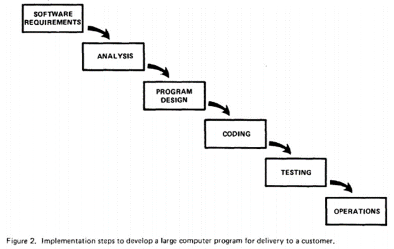
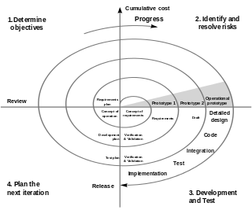
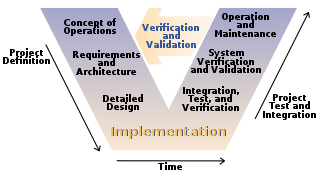
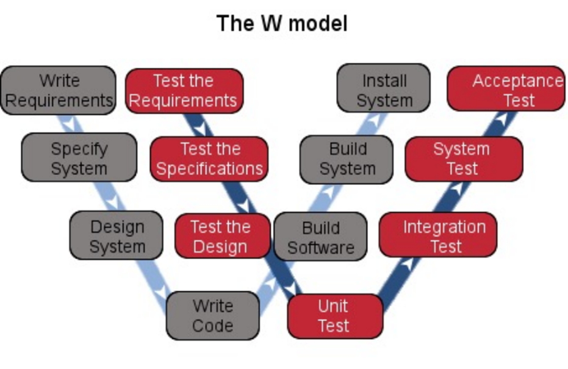
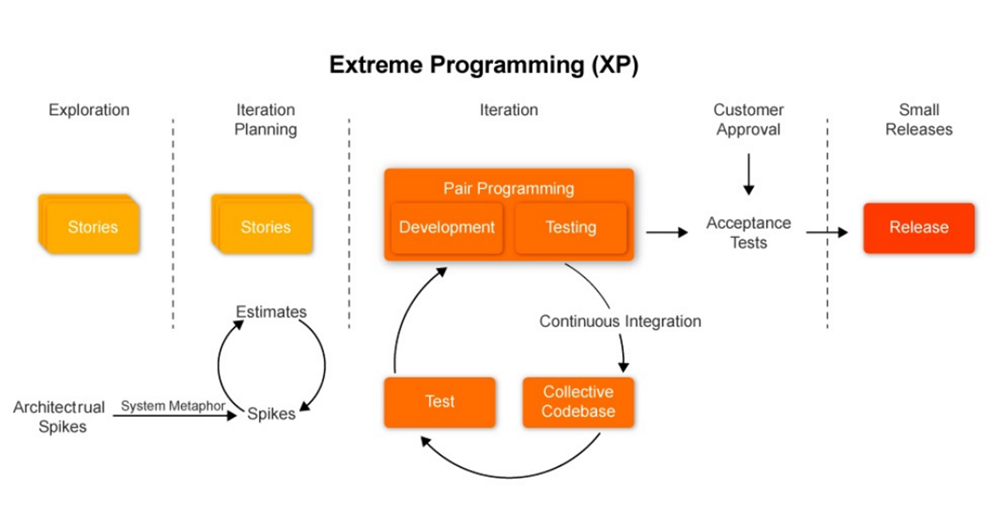
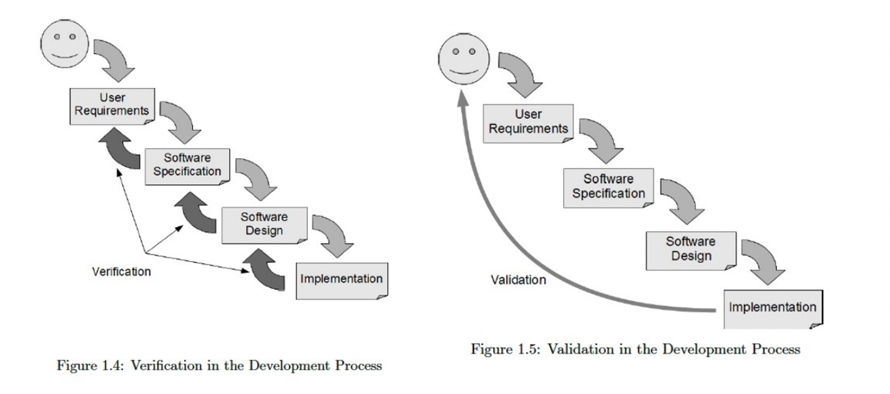

## Fault, Error and Failure

- 软件故障(Fault)：软件中的静态缺陷。
- 软件失败(Failure)：相对于需求或其他预期行为的描述，表现出的外部错误行为。
- 软件错误(Error)：某些故障表现出的错误内部状态。

:::info 例如

- 患者向医生提供一份症状清单——失败
- 医生尝试诊断根本原因，即疾病——故障
- 医生可能会寻找异常的内部状况（高血压、心律不齐、血液中的细菌）——错误
:::

## Bug

- Bug 可能是 Fault, Error 或者 Failure
- Bug 往往出现在`软件规约(Software Specification)`阶段

## What Effort Goes Into a Software Product

### 用户需求(Customer Requirements)

- 需要了解用户需求
- 通常需要通过调研同类产品，用户调查等方式进行
- 为了决定产品最终要包含哪些`features`

### 软件规约(Specifications)

- 格说明汇集了所有这些信息以及任何未明确表述但又是强制性的要求，真正定义了产品将是什么、将做什么以及它将呈现什么样子。

### 进度计划(Scheduling)

- 目的是为了判断当前的完成进度

### 文档

软件设计文档

- 架构
- 数据流图
- 状态转换图
- 流程图
- 代码注释
测试文档
- 测试计划
- 测试用例
- 错误报告
- 测试工具和自动化
- 指标、统计和总结

## What Parts Make Up a Software Product?

## 软件测试模型(Models of Software Testing)

- 瀑布模型(Waterfall Model)
- 螺旋模型(Spiral Model)
- V Model
- W Model
- 敏捷模型(Agile Model)
- 极限开发(Extreme Programing, XP)

### 瀑布模型(Waterfall Model)

- 所有的计划在最开始就完成了，一旦创建，就不应更改。
- 随后的各个阶段之间没有任何重叠。
- 通常，任何人在测试完成后的最后一刻才有机会“看到”程序。

- 优点:
  1. 如果早期就确保需求和设计是完全正确的，那么这将在后期节省大量时间和精力。
  2. 强调了文档化的重要性，将所有知识集中存放在一个中央资料库中，新团队成员可以轻松参考。
- 缺点：
  1. 在项目结束前，很少有可见的进展迹象。
  2. 它不灵活，无法应对变化。
  3. 生成所有文档耗时较长。
  4. 测试仅在项目结束时进行——这可能会在存在时间或预算约束的情况下意味着妥协。
  5. 必须整体测试程序，这可能导致测试不完整。
  6. 如果测试发现一个需要重新设计的故障，可能会因为涉及的麻烦而被忽略。
  7. 如果客户不满意，可能会导致维护阶段较长，以解决他们的问题。

### 螺旋模型(Spiral Model)

- 以风险驱动的开发过程
- 瀑布模型与快速原型迭代模型的结合
- 始于一个设计目标，以客户审查进度结束。

|优点| 缺点|
|--|--|
|后期可以增加或更改附加功能 |严格遵循螺旋模型的协议以确保其顺利运行|
|由于原型构建是按小片段进行的，因此成本估算变得容易| 持续或反复的开发有助于风险管理|
|开发速度快，系统地添加功能 |由于有中间阶段，文档更详细|
|总是有客户反馈的空间 |螺旋软件开发不适用于小型项目，可能会花费很多|

### V Model

- 瀑布模型的扩展
- 通过标记生命周期的每个阶段与测试活动之间的关系，强调验证与确认
- 一旦代码实现完成，测试就开始了。
- 从单元测试开始，然后逐层向上进行测试，直到完成验收测试阶段。

|强度| 弱点|
|--|--|
|由于模型的简单性，易于管理| 像瀑布模型一样，直到生命周期的后期才产生可工作的软件|
|它鼓励在所有阶段进行验证和验证 |对于需求在中等至高度变化的风险下，它是不适用的|
|每个阶段都有具体的可交付成果和审查过程 |有建议称，对于长期、复杂和面向对象的项目的模型来说，这也是一个糟糕的模型|
|它赋予测试与开发同等的重要性，而不是将其作为一个在最后阶段才考虑的次要事项 ||

### W Model

- V Model的扩展
- 测试不是在代码实现之后进行。
- 测试过程与开发过程平行进行。
- 开发与测试之间的协作。
- 测试不仅仅是测试用例的构建、执行和评估。

### 敏捷模型(Agile Model)

为了有效测试：

- 当开发者与客户就即将进行的迭代需求进行“协商”时，测试人员必须是这些对话的全面参与者。
- 测试人员应立即将对话中达成一致的要求转化为测试用例。
- 当需求发生变更时，测试人员应立即参与其中，因为大家都清楚相应的测试用例也必须进行修改。

- 增量模型从软件系统的部分简单实现开始。每次增量时，产品都会随着增强功能的添加而进化，直到最终版本。
- 测试是增量模型的重要部分，并在每次迭代的末尾进行。这意味着测试在开发过程的早期开始，并且总体的测试量更多。
- 大量的测试是回归测试的形式，并且可以大量复用早期增量的测试用例和测试数据。

### 极限开发(Extreme Programming)

- 极限编程（XP）是敏捷软件开发哲学的一个子集。
- 它强调代码审查、持续集成和自动化测试，以及非常短的迭代周期。
- 它倾向于进行中的设计细化（或重构），而不是大型初始设计阶段，尽可能保持当前实现简单。
- 它倾向于实时沟通，最好是面对面，而不是写文档，并且认为工作软件是进步的主要衡量标准。
- 这种方法还强调团队合作。管理者、客户和开发人员都是致力于交付高质量软件的团队的一部分。
- 程序员负责测试他们自己的工作；测试人员专注于帮助客户选择和编写功能性测试，并定期运行这些测试。

#### 用户故事和故事卡(User Stories and Story Card)

- 用户故事是用日常语言编写的一个或多个句子，捕捉到软件系统需要执行的一个方面。
- 这些通常被写在被称为故事卡的纸卡上
- 故事卡被排序以反映系统的开发
- 这应该怎么做呢？首先优先考虑最困难的部分或组件？或者按照用户操作的顺序？

## 现实中的软件测试(The Realities of Software Testing)

1. 完全测试一个程序是不可能的

2. 软件测试是一种基于风险的练习

3. 测试不能证明不存在缺陷

4. 你发现的错误越多，存在的错误就越多

5. 农药悖论

6. 你发现的所有错误并非都会被修复

7. 何时认定为一个错误是困难的

8. 产品规格永远不是最终的

9. 软件测试人员并非项目团队中最受欢迎的成员

10. 软件测试是一种受到纪律约束的技术性职业

## Validation & Verification

- Verification: How do we ensure software satisfies its requirements
- Validation: How to we ensure the software requirements satisfy its intended use?
- 换言之，就是`building a program correctly`和`Building a correct program`

## Quality Control&Quality Assurance

- Quality Control：验证产品的正确性，当发现与设计不一致的时候进行纠正。
- Quality Assurance：充当支持执行全面质量管理的角色

## Tester & QA | Software Testing & SQA

- 软件测试员（QC）：检测软件产品，找出缺陷，评价软件质量
- 质量保证人员（QA）：检测软件过程，创建和加强促进软件开发并防止软件缺陷的标准、方法和过程。

- SQA 是管理工作、审查对象是流程、强调以预防为主
- 测试(Testing)是技术工作、测试对象是产品、主要是事后检查
