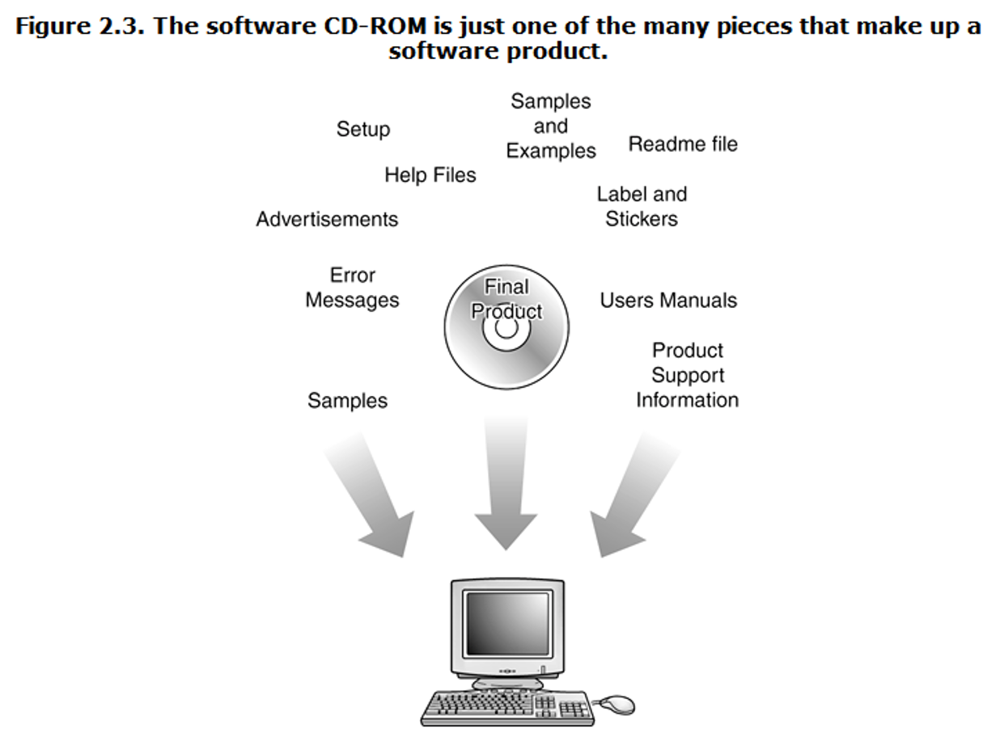

## Fault, Error and Failure

- 软件故障(Fault)：软件中的静态缺陷。
- 软件失败(Failure)：相对于需求或其他预期行为的描述，表现出的外部错误行为。
- 软件错误(Error)：某些故障表现出的错误内部状态。

> [!note] 例如
>
> - 患者向医生提供一份症状清单——失败
> - 医生尝试诊断根本原因，即疾病——故障
> - 医生可能会寻找异常的内部状况（高血压、心律不齐、血液中的细菌）——错误

## Bug

- Bug 可能是 Fault, Error 或者 Failure
- Bug 往往出现在`软件规约(Software Specification)`阶段

## What Effort Goes Into a Software Product

### 用户需求(Customer Requirements)

- 需要了解用户需求
- 通常需要通过调研同类产品，用户调查等方式进行
- 为了决定产品最终要包含哪些`features`

### 软件规约(Specifications)

- 格说明汇集了所有这些信息以及任何未明确表述但又是强制性的要求，真正定义了产品将是什么、将做什么以及它将呈现什么样子。

### 进度计划(Scheduling)

- 目的是为了判断当前的完成进度

### 文档

软件设计文档
- 架构
- 数据流图
- 状态转换图
- 流程图
- 代码注释
测试文档
- 测试计划
- 测试用例
- 错误报告
- 测试工具和自动化
- 指标、统计和总结

## What Parts Make Up a Software Product?

