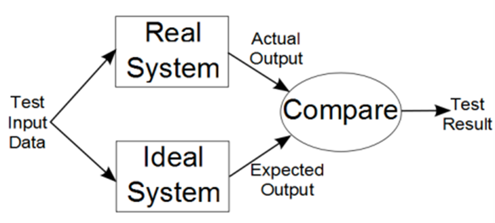
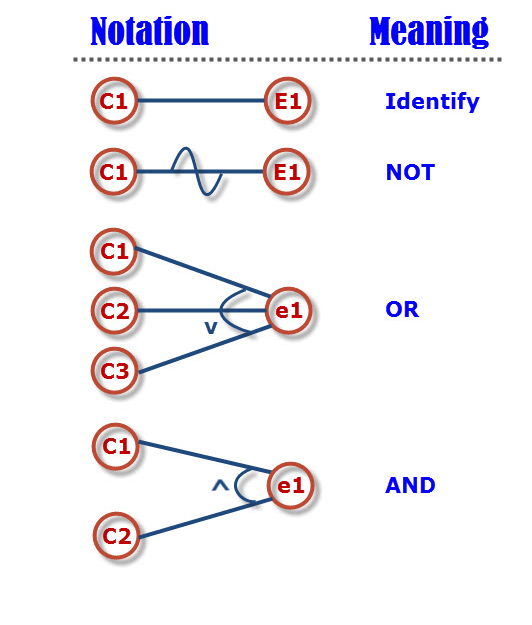
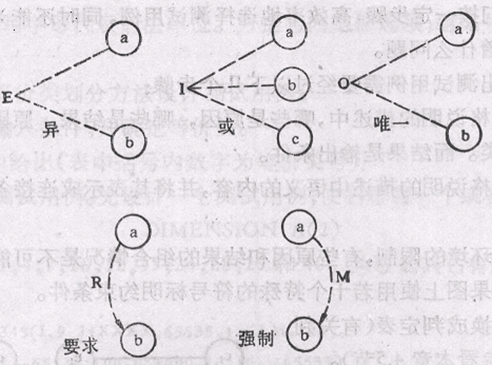
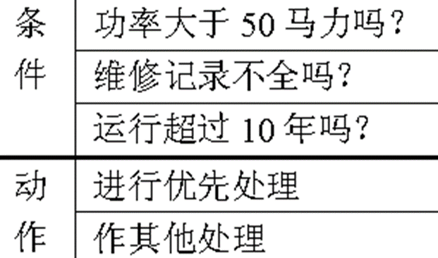
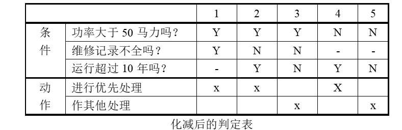
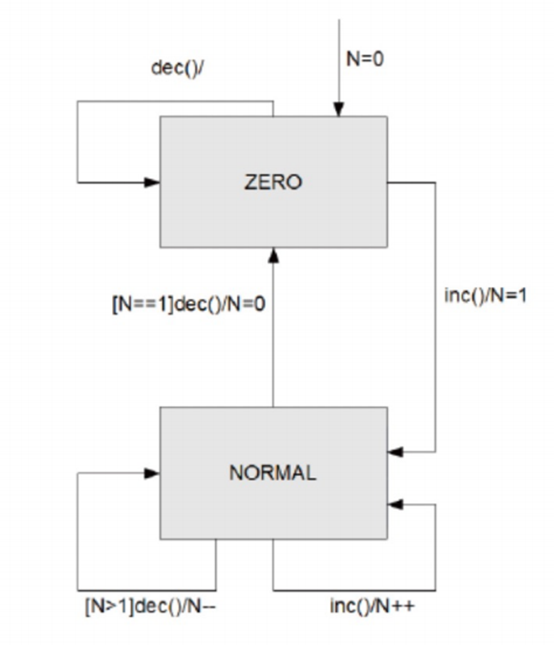
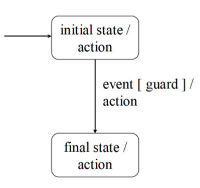
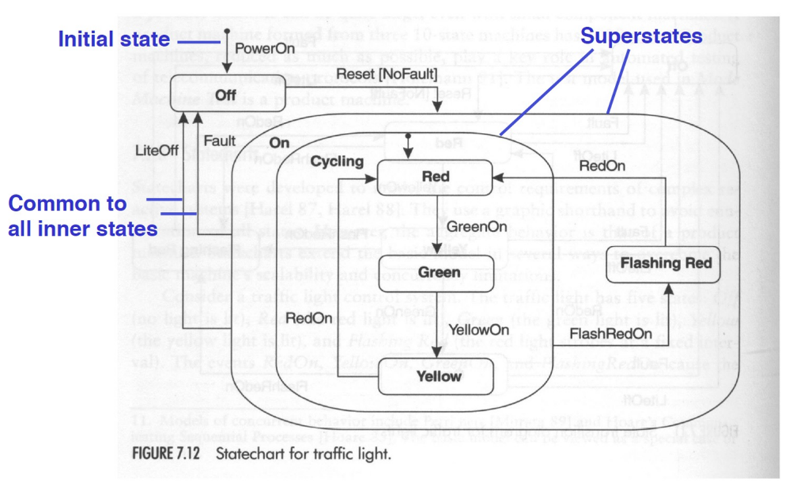

## 静态验证(Static Verification)与动态验证(Dynamic Verification)

- 静态验证是指在不运行程序的情况下对程序进行验证
- 动态验证是指借助测试用例等方式，通过运行成勋来对程序进行验证，将输入值(input value)输入程序中，将真实输出(actual value)与预期输出(expected value)做比对，来判断程序的正确性


- 理想系统(ideal system)由规范表示，而真实系统是实际代码。
- 测试成功并不需要通过结果。 失败的测试也会传授一些关于系统的新知识

:::info 黑盒测试(Black Box Testing)与白盒测试(White Box Testing)

- 黑盒测试完全基于程序规范(specification)，旨在验证程序是否满足规定的要求
- 白盒测试使用软件的实现来导出测试。 这些测试旨在测试程序代码的某些方面

:::

## 黑盒测试

- 黑盒测试也称为功能测试、数据驱动测试或基于规范的测试，是从用户角度进行的测试。
- 黑盒测试的主要错误类型有：
  - 功能不正确或缺失；
  - 接口及接口错误；
  - 性能误差；
  - 数据结构或外部数据访问错误；
  - 初始化或终止条件等错误。
- 每个软件功能必须包含在测试用例或经批准的例外情况中。
- 使用最小的数据类型和数据值集进行测试。
- 使用一系列实际数据类型和数据值来测试过载和其他“最坏情况”结果。
- 使用假设的数据类型和数据值来测试拒绝不规则输入的能力。
- 测试影响性能的关键模块，如基本算法、精度、时间、容量等是否正常。

### 优点

- 有目的地发现Bug，更准确地定位Bug。
- 黑盒测试可以证明产品是否满足用户所需的功能，满足用户的工作要求。
- 黑盒测试与软件本身如何无关实施的。如果实现发生变化，黑盒测试用例仍然存在可用（可重用性，面向回归测试）
- 测试用例开发可以与软件开发同时进行，可以节省软件开发时间。 大多数黑盒测试用例可以通过软件用例来设计。
- 可以重复相同的动作，试验中最枯燥的部分可以由机器完成。

### 缺点

- 需要充分了解待测试的软件产品所使用的技术，测试人员需要有较多的经验。
- 大量的测试用例
- 测试用例可能会产生大量冗余
- 功能测试覆盖率达不到100%
- 在测试过程中，很多都是手工测试操作。
- 测试人员负责大量文件和报告的准备和整理。

### 过程

1. 计划阶段(Test plan stage)
2. 设计阶段(Test design stage):根据程序需求说明书或用户手册，按照一定的标准化方法划分软件功能并设计测试用例
3. 测试执行阶段(Test execution stage):
根据设计的测试用例执行测试；
免费测试（作为测试用例测试的补充）
4. 测试总结阶段(Test summary stage)

### 测试用例(Test case)

- 测试用例是描述输入、操作或时间以及期望结果的文档。 其目的是确定应用程序的某个功能是否正常工作。
- 软件测试用例的基本要素包括测试用例编号、测试标题、重要性级别、测试输入、操作步骤和预期结果。

### 黑盒测试方法

- 等价划分(Equivalence Partitioning)
- 边界值分析(Boundary value analysis)
- 因果图(决策表)(Cause-Effect Graphs[Decision table])
- 随机测试(Random Testing)
- 错误猜测(Error Guessing)
- 场景测试(Scenario Testing)

#### 等价划分(Equivalence Partitioning)

- 就是将所有可能的输入数据，即程序的输入域，划分为若干部分（子集），然后从每个子集中选取几个有代表性的数据作为测试用例，该方法是一种重要且常用的黑盒测试用例设计方法，有两种类型的等价类(qeuivalence class):有效等价类(effective equivalence class)和无效等价类(invalid equivalence class)
- 有效等价类(effective equivalence class)它是指对程序的规范来说合理且有意义的输入数据的集合。
有效等价类可以用来检查程序是否实现了规范中规定的功能和性能。
- 无效等价类(invalid equivalence class):与有效等价类的定义相反。无效等价类是指对于程序规范来说不合理或无意义的输入数据集。对于具体问题，至少应该有一个无效的等价类，也可以有多个。
- 等价分类标准:完成测试并避免冗余,划分等价类重要的是把集合分成一组不相交的子集，子集就是整个集合

#### 边界值分析(Boundary value analysis)

- 就是对等价划分的补充，比如我只允许输入为`0-255`,那我就检测`-1,0,1,254,255,256`

#### 因果图(决策表)(Cause-Effect Graphs[Decision table])

- 前面介绍的等价划分和边界值分析都侧重于考虑输入条件，但没有考虑输入条件之间的联系和组合。
- 考虑输入条件的组合可能会导致一些新的情况，但检查输入条件的组合并不是一件容易的事，即使所有输入条件都被划分为等价的类，它们之间的组合仍然相当多。因此，有必要考虑以适合描述多个条件的组合并相应地生成多个动作的形式来设计测试用例。这需要使用因果图(又称石川馨图/鱼骨图)

- 还有一些约束符号

- 因果图方法的最终结果是判定表(Decision table)，因此因果图的使用顺序是：
  1. 通过分析规格说明，为每个原因(输入)和结果(输出)分配标识符
  2. 根据关系画出因果图
  3. 标明限制条件
  4. 把图转换为判定表
  5. 把判定表的每一列拿出来作为依据
- 判定表的建立步骤：
  1. 确定规则的个数.假如有$n$个条件。每个条件有两个取值$(0,1)$,故有$2^n$种规则。
  2. 列出所有的条件桩和动作桩。
  3. 填入条件项。
  4. 填入动作项。等到初始判定表。
  5. 简化.合并相似规则（相同动作）。

##### 示例

- 问题要求：”……对功率大于50马力的机器、维修记录不全或已运行10年以上的机器，应给予优先的维修处理……” 。这里假定，“维修记录不全”和“优先维修处理”均已在别处有更严格的定义 。请建立判定表

1. 确定规则的个数：这里有3个条件，每个条件有两个取值，故应有$2\times 2\times 2=8$种规则。
2. 列出所有的条件茬和动作茬：

3. 填入条件项。可从最后1行条件项开始，逐行向上填满。
4. 填入动作桩和动作顶。这样便得到形如图的初始判定表。

5. 化简，合并相似规则


#### 随机测试(Random Testing)

- 测试数据是使用随机数生成器生成的。
- 该分布可以是均匀的，或者被选择为在统计意义上模拟程序在实际使用中将接收的输入类型。
- 如果规范写得清楚且详尽，那么应该可以找到可能的输入值的集合。
- 目标是根据每个输入参数的分布实现其可能值的“合理”覆盖。 这可以通过启发式方式确定（例如，使用 10 个随机值），或者基于根据覆盖范围内所需的置信度确定的统计样本大小。
- 每个测试用例都由一组（随机）输入值表示，每个输入值对应一个参数。
- 然后，测量的测试故障率可以指示使用中的预期故障率

#### 错误估测(Error Guessing)

- 这是一种基于直觉和经验的临时方法(ad-hoc approach)。
- 通过选择性地使用一些测试数据，例如`null ptr`、空字符串，0值，NaN等
- 目标是覆盖尽可能多的值，根据测试人员的经验，这些值可能会暴露代码中的错误

#### 场景测试(Scenario Testing)

- 场景测试是一种软件测试技术，它使用场景（即推测性故事）来帮助测试人员解决复杂的问题或测试系统。


- 基本流程(basic flow):最简单的贯穿用例的路径，即没有任何错误，程序直接从头到尾的流程。大多数用户最常用的操作流程，反映了软件的主要功能和流程。 一项业务只有一个基础流，并且基础流只有一个起点和一个终点。
- 替代流程(alternative flow):从基础流程开始，在特定条件下执行，然后重新加入基础流程（例如替代流程1和3），或者源自另一个替代流（例如替代流2），用例也可以终止而不添加到基础中流（例如替代流 2 和 4），反映各种异常和错误情况。

##### 场景测试的步骤

1. 根据规范，描述被测软件的基本流程和替代流程。
2. 构建不同的场景，满足测试完整性、无冗余的要求。
3. 针对每个场景设计相应的测试用例。
4. 重新检查所有生成的测试用例，删除多余的测试用例。 确定测试用例后，确定每个测试用例的测试数据值。

#### 顺序值测试(Sequence and value testing)

- 值的序列对于软件保存状态很重要。
- 对特定输入值的响应可能会根据状态而变化，并且状态取决于先前的值序列。
- 分析序列的常规方法是使用状态图来识别软件可以处于的状态，以及每个状态下对每个输入（“事件”）的响应（“操作”）。


- 状态:系统实体生命周期中的抽象情况（例如，对象的内容）
- 过渡:允许的二态序列。 由事件引起
- 活动:输入或时间间隔
- 动作:事件之后的输出
- 守卫:与事件关联的谓词表达式，声明转换为触发态的布尔限制




- 测试用例 = 输入事件序列
- 全部事件覆盖(All events coverage)：测试套件（test suite）中包含状态机的每个事件，即每个事件至少是某个测试用例的一部分。
- 全部状态覆盖(All states coverage)：在测试过程中，通过测试套件中的某个测试用例至少激活一次状态机中的每个状态。
- 全部转换覆盖(All transitions coverage)：每个转换至少被一次测试用例激活。
- 全部路径覆盖(All path coverage)：从入口到退出状态的所有可能路径都被测试用例覆盖。由于图中没有退出状态，因此需要识别从入口到每个状态的所有路径。
- 全部循环覆盖(All circuits coverage)：在图中，从同一个状态开始和结束的所有路径都被测试用例覆盖。

## 白盒测试

- 白盒测试，也称为`结构测试(structual testing)`或`逻辑驱动测试(logic driven testing)`，是一种从程序的`控制结构(control structure)`中导出测试用例的测试用例设计方法。
- 白盒测试使用`被测单元(unit under test)`内部如何工作的信息，允许测试人员根据程序的`内部逻辑结构(internal logical structure)`和相关信息来设计和选择测试用例来测试程序。

### 覆盖率标准(Coverage Standard)

- 我们当然希望白盒测试覆盖尽可能多的分支，然而，由于循环的存在，遍历程序所有可能的路径是不现实的，例如一个`if-else`循环二十次，就有$2^20$种不同的可能性。因此我们有许多种不同的覆盖率标准，从低到高依次为：
  - 语句覆盖(Statement Coverage):意味着选择足够的测试用例，使得程序中的每条语句至少可以执行一次。
  - 判定覆盖/分支覆盖(Decision Coverage/Branch Coverage):执行足够的测试用例，使得程序中的每个分支至少通过一次
  - 条件覆盖(Condition Coverage)：执行足够的测试用例，使得程序中判断的每个条件的每个可能值至少被执行一次；条件覆盖渗透到决策中的每个条件，但可能不满足决策覆盖的要求。
  - 判断/条件覆盖(Decision/Condiction Coverage)：设计足够多的测试用例，运行所测程序，使程序中每个判断的每个条件的所有可能取值至少执行一次，并且每个可能的判断结果也至少执行一次，换句话说，即是要求各个判断的所有可能的条件取值组合至少执行一次；
  - 条件组合覆盖(Conditional combination coverage)：执行足够的示例，以便每个决策中各种可能的条件组合至少出现一次。
  - 基本路径覆盖(basic logic test):设计足够多的测试用例，运行所测程序，要覆盖程序中所有可能的路径。这是最强的覆盖准则。但在路径数目很大时，真正做到完全覆盖是很困难的，必须把覆盖路径数目压缩到一定限度。  
- 前五种准则又被称为逻辑驱动测试(Logic-Driven Testing)方法

### 逻辑驱动测试(Logic-Driven Testing)


- 这里，我们记$x\gt 3,\;z\lt 10,\; x==4, \;y\lt5$分别为$T_1,\;T_2,\;T_3,\;T_4$

#### 语句覆盖(Statement Coverage)

- 语句覆盖无法判断逻辑问题，因为它并不能对逻辑分支做检查，例如，将示例图中的第一个`&&`改为`||`，也并不能检查出来

#### 判定覆盖/分支覆盖(Decision Coverage/Branch Coverage)

- 它能够使每一个分支都获得每一种可能的结果，对于对于例1中，我只要设计两个例子，通过路径`ace`和`abd`或者通过路径`acd`和`abe`就可以达到判定覆盖，但是他也无法对判断条件进行检查，例如，我使用输入

```c
x=4,y=5,z=5; //[a,b,d]
x=2,y=5,z=5; //[a,c,e]
```

当第二个条件错误地写成`y<5`时，也无法检测出来

#### 条件覆盖(Condition Coverage)

例1的程序有四个条件：

$$
         A\gt1、B=0、A=2、X\gt1
$$
为了达到“条件覆盖”标准，需要执行足够的测试用例使得在a点有以下结果出现：
$$
A\gt1、A\le1、B=0、B\ne0
$$
以及在b点有以下结果出现：
$$
       A=2、A\ne2、X\gt1、X\le1
$$
现在只需设计以下两个测试用例就可满足这一标准：
$$
\begin{array}{c}
 A=2，B=0，X=4   \text{(沿路径ace执行)}\\
 A=1，B=1，X=1   \text{(沿路径abd执行)}
\end{array}
$$

- 但是它无法保证所有分支都被执行到，例如`IF A AND B THEN S`，我们设计用例为`(A,!B),(!A,B)`,那么`S`永远无法被执行到

#### 判断/条件覆盖(Decision/Condiction Coverage)

- 针对上述问题，引入了另一种覆盖标准“分支/条件覆盖”。其含义是执行足够多的测试用例，使得一个分支中的每个条件都可以获得各种可能的值，并且每个分支都可以获得各种可能的结果。
- 对于例1，我们可以设计

|条件取值|通过路径|覆盖分支|
|--|--|--|
|$T_1,\;T_2,\;T_3,\;T_4$|abd|bd|
|$-T_1,\;-T_2,\;-T_3,\;-T_4$|ace|ce|

- 然而，它无法判断条件的正确性，例如$x\gt 3 \&\& \lt 10$，对大多数编译器，当$x\gt 3$为真时，就不再会判断$z\lt 10$的情形了

#### 条件组合覆盖(Conditional combination coverage)

- 针对上述问题，提出了另一个标准“条件组合覆盖”。其含义是执行足够多的示例，使得每个决策中各种可能的条件组合至少出现一次。
- 但是这种方法不能保证所有路径都被遍历到，因为它不要求分支的条件组合

#### 补充策略

- 任何方法都不可能提供一组"完整的"测试用例，因此总是需要补充，一种参考的黑盒法补充策略是:
  1. 使用边界值分析。
  2. 用等价分类法补充一些测试用例。
  3. 再用错误推测法附加测试用例。
  4. 检查上述例子的逻辑覆盖程度，如果未能满足某些覆盖标准，则再增加足够的测试用例。
  5. 如果功能说明中含有输入条件的组合情况，则一开始就可先用因果图(判定表)法。

### 基本路径测试(Basic Path Testing)

- 在例1中，我们可以很简单地遍历所有可能的路径，然而在实际程序中这是不可能的(指数爆炸!)，但是我们可以通过一些手段进行剪枝，也就是压缩覆盖的路径数，比如通过只运行一次循环体
- 下面介绍的方法就是在`程序控制图`的基础上，通过分析控制构造的`环行(圈，loop)复杂性`，导出基本可执行路径集合，从而设计测试用例的方法，设计出的测试用例要`保证在测试中程序的每一个可执行语句至少执行一次`。
- 通常包括四个步骤：
  1. 程序的控制流图：描述程序控制流的一种图示方法
  2. 程序圈复杂度：McCabe复杂性度量。从程序的环路复杂性可导出程序基本路径集合中的独立路径条数。
  3. 导出测试用例：根据圈复杂度和程序结构设计用例数据输入和预期结果。
  4. 准备测试用例：确保基本路径集中的每一条路径的执行
- 一个方法:
  - 图形矩阵：是在基本路径测试中起辅助作用的软件工具，利用它可以实现自动地确定一个基本路径集。

#### 控制流图


- 流图只有二种图形符号，图中的每一个圆称为流图的结点，代表一条或多条语句。流图中的箭头称为边或连接，代表控制流。
- 任何过程设计都要被翻译成控制流图。
- 在将程序流程图简化成控制流图时，应注意：
  - 在选择或多分支结构中，分支的汇聚处应有一个汇聚结点。
  - 边和结点圈定的区域叫做区域，当对区域计数时，图形外的区域也应记为一个区域。

- 如果判断中的条件表达式是由一个或多个逻辑运算符 (OR,  AND, NAND,  NOR)  连接的复合条件表达式，则需要改为一系列只有单条件的嵌套的判断。
  - 例如下列代码和对于图

```c
if (a||b){
  x
}else{
  y
}
```


