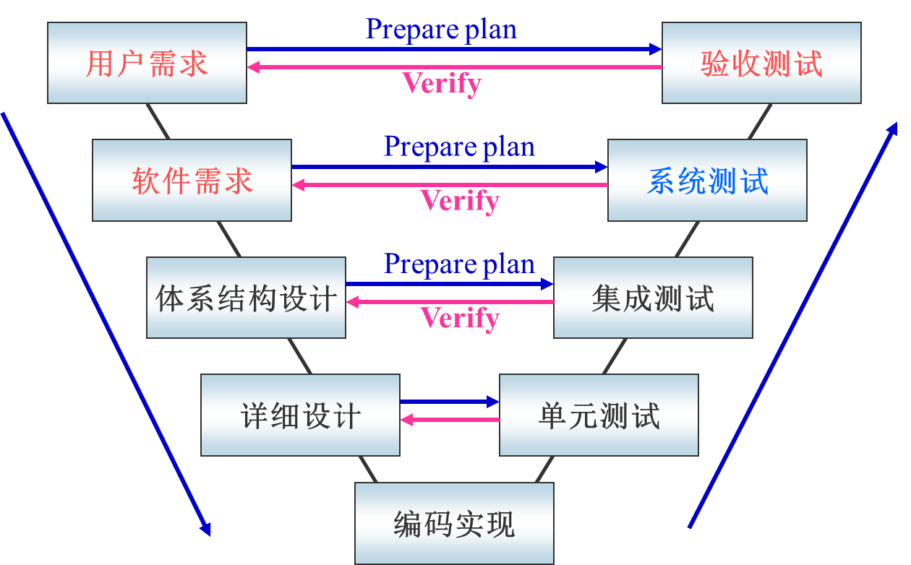

## 单元测试(Unit Test)

- “单元”：明确的功能、规格定义，与其他部分明确的接口定义。
  - 结构化程序设计：函数或子过程；
  - 面向对象：类或类的方法；
  - 一个菜单、屏幕显示界面或对话框等。
- 单元测试也称模块测试，这是针对最小的可测试软件元素-模块进行测试工作。单元测试目的在于发现各模块内部可能存在的各种差错。
- 在单元测试时，如果模块不是独立的程序，需要辅助测试模块。有两种辅助模块：
  - 驱动模块（Driver）：所测模块的主程序：它接收测试数据，把这些数据传递给所测试模块，最后再输出实测结果。当被测试模块能完成一定功能时，也可以不要驱动模块。
  - 桩模块（Stub）：用来代替所测模块调用的子模块。
    

### 单元测试的内容

### 单元测试用例的设计

- 测试用例的设计是根据设计文档进行的
- 为系统运行设计用例，用最简单的方法执行被测单元。
- 为正向测试设计用例，测试设计说明书所对应的功能项或性能指标是否达到。
- 为逆向测试设计用例，测试被测单元有没有做它不应该做的事情。

## 集成测试(Integration Test)

- 软件在系统集成时会经常有这样的情况发生：即每个模块都能单独工作 ，但这些模块集成在一起之后却有可能不能正常工作。
- `集成测试`又称组装测试，是在单元测试的基础上，将所有模块按照设计要求组装成子系统或系统进行的测试活动。
- 确保各单元组合在一起后能够按既定意图协作运行，并确保增量的行为正确，所测试的内容包括`单元间的接口`以及`集成后的功能`。
- 集成测试通常需要考虑以下方面：
  1. 在把各个模块连接起来的时候，穿越模块接口的数据是否会丢失；
  2. 各个子功能组合起来，能否达到预期要求的父功能；
  3. 一个模块的功能是否会对另一个模块的功能产生不利的影响；
  4. 全局数据结构是否有问题
  5. 单个模块的误差积累起来，是否会放大，从而达到不可接受的程度。

### 集成测试的等级

- 由集成的力度不同，一般可以把集成测试划分为三个级别：
  1. 模块内集成测试。
  2. 子系统内集成测试：先测试子系统内的功能模块，然后将各个功能模块组合起来确认子系统的功能是否达到预期要求。
  3. 子系统间集成测试：测试的单元是子系统之间的接口。子系统是可单独运行的程序或进程。

### 集成测试方法

- 静态测试技术——针对概要设计的测试
- 动态测试技术——灰盒测试：与白盒和黑盒测试相比，灰盒测试只需要了解程序的部分内部结构，例如程序内部结构文档或者部分算法

### 集成测试策略

- 集成的基本策略比较多，分类比较复杂，但是都可以归结为以下两类：
  - 非增量式集成策略——一步到位
  - 增量式集成策略——逐步实现

#### 非增量式集成策略(Non-increasing integration strategy)

- 非增量式测试是采用一步到位的方法来构造测试：
  - 对所有模块进行个别的单元测试后，按照程序结构图将各模块连接起来，把连接后的程序当作一个整体进行测试。
  - 又叫大爆炸式集成（Big Bang）
    
- 优点：
  - 方法简单
  - 允许多测试人员同时并行工作，人力物力资源利用率较高
- 缺点
  - 必须为每个模块准备相应的驱动模块和桩模块，测试成本较高
  - 一旦集成后包含多种错误，难以纠正。

#### 增量式集成策略(Increasing integration strategy)

- 增量式测试的集成是逐步实现的：逐次将未曾集成测试的模块和已经集成测试的模块（或子系统）结合成程序包，再将这些模块集成为较大系统，在集成的过程中边连接边测试，以发现连接过程中产生的问题。
- 按照不同的实施次序，增量式集成测试又可以分为三种不同的方法：
  1. 自顶向下增量式测试
  2. 自底向上增量式测试
  3. 三明治增量式测试（混合增量式测试）

##### 自顶向下

- 自顶向下集成测试的整个过程由 3 个步骤完成：
  1. 主控模块作为测试驱动器。
  2. 根据集成的方式（深度或广度），下层的桩模块一次一次地被替换为真正的模块。
  3. 在每个模块被集成时，都必须进行单元测试。
     重复第 2 步，直到整个系统被测试完成。
- 优点：
  - 较早地验证了主要控制和判断点；
  - 按深度优先可以首先实现和验证一个完整的软件功能；
  - 功能较早证实，带来信心；
  - 只需一个驱动，减少驱动器开发的费用；
  - 支持故障隔离。
- 缺点：
  - 桩的开发量大；
  - 底层验证被推迟；
  - 底层组件测试不充分。

##### 自底向上

- 从具有最小依赖性的底层组件开始，按照依赖关系树的结构，逐层向上集成，以检验系统的稳定性。
- 最常用的集成策略，其他方法都或多或少应用此种方法。 1. 起始于模块依赖关系树的底层叶子模块，也可以把两个或多个叶子模块合并到一起进行测试 2. 使用驱动模块对步骤１选定的模块（或模块组）进行测试 3. 用实际模块代替驱动模块，与它已测试的直属子模块组装成一个更大的模块进行测试 4. 重复上面的行为，直到系统最顶层模块被加入到已测系统中
  
- 优点：
  - 对底层组件行为较早验证；
  - 工作最初可以并行集成，比自顶向下效率高；
  - 减少了桩的工作量；
  - 能较好锁定软件故障所在位置。
- 缺点：
  - 驱动的开发工作量大；
  - 对高层的验证被推迟，设计上的错误不能被及时发现。

##### 三明治

-混合式集成，把系统划分成三层，中间一层为目标层，目标层之上采用自顶向下集成，之下采用自底向上集成

- 优点：
  - 集合了自顶向下和自底向上两种策略的优点
- 缺点：
  - 中间层测试不充分
- 适用范围：
  - 适应于大部分软件开发项目

### 集成策略框架

xUnit/JUnit

略

## 系统测试(System Testing)

- 系统测试是将经过集成测试的软件，作为计算机系统的一个部分，与系统中其他部分结合起来，在实际运行环境下对计算机系统进行的一系列严格有效地测试，以发现软件潜在的 BUG，保证系统的正常运行。
  

### 系统测试类型

#### 性能测试(Performance test)

- 评估系统的能力。测试中得到的负荷和响应时间等数据可以被用于验证所计划的模型的能力，并帮助做出决策。
- 识别系统中的弱点。受控的负荷可以被增加到一个极端的水平并突破它，从而修复系统的瓶颈或薄弱的地方。
- 系统调优。重复运行测试，验证调整系统的活动得到了预期的结果，从而改进性能，检测软件中的问题。

#### 压力测试(Stress Test)

- 模拟巨大的工作负荷，以查看系统在峰值使用情况下是否可以正常运行。
- 通过逐步增加系统负载来测试系统性能的变化，并最终确定在什么负载条件下系统性能处于失效状态，以此来获得系统性能提供的最大服务级别的测试。

#### 容量测试(Capacity Test)

- 采用特定手段，检测系统能够承载处理任务的极限值所进行的测试工作。
- 目的是使系统承受超额的数据容量来检测它是否能够正确处理，通过测试，分析出反映软件系统应用特征的某项指标的极限值，确定系统在其极限值状态下还能否保持其主要功能正常运行。

#### 健壮性测试(Robustness Test)

- 用于测试系统抵御错误的能力。测试重点为当出现故障时，系统是否能够自动恢复或忽略故障继续运行。
- 健壮性包括两层含义：一是高可靠性；二是从错误中恢复的能力。

#### 恢复性测试(Recovery Test)

- 恢复测试主要检查系统的容错能力。当系统出错时，能否在指定时间间隔内修正错误并重新启动系统。
- 恢复测试首先要采用各种办法强迫系统失败，然后验证系统是否能尽快恢复。

#### 备份测试 (Backup Test)

- 恢复性测试的一个补充，目的是验证系统在发生软件或者硬件失败时备份数据的能力。

#### 兼容性测试(Compatibility Test)

兼容性测试是指检查软件之间是否能够正确地进行交互和共享信息。对新软件进行软件兼容性测试。

#### 安装测试(Installation Test)

- 安装性测试的目的就是要验证系统成功安装的能力，并保证程序安装后能正常运行。因此清晰且简单的安装过程是系统文档中最重要的部分。

#### 图形界面测试(GUI Test)

- GUI 测试是对图形用户界面进行的测试。
- 一般来说，当一个软件产品完成 GUI 设计后，就确定了它的外观架构和 GUI 元素

#### 文档测试(Document/Help Test)

- 从用户的角度来测试软件文档是非常有效的方法。仔细阅读，跟随每个步骤，检查每个图形，尝试每个示例。

#### 安全测试(Security Test)

- 安全测试期间，测试人员假扮非法入侵者，采用各种办法试图突破防线。例如想方设法截取或破译口令；专门定做软件破坏系统的保护机制；故意导致系统失败，企图趁恢复之机非法进入；试图通过浏览非保密数据，推导所需信息等等。
- 安全测试的方法：
  1. 威胁建模(Threat Modeling)
  2. 漏洞扫描(Vulnerability Scnaning)
  3. 渗透测试(Penetration Testing):包括侦察和信息收集，网络枚举和扫描，漏洞测试与利用，报告这四个阶段
     

## 验收测试(Acceptance Testing)

- 验收测试是软件测试的最终级别，测试系统是否符合其业务需求。它由客户或最终用户执行，目的是查看产品是否适合交付。
- 在系统测试之后、最终交付给客户之前进行。它在黑盒测试方法下工作。

### 验收测试的内容

- 包括两部分：`软件配置审查(Software Configuration Review)`和`软件有效性测试(Software Validity Testing)`。

#### 软件配置审查(Software Configuration Review)

- 常见的软件配置项包括：
  1. 主要软件程序配置，一般包括源码程序、可执行程序、软件安装和配置脚本、关键测试脚本或测试程序
  2. 主要技术文件
  3. 主要开发管理文件
- 对软件配置完成以下检查：
  - 源代码检查
    - 规范检查
    - 数据类型检查
    - 检查外部接口
  - 软件一致性检查
    - 编译检查
    - 安装和卸载测试
    - 运行模块一致性检查

#### 软件有效性测试(Software Validity Testing)

- 软件接口测试
- 可用性测试
- 功能测试（包括正常业务流程测试和错误处理能力测试）
- 性能测试（包括负载、体积、压力测试）
- 软件执行环境及系统平台配置测试
- 鲁棒性测试（包括各种硬件下的恢复测试）
  软件故障）
- 可靠性测试
- 兼容性测试
- 数据备份测试
- 安全测试

### 验收测试的注意事项

1. 验收前应制定正式的验收计划，明确验收通过的标准，并经用户确认。
2. 验收测试必须在最终用户的实际使用环境中进行，或者模拟用户的实际操作环境，避免因环境差异而无法发现软件的一些潜在问题。
3. 验收测试应涵盖软件的粗粒度、业务级功能。 验收测试用例与软件项目合同和软件之间存在可追溯性
   要求规范。
4. 验收测试用例不可能或没有必要重新运行在开发阶段进行的所有测试用例。
5. 验收测试必须以用户为导向，以用户能够接受的方式进行。能够从最终用户使用的实际业务场景的角度直观地感知。
6. 验收测试用例的设计必须充分考虑用户的使用方式
   思维、使用习惯、业务语言等，并根据主要业务场景组织测试用例和测试流程。 重点关注客户最关心的功能点和性能点。

### Alpha 测试与 Beta 测试

- Alpha 和 Beta 测试阶段主要侧重于发现已测试产品中的错误，并清楚地了解实时用户如何使用该产品。

#### Alpha 测试

- Alpha 测试是验收测试的一种形式，发生在开发商的网站。
- 它也可以由内部开发人员和质量检查人员来执行以及潜在的最终用户。

#### Beta 测试

- Beta 测试（现场测试）是进行的验收测试的形式。在客户或最终用户的站点。
- 它是在 alpha 测试之后在现实环境中执行的，无需开发人员在场或控制。
- Beta 测试或应用程序的 Beta 版本通常向全世界（或客户）开放。

## 回归测试(Regression Testing)

- 回归测试是重新运行功能和非功能测试，以确保先前开发和测试的软件在更改后仍然可以运行。可能需要回归测试的更改包括错误修复、软件增强、配置更改。
- 这里所说的保证软件原有功能正常运作，或称之为软件修改的正确性，可以从两方面来理解：
  - 所做的修改达到了预期的目的，例如缺陷得到了修改，新增加的功能得到了实现
  - 软件的修改没有引入新的缺陷，没有影响原有的功能实现
