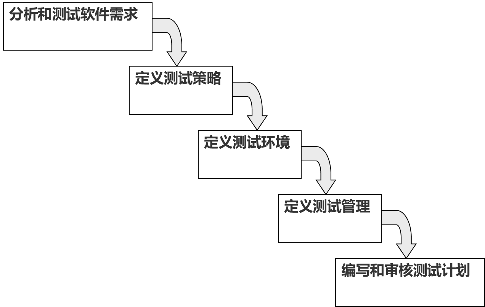

## 软件测试环境(Software Testing Environment)

- 软件测试环境包括`设计环境`，`实施环境`和`管理环境`三部分，是指为了完成软件测试工作所必需的硬件、软件、设备、数据的总称。
- 软件测试环境是软件测试实施的一个重要阶段，软件测试环境适合与否会严重影响测试结果的真实性和正确性。测试环境是软件测试的基础

### 软件测试环境的要素(Elements of software testing environment)

- 一般来说，配置测试环境应该满足五个基本要素是：`硬件`、`软件`、`网络环境`、`数据准备`、`测试工具`。其中硬件、软件是测试环境中的最基本的两个要素，并派生出后三者。

## 软件测试计划(Software Testing Plan)

- 软件测试计划是软件测试员与产品开发小组交流意图的主要方式。
- 测试计划的目标是：
  - 规定测试活动的范围、方法、资源和进度；
  - 明确正在测试的项目、要测试的特性、要执行的测试任务、每个任务的负责人，以及与计划相关的风险。
- 测试计划过程的最终目标是交流（`而不是记录`）软件测试小组的意图、期望，以及对将要执行的测试任务的理解。

### 测试计划主题

- 因此，在测试计划中，重要的不是最终的测试计划文档应该以什么模板输出，而是在测试计划沟通的过程中，有没有就所有应该讨论的主题达成一致。因此主题清单很重要

#### 高级期望

- 测试过程中第一个论题是定义测试小组的高级期望。
- 测试计划过程和软件测试计划的目的是什么？
  - 不但测试人员要清楚，还要保证程序员、文档编写人员、管理部门都要知道。因为测试要获得他们的同意和支持。
- 测试的是什么产品。因为软件产品不断的升级换代，下一版本是完全重写呢，还是维护升级呢？它是一个独立的程序还是有若干个小程序构成的？

#### 人、地点和事

- 测试计划需要明确在项目中工作的人，他干什么，怎样和他联系。
    - 因为测试小组有可能跟所有的人都需要打交道。

#### 定义

- 请回顾软件缺陷的定义。
  - 它为我们认清缺陷的本质和识别缺陷提供了依据。
  - 如果程序员、测试员和管理部门对定义未能达成一致，争执在所难免。
- 需要对一些术语的定义达成一致，例如Alpha版，Beta版，如果有程序员认为Beta版仅仅是内部测试而略过了Alpha测试，那么就会带来严重的问题

#### 团队间的责任

- 如图所示是一种常见的划分团队责任的方法，其中`*`表示任务的责任者，`-`表示任务的参与者，空白表示不负责该任务。

#### 测试内容

- 也就是哪些要测试，哪些不要测试
- 比如外包公司的内容通常就不需要进行详尽的测试，以前测试过的内容也不必测试
- 如果某部分内容不需要测试，需要阐明这样做的理由，因为这是风险。

#### 测试的阶段

- 要计划测试的阶段，测试小组就会查看预定的开发模式，并决定在项目期间是采用一个测试阶段还是分阶段测试。
  - 在边写边改的开发模式中只有一个测试阶段。
  - 在螺旋模型中可能有若干测试阶段，其中计划测试就是一个。
- 与测试阶段相关联的两个重要概念是进入和退出规则。
- 每一阶段都必须有可观定义的规则，明确定义本阶段的结束，下一阶段开始。
  - 如说明书审查阶段可能在正式说明书审查公布时结束。
  - Beta测试阶段可能在测试员完成验收测试时开始。

#### 测试策略

- 定义测试策略与定义测试阶段相关联。
- 测试策略描述测试小组用于测试整体和每个阶段的方法，决定使用黑盒还是白盒，或是两种方式结合使用，用在软件的什么部分，怎么运用？使用手工测试还是自动化测试？

#### 资源需求

- 例如人力，设备，软件需求
- 项目后期想要获取资源非常困难

#### 测试员的任务分配

- 一旦定义了测试阶段、测试策略和资源要求，这些信息加上产品说明书就可以分配每个测试员的任务。
- 与团队之间的责任划分不一样，测试员的任务分配指的是，明确测试员负责软件的那些部分、那些可测试特性。

#### 测试进度

- 测试进度需要以上所述的全部信息，并将其反映到整个进度安排中。
- 测试进度非常重要，有时甚至会根据测试进度决定砍掉产品的一些特性，或者推迟到下一版本中推出。

### 测试计划的制定

### 测试策略

- 测试策略考虑的问题：
  - 测试范围
  - 测试方法
  - 测试标准
  - 测试工具

#### 测试范围

- 测试过度，则在测试覆盖中存在大量冗余；测试范围过小，则存在遗漏错误的风险。
- 定义测试范围是一个在测试时间、费用和质量风险之间寻找平衡的过程。
- 定义测试范围需要考虑下列一些因素：
    - 首先测试最高优先级的需求。 
    - 测试新的功能和代码或者改进的旧功能。 
    - 使用等价类划分来减小测试范围 
    - 重点测试经常出问题的地方

#### 测试方法

- 在不同的开发阶段，需要选择不同的测试方法。
- 在瀑布生命期模型中不同的阶段可以选择的不同的测试方法：
  - 需求分析阶段：静态测试
  - 概要设计与详细设计阶段：静态测试 
  - 编码和单元测试阶段：静态测试和动态测试、白盒测试
  - 集成测试阶段：动态测试、白盒测试、黑盒测试 
  - 系统测试阶段：动态测试、黑盒测试
  - 验收测试阶段：动态测试、黑盒测试

#### 测试标准

- 定义测试标准的目的是设置测试中遵循的规则。
- 需要制订以下几种标准：
  - 测试入口标准
  - 测试出口标准
  - 测试暂停与继续标准
- 基于测试用例的规则
  - 当测试用例的不通过率达到某一百分比时，则拒绝继续测试。
  - 优点是适用于所有的测试阶段 
  - 缺点是太依赖于测试用例。 
- 基于“测试期缺陷密度”的规则
  - “测试期缺陷密度”：测试一个CPU小时发现的缺陷数。
  - 如果在相邻n个CPU小时内“测试期缺陷密度”全部低于某个值m时，则允许正常结束测试。 
- 基于“运行期缺陷密度”的规则
  - “运行期缺陷密度”：软件运行一个CPU小时发现的缺陷数
  - 如果在相邻n个CPU小时内“运行期缺陷密度”全部低于某个值m时，则允许正常结束测试。 

#### 测试工具

- 要针对测试目标和需求，选择合适的测试工具

## 软件缺陷管理(Software Bug Management)

- 软件缺陷概述
- 如何报告缺陷
- 如何跟踪缺陷
- 缺陷度量
- 缺陷管理工具

### 软件缺陷概述

#### 软件缺陷的属性

- 主要属性：
  
| 属性名称               | 描述                                                           |
| ---------------------- | -------------------------------------------------------------- |
| 缺陷标识(Identifier)   | 缺陷标识是标记某个缺陷的一组符号。每个缺陷必须有一个唯一的标识 |
| 缺陷类型 (Type)        | 缺陷类型是根据缺陷的自然属性划分的缺陷种类。                   |
| 缺陷严重程度(Severity) | 缺陷严重程度是指因缺陷引起的失效对软件产品的影响程度。         |
| 缺陷优先级(Priority)   | 缺陷的优先级指缺陷必须被修复的紧急程度。                       |
| 缺陷状态(Status)       | 缺陷状态指缺陷通过一个跟踪修复过程的进展情况。                 |
| 缺陷起源(Origin)       | 缺陷起源指缺陷引起的失效或事件第一次被检测到的阶段。           |
| 缺陷来源(Source)       | 缺陷来源指引起缺陷的起因。                                     |
| 缺陷根源(Root Cause)   | 缺陷根源指发生错误的根本因素。                                 |

- 其它属性：
  
| 属性名称                      | 描述                                                                                                                                   |
| ----------------------------- | -------------------------------------------------------------------------------------------------------------------------------------- |
| 缺陷摘要 (Summary)            | 用一句话概要地描述缺陷的现象                                                                                                           |
| 缺陷描述 (Description)        | 详细的描述缺陷重现的环境、前置条件、步骤、期望结果、实际结果等。                                                                       |
| 指定的负责人 (owner/assignee) | 通常是负责修复该缺陷的开发人员，在有的系统中也支持开发人员修复好缺陷修改其在缺陷跟踪系统中的状态后把它指定（assign）给相关的测试人员。 |
| found in                      | 缺陷被发现的版本                                                                                                                       |
| fixed in                      | 缺陷被修复的时候由开发人员填写。                                                                                                       |
| 解决办法（ resolution ）      | 由开发人员修复缺陷的时候填写。                                                                                                         |
| verified in                   | 反映缺陷的修复在哪个版本被验证了                                                                                                       |
| 附件（ attachment ）          | 附加的屏幕截图、服务器或客户端日志等相关文件，便于开发人员定位缺陷的原因。                                                             |

### 如何报告缺陷

- 如何面对软件缺陷
- 如何有效描述缺陷

#### 如何面对缺陷

- 确保发现的软件缺陷全部被关闭，但不一定被修复。
  - 没有足够的时间。
  - 不算真正的软件缺陷。
  - 修复的风险太大。
  - 不值得修复。
- 软件缺陷报告不够有效。导致对缺陷的判断失误。
- 报告软件缺陷的原则：
  - 尽快报告软件缺陷
  - 有效描述软件缺陷

#### 如何有效描述缺陷

- 缺陷描述的三个部分
  - 概要：使用一两句话来描述错误，留下深刻印象。  
  - 再现步骤：对于如何再现缺陷提供了准确的描述  要求简明但完全；不含糊且精确。  
  - 隔离：是指测试员用来确认错误是一个真正的问题，并识别哪些影响错误表现的因素而收集的结果和信息。
- 有效描述缺陷的十步骤过程：
  - 结构:测试过程的结构。
  - 再现:三次再现缺陷。
  - 隔离:确定影响再现的变量。
  - 推广:确定系统其他部分是否可能出现这种错误。
  - 比较:评审运行相似测试的结果。
  - 总结:简短描述客户或用户的质量体验和观察到的特征。
  - 压缩:精简不必要的信息，特别是冗余的测试步骤。
  - 去除歧义:使用清晰的语言。
  - 中立:公正地表达自己的意思，避免夸张、幽默、讽刺。
  - 评审:同行评审。

### 如何跟踪缺陷

- 使用状态来管理缺陷生命周期

| 缺陷状态 | 描述                                 |
| -------- | ------------------------------------ |
| New      | 新建缺陷                             |
| Open     | 被确认并分配相关开发人员处理         |
| Fixed    | 开发人员已确认修改，等待测试人员处理 |
| Rejected | 拒绝修改缺陷                         |
| Deferred | 被确认，但延期修改缺陷               |
| Closed   | 缺陷已被修复                         |

- 强调所有权和责任
  - 谁负责设置和改变缺陷的状态？
  - 使用分配和估计修复日期跟踪缺陷修复。
  - 跟踪测试人员所有权，尽快完成回归测试。

- 关键转移

### 缺陷度量

- 缺陷度量：帮助确定产品缺陷分布的情况、 帮助确定产品缺陷分布的情况“概率”和“风险发生后所带来的损失”来评估风险。 
- 是作为`测试有效性度量`的一种形式
- 包括
  - 缺陷数量
  - 产品缺陷
  - 缺陷消除率(DRE)
  - 缺陷龄期(潜伏期)（Defect Age）
  - 缺陷损耗
  - 缺陷密度

#### 测试有效性度量

#### 缺陷数量

- 用缺陷数量作为测试有效性度量的两个问题
  - 所有的Bug并不都是均等的。有必要对bug进行“加权”或采用影响等级分类。
  - 最初存在的数量对发现的bug数量由着重要的正影响

#### 产品缺陷

- 在产品中或客户发现的缺陷数量。
- 测试员没有发现的或者是在发布之前未修复的。

#### 缺陷消除率

- 在我们可能发现的bug集合中，我们到底发现了多少bug?
- 定义：
$$
DRE= \frac{\text{测试期间发现的Bug数量}}{\text{测试期间发现的Bug数量+未发现的Bug数量}}
$$
  - 未发现的Bug数量=客户发现的Bug数量
- 使用该度量，必须清楚以下几点
  - 必须考虑Bug的严重程度和分布状况。
  - 我们怎么才知道客户到什么时候会发现所有的bug?
  - 这种度量是“马后炮”性质的度量。对当前项目的测试有效性度量无意义，但有利于组织的测试有效性的长期趋势度量。
  - 我们什么时候开始计算Bug?
  - 有些Bug在测试中发现不了！受测试环境的影响，发现不了的bug是否需要考虑度量。

- $DRE=(80+40+100+20+50+30)/(80+40+100+20+50+30+30)=91%$
- $\text{系统测试的DRE=系统测试发现的bug数量}/\text{(系统测试发现的bug数量+验收测试和产品中发现的bug数量)}=50/（50+30+30）=45%$

#### 缺陷潜伏期

- 我们发现bug的时间越晚，这个bug所带来的损害就越大，修复这个bug所耗费的成本就越多。

#### 缺陷损耗

- 损耗是使用阶段潜伏期和缺陷分布来度量缺陷消除活动的有效性的一种度量。
- 缺陷损耗的计算
$$
\text{损耗}=\frac{\text{缺陷数量}\times\text{发现的阶段潜伏期}}{\text{缺陷总量}}
$$
- 损耗的数值越低，说明发现过程越有效。
- 作为一个绝对值，损耗几乎没有任何意义；但是，当用损耗来度量测试有效性的长期趋势时，它就会显示出自己的价值。

#### 缺陷密度

- 计算
$$
\text{缺陷密度}=\frac{\text{缺陷数量}}{\text{代码行或功能点的数量}}
$$
- 两个问题
  - 我们把什么当作缺陷
    - 是否将较小的缺陷和严重缺陷作同等对待，是否加权。
    - 我们是否计算单元测试的bug数量？还是只计算以后发现的bug数量？
    - 计算在评审/审查期间发现的bug数量？
  - 度量模块的大小也是一个问题，代码行的数量会因为编程人员的技术水平和所使用的语言的不同而不同。
- Pareto分析：也就是80-20法则，以这种方式来进行更进一步的分析：以发生频率的降序形式（如功能性、可使用性等）来显示引发缺陷的原因。

## 测试总结报告

- 测试总结报告是一个重要的可交付成果，它是在测试项目结束时准备的，或者更确切地说是在测试完成后准备的。
- 本文件的主要目的是向高级管理层、客户等相关利益相关者解释有关项目测试的各种细节和活动。
- 在进行详尽的测试后，发布测试结果、指标、最佳实践、经验教训、“上线”结论等非常重要，将其作为所执行的测试和测试结论的证据很重要。
- 测试总结报告通常包括
  - 软件概述
  - 所使用的测试类型
  - 测试环境与工具
  - 测试范围
  - 测试指标(结果)