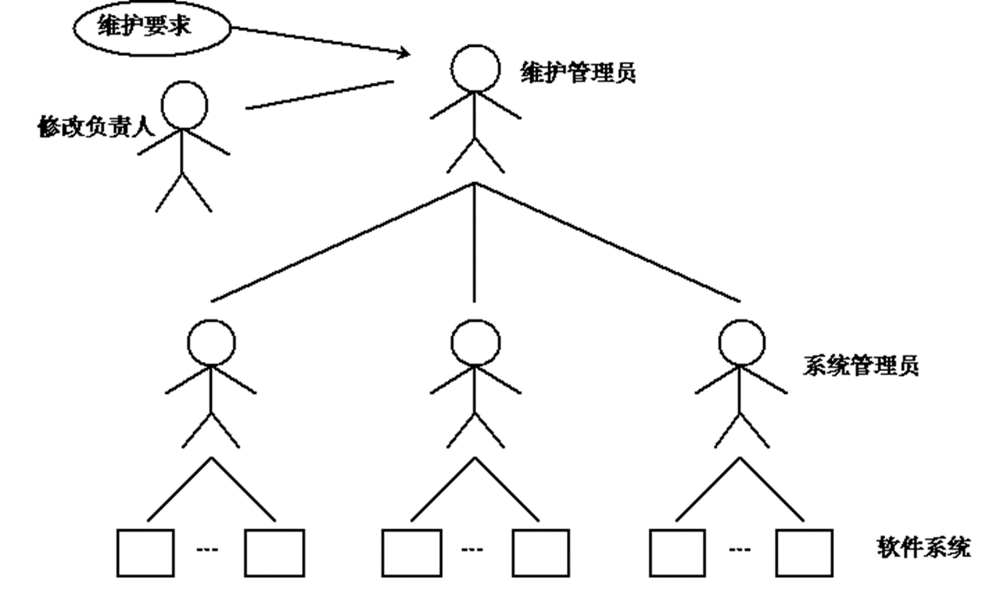
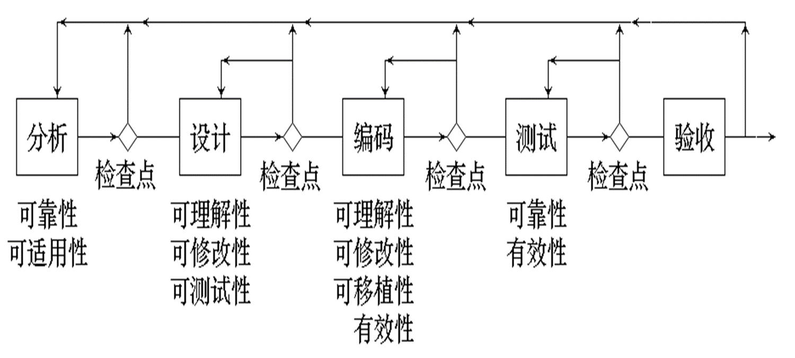
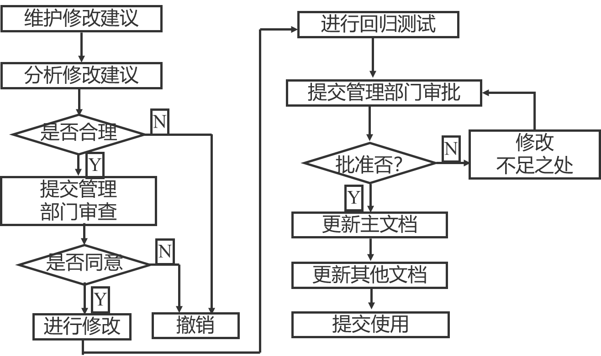

## 软件维护的定义(Definition of Software Maintenance)

- 软件维护是指软件系统交付使用以后，为了改正错误或满足新的需要而修改软件的过程。
- 一般来说，要求进行维护的原因大致有以下几种：
  1. 改正程序中的错误和缺陷。
  2. 改进设计以适应新的软、硬件环境。
  3. 增加新的应用范围。

## 软件维护的类型(Types of Software maintenance)

- 根据软件维护的不同原因，软件维护可以分成以下类型：
  1. 改正性维护
  2. 适应性维护
  3. 完善性维护
  4. 预防性维护

### 改正性维护

- 在软件交付使用后，因开发时测试的不彻底、不完全，必然会有部分隐藏的错误遗留到运行阶段。
- 这些隐藏下来的错误在某些特定的使用环境下就会暴露出来。
- 为了识别和纠正软件错误、改正软件性能上的缺陷、排除实施中的误使用，应当进行的诊断和改正错误的过程就叫做改正性维护。

### 适应性维护

- 在使用过程中，环境可能发生变化：
  - 外部环境（新的硬件、软件配置）
  - 数据环境（数据库、数据格式、数据输入/输出方式、数据存储介质）
- 为使软件适应这种变化，而去修改软件的过程就叫做适应性维护。

### 完善性维护

- 在软件的使用过程中，用户往往会对软件提出新的功能与性能要求。
- 为了满足这些要求，需要修改或再开发软件，以扩充软件功能、增强软件性能、改进加工效率、提高软件的可维护性。
- 这种情况下进行的维护活动叫做完善性维护。

### 预防性维护

- 预防性维护即`软件再工程`，是为了提高软件的可维护性、可靠性等，为以后进一步改进软件打下良好基础。
- 采用先进的软件工程方法对需要维护的软件或软件中的某一部分（重新）进行设计、编制和测试，称为预防性维护。

## 影响软件维护工作量的因素(Factors affecting software maintenance workload)

- 软件维护的特点
  - 结构化维护和非结构化维护差别巨大
  - 软件维护的代价高昂
  - 维护问题多
- 在结构化维护的过程中，所开发的软件具有各个阶段的文档，它对于理解和掌握软件的功能、性能、体系结构、数据结构、系统接口和设计约束等有很大的作用。
- 非结构化维护时，要求维护人员直接通过源码进行维护，维护效率低
- 在软件维护中，影响维护工作量的因素主要有以下六种：
  - 系统的大小
    - 系统规模越大，其功能就越复杂，软件维护的工作量也随之增大。
  - 程序设计语言 - 使用强功能的程序设计语言可以控制程序的规模。语言的功能越强，生成程序的模块化和结构化程度越高，所需的指令数就越少，程序的可读性越好。
    系统年龄 - 老系统比新系统需要更多的维护工作量 。因为多次的修改可能造成系统结构变得混乱，由于维护人员经常更换，程序变得越来越难于理解，加之系统开发时文档不齐全，或在长期的维护过程中文档在许多地方与程序实现变得不一致，从而使维护变得十分困难。
  - 数据库技术的应用
    - 使用数据库，可以简单而有效地管理和存储用户程序中的数据，还可以减少生成用户报表应用软件的维护工作量。
  - 先进的软件开发技术
    - 在软件开发过程中，如果采用先进的分析设计技术和程序设计技术，如面向对象技术、复用技术等，可减少大量的维护工作量。
  - 其它一些因素
    - 如应用的类型、数学模型、任务的难度、开关与标记、IF 嵌套深度、索引或下标数等，对维护工作量也有影响。

### 维护工作量

- 用于维护工作的劳动可以划分成：
  - 生产性活动（如，分析评价、修改设计、编写程序代码等）
  - 非生产性活动（例如，理解程序代码功能、解释数据结构、接口特点、性能限度等）
- 下述表达式给出了维护工作量的一个模型：
  $$
  M=P+K\times e^{(c-d)}
  $$
- 其中，M 是维护的总工作量，P 是生产性工作量，K 是经验常数，c 是复杂程度，d 是维护人员对软件的熟悉程度
- 上述模型表明，如果软件开发没有运用软件工程方法学，而且原来的开发人员未能够参与到维护工作之中，则维护工作量和费用将指数增加。

### 软件维护的困难

- 理解别人写的程序通常非常困难，而且困难程度随着软件配置成分的减少而迅速增加。
  - 有程序代码没有说明文档，则会出现严重的问题。
- 需要维护的软件往往没有合格的文档，或者文档资料显著不足。
  - 认识到软件必须有文档仅仅是第一步，容易理解的并且和程序代码完全一致的文档才真正有价值。
  - 当要求对软件进行维护时，不能指望由开发人员给人们仔细说明软件。
    由于维护阶段持续的时间很长，因此，当需要解释软件时，往往原来写程序的人已经不在附近了。
  - 绝大多数软件在设计时没有考虑将来的修改。除非使用强调模块独立原理的设计方法学，否则修改软件既困难又容易发生差错。
- 软件维护不是一项吸引人的工作。
  - 形成这种观念很大程度上是因为维护工作经常遭受挫折。
- 与软件维护有关的绝大多数问题，都可归因于软件定义和软件开发的方法有缺点。
- 在软件生命周期的头两个时期没有严格而又科学的管理和规划，必然会导致在最后阶段出现问题。

## 软件维护过程

### 维护组织(Maintain organization)

- 在维护人员对程序进行修改的过程中，由配置管理员严格把关，控制修改的范围，对软件配置进行审计。
  
- 维护团队根据时间的不同,可以分为短期团队和长期团队
- 短期团队一般是当需要执行相关具体任务时，临时组织起来解决手头的问题
- 长期团队则更正式，能够专业化创建沟通渠道，可以管理软件系统整个生存期的成功演化
- 无论是短期团队还是长期团队，都要把有经验的员工和新员工混合起来。

### 维护报告(Maintenance report)

- 应该用标准的格式来表达维护要求。软件维护人员通常提供给用户空白的维护请求表（报告）即软件问题报告，该报告（表）由要求一项维护活动的用户填写。
  - 如遇到什么错误，用户需要详细描述错误出现的现场信息(包括输入数据、列表文件和其他有关信息)；
  - 对适应性维护、完善性维护应该给出一个简短的需求规格说明书。最终由维护管理员和系统管理员评价用户用户提出的维护请求表。
- 一个维护申请被核准后，维护请求表就成为外部文档，视作规划本次维护任务的依据。

### 维护审查(Maintenance review)

- 当一项软件维护任务完成之后，进行一次情况复审不无裨益。情况复审主要考虑下列问题:
  - 依照当前状态，在设计、编码和测试的哪些方面还能用其他方法进行?
  - 哪些维护资源可用但未用？
  - 这次维护活动中主要(或次要)的障碍有哪些?
  - 在维护请求中有预防性维护吗?
- 情况复审的目的在于促进未来的维护工作,同时也为有效管理软件组织提供重要的反馈信息。

### 软件维护的工作流(Software maintenance workflow)

1. 分类整理用户意见。
2. 提出维护申请。
3. 评审、审计、批准维护申请。
4. 修改需求文档。
5. 维护需求文档评审。
6. 修改设计文档。
7. 维护设计文档评审。
8. 修改源程序。
9. 回归测试。
10. 修改软件产品版本号。
11. 交付用户运行。
12. 收集用户反馈意见，准备进行新一轮维护活动，转向流程的第 1 个步骤。

## 软件维护的副作用(By-effects of software maintenance)

- 软件修改是一项很危险的工作,对一个复杂的逻辑过程,那怕做一项微小的改动,都可能引入潜在的错误,虽然设计文档化和细致的回归测试有助于排除错误,但是维护仍然会产生副作用。
- 软件维护的副作用指，由于维护或在维护过程中其他一些不期望的行为引入的错误,副作用大致可分为三类:
  - 代码副作用
  - 数据副作用
  - 文档副作用

### 代码副作用

- 在一个地方发现错误后，要修改程序代码，而修改一段程序代码可能波及别处，由此产生新的错误。
- 修改代码将使编码更加混乱，程序结构更不清晰，可读性更差，而且有连锁反应。

### 数据副作用

- 数据结构是系统的骨架，修改数据结构是对系统伤筋动骨的大手术，在数据冗余与数据不一致方面，可能顾此失彼。
- 当需要修改用户数据时要与用户协商，一旦有疏忽，可能使系统发生意外。
- 数据副作用指因修改软件的信息结构而带来的不良后果。

### 文档副作用

- 修改文档可能产生的副作用对非结构化维护不适应。
- 对结构化维护要严防程序与文档的不匹配往往会出现这样一种现象。
- 维护应统一考虑整个软件配置，而不仅仅是源代码或者文档。
- 否则,由于在设计文档和用户手册中未能准确反映修改情况而引起文档副作用。

### 重新验证程序

- 由于软件维护会产生副作用，所以，经过修改后的软件，在提交给用户之前，应该进行确认和测试，以确保整个系统的正确性。
  - 静态确认。
  - 计算机确认。
  - 文档验收。

## 可维护性(Maintainability)

- `软件可维护性`是指纠正软件系统出现的错误和缺陷，以及为满足新的要求进行修改、扩充或压缩的`容易程度`。
- `可维护性`、`可使用性`、`可靠性`是衡量`软件质量`的主要质量特性，也是用户十分关心的几个方面。
- 软件的可维护性是软件开发阶段各个时期的关键目标。
- 目前广泛使用的是用如下的七个特性来衡量程序的可维护性。
  - 可理解性
  - 可使用性
  - 可测试性
  - 可移植性
  - 可修改性
  - 效率
  - 可靠性
- 在各类维护中的侧重点

|          | 改正性维护   | 适应性维护   | 完善性维护   |
| -------- | ------------ | ------------ | ------------ |
| 可理解性 | $\checkmark$ |              |              |
| 可测试性 | $\checkmark$ |              |              |
| 可修改性 | $\checkmark$ | $\checkmark$ |              |
| 可靠性   | $\checkmark$ |              |              |
| 可移植性 |              | $\checkmark$ |              |
| 可使用性 |              | $\checkmark$ | $\checkmark$ |
| 效率     |              |              | $\checkmark$ |

### 可维护性的度量

- 人们一直期望对软件的可维护性做出定量度量，但要做到这一点并不容易。
- 常用的度量一个可维护的程序的七种特性的方法。就是
  - 质量检查表
    - 质量检查表是用于测试程序中某些质量特性是否存在的一个问题清单。
    - 评价者针对检查表上的每一个问题，依据自己的定性判断，回答“Yes”或者“No”。
  - 质量测试
  - 质量标准
    - 质量测试与质量标准则用于定量分析和评价程序的质量。
- 由于许多质量特性是相互抵触的，要考虑几种不同的度量标准，相应地去度量不同的质量特性。

### 可理解性

- 可理解性表明人们通过阅读源代码和相关文档，了解程序功能及其如何运行的容易程度。
- 一个可理解的程序应具备以下一些特性：模块化，风格一致性，不使用令人捉摸不定或含糊不清的代码，使用有意义的数据名和过程名，结构化，完整性等。

### 可靠性

- 可靠性表明一个程序按照用户的要求和设计目标，在给定的一段时间内正确执行的概率。
- 关于可靠性，度量的标准主要有：

$$
\begin{array}{c}
\text{平均故障间隔时间}MTBF\\
\text{平均修复时间}MTTR\\
\text{平均可用时间}MTTF(MUT)\\
\text{有效性}A = \frac{MTBF}{(MTBF-MTTR)}\\
\end{array}
$$

### 可测试性

- 可测试性表明论证程序正确性的容易程度。程序越简单，证明其正确性就越容易。而且设计合用的测试用例，取决于对程序的全面理解。
- 一个可测试的程序应当是可理解的，可靠的，简单的。
- 用于可测试性度量的检查项目如下：
  - 程序是否模块化? 结构是否良好?

### 可修改性

- 可修改性表明程序容易修改的程度。
- 一个可修改的程序应当是可理解的、通用的、灵活的、简单的。
- 通用性是指程序适用于各种功能变化而无需修改。
- 测试可修改性的一种定量方法是修改练习。其基本思想是通过做几个简单的修改，来评价修改的难度。
- 设 C 是程序中各个模块的平均复杂性，n 是必须修改的模块数，A 是要修改的模块的平均复杂性。 则`修改的难度D`由下式计算：
  $$
  D = A / C
  $$

### 可移植性

- 可移植性表明程序转移到一个新的计算环境的可能性的大小。或者它表明程序可以容易地、有效地在各种各样的计算环境中运行的容易程度。
- 一个可移植的程序应具有结构良好、灵活、不依赖于某一具体计算机或操作系统的性能。

### 效率

- 效率表明一个程序能执行预定功能而又不浪费机器资源的程度。
- 这些机器资源包括内存容量、外存容量、通道容量和执行时间。

### 可使用性

- 从用户观点出发，可使用性定义为程序方便、实用、及易于使用的程度。一个可使用的程序应是易于使用的、能允许用户出错和改变，并尽可能不使用户陷入混乱状态的程序。
- 用于可使用性度量的检查项目如下：
  - 程序是否具有自描述性?

### 提高可维护性的方法

- 建立明确的软件质量目标和优先级
- 使用提高软件质量的技术和工具
- 进行明确的质量保证审查
- 选择可维护的程序设计语言
- 改进程序的文档

## 软件维护管理(Management of software maintenance)

- 软件维护不仅仅是技术性的，还需要大量的管理工作予以配合，才能保证维护工作的质量。

- 为了确保维护中所作修改的正确性，消除因不当修改给用户带来不良影响，要求对修改工作持谨慎态度。维护人员应和用户充分讨论，在说明情况、弄清要求的基础上，提出修改意见。
- 由谁来承担软件维护管理工作是维护管理的另一个重要问题。
  - 一般认为应该有开发人员来维护，应为他们对软件最熟悉，维护起来最方便
  - 另一种做法是安排专职维护人员负责维护工作，而非开发人员。这样的好处是开发人员可以集中精力做好开发工作，有利于坚持实施开发标准，有利于保证文档的编制质量。同时专职的维护人员可以深入透彻的分析软件，从而更有力于维护的开展。
  - 还有一种较好的做法，安排软件人员开发任务和维护任务的定期轮换。这样可以使软件人员体会到开发和维护工作的具体要求、开发和维护的关系，有利于软件人员的技术水平和软件系统的质量。

## 主要维护活动(Major maintenance activities)

- 在改变现有系统之前我们必须了解它
  - 如何做出改变？
  - 潜在的连锁反应有哪些？
  - 需要哪些技能和知识？
- 主要活动：
  - 识别变化：要改变什么，为什么要改变它
  - 管理过程：我们需要什么资源
  - 理解程序：如何做出改变，确定连锁反应
  - 完成更改
  - 测试更改
  - 为更改编写文档和记录
