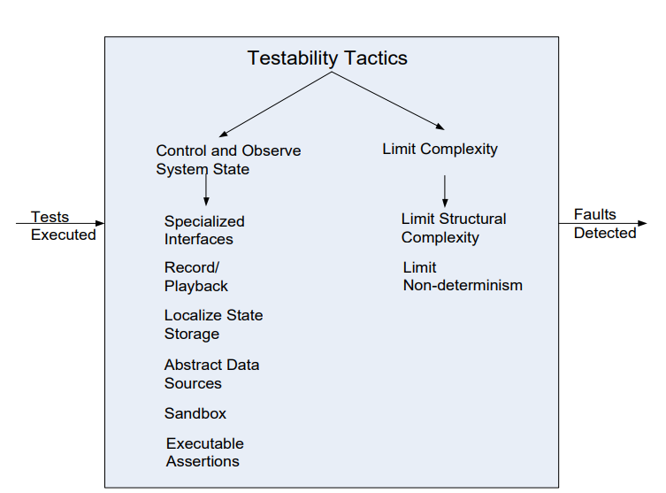

## 可测试性是什么？

- 软件的可测试性是指通过（通常是基于执行的）测试来展示其错误的难易程度。
- 可测试性是指系统在下一次测试执行中失败的概率。
- 如果系统存在错误，我们希望它能在测试过程中尽快失败。
- 要使一个系统具有可测试性，必须能够控制每个组件的输入（并可能操作其内部状态），然后观察其输出（以及可能的内部状态）。

## 可测试性策略的目标

- 可测试性策略的目标是在软件开发完成的一个增量中实现更容易的测试。
- 可测试性策略可以分为两个类别：
  - 第一个类别涉及向系统添加可控性和可观察性。
  - 第二个类别涉及限制系统设计中的复杂性。

## 可测试性策略

### 控制和观察系统状态(Control and Observe System State)

- 记录/回放(Record/Playback)：捕获通过接口传递的信息，并将其用作进一步测试的输入。
- 本地化状态存储(Localize State Storage)：为了进行测试，将系统置于任意状态时，如果该状态存储在一个单独的位置最为方便。
- 专用接口(Specialized Interfaces)
  - 通过正常执行来控制或捕获组件的变量值。
  - 一组用于设置和获取变量的方法。
  - 一个返回对象状态的报告方法。
  - 一个用于设置内部状态的重置方法。
- 沙盒(Sandbox)：将系统与真实世界隔离开来，以便进行实验。
- 可执行断言(Executable Assertions)：手动编写断言，并将其放置在所需位置，以指示程序何时以及在何处处于错误状态。

### 限制复杂性(Limit Complexity)

- 限制结构复杂性：避免或解决组件之间的循环依赖，并减少组件之间的依赖关系。
- 例如，限制继承树的深度。
- 高内聚性和松散耦合有助于可测试性。
- 限制非确定性：找出所有非确定性的来源，例如无约束的并行性，并尽可能消除它们。

:::info 测试可行性与容错性

- 测试可行性旨在更容易地显示错误。
- 容错性试图隐藏错误，并使其难以暴露。
- 这两个设计目标是否不兼容？

测试可行性和容错性是两个不同的设计目标，但并不一定是不兼容的。测试可行性旨在通过测试过程中更容易地检测和暴露错误，以便及早修复它们。容错性旨在使系统能够继续正常运行，即使在面临错误或故障的情况下也能提供可接受的性能和可靠性。

尽管两者有不同的关注点，但它们可以在系统设计中相互支持。例如，通过增加系统的容错能力，可以减少错误的发生率，从而提高测试的有效性。在设计过程中，可以采用合适的策略和技术来平衡测试可行性和容错性的需求，以确保系统在各个方面都具备良好的质量和可靠性。

:::

## 总结

- 控制和观察系统状态是测试可行性策略的主要类别。
- 复杂系统由于计算发生在庞大的状态空间中以及系统元素之间较多的相互连接，因此很难进行测试。
- 保持系统简单是另一类支持测试可行性的策略。
