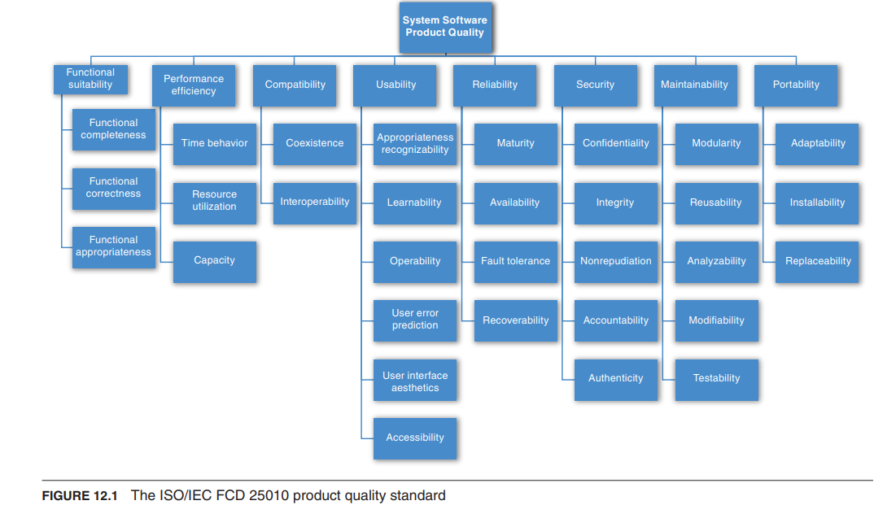

## 可移植性(Portability)

- 可移植性也是一种特殊形式的可修改性。
- 可移植性指的是将为一个平台构建的软件更改为在不同平台上运行的便捷程度。

## 开发可分发性(Development Distributability)

- 开发可分发性是指设计软件以支持分布式软件开发的质量。
- 系统是使用全球分布的团队开发的。
- 目的是最大限度减少团队之间的协调。

## 可扩展性(Scalability)

- 水平可扩展性（扩展外部）指向逻辑单元添加更多资源，例如向集群添加另一个服务器。
- 垂直可扩展性（扩展内部）指向物理单元添加更多资源，例如向计算机添加更多内存。
- 可产生可衡量的改进，而无需中断操作。

:::info 集中式与分散式

- 在集中式架构中，控制和决策集中在一个单一的中央实体或服务器上。这种方法可以提供更好的资源协调和管理，但可能会成为单点故障并限制可扩展性。
- 相比之下，分散式架构将控制和决策分布在多个实体或服务器之间。这种方法可以提供更好的容错性、可扩展性和弹性，但可能会引入协调和一致性方面的挑战。
  :::

## 部署性(Deployability)

- 部署性关注的是可执行文件如何到达主机平台以及如何被调用。
- 例如：
  - JavaScript 脚本
  - 病毒
  - 代理程序

## 可监控性(Monitorability)

- 可监控性涉及运维人员在系统执行过程中监控系统的能力。
- 例如：
  - 各个组件的运行状态
  - 平均事务处理时间
  - 队列长度

## 安全性(Safety)

- 软件安全性涉及软件避免进入会导致损害、伤害或生命丧失的状态，并在进入不良状态时进行恢复和限制损害的能力。
- 在安全性方面，架构关注的问题与可用性几乎完全相同。

## 标准的质量属性列表(Standard Lists of Quality Attributes)

