## 什么是模式(Pattern)？

- `架构模式(An architecture pattern)`是一组在实践中反复出现的设计决策的集合。
- 它具有已知的可重用性属性，并描述了一类架构。

## 架构模式(An architecture pattern)

- 模块模式
  - 分层模式
- 组件与连接器模式
  - 代理模式
  - 模型-视图-控制器模式
  - 管道-过滤器模式
  - 客户端-服务器模式
  - 对等模式
  - 面向服务的架构（SOA）模式
  - 发布-订阅模式
  - 共享数据模式
- 分配模式
  - Map-Reduce 模式
  - 多层模式

### 分层模式(Layer Pattern)

- 分层模式将软件划分为称为层的单元。
- 每个层是一组模块，提供一套协调一致的服务。
- 每个层通过`公共接口(public interface)`进行暴露。
- 使用必须是单向的。
  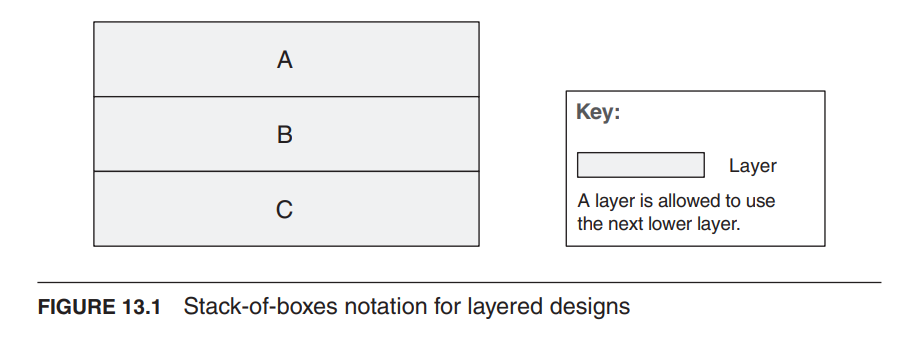

#### 分层模式解决方案

- 分层模式定义了层和层之间的单向允许使用关系。
- 约束条件(Constraints)：
  - 每个软件部件都被分配到恰好一个层中。
  - 至少有两个层。
  - 允许使用关系不应该是循环的。
- 弱点：
  - 添加层会增加系统的成本和复杂性。
  - 层会对性能产生负面影响。
- 例如下图所示的三层分层应用结构
  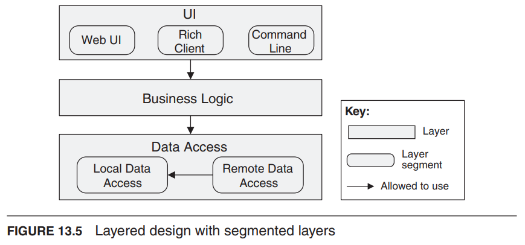

### 代理模式(Broker Pattern)

- 背景(Context)：许多系统由分布在多个服务器上的一组服务构建而成。
- 问题(Problem)：我们如何构建`分布式软件(distributed software)`，使得服务使用者不需要知道服务提供者的性质和位置？
- 解决方案(Solution)：代理模式通过插入一个`中间层(intermediary)`，称为代理，将客户端与服务提供者服务器分离开来。

#### 代理模式解决方案

- 概述：代理模式定义了一个运行时组件，称为代理，它在多个客户端和服务器之间进行通信的中介。
- 组成部分：
  - 客户端(Client)，服务的请求者
  - 服务器(Server)，服务的提供者
  - 代理(Broker)，中间层，用于定位适合客户端请求的服务器，将请求转发给服务器，并将结果返回给客户端
- 约束条件：客户端只能连接到代理。服务器只能连接到代理。
- 弱点：
  - 代理会增加客户端和服务器之间的延迟，并可能成为通信瓶颈。
  - 代理可能成为单点故障。
  - 代理可能成为安全攻击的目标。

### 模型-视图-控制器模式(Model-View-Controller Pattern)

- 背景：用户界面软件是交互式应用程序中经常修改的部分。
- 问题：如何将用户界面功能与应用程序功能分开，同时仍能响应用户输入或底层应用程序数据的更改？
  - 当底层应用程序数据发生变化时，如何创建、维护和协调多个用户界面视图？

#### 模型-视图-控制器模式解决方案

- 模型-视图-控制器（MVC）模式将应用程序功能分为三种组件：
  - 模型(Model)：包含应用程序的数据
  - 视图(View)：显示底层数据的一部分并与用户交互
  - 控制器(Controller)：在模型和视图之间进行中介，并管理状态变化的通知
- 约束条件：
  - 模型、视图和控制器必须至少有一个实例。
- 弱点：
  - 对于简单的用户界面来说，复杂性可能不值得。
- 例如下图所示为一个 MVC 模式示意图
  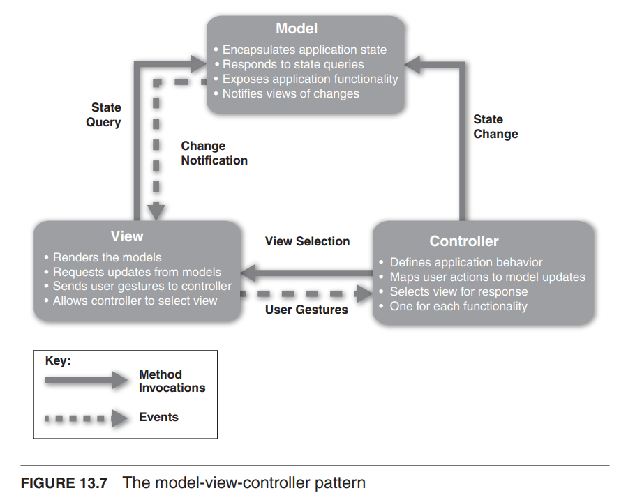

### 管道和过滤器模式(Pipe and Filter Pattern)

- 背景：流式数据处理
- 问题：如何加快数据处理速度？
- 解决方案：数据到达过滤器的输入端口后，经过转换，然后通过管道传递到下一个过滤器的输出端口。
  - 单个过滤器可以从管道中消费数据，也可以产生数据。

#### 管道和过滤器模式解决方案

- 组成部分：
  - 过滤器：一种将从其输入端口读取的数据转换为写入其输出端口的数据的组件。
  - 管道：一种将数据从一个过滤器的输出端口传递到另一个过滤器的输入端口的连接器。
- 关系：附加关系将过滤器的输出与管道的输入相关联，反之亦然。
- 约束条件：
  - 连接的过滤器必须就沿着连接管道传递的数据类型达成一致。
    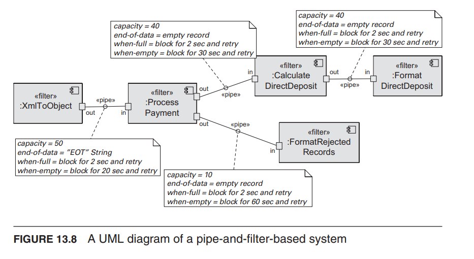

### 客户端-服务器模式(Client-Server Pattern)

- 背景：存在`共享资源和服务`，许多分布式客户端希望访问这些资源和服务，我们希望`控制对其的访问或提供服务的质量`。
- 问题：通过`集中控制`这些资源和服务来提高可用性。
- 解决方案：客户端通过请求服务器的服务进行交互。
  - 可能存在一个中央服务器或多个分布式服务器。
    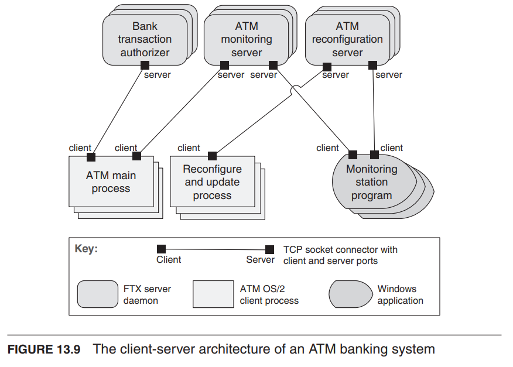

#### 客户端-服务器模式解决方案

- 弱点：
  - 服务器可能成为性能瓶颈。
  - 服务器可能成为单点故障。
  - 在系统构建之后，关于功能定位（在客户端还是服务器中）的决策往往非常复杂且更改成本高昂。

### 点对点模式(Peer-to-Peer Pattern)

- 问题：如何通过一个共同的协议将一组“相等的”分布式计算实体连接在一起，
- 使它们能够以高可用性和可扩展性组织和共享其服务？
- 解决方案：在点对点（P2P）模式中，组件作为对等体直接进行交互。所有对等体都是“相等的”。
  - 点对点通信通常是一种请求/响应的交互方式，`没有客户端-服务器模式中的非对称性`。
    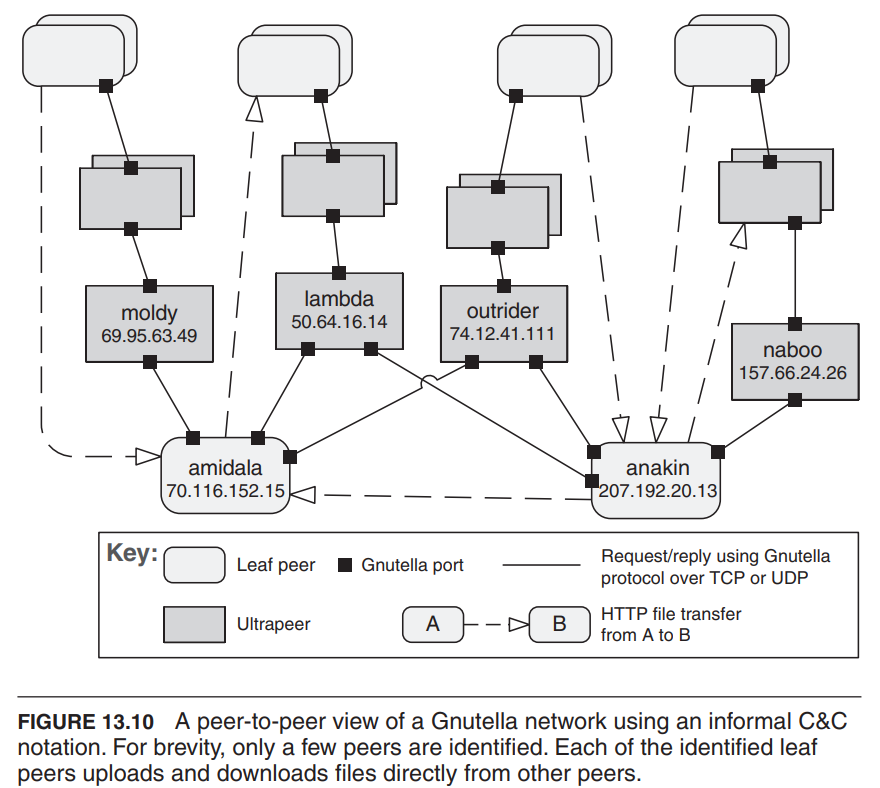

#### 点对点模式解决方案

- 弱点：
  - 管理数据一致性、数据/服务的可用性、备份和恢复等都更加复杂。
  - 较小的点对点系统可能无法实现性能和可用性等质量目标。

### 面向服务的体系结构模式(Service Oriented Architecture Pattern)

- 问题：如何支持在不同平台上运行、使用不同实现语言编写、由不同组织提供并分布在互联网上的分布式组件之间的互操作性？
- 解决方案：面向服务的体系结构（SOA）模式描述了一组提供和/或消费服务的分布式组件。
  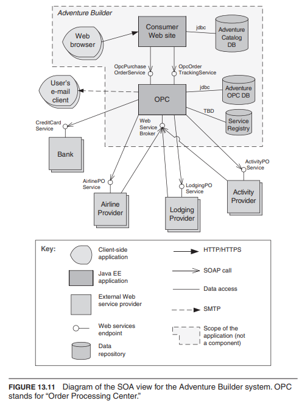

#### 面向服务的体系结构模式解决方案

- 组成部分：
  - 组件：
    - 服务提供者：通过已发布的接口提供一个或多个服务。
    - 服务消费者：直接或通过中间件调用服务。
    - 企业服务总线（Enterprise Service Bus, ESB）：作为`中间件元素`，可以在服务提供者和消费者之间路由和转换消息。
    - 服务注册表：供应商可使用注册表注册其服务，并在运行时由消费者发现服务。
- 连接器：
  - SOAP 连接器：使用 SOAP 协议进行 Web 服务之间的同步通信，通常通过 HTTP 进行。
  - REST 连接器：依赖于 HTTP 协议的基本请求/响应操作。
  - 异步消息连接器：使用消息系统进行点对点或发布-订阅的`异步消息交换(asynchronous message exchanges)`。
- 弱点：
  - 中间件存在与性能相关的开销，可能成为性能瓶颈，并且通常不提供性能保证。

### 发布-订阅模式(Publish-Subscribe Pattern)

- 问题：如何在生产者和消费者之间传递消息，使它们对彼此的身份甚至存在都毫不知情？
  
  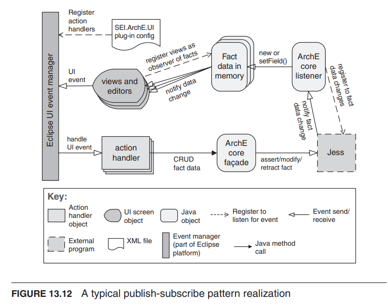

#### 发布-订阅模式优缺点

- 发布-订阅模式的优势
  - 非常适合移动应用程序、普适计算和分布式嵌入式系统
  - 鲁棒性 - 发布者或订阅者的故障不会导致整个系统崩溃
  - 可扩展性 - 适用于构建由大量实体组成的分布式应用程序
- 发布-订阅模式的缺点
  - 可靠性
    - 无法对代理服务器向订阅者传递内容提供强有力的保证。发布者发布事件后，假设所有相应的订阅者都将收到该事件。
  - 当订阅者和发布者过载代理服务器时，可能会在代理服务器中出现瓶颈。（可以通过负载均衡技术来解决）

### 共享数据模式(Shared-Data Pattern)

- 背景：各种计算组件需要共享和操作大量数据。这些数据`不仅属于其中任何一个组件`。
- 问题：系统如何存储和操作被多个独立组件访问的`持久`数据？
- 解决方案：在共享数据模式中，交互主要通过多个数据访问者和至少一个共享数据存储之间的持久数据交换来实现。
  - 交换可以由访问者或数据存储发起。连接器类型是数据读取和写入。

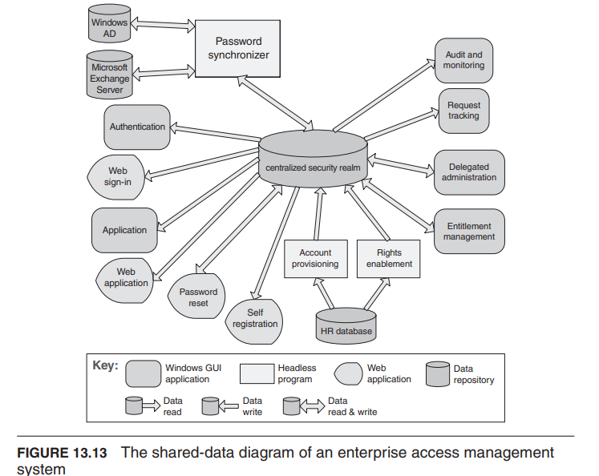
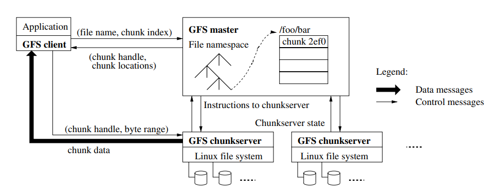

#### 共享数据模式解决方案

- 约束条件：数据访问者只与数据存储交互。
- 弱点：
  - 共享数据存储可能成为性能瓶颈。
  - 共享数据存储可能成为单点故障。
  - 数据的生产者和消费者可能耦合紧密。例如，在数据库中需要并发控制。

### MapReduce（分布式计算模型）

- 源自 Google，[OSDI'04]
- 一种简单的编程模型
- 用于大规模数据处理
  - 利用大量的通用计算机
  - 分布式执行过程
  - 提供高可用性
    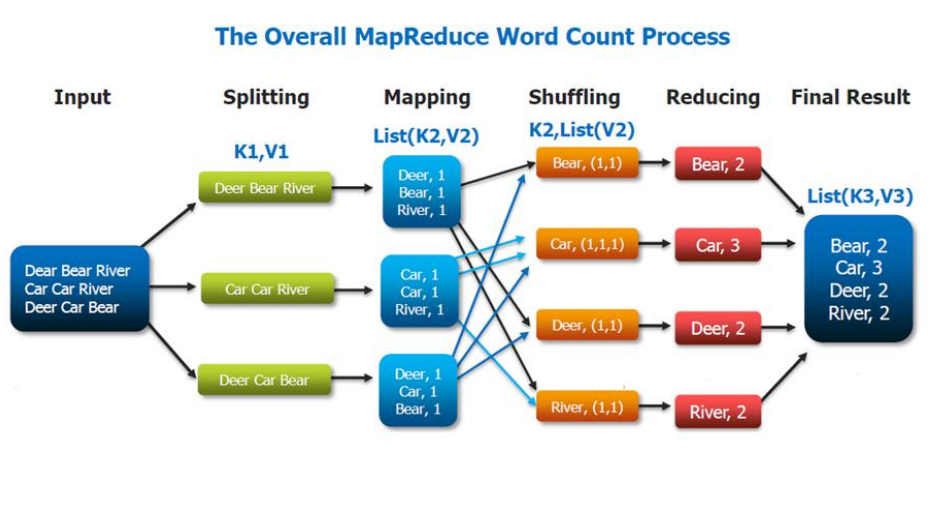
- 详见[第一个 MapReduce 程序——WordCount](https://songlee24.github.io/2015/07/29/mapreduce-word-count/)

:::info HDFS 和 GFS

- HDFS(Hadoop 分布式文件系统)是根据 GFS(Google 文件系统)的原理开发的,是 GFS 的简化版。
- 不同点：
  1. GFS 支持多客户端并发 Append 模型,允许文件被多次或者多个客户端同时打开以追加数据;HDFS 文件只允许一次打开并追加数据,客户端先把所有数据写入本地的临时文件中,等到数据量达到一个块的大小(通常为 64MB),再一次性写入 HDFS 文件。
  2. GFS 采用主从模式备份 Master 的系统元数据,当主 Master 失效时,可以通过分布式选举备机接替,继续对外提供服务;而 HDFS 的 Master 的持久化数据只写入到到本机,可能采用磁盘镜像作为预防,出现故障时需要人工介入
  3. GFS 支持数据库快照,而 HDFS 不支持
  4. GFS 写入数据时,是实时写入到物理块;而 HDFS 是积赞到一定量,才持久化到磁盘。

:::

#### 本地化问题

- 主节点调度策略
  - 向 GFS 请求输入文件块副本的位置
  - Map 任务通常按照 64MB（等于 GFS 块大小）划分
  - 调度 Map 任务时，使 GFS 输入块副本位于同一台机器或同一机架上
- 影响
  - 成千上万台机器以本地磁盘速度读取输入
  - 若没有本地化策略，机架切换将限制读取速率

#### 容错性

- 响应式方式
  - 工作节点故障
    - 心跳机制，主节点定期向工作节点发送检查请求
    - 如果工作节点没有响应，则判定为故障节点
    - 如果工作节点的处理器故障，该节点的任务将重新分配给其他工作节点。
  - 主节点故障
    - 主节点定期写入检查点（checkpoint）
    - 可以从最后一个检查点的状态启动另一个主节点
    - 如果最终主节点崩溃，作业将被中止
- 主动方式（冗余执行）
  - 解决“拖延者”问题（执行缓慢的工作节点）
  - 其他任务占用机器资源
  - 坏的硬盘传输数据非常慢
  - 奇怪的问题：处理器缓存被禁用（!!）
  - 当计算接近完成时，重新安排正在进行中的任务
  - 无论是主要执行还是备份执行完成，都将其标记为已完成

#### 需要强调的要点

- 在 map 完成之前，reduce 不能开始执行。
- 主节点必须传达中间文件的位置信息。
- 任务调度基于数据的位置。
- 如果 map 工作节点在 reduce 完成之前任何时候失败，任务必须完全重新运行。
- MapReduce 库为我们完成了大部分繁重的工作！

### 多层模式

- 许多系统的执行结构都组织为一组软件和硬件的逻辑分组。
- 每个分组称为一个层级。
- 层（Layer）和层级（Tier）之间的区别是什么？

:::info 层（Layer）和层级（Tier）
在软件架构中，"层"（Layer）通常用于描述系统内部的组织结构，涉及组件之间的逻辑关系和功能划分。例如，常见的三层架构模式包括表示层（Presentation Layer）、业务逻辑层（Business Logic Layer）和数据访问层（Data Access Layer）。

而"层级"（Tier）则更多地涉及系统的物理分布和部署。它指的是将系统的不同组件或功能划分到不同的硬件或网络节点上。例如，常见的三层架构模式中，可以将表示层部署在客户端设备上，业务逻辑层和数据访问层部署在服务器上，形成客户端-服务器的层级结构。

简而言之，"层"强调的是软件组织和功能划分，而"层级"强调的是物理分布和部署结构。
:::

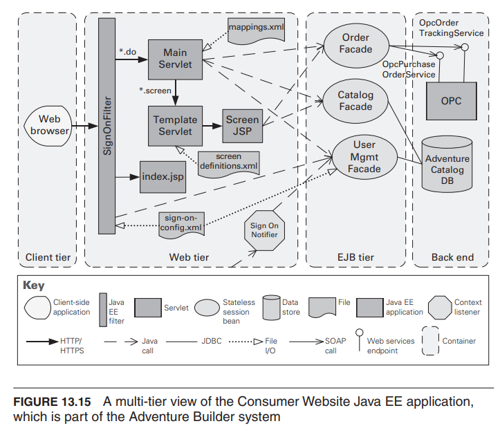

## 策略和模式之间的关系

### 模式是由策略构建的

- 如果说模式是分子，那么策略就是原子。
- 例如，MVC（模型-视图-控制器）利用了以下策略：
  - 增加语义一致性
  - 封装
  - 使用中介者（intermediary）

策略是用来解决特定问题的单个行动或技术，而模式是一种更高级别的设计解决方案，它将多个策略组合在一起，以解决更复杂的问题。模式提供了一种通用的架构和组织原则，而策略则提供了具体的实现细节。因此，策略可以被视为构成模式的组成要素。

### 策略增强模式

- 模式解决了特定的问题，但在其他方面可能存在弱点。
- 以代理模式为例
  - 可能存在性能瓶颈
  - 可能存在单点故障
- 使用策略，例如
  - 增加资源将有助于提高性能
  - 维护多个副本将有助于提高可用性

策略可以用来增强模式，解决模式在某些方面的限制或弱点。通过应用适当的策略，可以改善模式的性能、可用性或其他质量属性，并使其更加适应实际需求。

### 策略和相互作用

- 每个策略都有其优点（存在的原因）和缺点 - 副作用。
- 使用策略可以帮助减轻缺点。
- 但没有什么是免费的，一个常见的检测故障的策略是 Ping/Echo（ping/echo），Ping/Echo 的常见副作用包括：

  - 安全性：如何防止 Ping 洪水攻击？
  - 性能：如何确保 Ping/Echo 的性能开销较小？
  - 可修改性：如何将 Ping/Echo 添加到现有架构中？
    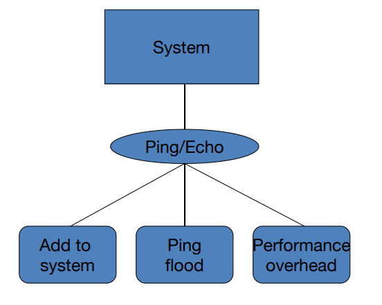

- 一个用于解决性能副作用的策略是“增加可用资源”（Increase Available Resources）。增加可用资源的常见副作用包括：

  - 成本：增加资源会带来额外的成本。
  - 性能：如何高效利用增加的资源？
    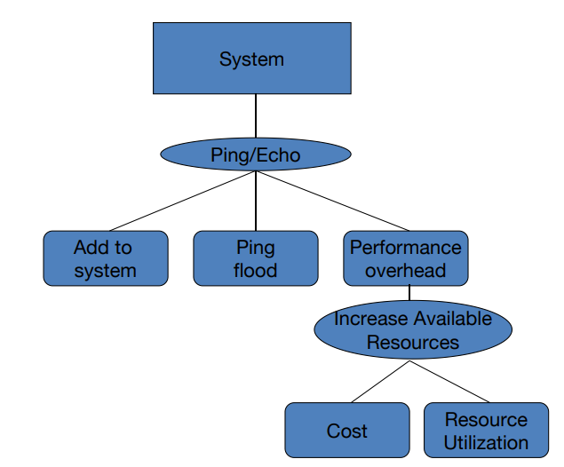

- 一个用于解决资源高效利用副作用的策略是“调度策略”（Scheduling Policy）。调度策略的常见副作用包括：
  - 可修改性：如何将调度策略添加到现有架构中？
  - 可修改性：如何在将来更改调度策略？
    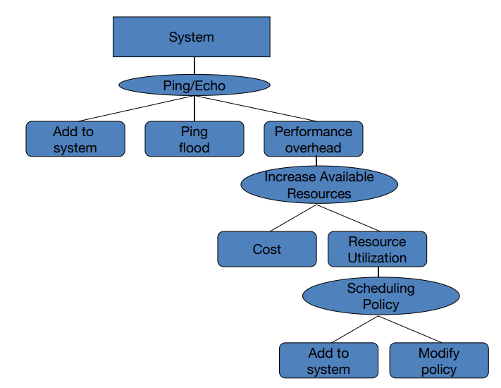

:::info 这样的递归何时结束？

- 每次使用策略都会引入新的问题。
- 每个新问题会导致添加新的策略。
- 我们是否处于无限的进展中？
- 不是的。最终，每个策略的副作用变得足够小，可以忽略不计。

:::

## 总结

- 架构模式是在实践中反复出现的设计决策的集合。
- 架构模式具有已知的属性，可以进行重复使用，并描述了一类架构。
- 策略比模式更简单。
- 模式对于真实系统来说是不完全的，因此需要通过策略进行补充。
  - 当满足特定系统的需求时，对模式的补充就会结束。
