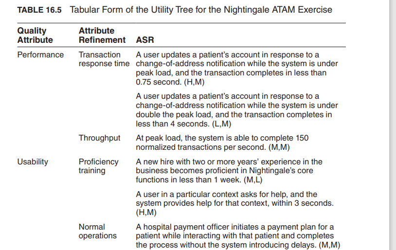

## 具有架构重要性的需求(Architecturally Significant Requirement ,ASR)

- 并非所有需求都是平等的。
- 具有架构重要性的需求（ASR）是对架构产生深远影响的需求。
- 我们如何找到这些需求呢？

## 捕捉架构重要性需求的方法

- 从需求文档中获取
- 通过与利益相关者进行面谈
- 通过理解业务目标
- 在效用树中(In Utility Tree)

### 具有架构重要性的需求和需求文档

- 寻找候选的具有架构重要性的需求时，需求文档是一个显而易见的地方。
- 需求应该在需求文档中！
- 不幸的是，实际情况通常并非如此。

:::info 不要抱太大希望

- 许多项目没有创建或维护详细、高质量的需求文档。
- 标准需求更注重功能而非质量属性。
- 架构是由质量属性需求驱动的，而不是功能。
- 大多数需求规格对架构没有影响。
- 质量属性通常被捕捉得不够充分，例如：
  - "系统应该具有模块化"
  - "系统应该具有良好的可用性"
  - "系统应该满足用户的性能期望"
- 对于架构师来说，很多有用的信息甚至都不在最好的需求文档中
  - 具有架构重要性的需求通常源于开发组织内部的业务目标
    :::

### 从利益相关者那里收集具有架构重要性的需求(Gathering ASRs from Stakeholders)

- 利益相关者通常不知道他们希望系统具备哪些质量属性（QAs）
  - 如果你坚持要求定量的质量属性需求，你很可能得到一些随意的数字。
- 至少其中一些需求将非常难以满足。
- 架构师通常对于什么样的质量属性是合理的有很好的想法。
- 与利益相关者进行面谈是了解他们的知识和需求的最可靠的途径。
  - 利益相关者面谈的结果应包括：
    - 架构驱动因素的清单
    - 利益相关者（作为一个群体）优先考虑的一组质量属性场景。

#### 质量属性研讨会(Quality Attribute Workshop, QAW)

- 质量属性研讨会是一种以利益相关者为中心(stakeholder-focused)的促进方法，旨在在软件架构完成之前生成、优先考虑和完善质量属性场景(quality attribute scenarios)。
- QAW 步骤
  1. QAW 演示和介绍。
     - QAW 的组织者描述 QAW 的动机，并解释每个步骤。
  2. 业务/任务介绍。
     - 代表业务关注点的利益相关者介绍系统的业务背景、广泛的功能需求、限制条件和已知的质量属性需求。
     - 质量属性主要源自业务/任务需求。
  3. 架构计划介绍。
     - 架构师将介绍系统的架构计划。
     - 这让利益相关者了解当前的架构思路。
  4. 确定架构驱动因素。
     - 主持人将在第 2 步和第 3 步期间汇总的关键架构驱动因素清单与利益相关者共享。
     - 架构驱动因素包括总体需求、业务驱动因素、限制条件和质量属性。
     - 向利益相关者征求对架构驱动因素的澄清、补充、删除和修正，并达成一致意见。
  5. 场景头脑风暴。
     - 每个利益相关者表达与系统相关的关注点的场景。
     - 主持人确保每个场景具有明确的刺激和响应。
     - 至少为第 4 步列出的每个架构驱动因素制定一个代表性场景。
  6. 场景整合。
     - 在合理的情况下，将相似的场景整合在一起。
  7. 场景优先级排序。
     - 将每个利益相关者分配的选票数量设为场景总数的 30%。
     - 每个利益相关者将他们的选票分配给场景。
  8. 场景细化。
     - 对排名靠前的场景进行细化和详述。
     - 主持人帮助利益相关者将场景按照六个部分的形式进行整理。

### 在一个效用树中捕捉 ASR（架构重要性需求）

一个 ASR 必须具备以下特点：

- 对架构产生深远影响
  - 如果包含此需求，很可能会导致与不包含此需求时完全不同的架构。
- 具有高商业或任务价值
  - 如果架构要满足此需求，它必须对重要的利益相关者具有高价值。

#### 效用树

- 将所有 ASR 记录在一个地方的方法。
- 根据对架构的影响和商业或任务价值确定每个 ASR 的优先级。
- ASR 以场景的形式进行捕捉。
- 树的根是一个名为“效用（Utility）”的占位符节点。
- 树的第二层包含广泛的质量属性类别。
- 树的第三层对这些类别进行细化。
- 叶节点是具体的质量属性场景。
- 如下图所示是一个效用树的例子，ASR 最末尾的括号分别表示这个 ASR 的商业价值和架构影响，用`H(High)`、`M(Medium)`、`L(Low)`来分别表示

- 获得（H，H）评级的 ASR 是最需要关注的。
  - 大量获得此评级的 ASR 可能会引起担忧：系统是否可行？
- 利益相关者可以审核效用树，以确保他们的关注点得到解决。

### 将这些方法结合起来的方式

- 如何将需求文档、利益相关者面谈、质量属性研讨会和效用树结合起来使用？
  - 如果在需求收集过程中忽视了重要的利益相关者，可以使用面谈或质量属性研讨会。
  - 使用质量属性效用树作为质量属性研讨会产生的场景的存储库。

## 总结

- 架构由架构重要性需求（ASRs）驱动：
  - 这些需求对架构产生深远影响。
- ASRs 可以通过以下方式捕获：
  - 从需求文档中捕获，
  - 通过与利益相关者进行面谈，
  - 或者通过进行质量属性研讨会来捕获。
- 一个有用的质量属性需求的表示形式是效用树。
- 效用树有助于以结构化形式捕捉这些需求。
- 场景按优先级排序。
- 这个按优先级排序的集合定义了您作为架构师的“指令”。
