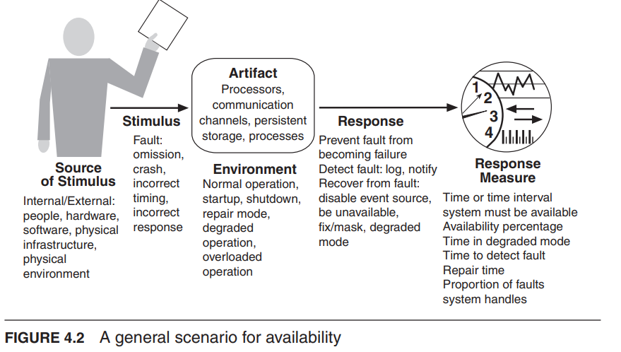

## 架构与需求

系统需求可以分为以下几类：

- 功能需求(Functional Requirements)：说明系统必须完成的功能、运行时行为或对运行时刺激的反应。
- 质量属性需求(Quality Attribute Requirements)：对功能需求进行限定，例如功能执行的速度要求、对错误输入的容错性要求等。
- 约束(Constraints)：约束是一个没有自由度的设计决策。

### 功能性(Functionality)

- 功能性是系统按照其预期进行工作的能力。
- 功能性与架构有着奇特的关系：
  - 功能性并不决定架构；

### 质量属性需求(Quality Attribute Requirements)

#### 质量需求的考虑(Quality Attribute Considerations)

- 如果一个功能性需求是“当用户按下绿色按钮时，选项对话框出现”：
  - `性能(performance qualification)`要求可能描述对话框出现的速度；
  - `可用性要求(availability qualification)`可能描述这个功能会出现故障的频率以及修复的速度；
  - `易用性要求(usability qualification)`可能描述学习这个功能的简易程度。

:::info 两类质量属性

- 描述系统在运行时的一些属性
  - 可用性、性能、易用性、安全性
- 描述系统开发过程中的一些属性
  - 可修改性、可测试性

:::

- 在之前关于质量属性的讨论中存在一些问题：
  - 不可测试的定义(Untestable definitions)。对某个属性提供的定义无法进行测试。说一个系统将是“可修改的”是没有意义的。
  - 重叠的问题(Overlapping concerns)。系统故障是由于拒绝服务攻击还是与可用性、性能、安全性或可用性相关？
- 解决这些问题（不可测试的定义和重叠的问题）的方法是使用质量属性场景来描述质量属性。

#### 指定质量属性需求(Specifying Quality Attribute Requirements)

- 我们使用一种通用形式，将所有质量属性需求都指定为场景。
- 我们对质量属性场景的表示包括以下几个部分：

  1. 刺激（Stimulus）。刺激是一种在到达系统时需要产生响应的条件。
  2. 刺激源（Source of stimulus）。刺激源是某个实体（人、计算机系统或其他执行器），它产生了刺激。
  3. 响应（Response）。响应是作为刺激到达后所进行的活动。
  4. 响应度量（Response measure）。当响应发生时，应该以某种方式进行度量，以便对需求进行测试。
  5. 环境（Environment）。刺激发生在特定条件下。系统可能处于超负荷状态、正常运行状态或其他相关状态。
  6. 构件（Artifact）。这可以是一组系统、整个系统或其中的某个部分。某个构件被刺激。

- `通用的质量属性场景(General quality attribute scenarios)`与具体的系统无关，可能适用于任何系统。
- `具体的质量属性场景(Concrete quality attribute scenarios)`则针对具体考虑的系统而定。

#### 通过策略实现质量属性

- 架构师可以使用一系列基本的设计技术来实现质量属性响应。
- 我们将这些基本设计技术称为架构设计策略。
- 策略和设计模式一样，是架构师多年来一直在使用的技术。
- 我们并不是发明策略，而是简单地捕捉架构师在实践中所做的事情。
- 例如资源调度就是用于性能的一种策略：
  - 给定条件：发布时间，每个任务的工作量
  - 过程：确定每个任务何时执行
  - 目标：最小化任务的平均完成时间

:::info 策略 vs. 架构模式

- 策略是针对单个质量属性的设计决策。
- 策略不考虑质量属性之间的权衡。
- 架构模式可以被看作是策略的“套餐”，其中考虑了质量属性之间的权衡。

:::

- 我们需要对策略进行隔离、分类和描述。为什么要这样做？
  - 设计模式往往很复杂，并且很难直接应用；架构师需要对它们进行修改和适应。
  - 如果没有现有的模式来实现架构师的设计目标，策略可以让架构师从“首要原则”构建设计片段。
  - 通过对策略进行分类，我们可以在改进特定质量属性时选择多种策略。选择使用哪些策略取决于诸如实施成本等因素。

#### 指导质量设计决策

- 架构设计是一种系统化的设计决策方法。
- 我们将设计决策分为以下几类：
  1. 职责分配(Allocation of responsibilities)
  2. 协调模型(Coordination model)
  3. 数据模型(Data model)
  4. 资源管理(Management of resources)
  5. 架构元素之间的映射(Mapping among architectural elements)
  6. 绑定时间决策(Binding time decisions)
  7. 技术选择(Choice of technology)

##### 职责分配

- 包括职责分配的决策内容：

确定职责，包括基本系统功能、架构基础设施和满足质量属性。
确定如何将这些职责分配给非运行时和运行时元素（即模块、组件和连接器）。

##### 协调模型

- 关于协调模型的决策包括：
  - 确定系统中需要进行协调或禁止协调的元素。
  - 确定协调的属性，例如及时性、实时性、正确性和一致性。
  - 选择实现这些属性的通信机制。
    - 有状态 vs 无状态，
    - 同步 vs 异步，
    - 有保证 vs 无保证的传递。

##### 数据模型

- 关于数据模型的决策包括：
  - 选择主要的数据抽象、它们的操作和属性。
  - 数据一致解释所需的元数据。
  - 数据的组织方式，即决定数据是保存在关系型数据库、对象集合还是两者兼有。

##### 资源管理

- 资源管理的决策包括：
  - 确定需要管理的资源，并确定每个资源的限制。
  - 确定哪个系统元素管理每个资源。
  - 确定资源共享的方式以及在资源争用时采用的策略。
  - 确定饱和对不同资源的影响。

##### 架构元素之间的映射

- 有用的映射包括：
  - 模块和运行时元素之间的映射。
  - 将运行时元素分配给处理器。
  - 将数据模型中的项分配给数据存储。
  - 将模块和运行时元素映射到交付单元。

##### 绑定时间决策

- 其他类别中的决策都与绑定时间决策相关。此类绑定时间决策的示例包括：
  - 构建时间 vs. 运行时间
  - 对于协调模型的选择，您可以设计运行时协议的协商。
  - 对于资源管理，您可以设计一个系统，在运行时接受新的外设设备插入。

##### 技术选择

- 技术选择决策涉及：
  - 决定哪些技术可用来实现在其他类别中做出的决策。
  - 确定支持该技术的工具（IDE、模拟器、测试工具等）是否足够。
  - 确定对该技术的内部熟悉程度和外部支持程度（例如课程、教程、示例、承包商的可用性）。
  - 确定选择某项技术的副作用，如所需的协调模型或受限的资源管理机会。
  - 确定新技术是否与现有技术堆栈兼容。

## 总结

- 系统的需求可以分为三类：
  1. 功能需求。通过在设计中包含适当的职责来满足这些需求。
  2. 质量属性需求。通过架构的结构和行为来满足这些需求。
  3. 约束条件。约束条件是已经确定的设计决策。
- 为了表达质量属性需求，我们使用质量属性场景。场景的组成部分包括：
  1. 刺激源。
  2. 刺激。
  3. 环境。
  4. 构件。
  5. 响应。
  6. 响应度量。
- 架构策略是影响质量属性响应的设计决策。策略的重点是单个质量属性响应。
- 架构模式可以被看作是策略的“包装”。
- 架构设计决策的七个类别包括：
  1. 职责分配
  2. 协调模型
  3. 数据模型
  4. 资源管理
  5. 架构元素之间的映射
  6. 绑定时间决策
  7. 技术选择
