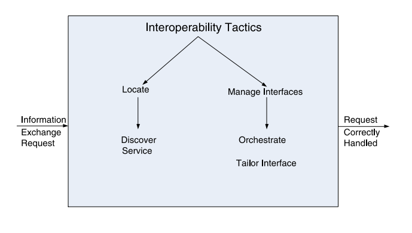
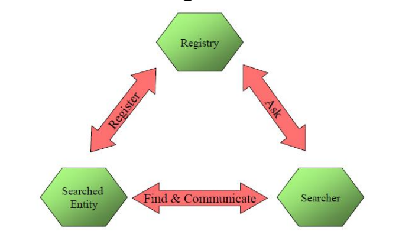
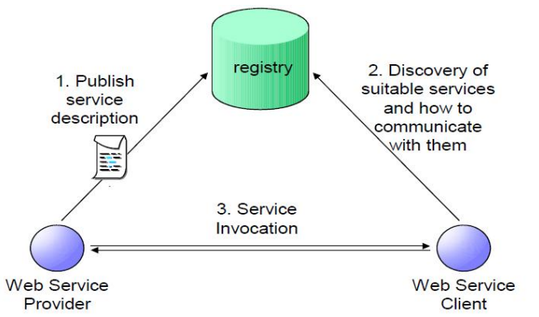
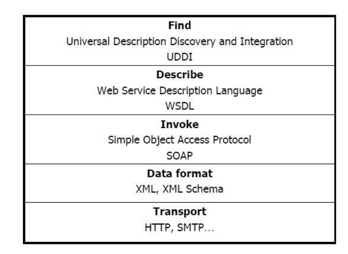

## 什么是互操作性？

- 互操作性是指在特定环境下，两个或多个系统能够通过接口有意义地交换信息的程度。
- 对于系统的互操作性的任何讨论都需要明确指出与谁以及在什么情况下进行交互。
- 语法互操作性是指交换数据的能力。
- 语义互操作性是指解释交换的数据的能力。
- 实现互操作性的两种视角：
  - 在了解外部系统接口的基础上，将该知识设计到系统中。
  - 在没有了解其他系统的情况下，以更通用的方式设计系统以实现互操作性。

### 动机

- 系统提供一个服务，供一组未知系统使用，例如 Google 地图。
- 系统由现有系统构建而成，例如：
  - 产生对所感知内容的表示
  - 解释数据
  - 处理原始数据
  - 感知环境

### 互操作性的两个重要方面

- 发现。服务的使用者必须发现服务的位置、身份和接口。
- 处理响应。有三种可能性：
  - 服务向请求者报告返回结果。
  - 服务将其响应发送给另一个系统。
  - 服务向任何感兴趣的方发送广播响应。

:::info SOAP 和 REST

- 两种技术选项，用于实现基于 Web 的应用程序之间的互操作性。
- SOAP 在 SOA 系统中与一组协议一起使用。
  - 服务描述和发现，例如 WSDL、UDDI。
  - 服务组合，例如 BPEL。
- SOAP 更复杂，用于交换带有结构化数据的消息，而 REST 更简单，用于小型消息。

:::

## 互操作性的目标和策略

- 为了使两个或多个系统能够有意义地交换信息，它们必须：
  - 了解彼此。这就是定位策略(locate tactic)的目的。
  - 以语义上有意义的方式交换信息。这就是管理接口策略(manage interfaces tactics)的目的。交换的两个方面是：
    - 按正确的顺序提供服务。
    - 将一个参与者产生的信息修改为第二个参与者可接受的形式。

### 定位

- 服务发现(Service Discovery)：通过搜索来定位一个服务
- 有许多服务发现机制：
  - 用于 Web 服务的 UDDI
  - 用于 Java 对象的 Jini
  - 通用即插即用（Universal plug-and-play，UPnP）中使用的简单服务发现协议（SSDP）
  - DNS 服务发现（DNS-SD）
  - 蓝牙服务发现协议（SDP）

:::info 服务发现的必要条件

- 搜索者希望找到被搜索的实体，而被搜索的实体也希望被找到。
- 被搜索的实体必须具有标识符。
- 搜索者必须获取足够的标识符来识别被搜索的实体。

:::

#### 搜索方法(Searching Method)——主动搜索

- 泛洪/广播请求(Flood/Broadcast request)
  - 向每个实体询问并等待回答
  - 示例
    - 在位置区域进行寻呼以找到移动终端
    - DHCP 发现：客户端在本地子网上进行广播，以找到可用的服务器以获取 IP 地址
  - 对于搜索者来说，高效且资源消耗较少
  - 对于被搜索的实体来说，资源消耗较低
  - 但对于环境来说，会造成干扰和资源消耗。
- 连续请求(Successive request)：
  - 逐个询问实体并进行匹配。
  - 如果没有匹配项，则继续下一个直到找到匹配项。
  - 对于搜索者来说，效率较低且资源消耗较高。
  - 但对于环境来说，干扰较少且资源消耗较少。
- 连续/定期广告(Continuous/periodical advertisement)：
  - 连续或定期发布广告，以便每个搜索者都能注意到并做出响应。
  - 对于被搜索的实体来说，效率高但资源消耗较高。
  - 对于搜索者来说，资源需求较低。
  - 对于环境来说，干扰和资源消耗较高。
- 新实体到达时的广告(Advertisement upon arrival of new entity)：
  - 例如，当有新人进入大厅时自我介绍。
  - 需要在新实体到达时进行检测机制。
  - 对于被搜索的实体来说，资源消耗较低。
  - 对于搜索者来说，资源需求较低。
  - 对于环境来说，干扰和资源消耗较少。

#### 搜索方法——注册(Searching Method Registration)

- 引入“中间人” - 注册表
  - 被搜索的实体向注册表注册
  - 搜索者可以通过注册表获取信息并找到被搜索的实体
- 示例
  - 服务提供者在 UDDI 注册表中注册其 Web 服务，可以被服务请求者搜索和找到
- 这种方法对搜索者和被搜索者的资源消耗较低，对环境的干扰也较少，但前提是注册表必须可用、可靠和正确。
  

:::info Web 服务与架构

- 它描述了可以在任何网络（例如互联网）上找到和调用的计算功能。
- 它代表了一个自描述、自包含的应用程序。
- 它被设计用于被其他程序或应用程序使用，而`不是人类使用`。

:::

#### UDDI 注册表(UDDI Registries)

- UDDI 注册表网络类似于域名系统（DNS）的网络结构。
- 所有的 UDDI 注册表之间交换信息。
- 访问一个注册表可以获取所有注册表中包含的信息。

### 管理接口(Manage Interface)

- 编排（Orchestrate）：使用控制机制来协调、管理和顺序执行服务的调用。

  - 当系统需要以复杂的方式相互交互以完成复杂任务时，使用编排。
  - 编排可以协调多个服务的执行顺序，确保它们按照特定的逻辑和时间顺序进行调用。

- 定制接口（Tailor Interface）：向接口添加或移除能力，例如翻译、缓冲或数据平滑处理。
  - 定制接口允许根据需要定制接口的功能，以满足特定的业务需求。
  - 可以根据不同的使用情境对接口进行配置，以提供符合要求的数据处理和传输功能。

## 总结

- 互操作性是指系统能够有效地交换信息的能力。
- 实现互操作性涉及相关系统相互定位，然后管理接口以使它们能够交换信息。
