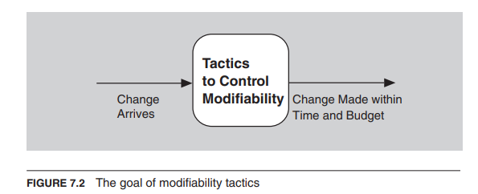
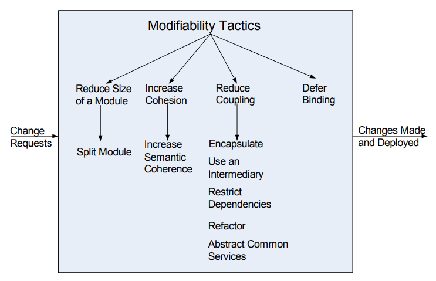
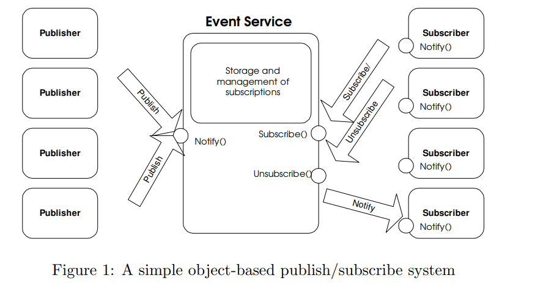
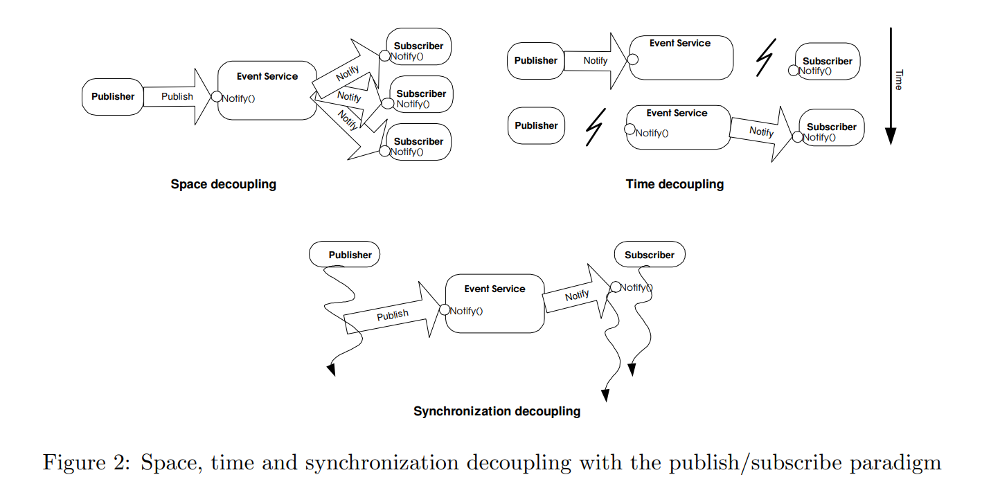

## 什么是可修改性（Modifiability）？

- 可修改性涉及变化，我们对它的兴趣在于变化的成本和风险。
- 为了规划可修改性，架构师必须考虑四个问题：
  - 什么可以改变？
  - 变化的可能性有多大？
  - 变化何时发生，由谁进行？
  - 变化的成本是多少？

### 什么可以改变

- 系统的功能
- 平台，即硬件、操作系统和中间件
- 系统运行的环境
  - 必须与之互操作的系统
  - 用于通信的协议
- 容量
  - 支持的用户数量
  - 同时操作的数量

### 变化何时发生，由谁进行？

- 在实施过程中可以进行的更改：
  - 通过修改源代码进行实施
  - 通过选择库进行构建
  - 通过参数设置、插件等进行执行
- 更改也可以由以下人员进行：
  - 开发人员
  - 最终用户
  - 系统管理员

### 变化的成本是多少？

- 包括两种类型的成本：
  - 引入机制以使系统更具可修改性的成本
  - 使用这些机制进行修改的成本

## 可修改性策略的目标

- 控制进行变更的复杂性
- 控制进行变更的时间和成本
  

## 可修改性策略

### 减小模块的大小

- 分割模块：如果要修改的模块包含大量功能，修改的成本可能会很高。
- 将模块细分为几个较小的模块应该会降低未来变更的平均成本。

### 增加内聚性

- 增加语义连贯性：如果模块中的职责 A 和 B 不具有相同的目的，它们应该放置在不同的模块中。
- 这可能涉及创建一个新的模块，或者将职责移动到现有的模块中。

### 减少耦合性

- 什么是耦合性？
  - 如果两个模块的职责重叠，一个变更可能会同时影响它们
  - 耦合性通过这种重叠来衡量，即修改一个模块将会传播到另一个模块的概率
  - 高耦合性是可修改性的敌人。
- 减少耦合性的方法：
  - 封装：封装为模块引入了一个明确的接口。该接口包括一个 API 及其相关的职责。
  - 使用中间层：如果职责 A 和职责 B 之间存在依赖关系（例如，首先执行 A 需要执行 B），可以通过使用一个中间层来打破依赖。
  - 使用[发布/订阅模型 (Publish/Subscribe model)](#发布订阅模型-publishsubscribe-model)
  - 限制依赖关系：限制一个模块与其交互或依赖的模块。
    - 通过限制模块的可见性和授权来实现。
    - 例如，
      - 一个层次结构允许访问其底层的模块。

### 延迟绑定

- 通常情况下，我们可以在生命周期的后期绑定值，这样效果更好。
- 如果我们设计的构件内置了灵活性，那么利用这种灵活性通常比手动编码进行特定更改要便宜。
- 然而，为了实现这种延迟绑定的机制往往更加昂贵。

## 发布/订阅模型 (Publish/Subscribe model)

### 发布/订阅模型的动机

- 传统的客户端/服务器通信模型（采用 RPC、消息队列等）
- 同步、紧密耦合的请求调用。-对于分布式应用程序，特别是对于广域网和移动环境，非常受限制。-当节点/链路故障时，系统会受到影响。 必须构建容错性以支持此功能。
- 需要更灵活、解耦的通信方式，提供异步机制。

### 什么是发布/订阅系统？

- 发布/订阅系统是一种通信范式，通过解耦时间、空间和同步等通信实体，为（分布式）系统提供自由。
- 它是一个异步、匿名和松散耦合的事件服务系统。
- 具有在动态环境中快速适应的能力。

### 发布/订阅系统的关键组件

- 发布者(Publishers)：发布者生成事件数据并发布它们。
- 订阅者(Subscribers)：订阅者提交他们的订阅，并处理接收到的事件。
- 发布/订阅服务(P/S service)：它是一个中介/代理，负责从发布者到感兴趣的订阅者过滤和路由事件。

- 提供了在时间、空间和同步上的解耦
  

### 发布/订阅架构的分类

- 集中式代理模型(Centralized Broker model)
  - 由多个发布者和多个订阅者以及集中式代理/代理组成（代理之间相互交互的叠加网络）。
  - 订阅者/发布者将联系一个代理(Broker)，不需要了解其他代理的存在。
  - 例如，CORBA 事件服务、JMS 等。
- 对等模型(Perr-to-peer model)
  - 每个节点可以是发布者、订阅者或代理。
  - 订阅者直接订阅发布者，发布者直接通知订阅者。因此，它们必须保持彼此的信息。
  - 本质上较为复杂，采用了 DHT（分布式哈希表）和 CHORD 等机制来定位网络中的节点。
  - 例如，Java 分布式事件服务。

### P/S 中间件服务实现的关键功能

- 事件过滤（事件选择）
  - 选择对给定事件表示兴趣的订阅者集合的过程。
  - 订阅信息存储在内存中，当发布者发布新事件时进行搜索。
- 事件路由（事件传递）
  - 将已发布的事件传递给所有感兴趣的订阅者的过程。

:::info 基于主题(Based on topic)与基于内容(Based on content)

- 基于主题
  - 通常也被称为基于主题、基于群组或基于频道的事件过滤。
  - 每个事件由其发布者发布到这些频道之一。
  - 订阅者订阅特定的频道，并会接收到发布到该频道的所有事件。
    - 事件过滤很容易。将事件与订阅进行简单匹配的过程。
    - 表达能力有限。
- 基于内容
  - 提供给订阅者更灵活和强大的功能，允许对事件内容进行任意/定制化查询表达。
  - 事件通过键/值属性对进行发布，订阅使用明确的订阅语言来指定过滤器。
  - 匹配事件和订阅之间增加了复杂性。
  - 然而，提供了更高的精确性，并且事件路由更容易。

:::

### 发布/订阅模型的优势

- 非常适用于移动应用、普适计算和分布式嵌入式系统。
- 鲁棒性- 发布者或订阅者的故障不会导致整个系统崩溃。
- 可扩展性- 适用于构建由大量实体组成的分布式应用程序。
- 适应性- 可根据不同的环境（移动、互联网游戏、嵌入式系统等）进行变化。

### 发布/订阅模型的缺点

- 可靠性
  - 对于代理将内容传递给订阅者没有强有力的保证。发布者发布事件后，假设所有对应的订阅者都会接收到它。
- 当订阅者和发布者过载时，代理可能成为瓶颈。（通过负载均衡技术解决）

## 总结

- 可修改性涉及变化以及进行变更的时间或金钱成本，包括此修改对其他功能或质量属性的影响程度。
- 降低变更成本的策略包括使模块更小、增加内聚性以及减少耦合度。
