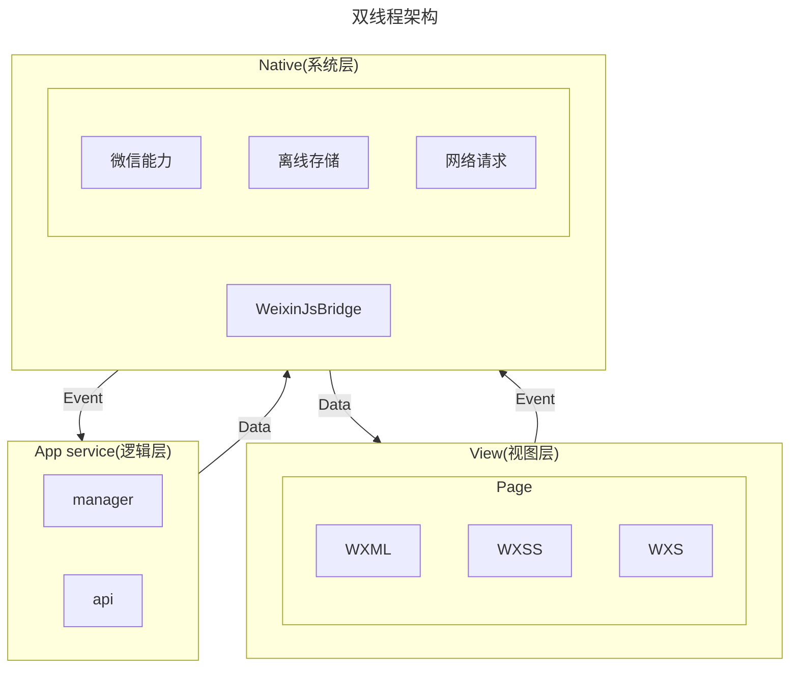

```mermaid
---
title: 双线程架构
---
flowchart TB
    subgraph one["App service(逻辑层)"]
    manager
    api
    end
    subgraph two["View(视图层)"]
    direction LR

    subgraph page[Page]
    direction TB
    WXML
    WXSS
    WXS
    end
    end
    subgraph three["Native(系统层)"]
    subgraph three-one[" "]
    微信能力
    离线存储
    网络请求
    end
    WeixinJsBridge
    end
    one-->|Data|three
    three-->|Event|one
    two-->|Event|three
    three-->|Data|two
```
