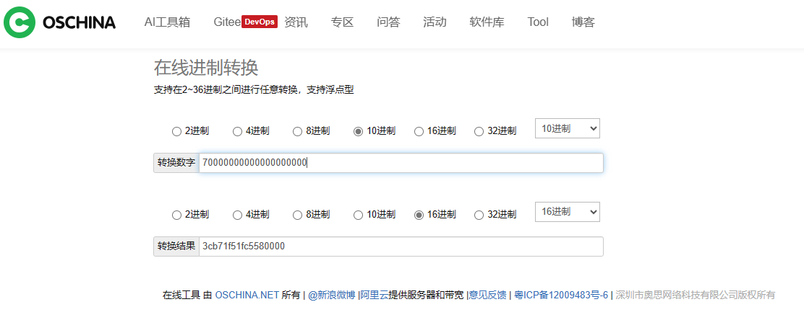

## 事情的起因

起因是我正在DragonOS写 Signal 相关的代码，然后 Page fault 了，经过一系列排查之后，发现 RIP 寄存器的值好像不太对，把内核反编译之后发现确实不对，它没指向任何一个函数入口。到这一步，很自然的想法是栈损坏了，或者某些原因导致了 Dirty bit。这里先提一嘴，就是 DragonOS 里中断栈帧的RIP是 `u64`，而 Signal 中的函数指针是 `c_void`。后者在 rust 中打日志的时候会被格式化成十六进制。

## 扑朔迷离

后面我就想怎么回事呢，这个值不对。它是怎么个不对法呢，就是有如下代码，就是很简单的打日志

``` rust
kdebug!("hander:{:?}, as u64:{:?}",frame.handler,frame.handler as u64)
```

但是打出来两个值居然是不一样的！虽然一个是十六进制一个是十进制，但是值就是不一样。我思来想去，是不是 rust 把 `c_void` 转成 `u64` 的时候出错了呢？有这种想法也是带有对 Rust 编译器的一定成见，毕竟它确实有一些小bug。于是我新建了一个 Rust 项目，很简单地初始化了一系列 `c_void` 然后转成 `u64` ，发现值大到一定程度就错了(没溢出)。我就想怎么会这样呢，编译器不可能会出这种错的。于是我就去吃饭了。

## 真相大白

我回来坐在凳子上，想着要不先测测别的能不能跑，也就是把原来错误的地址加上一个固定的值让它强行变到正确的地址上，再回头来解决这个问题，于是乎我就在测算这个值和正确的指针地址差多少，我在 `在线进制转换！` 中把输入的十进制数 `+1` ，没变！




看到这个结果的一瞬间我直接瘫坐在椅子上泣不成声。这是 google 中搜索 `进制转换` 排第一的网站，我测试了第一页全部网站，无一幸免。包括知名的 `菜鸟教程`。而我一旦搜索 `Dec converter` 随便两个网站都是正确的。我不做任何评价，但是这着实给我来了一点小小的中国震撼。
