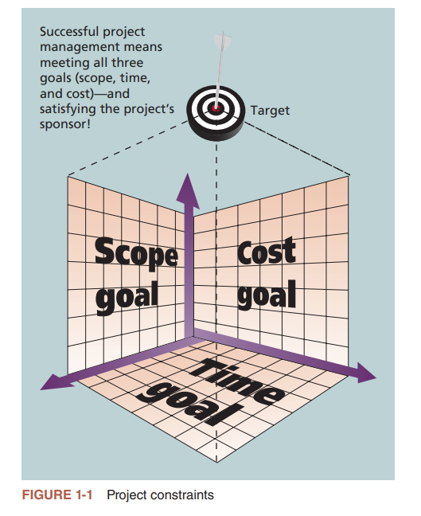

## 概要

- 体会到对更好的项目管理(尤其是IT项目管理)不断增长的需求。
- 解释什么是项目,列举IT项目的例子,列出项目的各种特征,并千描述项目管理的约束。
- 定义项目管理,并论述项目管理框架中的关键因素,包括牙项目干系人、项目管理的知识领域、常用工具和技术,以及项目成功的要素。
- 讨论项目管理、项目集管理和项目组合管理之间的关系,以及它们中的每一个对企业成功的重要性。
- 通过描述项目经理做些什么、需要什么技能、理想的技能给组合(能力三角形)和IT项目经理的就业机会来了解项目经理的角色。
- 描述项目管理专业,包括它的历史、PMI等专业组织的作用月、项目管理资格认证和职业道德的重要性,以及项目管理软件的更新。

## 引言

略

## 什么是项目

- `项目(project)`是"为色别造独特的产品、服务或成果而进行的临时性工作"。
- 另一方面,`运营(operations)`是在组织中为了维持业务所做的工作,它侧重于产品和服务的持续生产。

### 项目举例

略

### 项目属性

- 项目有一个独特的目的
- 项目是临时性的
- 项目推动变革并创造价值
- 项目是通过不断完善细节而逐步开展的
- 项目需要来自不同领域的资源
- 项目具有不确定性

### 项目约束

范围目标、时间目标和成本目标被称为项目管理的`三项约束(triple constraint)``

## 什么是项目管理

`项目管理(project management)`是"将知识、技能、工具和技术应用于项目活动,以满
足项目要求。"项目经理不应该局限于试图满足项目具体的范围目标、时间目标、成本目
标和质量目标,同时也必须协调整个过程,以满足项目活动相关者或干系人的需求或期望。

### 项目干系人

`干系人(stakeholder)`是指参与项目活动或受项目活动影响的个人、群体或组织,包括项目发起人、项目团队、支持人员、客户、用户、供应商,甚至项目的反对者。这些干系人通常有完全不同的需求和期望。房屋建设项目是常见的功项目例子,其中可能包含以下干系人

- 项目发起人为潜在的新业主
- 银行、融资机构
- 项目经理是承包商
- 项目团队包括建筑工人、电工、木匠等
- 支持人员包括买方的雇主
- 材料供应商
- 反对者：附近的邻居，因为噪音干扰

### 项目管理知识领域

`项目管理知识领域(projectmanagementknowledgeareas)`描述了项领目经理必须具备的关键
能力。图1-2的中间部分展示了项目管理的10大知识领域。这10大知识领域的简要描述如下:

1. 项目范围管理包括定义和管理成功完成项目所需的全部工作。
2. 项目进度管理(以前称为项目时间管理)包括估计完成工作所需的时间,制定可接受的项目进度,并确保项目按时完成。
3. 项目成本管理包括项目预算的制定和管理。
4. 项目质量管理确保项目满足各方明确表述的或隐含的需求。
5. 项目资源管理是指有效利用与项目有关的人员和物质资源。
6. 项目沟通管理包括生成、收集、传播和存储项目信息。
7. 项目风险管理包括识别、分析和应对与项目相关的风险。
8. 项目采购管理包括从实施项目的组织外部获取或采购产品和服务。
9. 项目干系人管理包括识别和分析干系人的需求,同时在项目的整个生命周期中管理和
控制干系人参与项目决策和执行。
10. 项目整合管理是一个影响所有其他知识领域并受其影响的总体功能。

### 项目管理工具和技术

`项目管理工具和技术(Project management tools and techniques)`帮助项目经理及其团队在所有10个知识领域开展工作。例如,一些流行的时间管理工具和技术包括:甘特图(Gantt charts)、项目网络图(project network diagrams)和关键路径分析(critical path analysis)。下表列出了一些知识领域常用的工具和技术。

### 项目成功

1. 项目达到了范围目标、时间目标和成本目标。
2. 项目使客户/发起人满意。
3. 项目的结果达到了主要目标,比如赚取或节省了一定数目目的钱,带来了较好的投资回报率,或者仅仅是让项目发起人感到满意。

## 项目集和项目组合管理

### 项目集

- `项目集(program)`是指"以协调的方式管理一组相互关联的项目、子项目集和项目集
活动,以便获得分别管理所无法获得的利益。"，例如基础设施项目集包括体的项目,例如提供更多的无线网络连接、升级硬件和软件、增强计算机安全、开发或维护公司的IT标准等
- 项目集$\neq$超大项目，
- `项目集经理(program manager)`对领导项目集内项目的项目经理进行领导并指明方向。

### 项目组合管理

在许多组织中,项目经理还会实行一种新兴的业务战略,即本书所称的`项目组合管理(project portfolio management)`或`组合管理(portfolio management)`。在这种战略中,组织将项目以及项目集组合并进行管理,使其作为一个投资组合,从而促足成整个企业的成功。

### 组织项目管理

通过将项目分组到项目组合中,组织可以更好地将它们的项目与战略目标联系起来。项目组合管理还可以通过聘用、培训和留住员工来支持投资组合中的项目,进而帮助组织更好地管理其人力资源。简单来说有三种基本的IT项目组合种类：

- 冒险类项目:该类项目有助于改变目前的业务经营。例如,在"开篇案例"描述的大型零售连锁示例中,或许存在着一个IT项目--在商店里提供kiosks,同样也在网上提供,这样顾客和供应商就能够迅速提供有关产品和服务的反馈。这个项目能通过与顾客和供应商发展更亲密的关系来转变业务经营。
- 成长类项目:这类项目能帮助公司提高收入。例如,一家公司或许有一个新的IT项目--在其公司网站上用一种新的语言(中文或者日文)提供信息。这种项目能够促进他们在使用该语言的国家增加收入。
- 核心类项目:它是指为了商业活动的正常运营而必须要完成的那些项目。例如,为新员工提供计算机的IT项目就属于此类。

## 项目经理的作用

略

## 项目管理职业

- `项目管理办公室(Project ManagementOffice,PMO)`是一个在组织内部发挥项目管理协调作用的机构。
- 推动PMO发展的三个主要因素:
  1. PMO不断增长的战略价值。
  2. PMO在培训中的作用日益重要。
  3. 来自资源管理的挑战一直存在。

## 部分快速测验

1. __<BlurText text="B"/>__不是好的项目管理所具有的潜在优势。
a.更短的开发时间
b.更高的员工士气
c.更低的资金成本
d.更高的边际收益

## 关键术语

最佳实践(best practice)
魅力型(charismatic)
DevOps (DevOps)
企业项目管理软件(enterprise project management software)
道德(ethics)
甘特图(Gantt chart)
交互型(interactional)
放任型(laissez-faire)
领导者(leader)
经理(manager)
超大型项目(megaproject)
组织项目管理(organizational project management)
项目组合(portfolio)
项目集(program)
项目集经理(programmanager)
项目(project)
项目和项目组合管理软件(projectand portfolio management software)
项目管理(projectmanagement)
项目管理协会(ProjectManagement Institute(PMI))
项目管理知识领域(projectmanagementknowledge areas)
项目管理办公室(ProjectManagementOffice,PMO)
项目管理专业人士(ProjectManagement Professional, PMP)
项目管理工具和技术(projectmanagement tools and techniques)
项目经理(projectmanager)
项目组合管理或组合管理(project portfolio management or portfolio management)
项目发起人(projectsponsor)
干系人(servant leader stakeholders)
交易型(transactional)
变革型(transformational)
三项约束(tripleconstraint)
