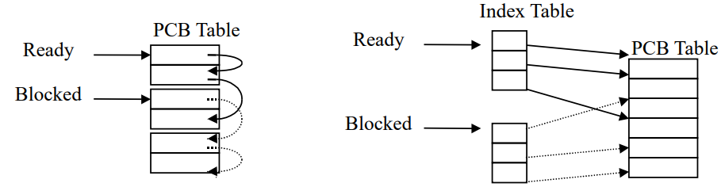
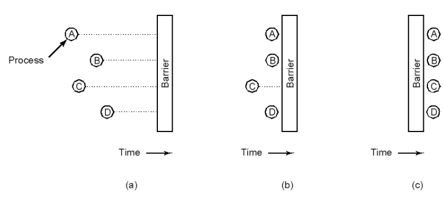
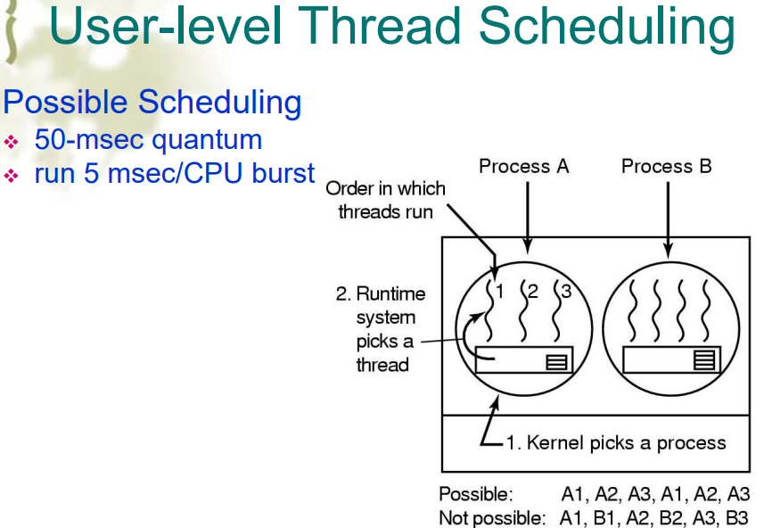
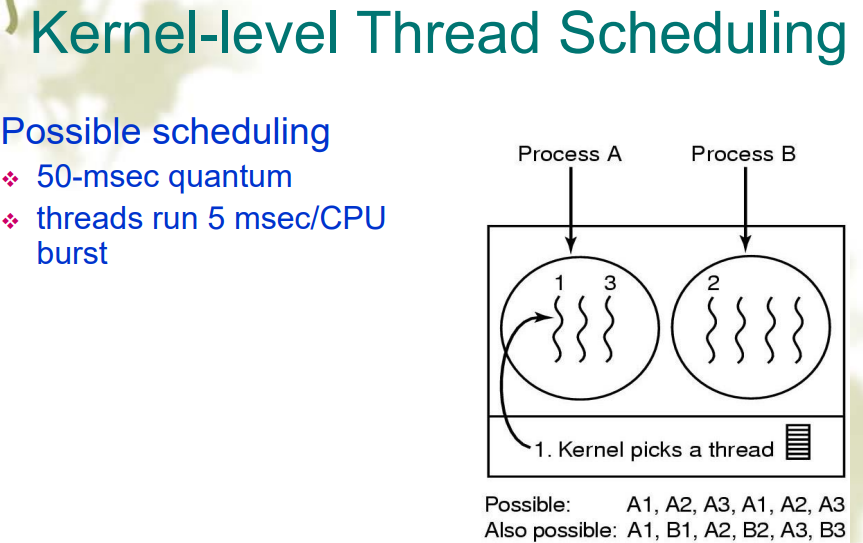

## 进程

- 顺序执行：单道程序系统中，一个具有独立功能的程序独占处理器直到最终结束的过程称为程序的顺序执行
- 顺序性：程序的结构是顺序执行的(可能有 switch 或者 loop)
- 封闭性：独占所有资源
- 可重复性：初始状态相同，运行多少次结果都相同
- 并发执行：所有上述特性都没有
- 为了描述并发的行为，引入了进程的概念

### 进程模型

- 在进程的模型中，所有可运行软件都被以进程的集合组成起来

### 进程概念

- 进程就是一个具有一定独立功能的程序关于某个数据集合的一次活动(另一个数据集合就是另一个进程)
- 进程和程序的区别

1.  程序是一个指令的集合，是一个静态的概念，进程描述并发，是一个动态的概念
2.  进程包括程序、数据和 PCB
3.  进程是临时的，程序是持久的
4.  一个程序可以是一个多进程的执行程序，一个进程也可以调用多个程序
5.  进程可以创建子进程

### 进程的创建

- 创建进程的主要事件

1.  系统初始化(reboot)
2.  用户请求创建进程(fork()方法)
3.  在运行中的进程中创建进程

- 前台进程用于与用户交互
- 后台进程来处理一些将会产生的请求，被称为守护进程(daemons)

- 在 UNIX 中，fork()系统调用被用于创建一个新的进程
- 刚开始时父子进程有完全相同的内存映像(memory image)，相同的运行环境，相同的打开文件
- 在调用 execve()后，子程序加载一个新的程序，否则将执行父进程的相同程序
- 在 Windows 中，CreateProcess 处理了创建和加载新应用到进程两个过程

### 进程终止

- 进程终止的状态

1.  正常退出(自愿的 voluntary)：UNIX 中的 Exit 和 Windows 中的 ExitProcess
2.  错误退出(自愿)：如编译错误
3.  致命错误退出(Fatal error，非自愿)：除以 0，执行非法指令，段错误
4.  被其他进程 killed(非自愿)：UNIX 中的 Kill 和 Windows 的 TerminateProcess

### 进程层次

- 父进程创建子进程
- UNIX 有进程树状结构，称为进程组
- Windows 没有类似层次，所有进程是平级的

### 进程状态

- 基本进程状态：
- Running：正在使用 CPU
- Ready：可运行的(处于 ready queue 中)
- Blocked：没有外部事件发生时无法运行(例如等待某个按键被按下)
<!--  -->
- New 和 Exit 状态
- Suspend(挂起):
- Blocked suspend state
- Ready suspend

### 进程实现

#### 进程中有什么(进程映像 Process image)

- User program
- User data
- Stack(处理函数调用和传参)
- PCB(Process control block)(存储进程的属性)
- 以 Linux PCB Structruetructrue: task_struct 部分(完整有 106 个 field)为例:

| Process management | Memory management       | File management   |
| ------------------ | ----------------------- | ----------------- |
| Registers          | Pointer to text segment | Root directory    |
| Program counter    | Pointerto data segment  | Working directory |

#### 上下文

##### 进程上下文

- 一个对执行进程的静态描述
- User Context, Register Context, System Context

##### 上下文切换

- 把 CPU 从一个进程切换到另一个进程
- 由调度器(Scheduler)执行
- 包括：
- 保存旧进程的 PCB 状态
- 加载新进程的 PCB 状态
- 刷新内存缓存
- 更改内存映射
- 上下文切换是十分昂贵的(1-1000 microseconds)
- 切换时没有进行实际操作
- 可能成为性能瓶颈

#### Process Table&PCB table

- 操作系统维护一个 process table，每个实体(entry)是一个 PCB
- PCB table 的大小决定了系统的并行度
- 有两种实现方式，链表实现和索引实现
  

## 2.2 线程(Thread)

### 基本概念

- 为了减小进程切换带来的额外开销，将进程资源分配和调度这两个基本属性分开，把进程调度交给线程执行，让拥有资源的基本单位——进程，不进行频繁的切换
- 原 PCB 的内容分成两部分：
- 描述进程资源和空间的部分
- 描述执行现场、状态及调度的部分
- 将第二部分内容作为线程控制块 TCB 的内容，且一个进程内允许多个线程存在
- 新进程描述为：
- 一个独立的进程空间，可装入进程映像
- 一个独立的进程相关联的执行文件
- 进程所用的系统资源
- 一个或多个线程(进程在创建时一般同时创建好第一个线程，其他线程按需要由用户程序请求创建)
- 线程不拥有系统资源，只有其运行必须的一些数据结构：TCB, a program counter, aregister set, a stack,它与该进程内其他线程共享该进程所拥有的全部资源
- 堆栈和寄存器用来存储线程内的局部变量
- 线程控制块 TCB 用来说明线程存在的标识，记录线程属性和调度信息

### Thread vs Process

### 线程应用

#### 线程的优点

- 响应性：同时可以执行多个任务，可以加速应用执行
- 资源共享：线程共享所属进程的所有内存和资源
- 经济性：易于创建和销毁
- 利用多处理器架构：可以被用于多处理器的系统中

#### POSIX Thread

| Thread call    | Description         |
| -------------- | ------------------- |
| Pthread_create | Create a new thread |

### 线程的实现

#### 用户空间的实现(ULT User Threads)

- 完全存在于用户空间，内核不知道线程的存在
- 完全由用户空间进行管理，能实现快速的创建和管理
- 问题：假如内核是单线程的，如果用户进程的某个线程执行了一个 blocked 的系统调用时，会导致整个进程都 blocked
  

#### 内核空间的实现

- 基于内核支持的，由内核控制线程的创建、调度和管理
- 没有 thread library，由内核提供 API
- 内核维护线程和进程的上下文
- 线程的切换需要内核
- 调度的基本单位是线程
- 缺点是高消耗
  

#### 混合实现


- 可能是由用户空间的一个或多个线程对应内核空间中的一个线程。

#### Pop-up

- 常用于分布式系统中
  

### Thread vs Process

1. 进程是资源分配的基本单位，所有与该进程有关的资源分配情况，如打印机、I/O 缓冲队列等，均记录在进程控制块 PCB 中，进程也是分配主存的基本单位，它拥有一个完整 的虚拟地址空间。而线程与资源分配无关，它属于某一个 进程，并与该进程内的其它线程一起共享进程的资源。
2. 不同的进程拥有不同的虚拟地址空间，而同一进程中的多个线程共享同一地址空间。
3. 进程调度的切换将涉及到有关资源指针的保存及进程地址 空间的转换等问题。而线程的切换将不涉及资源指针的保 存和地址空间的变化。所以，线程切换的开销要比进程切 换的开销小得多
4. 进程的调度与切换都是由操作系统内核完成，而线程则既可由操作系统内核完成，也可由用户程序进行。
5. 进程可以动态创建进程。被进程创建的线程也可以创建其它线程。
6. 进程有创建、执行、消亡的生命周期。线程也有类似的 生命周期

## 2.3 进程间通信(_重点难点_)

- 进程怎么把消息传递给另一个进程
- 资源的共用(互斥)
- 进程合作(协调进程的顺序以解决互相依赖或互相等待——进程同步)

- 竞争(race)：当多个进程同时读/写共享的资源时，就会出现竞争，防止竞争的关键是防止多个进程同时多谢共享资源
- 互斥：在一个进程访问共享资源时，阻止其他进程访问
- 临界资源(Critical Resource)：一次仅允许一个进程访问的资源称为临界资源，如硬件中的打印机，软件中的变量、表格、队列、文件。
- 临界区(Critical Region 或 Critical Section)：程序中的一段访问临界资源的的代码，两个进程不同时在临界区中就能做到不同时访问临界资源

|     | 代码区域          | 作用                                             |
| --- | ----------------- | ------------------------------------------------ |
| 1   | entry section     | 检测是否存在正在于临界区的进程，有的话则 blocked |
| 2   | critical section  | 执行                                             |
| 3   | exit section      | 退出临界区，并与其他进程互通消息                 |
| 4   | remainder section | 其余部分                                         |

- 互斥的四个原则：
  1. 不能有两个及以上的线程同时访问临界区
  2. 不能对 CPU 的数量和速度做出任何假设
  3. 在临界区之外运行的进程不能够阻塞其他进程进入临界区
  4. 不能有进程被一直阻塞于临界区之外

### 互斥

#### 禁止中断(Disabling Interrupts)

##### 工作方法

- 在一个进程刚进入临界区时，关闭所有中断，然后在即将离开时再开启中断

##### 为什么可行

- 一旦关闭所有中断，包括时钟中断，基于时间片的进程切换也不会发生，也就是在这段时间中这个进程将独占 CPU

##### 问题

- 一旦忘记打开中断，系统将瘫痪
- 多 CPU 下，只会影响当前执行进程的 CPU，无法影响其他 CPU

##### 应用

- 通常只用于 OS 内部

#### 变量锁(Lock Variable)

##### 工作方法

- 对共享变量添加 lock 字段，每个进程访问时查询是否为 0，若为 0 则执行，且把 lock 值置 1，退出执行时置 0，若为 1 则继续不断查询锁的值，直到锁的值为 0。

```cpp
shared int lock=0;
/*entry_code:excute before entering critical section*/
while (lock!=0)/*do nothing*/;
lock = 1;
 - critical section-
/*exit_code:execute after leaving critical section*/
lock = 0;
```

##### 问题

- 检测锁为 1 和置锁为 1 是两个原子操作，如果在这两个操作之间发生了切换会导致错误产生

#### 严格交换(Strict Alternation)

##### 工作方法

```cpp
while(TRUE){//thread a
 while(turn!=0)/*loop*/
 critical_region();
 turn=1;
 noncritical_region();

while(TRUE){//thread b
 while(turn!=1)/*loop*/
 critical_region();
 turn=0;
 noncritical_region();
}
```

##### 问题

- 我们假设先执行 a 进程，然后执行完一遍 b 进程又执行一遍 b 进程，且 a 进程的非临界区的代码执行时间足够长，那么在执行完 a 的非临界区的代码前，b 进程无法第二次执行，违背了互斥的第二条性质

#### Peterson's 方法

##### 工作方法

```cpp
##define FALSE 0
##define TRUE 1
##define N 2  /*number of processes*/

int turn; /*whose turn is it?*/
int interested[N] /*all values initially 0(FALSE)*/

void enter_region(int process)
{
 int other;

 other = 1-process;
 interested[process]=TRUE;
 turn = process;
 while(turn == process && interested[other] == TRUE)/*null statement*/
}
/*critical region*/
void leave_region(int process)
{
 interested[process] = FALSE;
}
```

#### TSL(Test-and-Set Locks)

##### 工作方法

- 需要硬件指令支持，是一个两步的原子操作：$$tsl\; register,\;flag$$
- (a)把内存中的 flag 值复制到寄存器中
- (b)置 flag 为 1

| enter_region       | 作用                          |
| ------------------ | ----------------------------- |
| TSL REGISTER, LOCK | 复制锁值并置 1                |
| CMP REGISTER, ##0  | 检测锁的值                    |
| JNE enter_region   | 如果锁不为 0 就跳回第一步     |
| RET                | 结束 enter_region，进入临界区 |

| enter_region(XCHG)  | 作用                          |
| ------------------- | ----------------------------- |
| MOVE REGISTER, ##1  | 寄存器置 1                    |
| XCHG REGISTER, LOCK | 交换 lock 和寄存器的值        |
| CMP REGISTER, ##0   | 检测锁的值                    |
| JNE enter_region    | 如果锁不为 0 就跳回第一步     |
| RET                 | 结束 enter_region，进入临界区 |

| leave_region   | 作用     |
| -------------- | -------- |
| MOVE LOCK, ##0 | 把锁置 0 |
| RET            | 结束     |

##### 问题

- Peterson 和 TSL 虽然都能正常执行，但是因为空循环的存在都带来了 BUSY_WAIT 问题，一是对 CPU 资源的浪费，二是带来优先级反转问题(priority-inversion)，低优先级的空循环占用了高优先级的 CPU 资源。

#### 睡眠唤醒(Sleep and Wakeup)

##### 工作方法

- 当进程不被允许进入临界区时，该进程进入休眠，直到可以进入临界区时被唤醒。

- 唤醒失败时，可能导致两个进程都进入 sleep，解决方法一是加上唤醒等待位，当进程接收到唤醒信号，但当前仍处于 awake 时，唤醒等待位置 1，当下次收到 sleep 信号时，唤醒等待位置 0，忽略此次 sleep，但是每多一个进程都会多一个位，因此引出了信号量的机制

#### 信号量(Semaphores/Completions)

- 用来解决 sleep 和 wakeup 的累计的问题
- 定义为

```cpp
struct sem_struct{
 int count//资源计数
 queue Q//阻塞/等待队列
}semaphores
```

- count 有两种类型，用来表示某种资源的数量，例如有 N 台打印机

1.  计数信号量：$0,1,...,N(初始化为N)$
2.  二元信号量：$0,1(初始化为1)$

- 信号量有且只有！两种操作(两个操作都是原子的)：

1.  $P(sem\;S)或wait(sem\;S)或down(sem\;S)$操作，用来获取一个资源并把资源数量(count)减一

```cpp
down(sem S){
 S.count=S.count-1//
 if(S.count<0)
  block(P);
}
```

- $block(P)$操作包含三步：
  1. $把P的pid入列S.Q$
  2. $阻塞进程P(从ready队列中移出pid)$
  3. 把控制权转给调度器
- 执行一次$P$操作后，若$S.count<0$，则$|S.count|$等于 Q 队列中等待 S 资源的进程数
- $V(sem\;S)或signal(sem\;S)或up(sem\;S)$操作，用来释放一个资源并把资源数量(count)加一

```cpp
up(sem S){
 S.count=S.count+1;
 if(S.count<=0) wakeup(P in S.Q)
}
```

- $wakeup(P)$操作有三步：

1.  $从S.Q中移出P的pid$
2.  $把P的pid移入ready队列$
3.  控制权转交给调度器

- 执行一次$up$操作后，若$S.count\le 0$表明 Q 队列中仍有因等待 S 资源而被阻塞的进程，所以需要唤醒$(wakeup)Q$队列的进程。

- 信号量的使用有两种方法：

  - 实现互斥($mutex$)：对于互斥信号量，其$down和up$往往在同一个进程中，而且紧挨着$critical\;region$，对于两个进程，$mutex的值可能为1,0,-1$，对于 N 个进程，$mutex的值可能为1,0,-1...,-(N-1)$
  - 实现进程同步($full,\;empty$)：对于同步信号量，其$down和up$往往不在一个进程中

```
// 互斥示例
other DOWN()
DOWN(mutex)
 -critical section-
UP(mutex)
other UP()
```

- 如果两个$P(S_1)和P(S_2)$在一起，那么$P$操作的顺序非常重要，要让同步信号量在互斥信号量之前，而$V$操作的顺序无关紧要

- 如果缓冲区大小大于 1，就必须专门设置一个互斥信号量来保证互斥访问缓冲区
- 如果缓冲区大小为 1，有可能不需要设置互斥信号量就可以互斥访问缓冲区

```
mutex = 1
plate = 2
banana = 0
apple = 0

//老豆
P(plate)
P(mutex)
放苹果
V(mutex)
V(apple)
//老母
P(plate)
P(mutex)
放香蕉
V(mutex)
V(banana)
//儿子
P(banana)
P(mutex)
拿香蕉
V(mutex)
V(plate)
//女儿
P(apple)
P(mutex)
拿苹果
V(mutex)
V(plate)


```

##### 缺点

- 信号量的控制分布在整个程序中，很难分析其正确性

#### 管程(Monitor 几乎没考过)

- 把信号量封装成一个对象，把信号量的 PV 操作变成管程对象的方法，

### 消息传递(Message passing)

- 进程间通信的方法：

1. 共享内存
2. 共享文件(例如 pipe 就是通过共享文件实现的)
3. 消息传递：

- 给进程赋一个地址 addr，用 send(addr,msg)和 recv(addr,msg)来传递消息
- 设置一个邮箱，通过 send(mailbox,msg)和 recv(mailbox,msg)来传递消息

### 壁垒(barrier)



- 使用方法：

  1. 进程抵达壁垒
  2. 只要有一个进程未抵达就阻塞壁垒
  3. 最后一个进程抵达后穿过。

- 例如：并行矩阵乘法。

### 经典 IPC 问题

#### 哲学家就餐


- 假设有五位哲学家围坐在一张圆形餐桌旁，做以下两件事情之一：吃饭，或者思考。吃东西的时候，他们就停止思考，思考的时候也停止吃东西。餐桌上有五碗意大利面，每位哲学家之间各有一支餐叉。因为用一支餐叉很难吃到意大利面，所以假设哲学家必须用两支餐叉吃东西。他们只能使用自己左右手边的那两支餐叉。哲学家就餐问题有时也用米饭和五根筷子而不是意大利面和餐叉来描述，因为吃米饭必须用两根筷子。

```C
##define N         5         /* number of philosophers */
##define LEFT      (i+N-1)%N /* number of i's left neighbor */
##define RIGHT     (i+1)%N   /* number of i's right neighbor */
##define THINKING   0        /* philosopher is thinking */
##define HUNGRY     1    /* philosopher is trying to get forks */
##define EATING     2        /* philosopher is eating */

typedef int semaphore; /* semaphores are a special kind of int */
int state[N];      /* array to keep track of everyone's state */
semaphore mutex = 1; /* mutual exclusion for critical regions */
semaphore s[N];      /* one semaphore per philosopher */

void philosopher(int i) /* i: philosopher number, from O to N-1 */
{
  while (TRUE){           /* repeat forever */
    think(）);              /* philosopher is thinking */
    take_forks():           /* acquire two forks or block */
    eat();                  /* yum-yum, spaghetti */
    put_forks(i);           /* put both forks back on table */
    }
}
```

```C
void take_forks(int i)/* i: philosopher number, from O to N-1 */
{
  down(&mutex);             /* enter critical region */
  state[i] = HUNGRY/* record fact that philosopher i is hungry*/
  test(i):                  /* try to acquire 2 forks */
  up(&mutex);               /* exit critical region */
  down(&s[i]);              /* block if forks were not acquired */
}

void put_forks(i)/* i: philosopher number, from O to N-1 */
{
  down(&mutex);           /* enter critical region */
  state[i] = THINKING;    /* philosopher has finished eating*/
  test(LEFT);             /* see if left neighbor can now eat */
  test(RIGHT);            /* see if right neighbor can now eat*/
  up(&mutex),             /* exit critical region */
}

void test(i)/* i: philosopher number, from O to N-1 */
{
  if （state[i] == HUNGRY && state[LEFT] != EATING &&  state[RIGHT] != EATING)
  {
    state[i] = EATING;
    up(&s[i]);
  }
}


```

- 简单来说就是当且仅当两边都有叉子的的时候直接拿起两个叉子

#### 读者写者问题(Readers and Writers)

- 在数据库中，只能有一个写者，且写时不能读，其余时候可以有多个读者同时读

```c
typedef int semaphore
semaphore mutex = 1;
semaphore db = 1;
int rc = 0;

void reader(void)
{
 while(TRUE)｛
  down(&mutex)
  rc = rc+1;
  if(rc==1) down(&db)
  up(&mutex)
  read_data_base();
  down(&mutex);
  rc = rc-1;
  if(rc==0) up(&db);
  up(&mutex);
  use_data_read();
 ｝
}
void writer(void)
{
 while(TRUE){
 think_up_data();
 down(&db);
 write_data_base();
 up(&db);
 }
}
```

## 2.4 调度(Scheduling)

### 目录

- 什么时候调度(调度时机)
- 什么是调度(调度算法，调度的原则)
- 怎么调度(上下文切换)

### Process Behavior

- CPU 突发(burst)：进程需要 CPU 的一段时间被称为 CPU burst
- I/O 突发(burst)：进程需要 I/O 的一段时间被称为 I/O burst

#### CPU 密集型(CPU-bound)进程

- 长 CPU burst，少 I/O waits
- 例如：数据计算，图像处理

#### I/O 密集型(I/O-bound)进程

- 短 CPU burst，频繁 I/O waits
- 例如：频繁读写硬盘

### 调度时机(When)

#### 可能的调度时机

- 一个新进程的创建
- 运行中进程的退出
- 运行中进程的阻塞
- I/O 终端
- 时钟中断

#### 可抢占式(preemptive) vs 不可抢占式(Non-preemptive)

- 批处理系统：非抢占式的，从长时间来看也算是抢占式的
- 交互系统：必须是抢占式的
- 实时系统：有时不需要抢占，有时需要

### 调度算法

#### 调度算法原则

- Fair()
- Priority
- Efficiency
- Encourage good behavior
- Support heavy loads
- Adapt to different environments

- 算法的选择取决于不同系统和不同的侧重点需求
- 对所有系统都要满足公平(Fairness)、效率(Efficiency)和策略强制执行(Policy Enforcement)

##### 批处理系统

- 吞吐量(Throughput)：单位时间完成的进程数量
- 周转时间(Turnaround Time 或 elapse time)：从进程进入到系统时开始(包括等待和执行)计算的运行时间
- 等待时间(Waiting Time)：进程在 ready 队列中等待的时间
- 处理器利用率(Processor Utilization)：CPU 忙碌的时间

##### 交互系统

- 响应时间：从请求提出到第一次响应产生的时间
- 均衡：要满足用户对延迟对的需求

##### 实时系统

- 满足 Deadline：要满足实时系统的底线要求，避免数据损失
- 可预测性：对不同程度的负载，相同的操作系统要有相同的时间消耗表现

#### 算法

##### First Come First Serve(FCFS)

- 非抢占式
- 用于批处理系统中
- 实现：维护一个 FIFO 队列，新进程入队尾，调度器从头部取出进程运行
- 表现度量：平均等待/周转时间

###### 问题

- 不可抢占
- 不是最优的 AWT(Average Waiting Time)
- 无法并行利用资源：会引起护航效应(Convoy effect)，例如只有一个 CPU 密集型和多个 I/O 密集型进程，会导致低 CPU 使用率和 I/O 使用率，因为当 CPU 在执行 CPU 密集型进程时，I/O 密集型需要等待使用 CPU，导致 I/O 设备的空闲，当在执行 I/O 密集型时，CPU 就空闲了。

##### SJF(Shortest Job First)

- 即有抢占式，也有非抢占式
- 用于批处理系统中
- 需要事先知道各个进程的周转时间
- 有最短的 AWT(对于非抢占式的来说，需要所有进程都同时抵达等待调度才能最短)
- 抢占式的也被称为 Shortest Remaining Time First(SRTF)

###### 问题

- 会导致 Starvation：在某些情况下，某些长进程会永远得不到调度以执行

##### 循环调度(Round-robin)

- 所有进程轮换执行

###### Time Quantum

- 意为时间片长度
- 太长：可能会退化为 FCFS，而且响应时间差
- 太短：过多的上下文切换导致大量的时间浪费和低 CPU 利用率
- 探索：70%-80%的任务阻塞在时间片内
- 通常时间片为 10-100ms

###### 问题

- 没有考虑到进程的优先级
- 频繁的进程上下文切换带来大量的开销

##### 优先级调度(Priority Scheduling)

- 在每个优先级内用 FCFS 进行执行

###### 优先级设置

- 有两种设置方法：静态的(Static)和动态的(Dynamic)
- 可能的考虑因素：Cost to user, Importance of user, Process type, Requirement to resource, Aging(动态的，根据进程已执行的时间), CPU 利用率(动态)

###### 问题

- 可能平均等待时间不是最优表现
- 可能仍有无限阻塞和 starvation

##### 多级队列(Multi-Queue)

- 优先级和循环调度的结合
- 按照某些属性把 Ready Queue 分成若干个 queue，例如分为 Interactive processes、System Processes、Background Processes 等
- 队列间以固定的优先级和 CPU 的使用率进行调度，队列内部可能有不同的调度算法，例如 System 以优先级调度，Interactive 以 RR 调度，Background 以 FCFS 调度。
- 一个进程只能永久属于一个一个队列
- 不同队列内的任务可以交错运行，不一定要按照队列的优先级，只要保证最后的 CPU 使用率符合要求就行

##### 反馈队列(Multi-level Feedback)

- 多级队列的变种
- 每个队列都有相同的 CPU 使用率
- 每个进程都从最高优先级的队列开始执行，每执行完一次 CPU burst 就移动到下一个队列(优先级低一级)
- 再某个队列中的每个任务都执行固定长度的时间片(RR 调度)
- 例如：CTSS 系统中，第$t$级队列的时间片为$2^t$，最后一个队列采用 FCFS。

##### Guaranteed Schedulin (QoS)

- 会给进程以确定的 CPU 时间，例如 n 个运行中的进程，就给每个进程 1/n 的 CPU 时间

##### 彩票调度(Lottery Scheduling)

- 给每个进程一定数量的彩票，每次调度时间里会随机抽取一张彩票，持有这张彩票的会得到资源调度，因此高优先级的进程会分配更多的彩票以提供更多的资源，也可以给运行时间短的进程更多彩票以更快运行完

###### 优点

- 简单
- 高响应
- 可以支持进程间的合作(借用彩票)
- 可以很好的支持优先级和 CPU 使用比例分配的需求

##### 公平调度(Fair-Share)

- 与 Round-robin 的区别，轮转调度是进程间公平，而 Fair-Share 是用户间公平，保证每个用户都有相同的 CPU 使用时间。

##### 实时系统调度

- 调度器会提供基于 deadline 和 CPU 利用率的调度保证
- 需要这个实时系统是可调度的：$$\sum\limits^m_{i=1}\frac{C_i}{P_i}\le1$$
  其中，$m$是任务数量，任务$i$出现在$P_i$时期内，需要$C_i$秒执行(反例是每一分钟有一个需要两分钟执行的任务抵达)

##### 用户级/内核级线程调度



- 在用户级线程调度中，进程由内核调度器选取，而线程只能在同进程的线程内选取调度。



- 而在内核级线程中，线程是调度的最小单位，因此可以选取任意线程进行调度。
