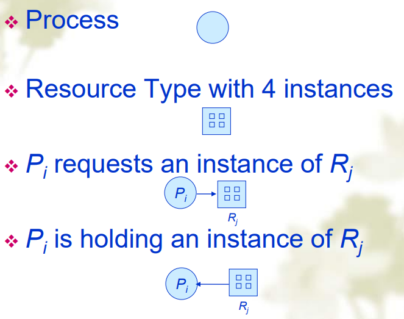
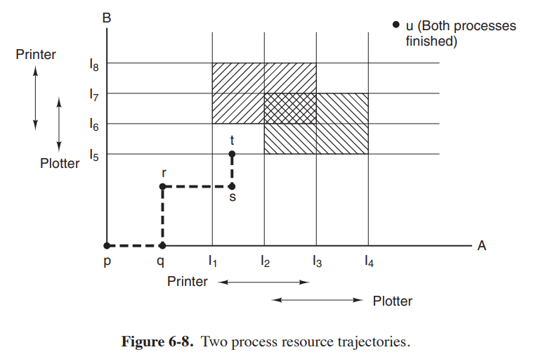
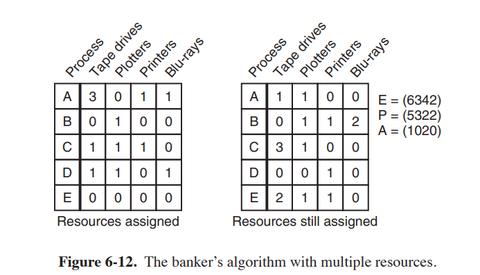

## 资源

### 分类

- 可抢占式(preemptable)资源：可以被从一个进程中拿走而不带来负面影响(例如 CPU、内存)。
- 不可抢占式(Nonpreemptable)资源：会导致进程失败如果被拿走(例如 CD 刻录机)。

### 资源的取用

- 每个进程会按以下步骤利用资源：

1.  请求资源
2.  使用资源
3.  释放资源

- 如果请求资源被拒绝就一定要等待，请求资源的进程阻塞，可能会因此 fail with error code

## 死锁的介绍

### 定义

- 如果一组进程内的每个进程都在等待一个只有其他进程才能引发的事件
- 这个事件往往是资源的释放

### 死锁的条件

1. 互斥条件：资源被分配给了一个进程或者是可用的
2. 持有且等待条件：持有资源的进程还可以额外请求资源
3. 不可抢占条件：资源必须是不可抢占的
4. 环路等待条件：两个及以上的资源被环路请求资源

### 资源分配图(Resource-Allocation Graph)

#### 死锁的判断

- 图上没有环$\Rightarrow$没有死锁
- 图上有环且每个资源只有一个实例$\Rightarrow$有死锁
- 图上有环但是资源有不止一个实例$\Rightarrow$可能有可能没

## 鸵鸟(ostrich)算法

- 假装没有死锁，假装没问题

### 可行性

- 死锁的出现是很罕见的
- 死锁的避免是开销很大的

### 实际

- Unix 和 Winows 系统都采用这种方式
- 是便利性和正确性之间的折中

## 死锁的检测

- 每隔一段时间就运行算法检测一次

### 实现(单实例资源)

1. 初始化一个空链表，把所有边初始化为未标记
2. 将当前节点添加到 L 的末尾，并检查 L 中是否出现了这个节点两次，如果出现，则图中包含一个循环，算法中止
3. 从给定的节点，查看是否有任何未标记的出边，如果有，转到步骤四，没有，转到步骤五
4. 随机选择一个未标记的出边标记它，然后沿这条边到下一个节点，重复步骤 2
5. 现在进入了死胡同，将其移出并返回到前一个节点，使其称为当前节点，然后转到步骤三，如果这个节点是初始节点，则图中不包含循环，算法中止

:::info 拓扑排序
实际上就是进行一次拓扑排序，如果排序后没有剩下的节点那么就是无环的
:::

### 实现(多实例资源)

#### 分配矩阵

- $resources\;in\;existence:E=(E_1,E_2,...,E_M)$

$$
\begin{bmatrix}
c_{11} & c_{12} & \cdots & c_{1m} \\
c_{21} & c_{22} & \cdots & c_{2m} \\
\vdots & \vdots & \ddots & \vdots \\
c_{n1} & c_{n2} & \cdots & c_{nm}
\end{bmatrix}
$$

- $c_{ij}$表示第$i$个进程已经被分配了$c_{ij}$个$E_j$资源

#### 需求矩阵

- $resource\;available:A=(A_1,A_2,...,A_m)$(可用资源矩阵)
- $A_m=E_m-\sum\limits^n_{i=1}c_{im}(exist的减去已分配的)$

$$
\begin{bmatrix}
R_{11} & R_{12} & \cdots & R_{1m} \\
R_{21} & R_{22} & \cdots & R_{2m} \\
\vdots & \vdots & \ddots & \vdots \\
R_{n1} & R_{n2} & \cdots & R_{nm}
\end{bmatrix}
$$

- $R_{ij}第i个进程需求R_{ij}个R_j资源$

#### 算法

1. 初始化时，所有进程都是未标记状态
2. 找一个未标记的进程$P_i$，使得需求矩阵中的第$i$行中的每一项都小于等于可用矩阵每一项的值
3. 如果找到了这样一个进程，就把分配矩阵中的第$i$行全部加回到可用矩阵$A$中。标记这个进程，回到第二步。
4. 如果没找到，剩下的所有未标记的进程都将陷入死锁，

## 死锁的恢复(Recovery)

### 抢占的方法(Preemption)

- 出现死锁的时候抢占资源
- 但是这种方法能否可行取决于资源的类型

### 回滚的方法(rollback)

- 周期性的在进程中设立检查点
- 当出现死锁的时候，从检查点开始恢复

### 杀死进程的方法(kill processes)

- 杀死一个死锁环中的进程
- 杀死的进程应当是一个能从头开始重新运行而不带来负面影响的。

## 死锁避免(Avoidance)

- 进程在事先声明会使用到的最大数量的资源

### 安全与不安全状态

- 安全状态：没有死锁，可以通过一次性分配最大资源需求来使得所有进程按一定顺序执行完毕。如果有一个方法使得所有进程按照一个安全序列运行不会出现死锁时，就称系统处于安全状态。当进程请求可用资源时，系统通过检测分配后会不会导致系统进入不安全状态从而决定要不要立即将资源分配给请求资源的进程
- 如图所示，画斜线的地方表示两个进程分别对 Printer 和 Plotter 会产生死锁的区域，而如果程序运行到了$I_1,I_2,I_5,I_6$包围的区域，就不论怎么走都会进入死锁，也就是我们说的非安全区。

### 结论

- 如果系统处于安全状态$\Rightarrow$没有死锁
- 如果系统处于不安全状态$\Rightarrow$可能有死锁
- 死锁避免$\Rightarrow$保证系统永远不会进入不安全状态
  zhaoyige
- 通过事先声明最大使用资源数量的方式来确保系统不会进入不安全状态。

### 银行家算法(Banker)

- 每个用户可以跟银行借钱，需要跟银行事先说最多要借多少钱
- 用户有借有还，最终还清
- 银行家保证只在安全的情况下借钱
  
- 左边代表已分配的资源数量(Alloc 矩阵)，右边代表还需要以完成运行的资源数量(Need 矩阵)。它们相加就是最大需求量 Max 矩阵
- 进行如下操作：

  1. 初始化时，所有进程都是未标记状态
  2. 找一个未标记的进程$P_i$，使得需求矩阵中的第$i$行中的每一项都小于等于可用矩阵每一项的值
  3. 如果找到了这样一个进程，就把分配矩阵中的第$i$行全部加回到可用矩阵$A$中。标记这个进程，回到第二步。
  4. 如果没找到，就说明是不安全的

- 其实跟死锁检测的方法是一样的。

#### 缺点

- 是一个保守的算法，处于安全的考虑限制了并发性
- 实践中也不可行，因为：

1.  进程很难事先知道所需的资源最大数量
2.  进程的数量不固定
3.  资源可能突然不可用，或则资源的数量会突然变化

## 死锁预防

- 破坏死锁发生的四个条件之一

### 破坏互斥条件

- 一些设备可以利用假脱机(Spool)目录(例如打印机)，使得其它进程只与假脱机文件交互，然后由打印守护进程负责假脱机文件和打印机之间的交互，使得打印机这个资源只有一个进程使用，这个守护进程也只使用这一个资源，打印机死锁就解决了
- 但是假脱机文件也有可能产生死锁，例如两个进程都只写入了一半，硬盘空间就满了，导致这两个进程在 I/O 上死锁了

### 破坏 Hold and Wait

- 在进程开始前就一次性获取所有资源

#### 缺点

- 可能无法在开始前就知道需要的所有资源
- 可能造成对一些进程的不必要过长时间占用(例如一个执行一小时的进程需要使用 15 秒的打印机，就会导致打印机被实际占用了一小时)

#### 变式

- 进程请求资源的时候要把所拥有的所有资源都释放，但是这也有缺点

### 破坏不可抢占

- 强行抢占资源
- 通过虚拟化资源，使得其变成可抢占的
- 但是这两个方法都有很大局限性

### 破坏环路等待

1. 类似破坏 Hold and Wait 的变式，请求资源的时候释放资源
2. 给所有资源编号，请求资源需要按照资源顺序请求

#### 问题

- 难以确定一个合适的编号方法(例如有的进程先使用打印机，有的后使用)
- 程序员还要确认不同资源的编号

## 其他问题

### 两段锁

- 用于数据库场景中

#### 实现

1. 第一阶段：逐条给每个记录上锁，阻止其他进程访问，如果遇到了要上锁的记录已经上了锁了，就把之前已上锁的记录都恢复，直到全部上锁完毕
2. 第二阶段：开始修改，修改完后再逐条开锁

### 通信死锁

- 除了资源使用间会出现死锁，通信也有可能出现死锁

#### 示例

- A 向 B 发送了请求，开始等待 B 的回复，而 B 也在等待 A 的请求，就进入死锁了

#### 解决方法

- Timeout：超时重传、放弃

### 活锁(Livelock)

- 死锁：进程全部阻塞了
- 活锁：进程都在运行，但是都没有进展(例如 busy waiting)

### Starvation

- 进程一直得不到资源，没有造成系统的卡死或者阻塞，除了 Starvation 的进程不能执行，其他进程都能正常运行并取得进展。
- 例如优先级高的进程一直获取资源，优先级低的进程就一直获取不到资源。
