# Chapter3 语法分析

- 正则表达式的能力有限，无法分析具体的语法细节(例如嵌套、$a^nb^n$的n值)，与其等价的有穷自动机同理，因此引入了下推自动机和上下文有关、无关文法

# 大纲

- 语法分析的形式化——上下文无关文法
- 语法分析算法

# 上下文无关文法(CFG)

- 是用来描述一个编程语言的语法结构的文法
- 和正则表达式一样，可以表示递归的规则，而且更强大
- 是正则表达式的严格超集

## Chomsky语言层级

|Chomsky hierarchy|Production(产生式)|Explanation|
|---|---|---|
|unrestricted(type 0)(自然语言)|$\alpha \rightarrow \beta \quad V^+=V_N\cup V_T$$其中\alpha\in V^+,\; \beta\in V^*$|无严格约束|
|context sensitive(type 1)(上下文有关文法)|$\alpha A \gamma \rightarrow \alpha \beta \gamma,$$其中\alpha,\;\gamma\in V^*,\;A \in V_N, \; \beta \in V^+$|在不同的上下文中，$A$可能被不同的$\gamma$替换|
|context free(type 2)(上下文无关文法)|$A\rightarrow \beta ,\;A\in V_N,$$其中\beta \in V^*$|在任何$A$出现的地方都会被$\gamma$替换|
|regular(type 3)(正则表达式)|$A\rightarrow aB\;or\;A\rightarrow a$$(其中A,B\;A,b\in V_N\;,a\in V_T)$|等价于正则表达式|

- $V_N和V_T$分别是非终止符号集(nonterminal)和终止符号(terminal)集，是由语言设计者设计的集合，终止符就是常说的token
- 如果一个符号由它自身定义($a\rightarrow a$或$int \rightarrow int$)那么就是一个终止符号，通常是标点符号，如分号，括号等
- 如果一个符号有其定义的可再分的结构就是一个非终止符号($letter\rightarrow [A-Za-z]$)，通常是句子，短语，表达式等
- 要注意，$A^*$(Kleene闭包)是正则表达式特有的规则，CFG中没有，"|"在CFG中表示的是或，用来简化表示多个产生式，而不是正则表达式中的Union。
- CFG文法规定的第一个文法的左部是开始符号，规定了该语言都满足的一个规则
- 一个处于较低层级的文法是上级文法的特例，例如RE就是一种特殊的CFG

## 形式化定义

$$\begin{array}{c}
CFG:G=(V_T,V_N,P,S)\\
V_T\text{是终止符集合}\\
V_N\text{是非终止符集合，}V_N\cap V_T=\varnothing\\
P\text{是产生式集合，或称语法规则集，满足}A\rightarrow \beta \;A\in V_N和\beta \in (V_N\cup V_T)^*\\
S\text{是初始符号，}S\in V_N
\end{array}$$

### EBNF(Extended Backus-Naur form)

- $\rightarrow$：$X\rightarrow Y_1Y_2Y_3...Y_N$表示$X\text{可以用}Y_1Y_2Y_3...Y_N$来代替，$X\rightarrow \varepsilon$表示$X$可以用空串代替，这种$A\rightarrow \alpha$被称为BNF表示法
- 简化表示：
  1. 除非特殊说明，否则第一个产生式的左部就是初始符号
  2. 用小写字母表示终止符号
  3. 用大写字符或者$<...>$表示非终止符号
  4. 如果左部都为$A$的一系列产生式$A\rightarrow \alpha_2,\;...,\;A\rightarrow \alpha_n,\;$可以简写为$A\rightarrow \alpha_1 | \alpha _2|...|\alpha_n$
- 特别注意：
$$\begin{array}{c}
  S\rightarrow a^*b \text{(错误写法，没有Kleene闭包)}\\
  S\rightarrow Ab\\
  A\rightarrow Aa|\varepsilon
\end{array}$$

$$\begin{array}{c}
S\rightarrow a(b|c)(错误，没有括号)\\
S\rightarrow aX\\
X\rightarrow b|c
\end{array}$$

- 左递归：$A \rightarrow A\alpha|\beta\;(left\;recursive)$可表示$\beta ,\;\beta \alpha,\; \beta \alpha \alpha...$即有推导$A\Rightarrow^*\beta \alpha^n(n=0,1,2,...)$在EBNF中可表示为$A\rightarrow\beta \{\alpha \}$
- 右递归：$A \rightarrow \alpha A|\beta\;(right\;recursive)$可表示$\beta,\; \alpha \beta,\; \alpha \beta \beta...$即有推导$A\Rightarrow^* \alpha^n \beta(n=0,1,2,...)$在EBNF中可表示为$A\rightarrow \{\alpha \}\beta$
- 结合性
$$\begin{array}{c}
exp\rightarrow exp\; addop\; term|term\\
exp\rightarrow term\{addop\;term\}\text{(左结合性)}\\
exp\rightarrow term[addop \; term]\text{(右结合性)}
\end{array}
$$

- 中括号表示其中的符号出现0次或1次，大括号表示0次至无数次

## 推导(Derivation)与规约(Reduction)

- 如果能用一步步推导从初始符号得到需要验证的式子，那么式子就是符合规则的
- 推导就是不断用产生式的右部来替换一个非终止符
- $\Rightarrow^*$表示多步推导
- 由终止符号构成的串称为句子(sentence)，由非终止符号构成的串是句型(sentential form)
- 以S为开始符号的CFG构成的语言：
  $$L(G)=\{s\in V_T^*|\;there\;exists\;S\Rightarrow^*s\;of\; G\}$$

### 语法树

- 根节点是开始符号
- 内部节点是非终止符号
- 叶子节点是终止符号或者$\varepsilon$
- 如果节点A有子节点$X_1,X_2,...,X_N$则意为$A\rightarrow X_1X_2...X_N$
- 最终的叶子节点连起来就是一个句子
- 不同的推导会得到不同的树，但是可能会有相同的结果。

### 最左推导(LeftMost Derivation前缀推导)

- 总是对句型中最左侧的非终止符号进行一次推导
- 从开始符号推导到结果，被称为Top-down

### 最右推导(RightMost Derivation)

- 从结果反向推回开始符号，这个过程被称为规约$s\Rightarrow^*S$
- 等价于对语法树进行后序遍历的逆过程
- 最右推导的能力比最左推导要强

### 抽象语法树

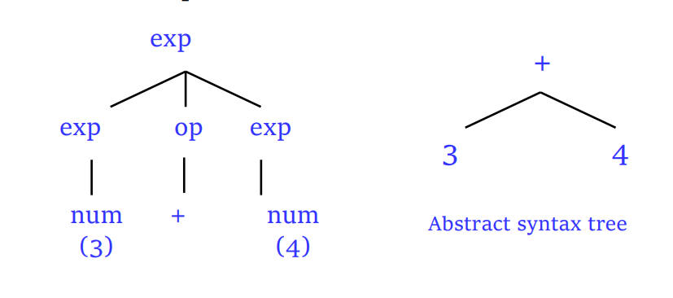

- 比起语法树，省略了部分细节，带来了更好的语法抽象，对于后续编译阶段是一个更好的数据结构
- 它反映了源码token序列的一个抽象，比语法树更高效

## 歧义(Ambiguity)

- 对于一个CFG，同样的输入可能有不同的解析
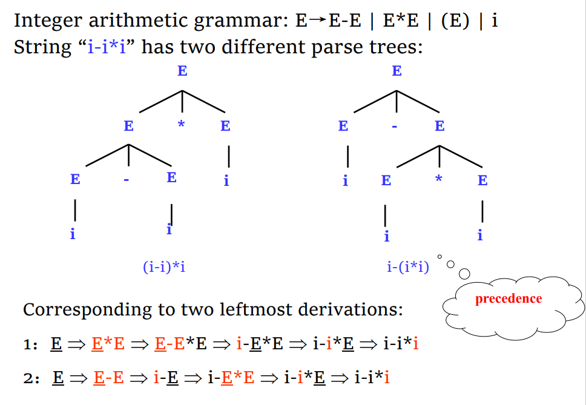

### 解决方法

- 消除歧义(Disambiguity rule)：不改变文法，列举所有可能造成歧义的情况并进行消除，不现实的
- 文法重写：改变文法，进行同义转换：(添加优先级，添加关联性)

$$E\rightarrow E-E|E \times E|(E)|i\;\Rightarrow \begin{array}{c}
E\rightarrow E-E|T\\
T\rightarrow T\times T|F\\
F\rightarrow(E)|i
\end{array}$$

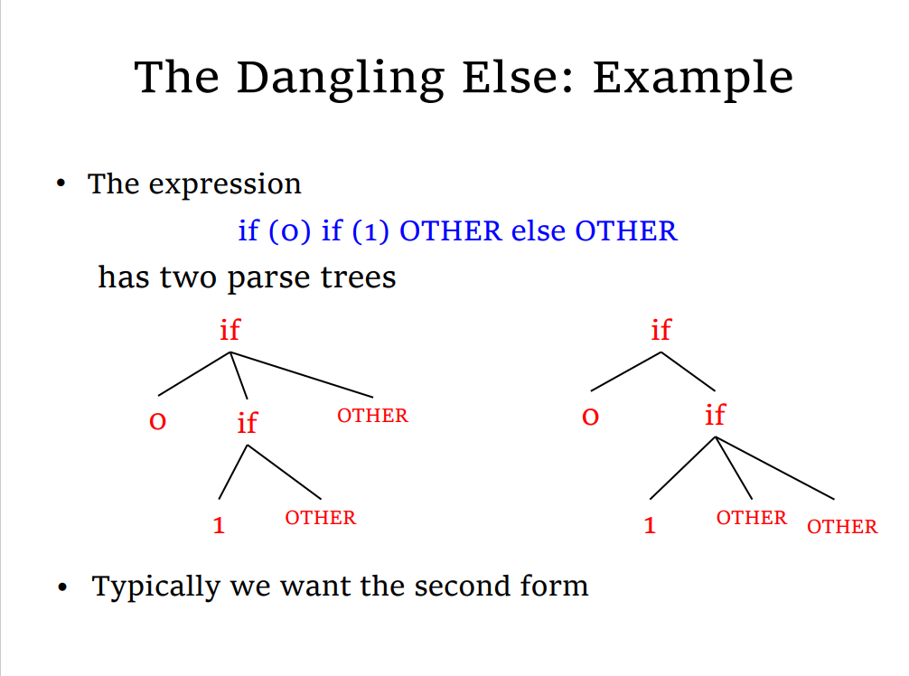
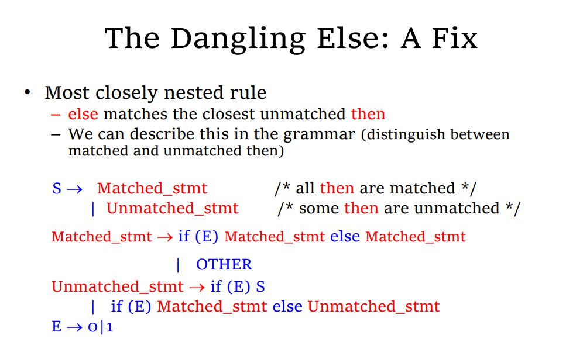
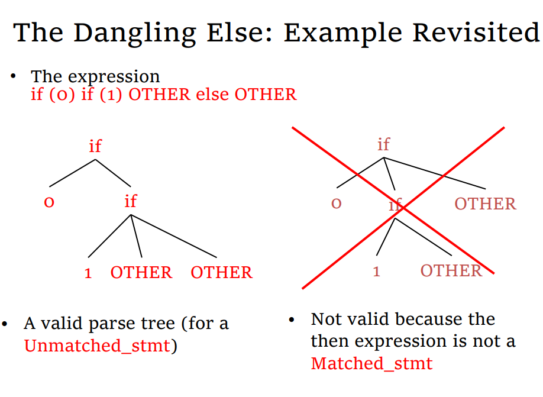

# 语法分析算法(parsing)

## Top-Down(Leftmost) parsing

- 本质上是一个图搜索问题，在树上搜索，查找能否获得一个与输入sentence匹配的路径

### 回溯算法(Backtracking)

- 用BFS：进行图遍历搜索，复杂，时间复杂度过高，产生大量无用分支，时间和空间的最差情况都是指数级别。现代编译器中不被使用
- 剪枝：由终止符号做前缀时，如果无法与输入的前缀匹配则剪枝。($Aa|Ab|c\rightarrow caaaaa$时，无法剪枝，因为前缀一直是非终止符号)
- 用DFS：有比BFS更好的空间复杂度和时间复杂度，但是无法匹配($Aa|c\rightarrow c$，因为会一直循环)

### 预测推导(predictive parsing)

- Idea：利用先行词(lokkahead tokens)，也就是上面提到过的终止符前缀
- 两种分析方法：

 1. 递归下降分析(Recursive-descent parsing)
 2. LL(1)分析

#### 预测分析的概念

- 从输入串和文法的开始符号开始分析
- 可以从当前输入的token(s)唯一确定下一个要使用的产生式
- 预测分析文法包括LL(k)文法，其中L表示从左向右扫描，L表示最左推导，k表示“需要$\le k$个先行词用于预测  ”
- LL(1)文法是常用的，也不完全常用

##### Lookahead Sets

###### First Sets(具体计算看讲义和书)

- 定义
$$\begin{array}{c}
G=(V_N,V_T,P,S)\text{是一个文法}\\
\beta\in(V_N\cup V_T)^*\\
FIRST(\beta)=\{\alpha\in V_T|\beta\Rightarrow^*a...\}\\
if\;\beta\Rightarrow^*\varepsilon\;then\;\varepsilon\in FIRST(\beta)
\end{array}$$
- 计算

计算3.png)
计算4.png)
计算5.png)

//Todo 提取简练课程笔记

###### Follow Sets

- 定义：

$$\begin{array}{c}
G=(V_N,V_T,P,S)\text{是一个文法}\\A\in V_N\\
FOLLOW(A)=\{a\in V_T|S\Rightarrow^*...Aa...\},\\
if\;S\Rightarrow...A,\;then\;\$\in FOLLOW(A)\\
\$是用来标记输入的终止的符号
\end{array}$$

- 计算：
计算2.png)

##### 可空的非终止符(nullable nonterminal)

- 定义：
  $$S\Rightarrow^*\varepsilon$$
则称S是一个可空的非终止符
- 计算：


##### 判定LL(1)文法

- 计算每个可空的非终止符
- 计算产生式右侧所有的$FIRST(\alpha)$并验证其两两交集是否为空
- 计算(1)中算出的非终止符的$FOLLOW(A)$并验证$FIRST(A)\cap FOLLOW(A)=\varnothing$
示例.png)

##### 非LL(1)到LL(1)

- 两种简单的非LL(1)情形：

 1. 左因子，例如$A\rightarrow \alpha \beta|\alpha r$，这是两个产生式的简写，其产生式交集为$\alpha$，改写方法为
   $$\begin{array}{c}
A\rightarrow\alpha\beta_1|\alpha\beta_2|...|\alpha\beta_n\;重写为:\\
A\rightarrow\alpha A{'}\quad A^{'}\rightarrow\beta_1|\beta_2|...|\beta_n
\end{array}$$
 2. 左递归，包括直接左递归和间接左递归，例如$A\rightarrow A \beta$和$A\rightarrow B \beta\quad B\rightarrow A\alpha$ 改写方法为
$$\begin{array}{c}
A\rightarrow A \alpha|\beta\;\text{重写为：}\\
A\rightarrow\beta A^{'}\; ,\;A^{'}\rightarrow\alpha A^{'}|\varepsilon\\
\text{一般情况为：}\\
A\rightarrow A \alpha_1|A \alpha_2|...|A \alpha_m|\beta_1|\beta_2|...|\beta_n\; \text{重写为：}\\
A\rightarrow \beta_1 A^{'}|\beta_2 A^{'}|...|\beta_n A^{'}\\
A^{'}\rightarrow\alpha_1 A^{'}|\alpha_1 A^{'}|...|\alpha_m A^{'}|\varepsilon
\end{array}$$

- 要注意：将这两者进行改写后并不能保证改写后的文法是LL(1)，仍需要再进行验证

#### 递归下降

##### 输入

- 非终止符号递归调用，终止符号匹配

```cpp
int main(){
 Token token = getNextToken();
 S();/*S is the start symbol*/
 if(token!='$') throw error;
}
void A(){
 /*select a production of A:A→X_1X_2...X_k*/
 for(int i=0; i<k; k++){
  if(X[i].isnonterminal()) X[i]();
  else if(X[i]==input token) getNextToken();
  else throw error;
 }
}
```

- 如果$U\rightarrow x_1|x_2|...|x_n\; 且x_1,x_2,...,x_n\not= \varepsilon:$

```cpp
void U(){
 if (token in First(x_1)) x_1();
 else if (token in First(x_2)) x_2();
 ...
 else if (token in First(x_n))x_n();
 else throw error;
}
```

- 如果$U\rightarrow\varepsilon$则把

```cpp
void U(){
 if(token in First(x_n))x_n();
 else throw error;
}
```

改写为：

```cpp
void U(){
 if (token in First(x_n))x_n();
 else if(token not in Follow(x_n)) throw error;
}
```

###### 示例

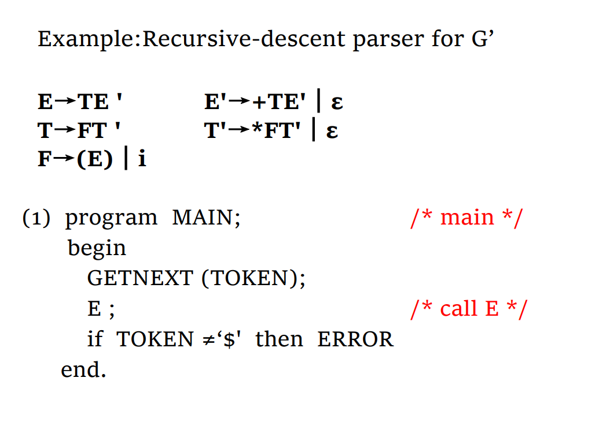
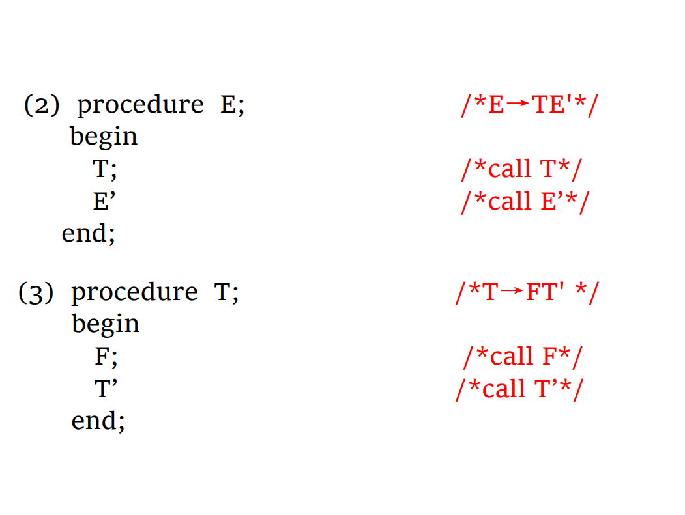
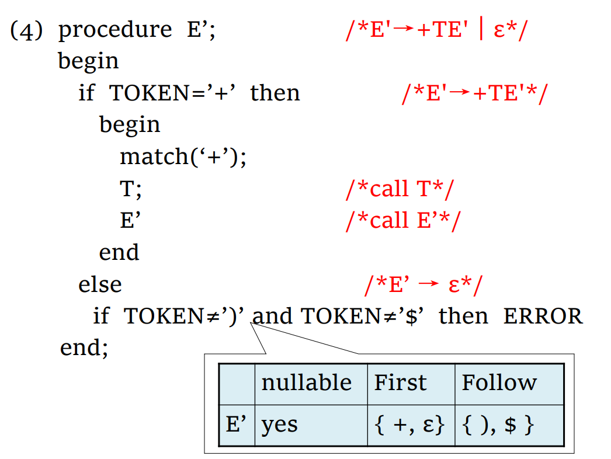
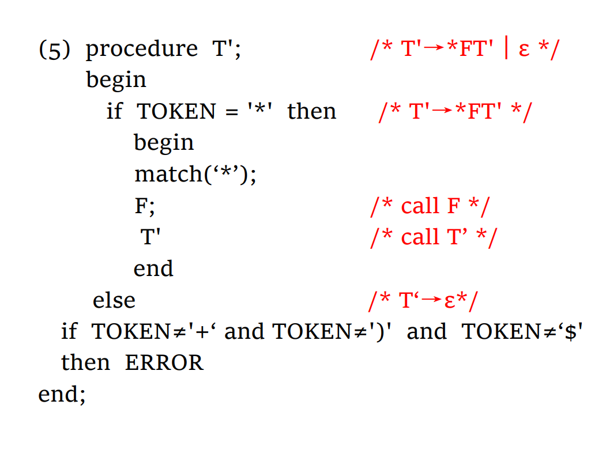
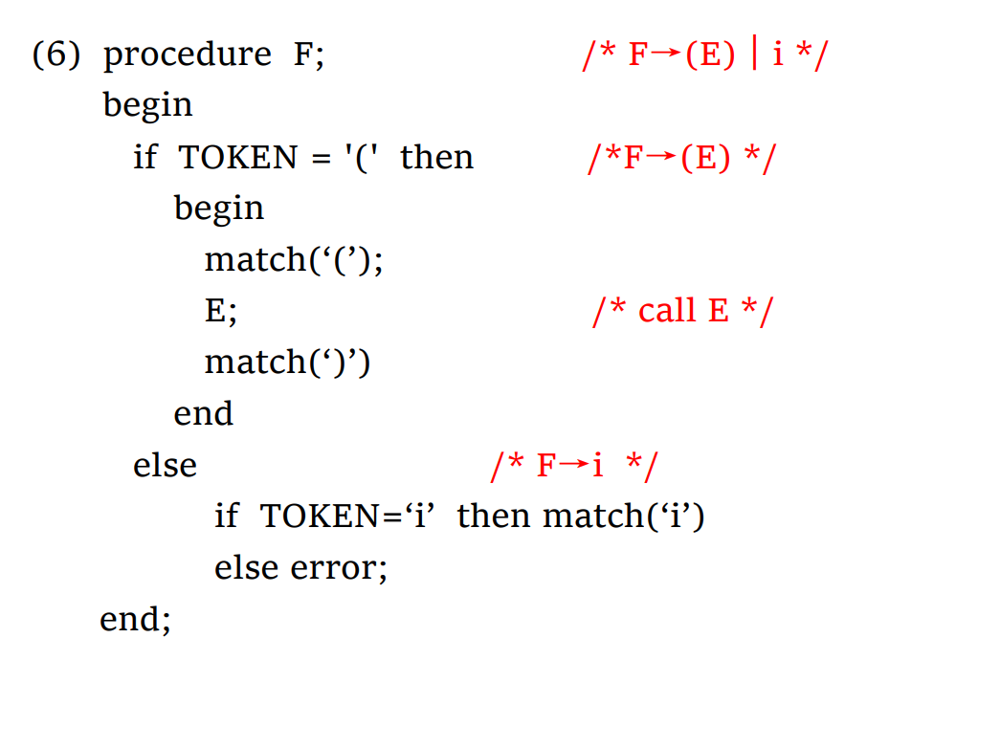

##### 输出(生成语法树)

- 语法树是一个中间表示
- 生成抽象语法树需要定义一个语义规则
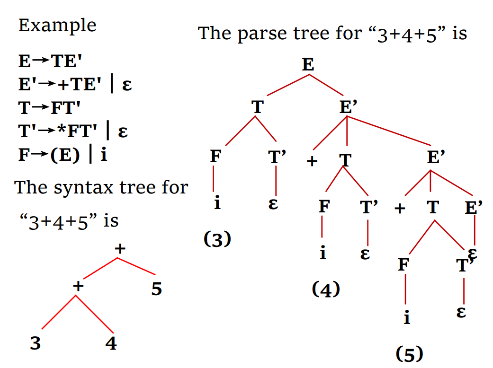
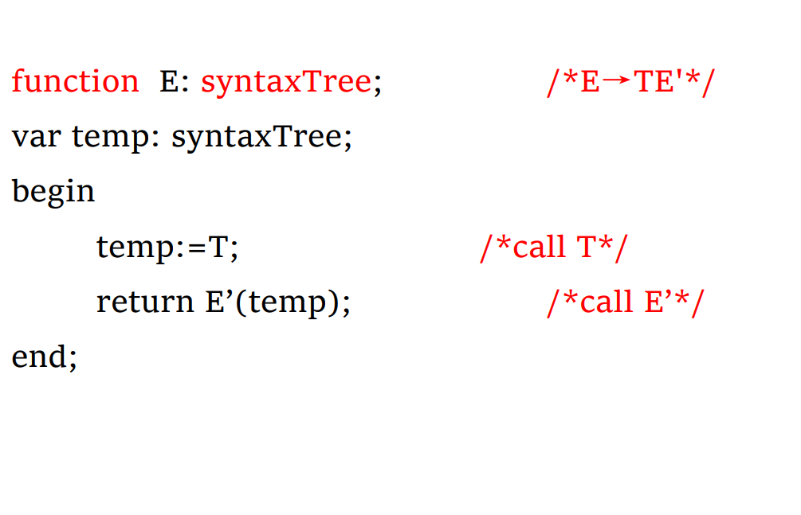
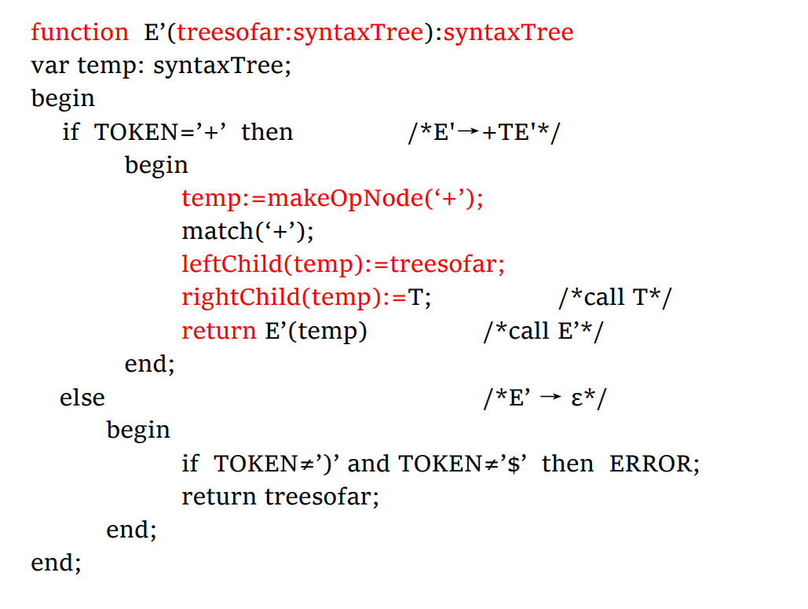

##### 优劣

- 优点：多功能，功能强大，简单有效；灵活，允许程序员安排操作，适用于手工生成的分析器
- 缺点：必须小心安排每个代码里的操作，而且递归操作会带来大量的时间复杂度和空间复杂度。

#### LL(1)

- 就是在递归下降的基础上用栈代替了递归，时间复杂度为$O(n|G|)，n是字符串的长度，G是语法的长度$
原理.png)
- 通过分析表(parsing table)来分析怎么转化一个非终止符号(如果不满足LL(1)文法，就会出现一个表项里有多个产生式)

##### 产生分析表

- 分析表项$M[N,t]$表示对于一个非终止符号N，当前输入token为t时，选择的产生式
- 构造分析表，对每个产生式$A\rightarrow \alpha$重复以下两步：
  1. $对每个在FIRST[\alpha]$中的$token$，把产生式$A\rightarrow\alpha$加入表项$M[A,a]中$
  2. 如果$\varepsilon \in First(\alpha)$，对$Follow(A)\text{中的每个元素(包括token和}\$)$，把$A\rightarrow \alpha$加入表项$M[A,a]$
  _parsing_table1.png>)
  _parsing_table2.png>)
  - 从分析表的角度来说，一个不满足LL(1)文法的CFG文法产生的产生表的一个表项内可能有多个产生式，无法做到唯一选择
  
##### 分析步骤

1. 开始于把起始符号压入栈中；
2. 把栈顶的非终止符号A用查表得到的产生式$A\rightarrow \alpha$替换；
3. 当栈顶元素为终止符号后，将栈顶元素与输入匹配，匹配成功后，同时丢弃栈顶元素和输入元素
4. 重复2、3步，直到输入和栈同时为空，则分析成功结束。

- 具体流程图(包括错误出现)：

流程图.png)

- 示例：
举例.png)

### 错误处理

- 错误恢复(recovery)，在遇到错误时先恢复，让整个分析完成后再一起报错，而不是遇到一个报一个
- 错误修复(repair)：在出错后尝试修复

#### 错误恢复

##### Panic Mode

- 不断尝试可能的token，如果能使得错误消失，那么就能继续分析了
- 通常从错误部分上下文的$FOLLOW(优先)和FIRST$集合中的token尝试


## Bottom-up Parsing I

### 目录

- Handle
- Shift/Reduce Parsing (Where to find handles)
- LR parser
- LR(0) items and LR(0) Parsing Table (How to search for possible handles )

### Handle

- 什么时候看到一个什么产生式的右部进行怎么样的规约(用哪个产生式)是Bottom-up算法的核心，而这个被归约的部分被称为handle，例如$aAcde\Rightarrow aAbcde \Rightarrow aAcde$中，$Ab是$$aAbcde\text{的}handle$  
- $handle$在右句型的左边(workarea)的最右边
- 从输入区移入语法分析栈(workarea)的过程称为shift，将栈中部分弹出并规约再入栈称为reduce
- 右句型(tight sentential Form): $S\Rightarrow^*Sentential Form$

### Shift and Reduce Parsing

- 把分析栈成文右句型的可行前缀(viable prefix)
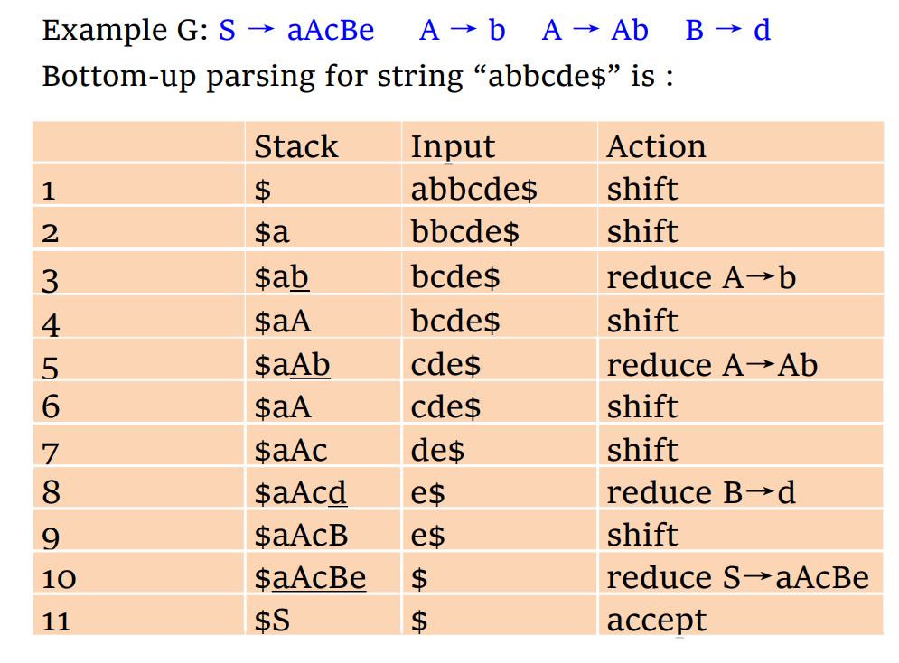
- 这种方法也被称为LR(0)，因为不需要lookahead token
- 但是LR算法需要看到栈顶以下多个元素，因此需要引入state来标记

### LR Parsing


- 其中$S_m$是状态，$X_m$是文法符号

#### Parsing Table


- 对表项$action[S_m,a_i]$：
  - Shift($s_k$)表示把对应的标识符$S_m$和状态$s_k$从输入移入到分析栈中
  - Reduction($r_k$)表示用第$k$个产生式($A\rightarrow \gamma$)进行规约，这个步骤包括：
    1. 把$\gamma 串$ 对应的所有字符和状态从栈中弹出，假设弹出后栈顶状态位$s_i$
    2. 把非终止符号A入栈
    3. 把状态$S_j=GOTO[S_i,A]入栈$
- Accept：表示分析顺利结束
- Error：表示分析遇到了某些问题


### LR(0) items and parsing table

#### LR(0) items

- 一个语法G的LR(0)项就是G的产生式再在其右侧加上一个位置点
- 例如$U\rightarrow  XYZ$有四种形式：$[0]\;U\rightarrow \cdot XYZ$ $[3]\;U\rightarrow XYZ \cdot$(被称为完成项)
- $U\rightarrow X\cdot YZ$和$T\rightarrow X\cdot AB$可以归成一个项集，用一个state刻画，在栈中用$X_m$来区分这两个项

#### Items 的自动机形式


##### 构建NFA

- 每个状态是一个项
- 几乎用不上 不用了解

##### 构建DFA

- 每个状态是一个项集

1. 增广(augment)：如果原来的文法的开始符号没有做为一个产生式的右部，就新增一个产生式$S\rightarrow E$其中$E$就是原来的开始符号
2. 构建开始状态：把每个产生式都加入初始状态
3. 构造转移：对项集中的每个项，看输入符号后位置点会不会后移，是的话就构造一个转移和对应的项集，并把其$\varepsilon$闭包加入项集，把完成项作为accepting state
4. 不断重复2，3，把增广产生式存在的项集作为接受状态


##### 构建LR(0) Parsing Table

1. 构建DFA
2. 构建state K 对应的ACTION：如果$A\rightarrow \alpha \cdot \beta \in K$ ,则$ACTION[K]=Shift$ 如果 $A\rightarrow \alpha \cdot \in K$ , 并且$A\rightarrow \alpha$需要$j$个栈中元素，那么$ACTION[K]=R_j$

##### LR(0)的限制

- LR(0)的自动机中有完成项的项集只能有完成项，否则会出现shift/reduce冲突(同时有完成项和非完成项)或reduce/reduce冲突(有多个完成项)

## Bottom-UP Parsing II

### 目录

- SLR(1)
- LALR(1)
- LR(1)

### SLR(1)(Simple LR(1))

#### SLR(1)文法

- simple在使用的仍然是LR(0)的DFA
语法.png)

对于一个状态$I=\{X\rightarrow \alpha \cdot b \beta,A\rightarrow r \cdot,B\rightarrow \delta \cdot\}$其中$b\in V_T$ 如果$Follow(A)\cap Follow(B)=\varnothing$且不包含$b$ 那么$I$的下一个行动取决于下一个输入的token $'a'$

- 如果$a=b$ 那么$shift$
- 如果$a\in Follow(A)$那么进行规约$A\rightarrow r$
- 如果$a\in Follow(B)$那么进行规约$B\rightarrow \delta$
- 否则报错

#### SLR(1)分析表

分析表.png)

#### SLR(1)算法

//Todo 插入

#### SLR(1)的缺点

- 只关注FOLLOW set，在某些情况下不能正确规约。原因是Follow(A)表示某个非终止符号所有可能跟着的符号，而并不是在每个包含A的句型中都会出现Follow(A)中的符号，我们用Follow(A)进行规约的时候就会出现这种问题

的缺点.png)

### LR(1)

#### LR(1)的项

- LR(1)的项由LR(0)的项(被称为核core)和一个lookahead token组成
项.png)

- 所有LR(0)、LL(1)文法都是LR(1)文法
- 所有确定的CFL(context free language)都有一个LR(1)文法
- 所有LL(k)、LR(k)语言都是LR(1)，尽管某个语言中的某个文法可能不是LR(1)

### LALR(1)

- 把有相同的核，不同lookahead token的项进行合并，但是包含的语义和LR(1)是不一样的，可能并不等价
- LR(0)、SLR(1)和大多数LR(1)都是LALR(1)文法，
