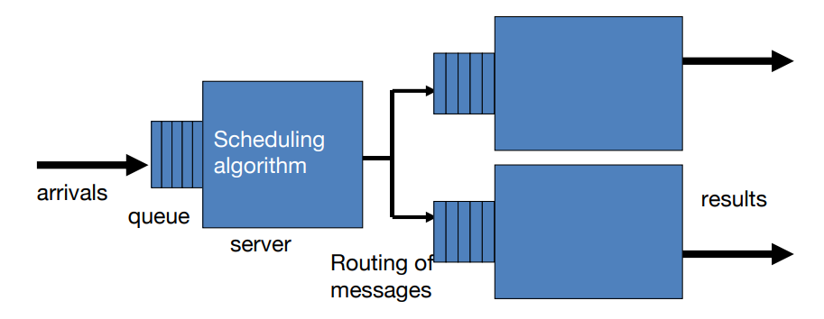
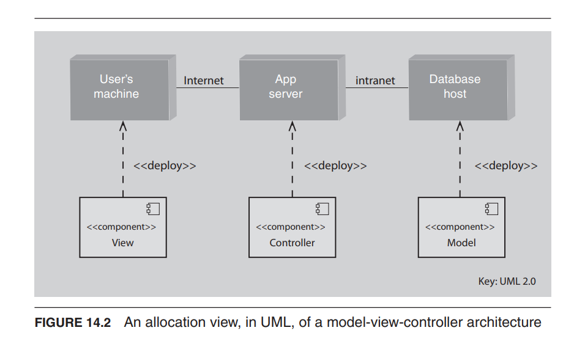
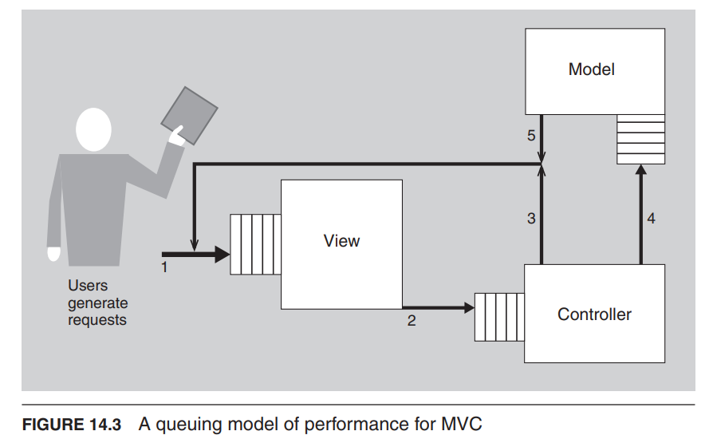
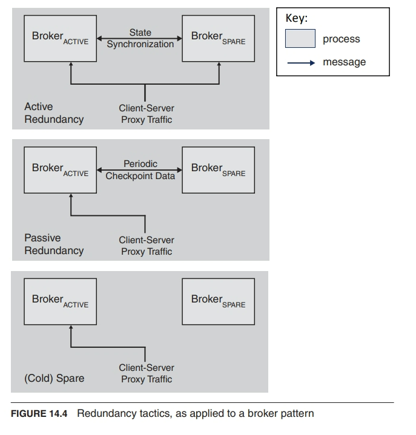

## 我们如何了解软件的质量属性？

- 实验和测量
- 分析模型
- 模拟

## 建模架构以支持质量属性分析

- 一些质量属性，尤其是性能和可用性，已经有了被广泛理解和经过时间验证的分析模型，可以用于辅助分析。
- 通过分析模型，我们指的是支持定量分析的模型。

### 性能建模

- 参数：事件的到达速率、选择的排队规则、选择的调度算法、网络拓扑、网络带宽、选择的路由算法、事件的服务时间

#### MVC分配建模(Allocation Model for MVC)

#### MVC队列建模

#### 性能建模的成本效益

- 成本：确定先前提到的参数
- 效益：延迟的估计
- 参数的估计越准确，延迟的预测就越好。
- 当延迟至关重要且存在疑问时，这是值得的。
- 当明显有足够的容量满足需求时，这是不值得的。

### 可用性建模

- 另一个具有被广泛理解的分析框架的质量属性是可用性。
- 可用性建模旨在确定组件的故障率和恢复时间。
- 稳态可用性
  - MTBF 是平均故障间隔时间
  - MTTR 是平均修复时间

$$
\frac{MTBF}{MTBF+MTTR}
$$

- 增加代理商可用性的三种不同策略是：
  - 主动冗余（热备份）
  - 被动冗余（温备份）
  - 备用（冷备份）。

### 实验和原型

- 许多工具可以帮助进行实验，以确定设计的行为
  - 请求生成器可以创建合成负载以测试可扩展性
  - 监视器可以进行非侵入式资源使用检测。
- 这些工具依赖于部分或原型实现。
  - 对于最重要的决策，可以使用原型替代方案。
  - 如果可能，在实现原型时，可以以一种方式实现，以便可以重复使用其中的一部分。
  - 故障注入工具可以引发故障，以确定系统在故障条件下的响应。

## 总结

- 分析始终是一种成本效益活动
  - 成本是创建和执行分析模型和工具的度量
  - 效益取决于
- 分析的准确性
- 正在进行分析的事物的重要性
- 分析可以通过以下方式进行
  - 用于某些属性的模型
  - 测量
  - 模拟
  - 原型
  - 思维实验
