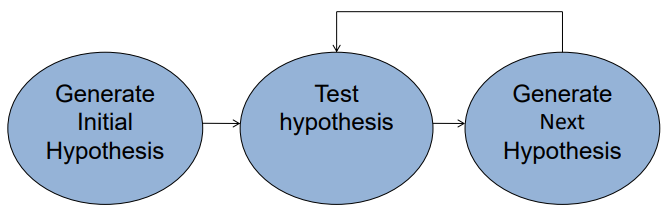
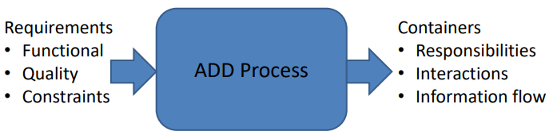
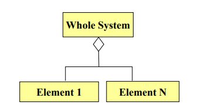

## 设计策略(Design Strategy)

- 分解(Decomposition)
- 面向架构重要性需求的设计(Designing to Architecturally Significant Requirements)
- 生成和测试(Generate and Test)

## 分解(Decomposition)

- 架构决定了质量属性
- 重要的质量属性是整个系统的特征。
- 设计从整个系统开始
  - 整个系统被分解为各个部分
  - 每个部分可能继承全部或部分质量属性需求

## 面向架构重要性需求的设计(Designing to Architecturally Significant Requirements)

- 这些是您必须通过设计满足的需求
  - 这些需求数量较少
  - 从定义上来说，它们是最重要的
- 问题：
  - 同时设计多少个ASR？
    - 如果您在设计方面缺乏经验，则应一次设计一个ASR，从最重要的ASR开始。
    - 随着经验的积累，您将能够同时设计多个ASR。

## 生成和测试(Generate and Test)

- 将当前设计视为一个假设(Hypothesis)。
- 询问当前设计是否满足需求（测试）。
- 如果不满足，则生成一个新的假设。

- 引出以下问题
  - 初始假设从何而来？
  - 如何测试假设？
  - 如何生成下一个假设？
  - 什么时候算完成？

### 初始假设从何而来？

- 现有系统
  - 很少有系统完全从头开始构建
- 框架
  - 提供特定领域常见服务的部分设计，例如Web应用程序、中间件
  - 设计框架可能限制通过经纪人或发布-订阅系统进行通信
- 其他来源：模式和策略

### 如何测试假设？

- 使用先前描述的分析技术
- 测试的输出是什么？
  - 当前设计未能满足的需求清单，包括职责或质量属性需求。

### 如何生成下一个假设？

- 添加缺失的职责。
- 使用策略调整假设的质量属性行为。
  - 策略的选择取决于未满足的质量属性需求。
  - 要注意策略的副作用。

### 何时算完成？

- 所有ASRs都得到满足和/或...
- 您的设计活动预算耗尽
  - 在这种情况下，使用到目前为止最好的假设开始实现
  - 放宽或取消需求
  - 争取更多的预算

## 属性驱动设计方法(The Attribute-Driven Design Method)

- 一种迭代的方法。在每个迭代中，您会：
  - 选择系统的一个部分进行设计。
  - 收集该部分的所有架构重要性需求。
  - 为该部分生成和测试设计。
- ADD不会导致完整的设计：
  - 一组具有职责的容器
  - 容器之间的交互和信息流
- 不会为容器生成API。

### ADD输入

- 需求
  - 功能需求、质量需求、约束条件
- 上下文描述
  - 正在设计的系统的边界是什么？
  - 系统必须与哪些外部系统、设备、用户和环境条件进行交互？

### ADD输出

- 架构元素及其关系
  - 元素的职责
  - 交互
  - 元素之间的信息流

### ADD的步骤

1. 选择系统的一个元素进行设计。
2. 确定所选元素的架构重要性需求（ASRs）。
3. 为所选元素生成设计方案。
4. 进行剩余需求清单的清点并选择下一次迭代的输入。
5. 重复步骤1-4，直到满足所有的ASRs。

#### 步骤1：选择要设计的系统元素

- 对于全新设计(green field designs)，通常选择的元素是整个系统。
- 对于旧系统设计(legacy designs)，选择的元素是要添加的部分。
- 在第一次迭代之后：

:::info 接下来选择哪个元素？

- 有两种基本的细化策略：
  - 广度优先
  - 深度优先
- 如何选择？
  - 如果使用新技术 => 深度优先：探索使用该技术的影响。
  - 如果团队需要工作 => 深度优先：为该团队生成需求。
  - 否则 => 广度优先。
:::

#### 步骤2：确定所选元素的ASRs

- 如果所选元素是整个系统，则使用效用树（如前所述）。
- 如果所选元素进一步分解，那么根据该元素的需求生成一个效用树。

#### 步骤3：为所选元素生成设计解决方案

- 对具有其ASRs的所选元素应用生成和测试的方法。

#### 步骤4：选择下一次迭代的输入

- 对于每个功能需求：
  - 确保需求已满足。
  - 如果未满足，则添加职责以满足该需求。
    - 将其添加到具有类似需求的容器中。
    - 如果没有这样的容器，可能需要创建新容器或将其添加到具有不同职责的容器中（协同性）。
    - 如果容器对一个团队有太多的需求，可以将其拆分为两个部分。在拆分时尽量实现松耦合。

:::info 质量属性需求

- 如果质量属性需求已满足，则无需进一步考虑。
- 如果质量属性需求未满足，则可以选择以下方式之一：
  - 将其委托给子元素之一。
  - 将其分配给子元素。
- 如果无法满足质量属性需求，则可以考虑是否可以削弱该需求。如果无法满足或削弱，则无法满足该需求。
:::

#### 重复步骤1-4，直到满足所有ASRs

- 在第4步结束时，每个子元素将与以下内容关联：
  - 功能需求
  - 质量属性需求
  - 约束条件
- 这为子元素准备了方法的下一次迭代。

## 总结

- 设计策略
  - 分解
  - 针对架构重要性需求进行设计
  - 生成和测试
- 属性驱动设计
  - 选择要设计的系统的一部分。
  - 收集(Marshal)该部分的所有架构重要性需求。
  - 为该部分生成和测试设计。
