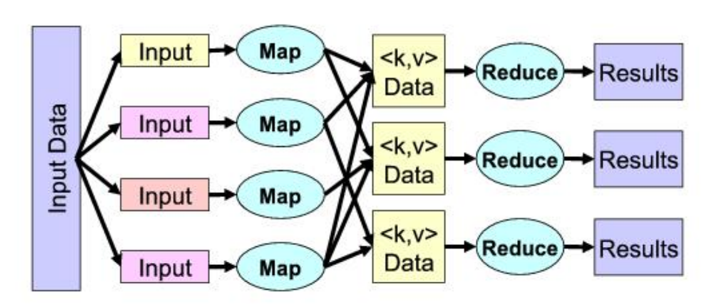
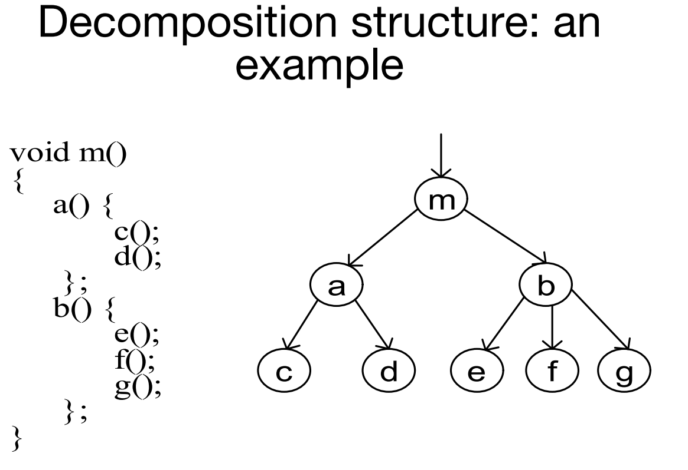
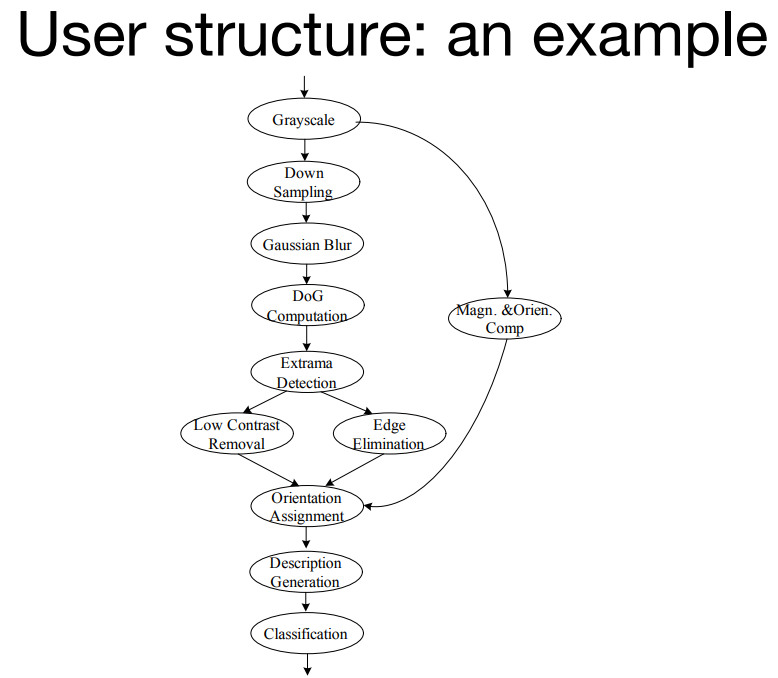
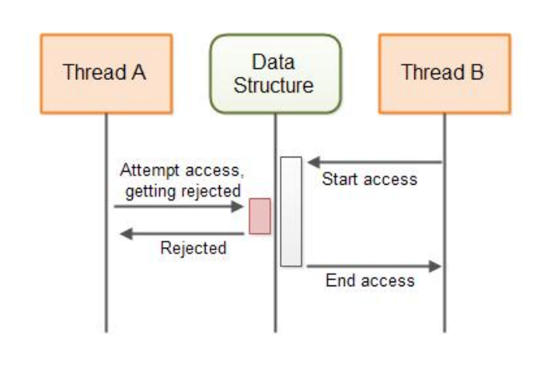
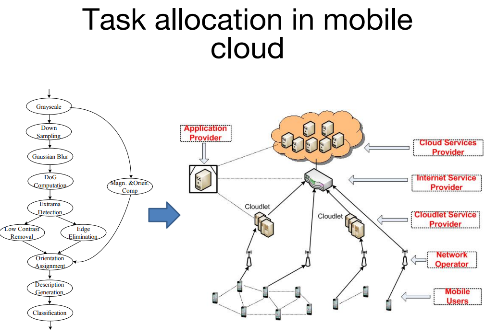
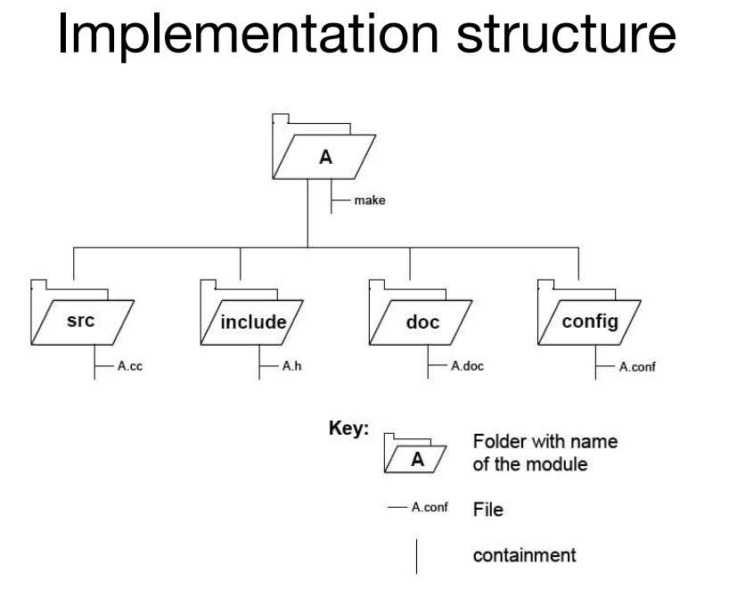
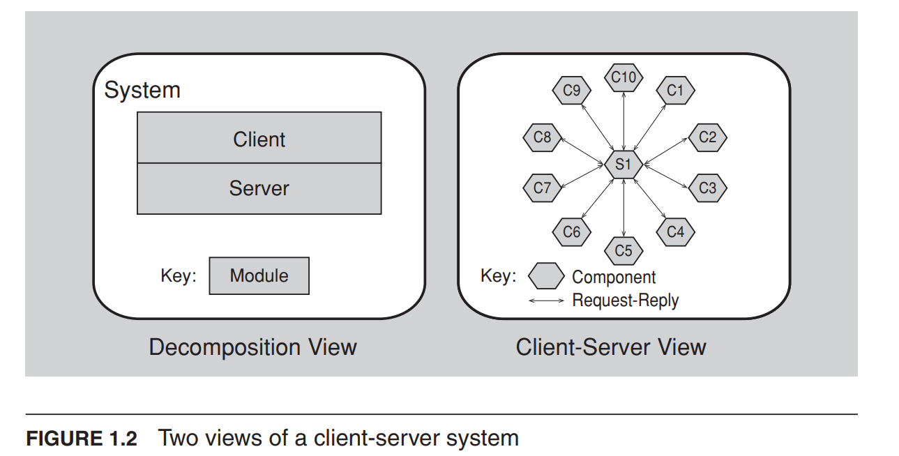
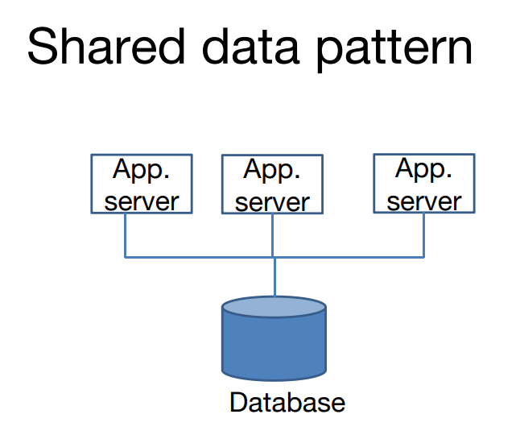

## 什么是软件架构

系统的软件架构是用于推理系统的一组结构，包括软件元素、它们之间的关系以及它们的属性。

:::info 什么是推理
在这里，"推理"指的是通过对系统的结构、元素和属性进行分析和推导，从而得出关于系统行为、性能、可靠性以及其他方面的合理推断和判断。通过推理，架构师和利益相关者可以理解系统的特性、功能和约束，并做出相应的决策，如优化系统设计、改进系统性能、预测系统行为等。推理可以基于已有的知识、经验、规则和模型，并结合对系统需求和上下文的理解进行推断和推测。因此，推理在软件架构中是一种重要的思维和分析方式，用于评估和决策系统的设计和实现。
:::

### 架构是一组软件结构

- 结构是由关系连接在一起的一组元素。
- 软件系统由许多结构组成，并没有单一的结构可以称为架构。
- 架构结构可以分为三个重要的类别：
  1. 模块(Module)；
  2. 组件和连接器(Component and Connector)；
  3. 分配(Allocation)。

#### 模块(Module)

- 一些结构将系统划分为实现单元，我们称之为模块。
- 模块被分配具体的计算责任，并且是编程团队工作任务的基础。
- 在大型项目中，这些元素（模块）会被进一步划分，以便分配给子团队。

#### 组件和连接器(Component and Connector)

- 其他结构关注元素在运行时如何相互交互以执行系统的功能。
- 我们将这些运行时结构称为组件和连接器（C&C）结构。
- 组件始终是运行时实体:
  - 在面向服务体系结构（SOA）中，系统被构建为一组服务。
  - 这些服务由各种实现单元（模块）中的程序组成（编译而成）。

#### 分配(Allocation)

- 分配结构描述了从软件结构到系统环境的映射关系。例如：
  - 模块被分配给团队进行开发，并在文件结构中分配位置进行实现、集成和测试。
  - 组件被部署到硬件上以执行相应的功能。

### 哪些结构是架构的？

- 如果一个结构支持对系统及其属性进行推理，那么它就是架构的。
- 这种推理应该是关于系统的某个对利益相关者来说重要的属性。
- 这些属性包括：
  - 系统实现的功能
  - 系统在面对故障时的可用性
  - 对系统进行特定更改的难度
  - 系统对用户请求的响应速度
  - 其他许多属性。

:::info 每个系统都有一个软件架构

但是这个架构可能没有为任何人所知。

- 可能所有设计该系统的人都已经离开。
- 可能文档已经消失（或从未产生）。
- 可能源代码已丢失（或从未提交）。

:::

### 架构是一种抽象

- 架构专门省略了有关元素的某些信息，这些信息在推理系统方面没有用处。
- 架构抽象使我们能够从元素的角度来看待系统，包括它们的排列方式、相互作用方式、组合方式等等。
- 这种抽象对于管理架构的复杂性至关重要。

### 架构包括行为

- 在能够用于推理系统的前提下，每个元素的行为都是架构的一部分。
- 这种行为体现了元素之间的相互作用，这显然是架构定义的一部分。

## 结构与视图

- 视图是一组连贯的架构元素的表示，由系统利益相关者编写和阅读。
- 结构是元素本身的集合，它们存在于软件或硬件中。
- 简而言之，视图是结构的表示。
  - 例如，模块结构是系统模块及其组织的集合。
  - 模块视图是该结构的表示，根据选择的符号系统中的模板进行文档化，并由一些系统利益相关者使用。
- 架构师设计结构。他们记录这些结构的视图。

### 模块结构

- `模块结构`体现了如何将系统作为一组`代码或数据单元`进行结构化的决策。
- 在任何模块结构中，元素都是某种类型的模块（可能是类、层次结构，或者仅仅是功能的划分，所有这些都是实现单元）。
- 模块被分配了功能责任的区域。

### 组件和连接器结构

- 组件和连接器结构体现了如何将系统作为具有`运行时`行为（组件）和相互作用（连接器）的元素集合进行结构化的决策。
- 元素是`运行时组件`，例如服务、对等体、客户端、服务器或其他类型的运行时元素。
- 连接器是组件之间的通信方式，例如调用返回、进程同步操作符、管道或其他方式。
- 组件和连接器视图帮助我们回答诸如此类的问题，例如下图：
  - 主要执行组件是什么以及它们在运行时如何交互？
  - 主要的共享数据存储是什么？
  - 系统的哪些部分被复制？
  - 数据如何通过系统进行？
  - 系统的哪些部分可以并行运行？

### 分配结构

- `分配结构`显示软件元素与一个或多个外部环境中的元素之间的关系，这些环境是软件创建和执行的地方。
- `分配视图`帮助我们回答以下问题：
  - 每个软件元素在哪个`处理器`上执行？
  - 在开发、测试和系统构建过程中，每个元素存储在哪些目录或`文件`中？
  - 每个软件元素分配给哪个`开发团队`？

### 结构提供了洞察力

- 每个结构为推理相关的一些质量属性提供了透视。
- 例如：
  - `模块结构(Module structure)`体现了模块之间的使用关系，与系统的易扩展性密切相关。
  - `并发结构(concurrency structure)`体现了系统内部的并行性，与系统消除死锁和性能瓶颈的容易程度密切相关。
  - `部署结构(Deployment structure)`与实现性能、可用性和安全性目标密切相关。

### 一些常用的模块结构

#### 分解结构(Decompositon Structure)

- 用来展示模块是如何被划分成更小的模块的，例如

#### 使用结构(Uses structure)

- 这里的单元也是模块，可能是类。
- 这些单元通过使用关系相互关联，使用关系是一种特殊形式的依赖关系。
- 如果一个软件单元的正确性需要一个正确运行的第二个单元的存在，那么该单元就使用了第二个单元。

#### 层次结构(Layer structure)

- 这个结构中的模块被称为层次。
- 层次是一个抽象的“虚拟机”，通过一个受管接口提供一组协同工作的服务。
- 层次允许以严格管理的方式使用其他层次。
  - 在严格分层的系统中，一个层次只允许使用单个其他层次。
- 这种结构赋予系统可移植性，即改变底层计算平台的能力。

#### 类（或泛化）结构(Class (or generalization) structure)

- 这个结构中的模块单位被称为类。
- 关系是继承自或是一个实例。
- `继承`是一种代码重用的机制，可以独立扩展原始软件。
- 类结构允许我们推理关于重用和逐步增加功能的问题。

#### 数据模型结构

- 数据模型以数据实体及其关系的形式描述静态信息结构。
  - 例如，在银行系统中，实体通常包括账户（Account）、客户（Customer）和贷款（Loan）。
  - 账户具有多个属性，例如账号、类型（储蓄或支票）、状态和当前余额。

### 一些常用的组件和连接器结构(Some Useful C&C Structures)

#### 服务结构( Service structure)

- 这些单元是通过等服务协调机制相互协作的服务。
- 服务结构有助于构建一个由相互独立且匿名的组件组成的系统

#### 并发结构(Concurrency structure)

- 这个结构有助于确定并行性的机会以及资源争用可能发生的位置。
- 单元是组件。
- 连接器是它们的通信机制。
- 组件被组织成逻辑线程。

### 常用的分配结构(Some Useful Allocation Structures)

#### 部署结构(Deployment structure)

- 部署结构显示软件如何分配给硬件处理和通信元素。
- 元素包括软件元素（通常是来自C&C视图的进程）、硬件实体（处理器）和通信路径。
- 关系是`allocated-to`，显示软件元素驻留在哪些物理单元上，以及如果分配是动态的，则是migrates-to。
- 这个结构可用于推理性能、数据完整性、安全性和可用性。
- 它在分布式和并行系统中尤为重要。

#### 实现结构(Implementation structure)

- 这个结构显示了软件元素（通常是模块）在系统的开发、集成或配置控制环境中如何映射到`文件结构`。

#### 工作分配结构(Work assignment structure)

- 这个结构将实现和集成模块的责任分配给将执行此任务的团队。

### 结构关联

- 一个结构中的元素将与其他结构中的元素相关联，我们需要推理这些关系。
  - 在分解结构中的一个模块可以表现为一个、部分或多个组件之一，属于组件和连接器结构之一。
- 一般来说，结构之间的映射是多对多的。

### Modules vs. Components

## 架构模式(Architectural Patterns)

- 架构模式提供了解决特定问题时使用的元素类型和它们的交互形式。
- 一个常见的模块类型模式是分层模式。
  - 当软件元素之间的使用关系是严格单向的时候，就会出现一组层次结构。
  - 层次是一组相关功能的协调集合。

### 常见的组件和连接器模式(Common component-and-connector type patterns)

#### 共享数据（或存储库）模式(Shared-data (or repository) pattern)

- 这个模式包括创建、存储和访问`持久数据`的组件和连接器。
- 存储库通常采用（商业）数据库的形式。
- 连接器是用于管理数据的协议，如SQL。

#### 客户端-服务器模式(Client-server pattern)

- 组件是客户端和服务器。
- 连接器是协议和它们之间共享的消息，用于执行系统的工作。

#### 点对点模式(Peer-to-peer pattern)

- 例如，Bittorrent、eMule。

### 常见的分配模式(Common allocation patterns)

#### 多层模式(Multi-tier pattern)

- 这个模式专门针对通用的部署（软件到硬件的分配）结构。
- 描述了如何将系统的组件分布和分配到不同的硬件和软件子集中，通过某种通信媒介连接起来。

#### 能力中心模式和平台模式(Competence center pattern and platform pattern)

- 这些模式专门针对软件系统的工作分配结构。
- 在能力中心模式中，根据某个站点的技术或领域专长，将工作分配给各个站点。
- 在平台模式中，一个站点负责开发`可重用的软件产品线的核心资产`，其他站点则开发使用这些核心资产的应用程序。

## 什么是“好”的架构？(What Makes a “Good” Architecture?)

- 并不存在固有的好或坏的架构。
- 架构可以进行评估，但仅在特定的目标背景下。
- 架构或多或少适合某种目的。
- 然而，有一些好的经验准则(good rules of thumb)。

### 经验准则——流程(Process “Rules of Thumb”)

- 架构应由单个架构师或由一小组架构师与指定的技术负责人共同完成。
- 架构师（或架构团队）应基于优先级明确的质量属性需求列表来建立架构。
- 架构应使用视图进行文档化。
- 架构应根据其提供系统重要质量属性的能力进行评估。
- 架构应适合逐步实施。

### 经验准则——结构(Structural “Rules of Thumb”)

- 架构应具有明确定义的模块。
- 架构不应依赖于特定版本的商业产品或工具。
- 生成数据的模块应与消费数据的模块分开。
  - 这倾向于增加可修改性。
- 不要期望模块与组件之间存在一对一的对应关系。
- 每个进程都应该编写成可以轻松更改其分配给特定处理器的方式，甚至可能在运行时进行更改。
- 架构应提供一小组组件交互的方式。
  - 系统在整个过程中应以相同的方式执行相同的任务。

## 总结

- 一个系统的`软件架构(A Software architecture)`是用于推理系统的一组结构，包括软件元素、它们之间的关系以及它们的属性。
- `结构(A Structure)`是一组元素及其之间的关系。
- `视图(A View)`是一组相关的架构元素的表示。一个视图是一个或多个结构的表示。

- 常用的结构(Useful Structures)
  - 模块结构
    - 分解结构
    - 用户结构 -> 分层模式
    - 类结构
    - 数据模型
  - 组件和连接器结构
    - 服务结构
    - 并发结构
  - 分配结构
    - 部署结构
    - 实现结构
    - 工作分配结构
- 架构模式(Architectural patterns)
  - 模块类型模式
    - 分层模式
  - 组件和连接器类型模式
    - 共享数据模式
    - 客户端和服务器模式
    - 点对点模式
  - 分配类型模式
    - 多层模式
    - 能力中心模式
    - 平台模式
