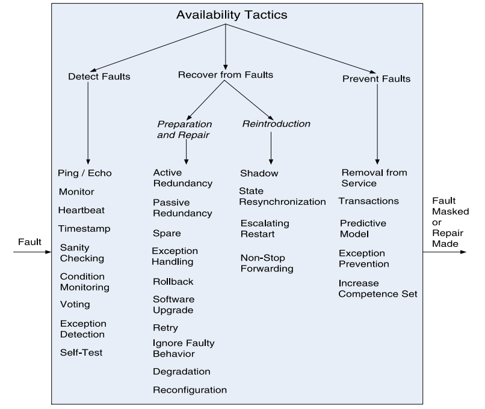
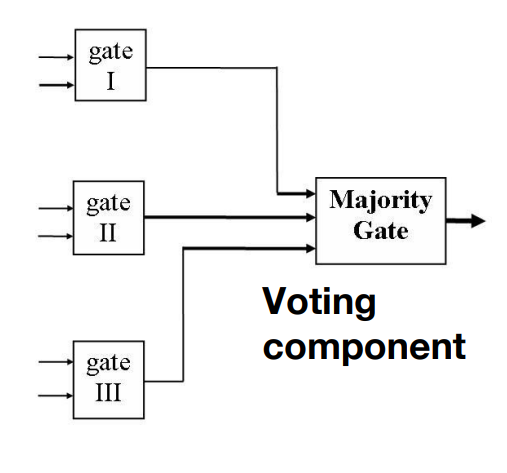

## 什么是可用性

- 可用性指的是软件具备在需要时随时可用并准备好执行任务的属性。
- 可用性是指系统能够掩盖或修复故障，以使累积的服务中断时间不超过指定时间间隔内的要求值。
- 可用性的目标是通过减轻故障来最小化服务中断时间。

:::info 可用性与可靠性或可信性的区别

- 可用性包括通常所称的可靠性。
- 可用性还涵盖了其他考虑因素，例如由于定期维护导致的服务中断。
- 可用性与以下因素密切相关
  - 安全性，例如拒绝服务攻击
  - 性能
  - ...

:::

## 可用性策略(Availability Tactics)的目标

:::info 故障(Fault) vs 失败(Failure)？

- 失败发生在系统不再按照其规范提供服务时
  - 此故障可以被系统的参与者观察到。

- 故障（或故障的组合）有可能导致失败。
:::

可用性策略使系统能够忍受故障，以便服务保持符合其规格说明。这些策略可以防止故障导致失败，或至少限制故障的影响，并使修复成为可能。

### 检测故障(Detect Faults)

- Ping/echo：用于确定与相关网络路径的连通性和往返延迟。
- 监视器(Monitor)：用于监控系统其他部分的健康状态的组件。
- 心跳(Heartbeat)：系统监视器与被监视的进程之间的定期消息交换。
  - 进程定期在其监视器中重置看门狗计时器，
  - 将心跳消息与其他控制消息捆绑在一起，减少开销。
- "ping"和"heartbeat"之间的区别是什么？
  - 谁发起健康检查？ping是检查者主动发信息，heartbeat 是被检查者发信息
- 时间戳(Timestamp)：用于检测分布式消息传递系统中的事件顺序错误。
- 条件监控(Condition Monitoring)：检查进程或设备中的条件，或验证设计过程中的假设。
  - 例如，在数据存储和传输中使用校验和(checksum)。
- 投票(Voting)：这种策略的常见实现是三重模块冗余(Triple Modular Redundancy TMR)。

### 从故障中恢复(准备和修复)(Recover from Faults (Preparation & Repair))

- 主动冗余(热备份)(Active Redundancy (hot spare))：保护组中的所有节点以并行方式处理相同的输入，允许冗余备份与活动节点保持同步状态。
- 备用(冷备份)(Spare (cold spare))：保护组的冗余备份保持停机状态，直到发生故障切换，此时在将冗余备份投入使用之前，会启动电源复位程序。
- 被动冗余(温备份)(Passive Redundancy (warm spare))：只有保护组的活动成员处理输入流量；
  - 其中一个职责是向冗余备份提供定期的状态更新。
- 回滚(Rollback)：恢复到先前已知的良好状态，称为"回滚点"。
  - 这种策略与冗余策略结合使用。
  - 在发生回滚后，故障组件的备用版本变为活动状态。
  - 回滚依赖于先前状态的副本（检查点）。
  - 检查点可以存储在固定位置，并需要定期更新。
- 重试(Retry)：当故障是暂时性的，重新尝试操作可能会成功。
  - 例如，网络重传。
- 忽略错误行为(Ignore Faulty Behavior)：当确定某个消息是伪造的时，忽略来自该消息源的消息。
  - 例如，忽略来自拒绝服务攻击者的消息。
- 退化(Degradation)：在组件故障的情况下保持最关键的系统功能，放弃较不关键的功能。
- 重新配置(Reconfiguration)：将责任重新分配给仍然正常运行的资源，同时尽可能保持功能性。

### 防止故障(Prevent Faults)

- 服务移除(Removal From Service)：将系统组件暂时置于停机状态，以减轻潜在的系统故障。
- 事务(Transactions)：将状态更新打包，使分布式组件之间交换的异步消息具有原子性、一致性、隔离性和持久性。
- 预测模型(Predictive Model)：在检测到预测可能的未来故障的条件时采取纠正措施。
- 增加能力集合：设计一个组件以处理更多的情况（故障），作为其正常操作的一部分。

## 总结

- 可用性指的是系统在发生故障时可供使用的能力。
- 必须识别（或预防）故障，然后系统必须做出响应。
- 响应将取决于应用程序的重要性和故障类型
  - 可以从"忽略它"到"继续进行，就像故障没有发生一样"。
- 可用性的策略可以分为检测故障、从故障中恢复和预防故障。
- 检测策略依赖于从各个组件中检测到的生命迹象。
- 恢复策略包括重试操作、维护冗余数据或计算。
- 预防策略依赖于将元素从服务中移除或限制故障的范围。
