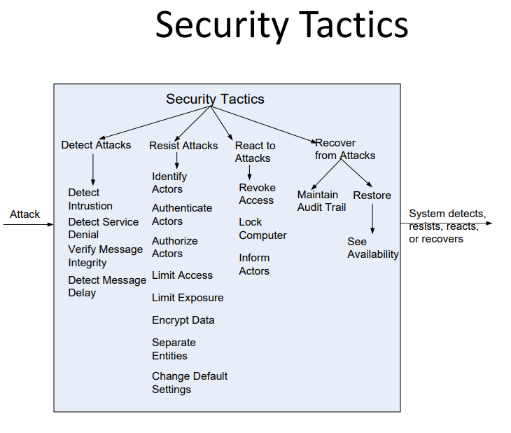
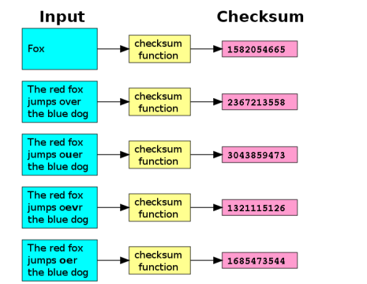
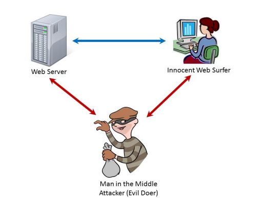

## 什么是安全(Security)

- 安全是系统保护数据和信息免受未经授权访问的能力的度量，同时仍然向经授权的人员和系统提供访问权限。
- 针对计算机系统的有意为害行为称为攻击。
- 攻击可以采取不同形式：
  - 未经授权的尝试访问/修改数据或服务
  - 旨在拒绝合法用户的服务
- 安全具有三个主要特征，即CIA：
- 保密性(Confidentiality)是数据或服务受到未经授权访问的保护性质。
  - 例如，黑客无法在政府计算机上访问您的个人所得税申报表。
- 完整性(Integrity)是数据或服务不受未经授权操纵的性质。
  - 例如，您的成绩自从教师分配以来没有被更改。
- 可用性(Availability)是系统能够供合法使用的性质。
  - 例如，拒绝服务攻击阻止您从在线书店订购一本书。
- 支持CIA的其他特征包括：
  - 身份验证验证交易参与方的身份，并检查他们是否真实身份与其所声称的一致。
  - 授权授予用户执行任务的权限。

## 安全性策略(Security tatics)

### 检测攻击(Detect Attacks)

- 检测入侵(Detect Intrusion)：将系统内的网络流量或服务请求模式与存储在数据库中的恶意行为的一组签名或已知模式进行比较。
- 检测服务拒绝(Detect Service Denial)：将系统接收到的网络流量的模式或签名与已知拒绝服务（DoS）攻击的历史配置文件进行比较。

:::info DOS(Deny of Service Attack)

- Ping of Death（死亡之Ping）是一种利用发送异常大的ICMP回显请求（Ping）来攻击目标系统的方法，超出系统处理能力导致系统崩溃或变得不稳定。
- UDP Flood（UDP洪泛）是通过发送大量伪造的UDP数据包来占用目标系统的网络带宽和资源，导致系统无法正常处理合法的网络请求。
- TCP SYN（TCP半开连接）攻击是通过发送大量伪造的TCP连接请求（SYN包）来消耗目标系统的资源，使其无法建立新的有效连接，从而导致服务不可用。

:::

- 验证消息完整性(Verify Message Integrity): 使用校验和或哈希值等技术来验证消息、资源文件、部署文件和配置文件的完整性。

- 检测消息延迟: 通过检查传递消息所需的时间，可以检测到可疑的时间行为，即中间人攻击。

### 抵御攻击(Resist Attacks)

- 识别参与者(Identify Actors)：识别系统接收的任何外部输入的来源。
- 对参与者进行身份验证(Authenticate Actors)：确保用户或远程计算机的实际身份与其所声称的身份相符。
- 授权参与者(Authorize Actors)：确保经过身份验证的参与者有权访问和修改数据或服务。
- 限制访问(Limit Access)：限制对诸如内存、网络连接或访问点等资源的访问。
- 限制曝光(Limit Exposure)：通过尽可能减少访问点的数量来最小化系统的攻击面。
  - 例如，防火墙是对内部网络的单一访问点。
  - 例如，关闭一个端口。
  - 被动防御。
- 加密数据(Encrypt Data)：对数据和通信应用某种形式的加密。
- 分离实体(Separate Entities)：可以通过在不同服务器上进行物理分离，使用虚拟机等方式实现。
- 更改默认设置(Change Default Settings)：强制用户更改默认分配的设置。

### 应对攻击(React to Attacks)

- 撤销访问权限( Revoke Access)：如果怀疑存在攻击，即使针对通常合法的用户和用途，也限制对敏感资源的访问。
- 锁定计算机(Lock Computer)：如果有多次尝试访问失败，限制对资源的访问。
- 通知参与者(Inform Actors)：在怀疑或检测到攻击时，通知操作员、其他人员或合作系统。

## 总结

- 对系统的攻击可以归纳为针对系统的机密性、完整性或可用性的攻击。
- 识别、验证和授权参与者是旨在确定哪些用户或系统有权以何种方式访问系统的策略。
- 存在用于检测攻击、限制攻击传播以及对攻击做出反应和恢复的策略。
