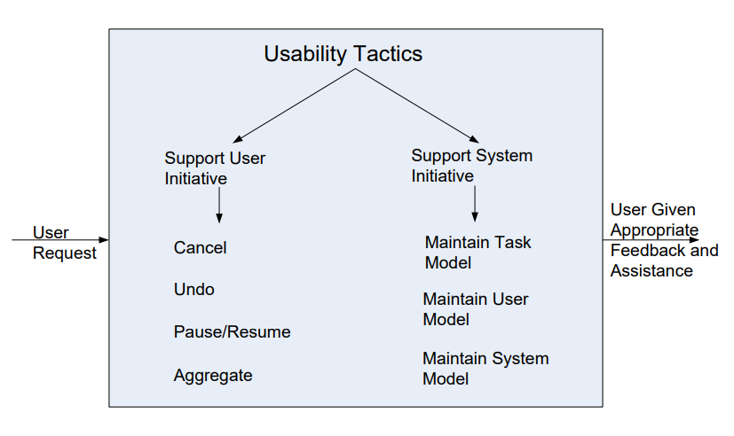

## 什么是易用性？

- 易用性关注用户完成所需任务的难易程度以及系统提供的用户支持。
- 易用性是改善系统质量的最便宜和最简单的方式之一。
- 易用性包括以下几个方面：
  - 高效使用系统。
  - 学习系统的功能。
  - 尽量减少错误的影响。
  - 使系统适应用户需求。
  - 提高用户的信心和满意度。

## 易用性策略

### 支持用户主动性(Support User Initiative)

- 取消(Cancel)：系统必须监听取消请求；
  - 被取消的命令必须终止；
  - 使用的资源必须被释放；
  - 合作组件必须被通知。
- 暂停/恢复(Pause/Resume)：临时释放资源，以便可以重新分配给其他任务。
  - 用于长时间运行的操作。
- 恢复(Restore)：保持足够的系统状态信息，以便可以恢复到先前的状态。
- 聚合(Aggregate)：能够将较低级别的对象聚合成一个组，以便可以对该组应用用户操作，从而使用户免于进行重复操作。

### 支持系统主动性(Support System Initiative)

- 维护任务模型(Maintain Task Model)：确定上下文，以便系统可以对用户的尝试有一定的了解，并提供帮助。
- 维护系统模型(Maintain System Model)：系统维护自身的显式模型。这用于确定预期的系统行为，以便向用户提供适当的反馈。

## 总结

- 对于易用性的体系结构支持涉及允许用户采取主动措施，例如取消长时间运行的命令、撤销已完成的命令以及聚合数据和命令。
- 为了预测用户或系统的响应，系统必须保持对系统和任务的模型。
