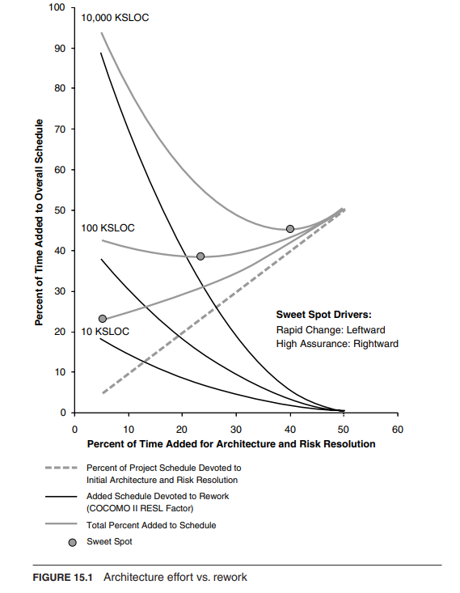

## 敏捷宣言

- Individuals and interactions over processes and tools 人机交互重于过程和工具
- Working software over comprehensive documentation 可以工作的软件重于求全责备的文档
- Customer collaboration over contract negotiation 客户协作重于合同谈判
- Responding to change over following a plan 随时应对变化重于循规蹈矩

## 敏捷开发十二原则

- 我们最重要的目标，是通过及早和持续不断地交付有价值的软件使客户满意。
- 欣然面对需求变化，即使在开发后期也一样。为了客户的竞争优势，敏捷过程掌控变化。
- 经常地交付可工作的软件，相隔几星期或一两个月，倾向于采取较短的周期。
- 业务人员和开发人员必须相互合作，项目中的每一天都不例外。
- 激发个体的斗志，以他们为核心搭建项目。提供所需的环境和支援，辅以信任，从而达成目标。
- 不论团队内外，传递信息效果最好效率也最高的方式是面对面的交谈。
- 可工作的软件是进度的首要度量标准。
- 敏捷过程倡导可持续开发。责任人、开发人员和用户要能够共同维持其步调稳定延续。
- 坚持不懈地追求技术卓越和良好设计，敏捷能力由此增强。
- 以简洁为本，它是极力减少不必要工作量的艺术。
- 最好的架构、需求和设计出自自组织团队。
- 团队定期地反思如何能提高成效，并依此调整自身的行为表现。

## How Much Architecture?

- 有两个活动可能会延长项目进度：
  - 架构的`前期设计工作(Up-front design work)`和前期风险识别(up-front risk identification)、规划和解决工作
  - 由于修复缺陷和处理修改请求而进行的`重工作(Rework)`
- 直观地说，这两者之间需要权衡。
- Boehm和Turner为三个假设项目将这两个值相互对比绘制了图表：
  - 一个项目的规模为10千源代码行（KSLOC）
  - 一个项目的规模为100千源代码行（KSLOC）
  - 一个项目的规模为1,000千源代码行（KSLOC）

- 这些线条显示每个项目都有一个最佳点。
  - 对于10千源代码行（KSLOC）的项目，最佳点位于最左边。在小型项目中花费过多时间进行前期工作是一种浪费。
  - 对于100千源代码行（KSLOC）的项目，最佳点位于项目进度的约20％左右。
  - 对于1,000千源代码行（KSLOC）的项目，最佳点位于项目进度的约40％左右。
- 如果没有架构指导，单靠敏捷原则无法应对这种复杂性。

## 敏捷架构师建议

- 如果你正在构建一个规模庞大、复杂的系统，其需求相对稳定且被充分理解，或者采用分布式开发模式，那么在前期进行大量的架构工作将会产生回报。
- 对于具有不稳定需求的大型项目，即使略去许多细节，也要快速设计一个候选架构。
  - 准备好根据情况的要求来改变和完善这个架构。
  - 这个早期架构将有助于
    - 指导开发
    - 早期问题理解和分析
    - 团队协调
    - 创建编码模板...
- 对于需求不确定的小型项目，至少要尝试就要使用的主要模式达成一致。
- 不要在前期花费过多的时间进行架构设计、文档编写或分析工作。

## 总结

- 敏捷宣言和原则
- 敏捷过程通常应用于小到中型项目，较少用于大型项目
- 大规模成功的项目需要敏捷和架构的结合
- 敏捷架构师采取中间立场，提出一个初始架构并开始实施，直到技术债务变得过大，此时需要进行重构
- Boehm和Turner发现项目存在一个“最佳点”，在这个点上，前期架构规划会带来回报。
