## 什么是性能？

- 它与时间有关
- 性能是关于时间以及软件系统满足时间要求的能力
- 当事件发生时，系统必须及时对其做出响应
  - 事件包括中断、消息、来自用户或其他系统的请求，或标记时间流逝的时钟事件

### 性能建模

- 响应时间的两个基本因素
- 处理时间指系统用于响应的工作时间
- 阻塞时间指系统无法响应的时间
- 阻塞时间的原因包括
  - 资源争用
  - 资源的可用性
  - 对其他因素的依赖

## 性能策略的目标

- 在基于时间的约束条件内，对进入系统的事件生成响应。
- 事件可以是单个事件或事件流，并且是执行计算的触发器。
  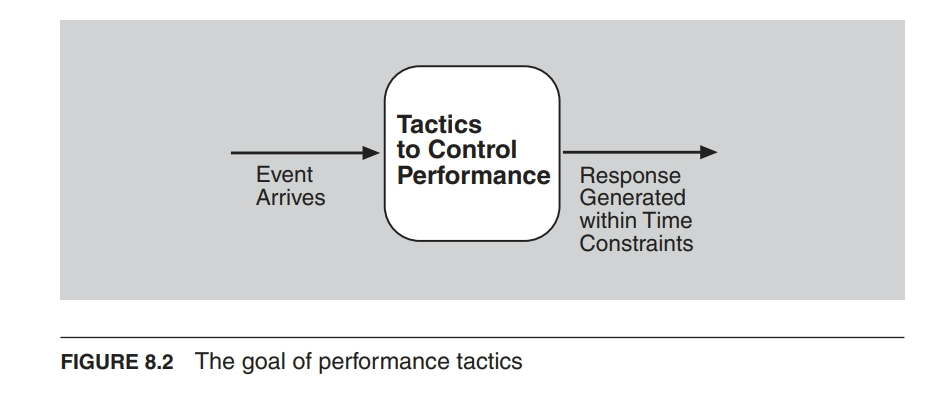

## 两种策略类别

- 控制资源需求
  - 降低对资源的需求量
  - 在需求方面进行操作
- 管理资源
  - 使现有资源在处理需求时更有效
  - 在响应方面进行操作
    ::info 资源
- 硬件资源，例如 CPU、数据存储、网络带宽和内存
- 软件资源，例如缓冲区或关键区域
  :::

## 性能策略

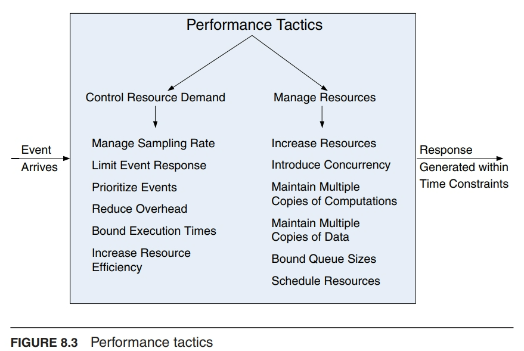

### 控制资源需求

- 管理采样率(Manage Sampling Rate)：降低对数据流进行采样的频率
- 优先处理事件(Prioritize Events)：引入优先级方案，根据重要性对事件进行排序
  - 当资源不足时，忽略低优先级事件
- 减少开销(Reduce Overhead)：使用中间件会增加处理事件流所消耗的资源；移除中间件可以提高响应延迟。
  - 在可修改性和性能之间进行权衡
- 限制执行时间(Bound Execution Times)：设置响应事件所使用的执行时间上限。
  - 在算法设计中，限制迭代次数是控制执行时间的方法之一。
  - 在性能和准确性之间进行权衡
- 提高资源效率(Increase Resource Efficiency)：改进关键领域中使用的算法将减少延迟。
  - 减少算法的复杂性。

### 管理资源

- 增加资源(Increase Resources:)：更快的处理器、额外的处理器、额外的内存和更快的网络都有可能减少延迟。
- 增加并发性( Increase Concurrency)：如果请求可以并行处理，阻塞时间可以减少。
  - 可以通过在不同线程上处理不同的事件流来引入并发性。

#### 维护多个计算副本(Maintain Multiple Copies of Computations)

- 复制的目的是减少单个服务器上的资源争用
- 负载均衡器将新任务分配给其中一个副本服务器
- `数据缓存(Data caching)`是将数据的副本保存在具有不同访问速度的存储介质上。- 例如，内存访问与磁盘访问，本地访问与通过网络的远程访问。
- `数据复制(Data replication)`是保留数据的独立副本，以减少多个同时访问所带来的争用。
- 如何选择要缓存/复制的数据？
- 如何确保多个副本的一致性？

## 调度

- 当资源存在争用时，需要对资源进行调度。
  - 处理器需要进行调度
  - 缓冲区需要进行调度
  - 网络需要进行调度

### 3 维度调度框架问题(3-Dimension Framework for Scheduling Problem)

- 任务(Tasks)
- 资源(Resources)
- 目标(Objectives)

#### 任务模型(Task Model)

- 任务包（Bag of tasks）
- 有向无环图（Directed Acyclic Graph，DAG）
- 周期性/循环性任务（Periodic/cyclic tasks）
- 任务属性
  - 执行成本（Execution cost）
  - 传输成本（Transmission cost）
  - 到达时间（Arrival time）
  - 截止时间（Deadline）
  - 抢占或非抢占（Preemptive or non-preemptive）

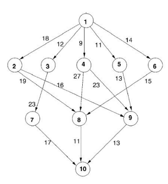

#### 资源模型(Resource Model)

- 资源包括一组通过网络连接的机器/处理器
- 机器/处理器模型
  - 处理能力/速度，能量消耗
- 网络模型
  - 网络拓扑
  - 带宽
  - 消息和能量消耗
  - 例如，传感器网络、数据中心网络、移动云

### 调度的目标

- 最小化完成时间
- 满足截止时间
- 最大化吞吐量
- 最小化数据传输/消息数量
- 最小化能量消耗
- ...

### 调度的分类

- 实时调度与非实时调度
- 静态调度与动态调度
- 离线调度与在线调度
- 确定性调度与随机调度

### 任务调度问题

1. 单处理器上的任务包调度（Bag-of-Tasks scheduling）
2. 多处理器上的任务包调度（Bag-of-Tasks scheduling）
3. 异构处理器上的有向无环图（DAG）调度
4. 作业车间调度（Job shop scheduling）
5. 周期性任务调度（Periodic tasks scheduling）

#### 单处理器上的任务包调度（Bag-of-Tasks on Single Processor）

给定：每个任务的发布时间、工作量或截止时间
确定每个任务的执行时间
目标：任务的平均完成时间或满足截止时间

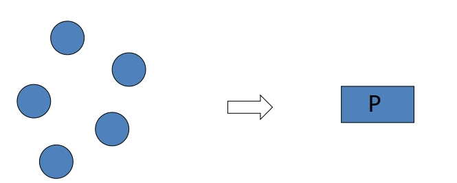

#### 多处理器上的任务包调度（Bag-of-Tasks on Multi-Processors）

给定：每个任务的发布时间和工作量
确定每个任务在何时何地执行
目标：最小化总执行时间（make-span）...

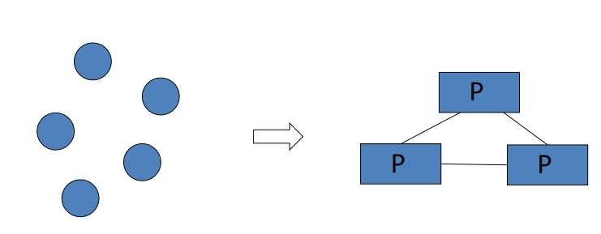

#### 在异构处理器上调度有向无环图（DAGs Scheduling on Heterogeneous Processors）

给定：每个任务在每个处理器上的处理时间，边缘上的通信时间
目标：最小化总执行时间（make-span）...
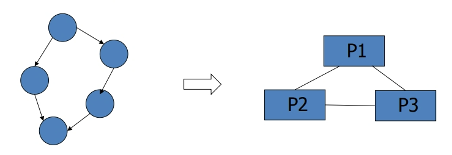

#### 作业车间问题（Job Shop Problem，JSP）

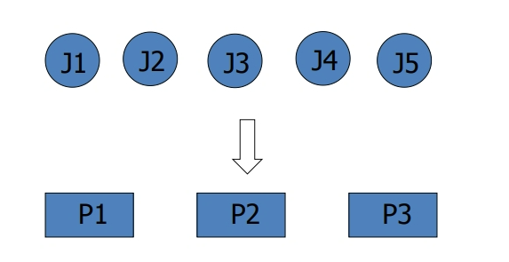

给定：每个作业在每个处理器上的处理时间
目标：最小化总执行时间（makespan）...

#### 周期性任务调度(Periodic tasks scheduling)

任务按周期性发布，并在流水线中执行。

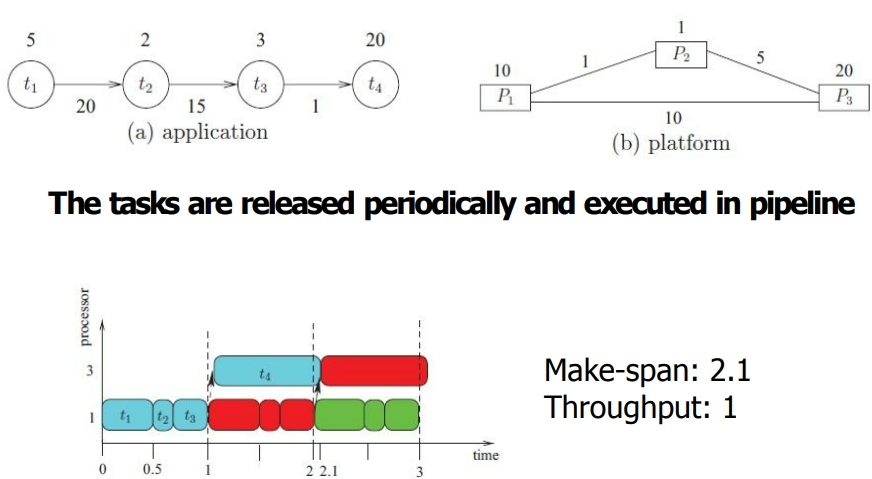

### 类似的术语(Similar Terminologies)

- 任务分配（Task assignment）
- 任务放置（Task placement）
- 任务分配（Task allocation）
- 资源分配（Resource allocation）
- 资源调度（Resource scheduling）

上述问题被视为调度问题的特殊情况/实例。

### 调度算法的类型

解决优化问题的算法

1. 数学规划，例如整数规划、线性规划
2. 进化算法，例如遗传算法（GA）、粒子群算法（PSO）、蚁群算法
3. 简单且有效的启发式算法，例如列表调度
4. 基于机器学习的算法，例如深度强化学习

:::info 调度方法：系统考虑因素

- 以机器为中心的方法

  - 当一台机器空闲时触发调度
  - 对于每台空闲机器，根据一些策略选择任务，例如：
    - 先到先得（First-Come-First-Serve，FCFS）
    - 最短作业优先（Shortest Job First，SJF）
    - 最早截止时间优先（Earliest Deadline First，EDF）
    - 首先选择等待时间最长的作业，...

- 以任务为中心的方法
  - 当一个新任务到达时触发调度
  - 对于每个被调度的任务，根据一些策略选择机器，例如最早完成时间，...

:::

#### 列表调度方法

摘自论文[Performance-effective and low-complexity task scheduling for heterogeneous computing](http://doi.org/10.1109/71.993206)

1. 步骤 1：任务选择
   通过为每个任务分配优先级构建一个有序任务列表，然后按照它们的优先级顺序选择任务。
2. 步骤 2：处理器选择
   将每个选定的任务调度到能够最小化预定义成本函数的处理器上。
3. 重复执行步骤 1 和步骤 2，直到所有任务都被调度。

例如：

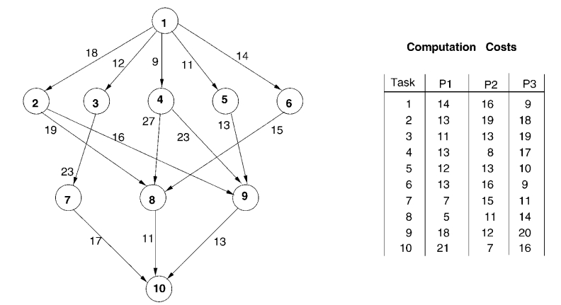

1. Step 1: 任务选择 - 上行排名（Upward rank）
   节点 i 的上行排名是最长路径的长度。
   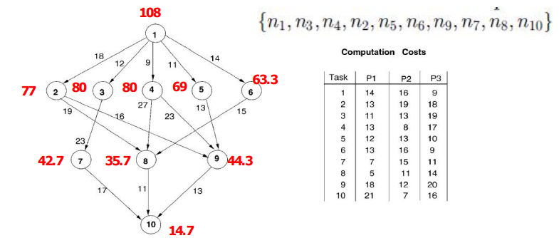
   :::info 计算方法
   在我们的算法中，任务按照基于向上和向下排名的调度优先级进行排序。任务 $n_i$ 的向上排名由

$$
rank_u(n_i)=\overline{w_i}+\max_{n_j\in succ(n_i)}(\overline{c_{i,j}}+rank_u(n_j)),
$$

递归定义。其中 $succ n_i$ 是任务$n_i$的直接后继集合，$\overline{c_{i,j}}$ 是边$(i,j)$的平均通信成本；$\overline{w_i}$ 为任务 $n_i$ 的平均计算成本。由于 Rank 是通过向上遍历任务图递归计算的，因此从退出任务开始，称为向上 Rank。对于退出任务$n_{exit}$，向上 Rank 值等于

$$
rank_u(n_{exit})=\overline{w_{exit}}.
$$

基本上，$rank_u(n_i)$ 是从任务 $n_i$ 到退出任务的关键路径的长度，包括任务 $n_i$ 的计算成本。文献中有一些算法仅使用计算成本来计算排名值，其中称为静态向上排名，$rank_u^s$。类似地，任务$n_i$的向下排名由

$$rank_d(n_i)=\max_{n_j\in pred(n_i)}\{rank_d(n_j)+\overline{w_j}+\overline{c_{j,i}}\left.\right\}$$

递归定义；其中$pred(n_i)$是任务$n_i$的直接前驱集合。通过从图的入口任务开始向下遍历任务图来递归地计算向下排名。对于入口任务$n_{entry}$，向下排名值等于 0。基本上，$rank_d(n_i)$ 是从入口任务到任务$n_i$的最长距离，不包括任务本身的计算成本。
::: 2. Step 2: 处理器选择 - 最早完成时间

在处理器选择阶段，选择能够最早完成任务的处理器。这意味着根据任务的执行时间和处理器的当前状态，选择能够最快完成任务的处理器进行调度。

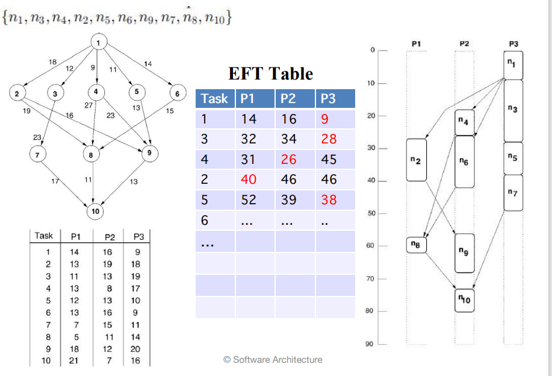

:::info 计算方法

$EST(n_i,,p_j)$ 和 $EFT(n_i,p_j)$ 分别是任务 $n_i$ 在处理器 $p_j$ 上的最早执行开始时间和最早执行结束时间。对于入口任务 $n_entry$，

$$
EST(n_{entry},p_j)=0
$$

对于图中的其他任务，从入口任务开始递归计算 $EFT$ 和 $EST$ 值，分别如下所示。为了计算任务 $n_i$ 的 $EFT$，需要计算任务 $n_i$ 的所有直接前置任务你肯定已经被安排好了。

$$
\begin{array}{c}
EST(n_i,p_j)=\max\left\{avail[j],\max_{n_m\in pred(n_i)}(AFT(n_m)+c_{m,i})\right\}\\
EFT(n_i,p_j)=w_{i,j}+EST(n_i,p_j)\\
AFT(n_i)=\min_{\forall j}EFT(n_i,p_j)\;(AFT——Actual Finish Time)
\end{array}
$$

其中 $pred (n_i)$ 是任务 $n_i$ 的直接前置任务的集合，$avail[j] $ 是处理器 $p_j$ 准备好执行任务的最早时间。如果 $n_k$ 是处理器 $p_j$ 上最后分配的任务，则$avail [j]$ 是当我们有基于非插入的调度策略时处理器 $p_j$ ，完成了任务 $n_k$ 的执行，并且准备好执行另一个任务的时间。$EST$ 方程中的内部 $max$ 块返回就绪时间，即 $n_i$ 所需的所有数据都已到达处理器$p_j$的时间

任务 $n_m$ 在处理器 $p_j$ 上调度后， $n_m$ 在处理器 $p_j$ 上的最早开始时间和最早完成时间分别等于任务 $n_m$ 的实际开始时间 $AST (n_m)$ 和实际完成时间 $AFT (n_m)$ 。当一个图中的所有任务都被调度后，调度长度（即总体完成时间）是退出任务$n_{exit}$的实际完成时间。如果有多个退出任务并且插入伪退出任务的约定不适用，调度长度(也称为$makespan$)定义为

$$
makespan=\max\{AFT(n_{exit})\}
$$

:::

## 摘要

- 性能是指在特定类型需求的面前有效管理系统资源，以实现可接受的时间行为。

- 对于交互式和嵌入式实时系统，性能可以通过吞吐量和延迟来衡量。

- 通过减少需求或更合理地管理资源，可以提高性能。
