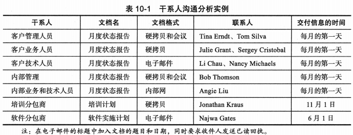
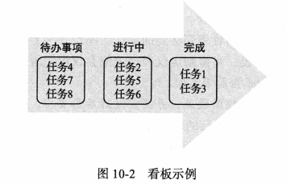

## 讨论问题

1. 项目沟通管理的 3 个过程
2. 项目沟通管理计划应包括哪些内容？
3. 发布信息应该注意哪些方面？
4. 绩效报告
5. 改善沟通的一些建议
6. 如何有效开会？
7. 如何更高效使用电子邮件或其他通讯工具？

## 项目沟通管理

- 项目沟通管理的目标是确保项目信息能够及时且适当地生成、收集、发送、存储和部署。项目沟通管理中包含以下 3 个主要过程:
  1. `计划沟通`管理包括确定干系人的信息和沟通需求——谁需要什么信息?他们什么时候需要这些信息?如何将信息发送给他们?这个过程的输出包括沟通管理计划、项目管理计划更新和项目文档更新。
  2. `管理沟通`包括对沟通管理计划中的项目沟通进行创建、发布、存储、检索和处置。这个过程的主要输出包括项目沟通、项目管理计划更新、项目文档更新和组织过程资产更新。
  3. `控制沟通`包括确保干系人的沟通需求得到满足。

## 良好沟通的关键

### 注重团队和个人的沟通需求

- 一个人两个月完成的项目不等于两个人一个月可以完成

### 正式和非正式的沟通

略

### 及时有效地发布重要信息

- 详细的技术信息是重要的
- 人们有避免报告坏消息的倾向
- 会议和非正式谈话的口头沟通有助于将重要的信息公开化

### 为交流坏消息搭建舞台

- 也就是让别人知道你已经评估了这个坏消息的影响，有一些替代方案

### 确定沟通渠道的数量

- 沟通渠道的数量满足以下关系
  $$\text{沟通渠道数}=\frac{n\left(n-1\right)}2$$

## 计划沟通管理

- 由于沟通对项目非常重要,因此每个项目都应包括一份`沟通管理计划(communication management plan)`,即指导项目沟通的文档。对于小型项目,沟通管理计划可以是团队章程的一部分。对于大型项目,它应该是一份单独的文档。沟通管理计划应解决以下问题:
  1. 干系人的沟通需求。
  2. 需要沟通的信息,包括格式、内容和详细程度。
  3. 谁接收信息,谁产生信息。
  4. 传达信息可能用到的方法或技术。
  5. 沟通频率。
  6. 解决问题的逐级上报程序。
  7. 用于更新沟通管理计划的修订程序。
  8. 常用术语表。
     

## 管理沟通

### 使用技术来强化信息创建和发布

略

### 选择是单独个沟通方法和媒介

- 沟通方法分为 3 大类：
  1. 互动沟通
  2. 推式沟通
  3. 拉式沟通

### 报告绩效

- 绩效报告通常以进度报告或状态报告的形式提供。
  - 进度报告(progress report)描述了项目团队在一定时间内完成的的工作。
  - 状态报告(status report)描述项目在特定时间点的位置。状态报告根据三项约束,满足范围、时间和成本目标来说明项目的现状。
- 预测(forecast)是基于过去的信息和发展趋势预测未来的项目状态和进展。

## 控制沟通

- 控制沟通的主要目标是在整个项目生命周期中确保信息的最佳流动动。
- 由一个项目之外的协调人员来评估沟通情况往往是有益的

## 改善项目沟通的建议

### 开发更好的沟通技能

略

### 召开有效的会议

- 确定会议是否有必要召开
- 明确会议的目的和预期结果
- 确定谁应该参加会议
- 在开会之前向参与者提供议程
- 事先准备印刷品和视觉辅助设施，并提前做好后勤安排
- 以专业方式主持会议
- 为会议制定基本规则
- 建立关系

### 有效地使用电子邮件、即时信息、短信、看板和协作工具

#### 使用项目沟通模板

- 经验总结报告(lessons-learned report)：一份反思性陈述文档
- 项目档案(project archive)：是一套有组织的项目记录，它可以提供项目的准确历史记录

## 小结

- 沟通失败往往是项目成功的最大威胁,尤其是 IT 项目。沟通是保证项目顺利进行的动力。项目沟通管理包括计划沟通管理、管理沟通和控制沟通。
- 项目经理可以把 90%的时间花在沟通上。良好沟通的几个关键要素包括:注重团队和个人的沟通需求、使用正式和非正式的沟通方法、及时有效地提供重要信息、为交流坏消息搭建舞台,以及理解沟通渠道。
- 应该为所有项目建立某种类型的沟通管理计划,以帮助确保良好的沟通。该计划的内容会根据项目的需求而变化。
- 管理沟通包括创建和发布项目信息。发布项目信息的方法包括正式的的、非正式的、书面的和口头的。重要的是要确定最适当的方式来发送不同类型的为项目信息。项目经理和他们的团队在交流项目信息时,应该关注建立关系的重要性。随着需要沟通的人数的增加,沟通渠道的数量也在增加。
- 报告绩效涉及收集和发布关于项目朝预定目标迈进的状态信息。项目团队可以使用挣值图表和其他形式的进度信息来沟通和评估项目绩效。状态评审会议是沟通、监督和控制项目的重要组成部分。
- 控制沟通的主要目标是在整个项目生命周期中确保最佳的信息流动。项目经理及其团队应考虑使用协调人员和其他专家提供帮助。
- 为了改善项目沟通,项目经理及其团队必须发展他们的沟通技能。西女善项目沟通的建议包括学习如何召开更有效的会议,如何更有效地使用电子邮件、即日时消息、短信、看板和协作软件,以及如何使用模板进行项目沟通。
- 新的硬件和软件层出不穷,以帮助改善沟通。随着越来越多的人远程工作,确保他们拥有必要的工具来提高工作效率是很重要的。企业项目管理软件提供了许多功能来增强整个组织的沟通。
- 一定要考虑沟通管理在敏捷/自适应环境中的差异。

## 关键术语

博客(blog)
沟通管理计划(communications management plan)
预测(forecast)
谷歌文档(Google Docs)
经验总结报告(lessons-learned report)
进度报告(progress report)
项目档案(project archive)
Share Point 门户(SharePoint portal)
状态报告(status report)
维基(wiki)
