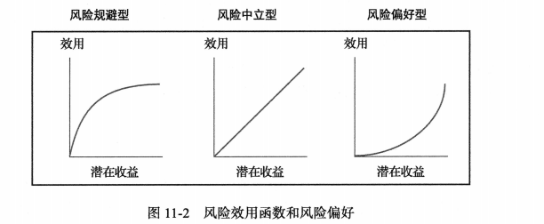
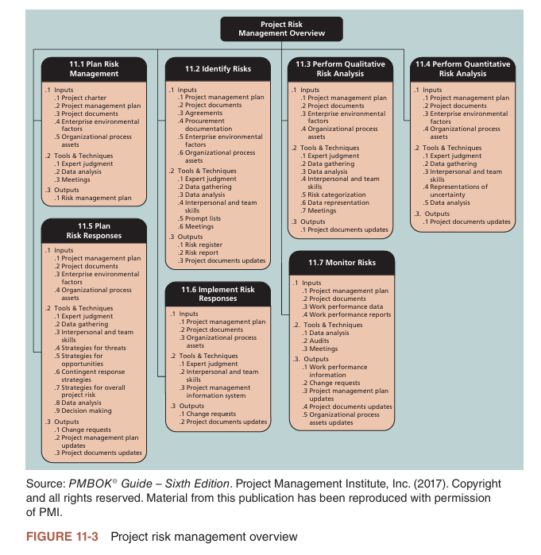
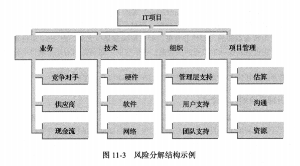
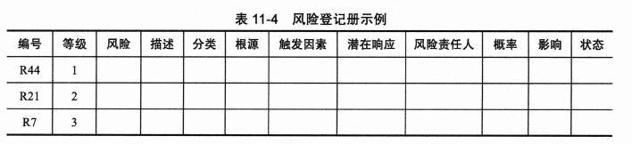
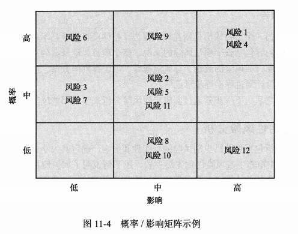
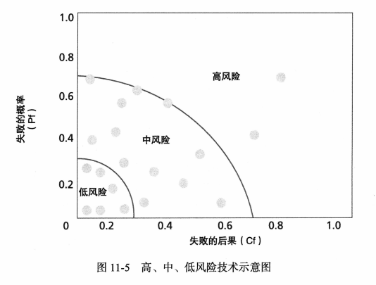
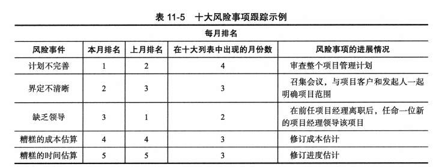
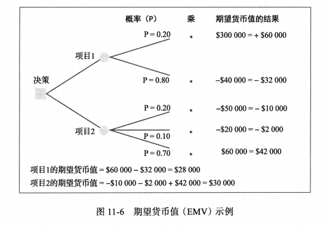
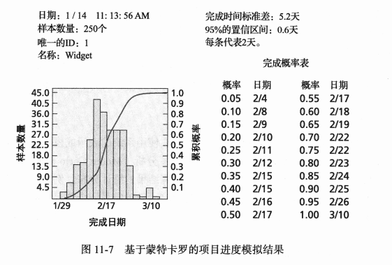

## 讨论问题

1. 项目风险管理的6个过程
2. 风险效用函数可以分为哪几类？
3. 风险管理计划的主要主题？
4. 风险的分类？
5. 风险识别的工具包括？
6. 风险登记册应包括哪些内容？
7. 定性风险分析的两种方法？
8. 定量风险分析的几个方法？
9. 应对负风险的几种策略？
10. 应对正风险的几种策略？
11. 风险监控的工具和技术包括？

## 项目风险管理

- 项目风险的的一般定义是对实现项目目标可能产生消极`或积极`影响的不确定性。
- `风险效用(risk utility)`是指从潜在收益中获得的满足感或愉悦感的程度。如下图所示，分为:`风险规避型(risk-averse)`、`风险偏好型(risk-seeking)`和`风险中立型(risk-neutral)`，Y轴代表效用,或者说是从人冒险中获得的愉悦。X轴显示的是潜在的回报或机会的价值。

- 风险管理涉及6个主要过程：
    1. 计划风险管理:针对某一项目决定如何制定与计划风险管理活动。这个过程的主要输出是风险管理计划。
    2. 识别风险:指确定哪些风险会影响项目并记录风险特性的过程。这个过程的主要输出是风险登记册、风险报告和项目文档更新。
    3. 实施定性风险分析:指按照发生的可能性和影响程度对风险进行优先排序的过程。在识别风险之后,项目团队可以使用各种工具和技术对风险进行排序并更新风险登记册中的信息。主要输出是项目文档更新。
    4. 实施定量风险分析:指就已识别风险对项目整体目标的影响进行定量分析的过程。这个过程的主要输出是项目文档更新。
    5. 计划风险响应:指采取措施来提高实现项目目标的概率、减少风险对实现项目目标的威胁的过程。利用预先制定的风险管理过程,项目团队可以制定流风险响应策略,这些策略常常导致变更请求、项目管理计划更新和项目文档更新。
    6. 实施风险响应:指实施风险响应策略。输出包括变更请求和项目文档更新。
    7. 监控风险:包括在项目生命周期中,监控已知的风险、识别新所的风险、实施风险响应计划,并评估风险响应策略的有效性。此过程的主要输出包括工工作绩效信息、变更请求、项目管理计划更新、项目文档更新、组织过程资产更新。

## 计划风险管理

- `风险管理计划(risk management plan)`记录项目全过程中的风险管理流程。项目团队应该在项目早期召开几次计划会议,以帮助开发风险管理计划。下表列出了风险管理计划中应着重强调的一般主题
| 主题 | 需要回答的问题 |
|---------|---------|
| 方法论 | 在这个项目中如何执行风险管理？有哪些可用和适用的工具和数据来源？ |
| 角色和责任 | 谁负责执行与风险管理相关的具体任务并提供可交付成果？ |
| 预算和进度 | 执行与风险相关的活动的估计成本和进度是多少？ |
| 风险类别 | 在这个项目中应该解决哪些主要风险类别？项目中是否有风险拆分结构？（请参阅本章后面关于风险拆分结构的信息。） |
| 风险概率和影响 | 如何评估风险项的概率和影响？将使用哪些定性和定量分析风险的评分和解释方法？如何开发概率和影响矩阵？ |
| 修订的利益相关者容忍度 | 利益相关者对风险的容忍度是否发生了变化？这些变化将如何影响项目？ |
| 追踪 | 团队将如何追踪风险管理活动？如何记录和共享经验教训？如何对风险管理流程进行审计？ |
| 风险文档 | 风险管理活动将使用哪些报告格式和流程？ |
- 除了风险管理计划,许多项目还有应急计划、退路计划、应急准备金和管理准备金。
  - `应急计划(contingency plans)`是项目团队在确定的风险事件发生时将采取的预先制定好的措施。例如,如果项目团队知道某个软件包的新版本可能无法按时应用于项目,那么团队可能执行应急计划,使用现有的、较旧版本的软件
  - `退路计划(fallback plans)`是针对那些对实现项目目标有很大影响的风险制定的,如果降低风险的尝试不起作用,退路计划就会付诸实施。例如,一个刚毕业的大学生可能会有一个主要的计划和几个应急计划来决定毕业后住在哪里但是如果这些计划行不通,一个退路计划可能是在家里住一段时间。有时,应急计划和退路计划这两个术语可以互换使用。
  - `应急储备金(contingency reserves)`或`应急津贴(contingency allowaances)`是成本基准中包含的资金,当已知风险发生时,可用于缓解成本或进度超出预期。例如,如果由于员工对一些新技术的使用缺乏经验,导致项目偏离了正常轨道,而项目团队又已经识别出这一风险,那么可以利用应急准备金聘请一名外部顾问,对项目工作人员进行使用新技术的培训并提供咨询意见。
  - `管理储备金(management reserves)`是用于未知风险的资金,从而达到管理控制的目的。它们不是成本基准的一部分,正如第7章所讨论的,但它们是项目预算和资金需求的一部分。如果管理储备金用于未预见的工作,则在变更获得批准后可以将其加入成本基准。

## IT项目中常见的风险源

- 风险有几类：
  - 市场风险
  - 财务风险
  - 技术风险
  - 人员风险
  - 结构/过程风险
- `风险分解结构(risk breakdown structure)`是项目潜在风险类别的层次结构。既可以根据项目或产品的性质来识别风险，也可以根据项目管理知识域来识别风险

## 识别风险

### 识别风险的几点建议

- 头脑风暴(Brainstorming)
- 德尔菲技术(Delphitechnique)是一种收集信息的方法,有助于防止头脑风暴中发现的一些负面团体效应。由专家提问，参与者回答问题，反复这个过程，来聚集大家的意见
- 访谈(interviewing)

### 风险登记册

- `风险登记册(risk register)`是包含各种风险管理过程结果的文档,通常以表格或电子表格的形式呈现。风险登记册是记录潜在风险事件和相关信息的工具。
- `风险事件(risk event)`是指会对项目造成不利或有利影响的特定但又不确定的事件。
- 风险登记记册的因素包括:
  - 每个风险事件的标识号:项目团队可能希望按照风险事件进行排序,或者快速搜索特定的风险事件,因此需要给每个事件赋予一个唯一的标识,如标识号。
  - 风险事件的等级:等级通常是一个数字,1代表最高级别的风险。
  - 风险事件的名称:例如服务器故障、测试延迟完成、咨询成本降低和良好的宣传效果。
  - 风险事件的描述:由于风险事件的名称通常是缩写,对风险事件的描述有助于提供更详细的信息。考虑使用类似于以下内容的风险陈述格式:由于<一个或多个原因导致>,<风险事件>可能发生,这将导致(一个或多个影响)。例如,减少的咨询成本可以扩写为:因为这位特定的咨询顾问喜欢为我们公司工作,并愿意与我们协商费用,这可能会降低咨询成本,为项目节省费用。
  - 风险事件的分类:例如,服务器故障可能属于更大的技术类或硬件技术类风险范畴。
  - 风险根源:服务器故障的根本原因可能是电力供应故障。
  - 每个风险的触发因素:`触发因素(triggers)`是实际风险事件的指标或症状。例如,早期活动的成本超支可能是成本估算不准确的症状。有缺陷的产品可能是低质量供应商的症状。记录项目的潜在风险症状还有助于项目团队识别更多的潜在风险事件。
  - 对每种风险的潜在响应:对服务器故障这一风险事件的潜在响压应可能是在供应商合同中加入一项条款,规定在一定时间内以协议成本更换服务器。
  - 风险责任人(risk owner)或将对风险负责的人:例如,某个人可能负责任何与服务器相关的风险事件,管理相应的响应策略。
  - 风险发生的概率:某一风险事件发生的概率可能为高、中、低。例如,服务器出现故障的概率可能很低。
  - 风险发生对项目的影响:如果风险事件真的发生,可能对项目的成功产生高、中、低的影响。服务器故障可能对按时成功完成项目有很大影响。
  - 风险状态:风险事件是否发生?响应策略是否完成?风险与项目不再有关?例如,针对服务器故障这一风险的合同条款已经完成了。

## 实施定性风险分析

- 定性风险分析包括评估已识别风险的可能性和影响,确定其大小和优先级。
- 主要输出是风险登记册

### 用概率/影响矩阵估算风险因子

- 项目经理可以在`概率/影响矩阵或图表(probability/impact matrix or char)`上绘制风险的概率与影响,该矩阵或图表列出了风险发生的相对概率和风险金发生的相对影响。越靠近右上角的越需要关注

### 十大风险事项跟踪法

- `十大风险事项跟踪法(Top Ten Risk Item Tracking)`是一种定性的风险分析工具。除了识别风险外,还能通过监控风险来保持项目团队在整个项目生命周期中的风险意识。
- 它使管理层或客户定期审查项目最重大的风险事项。对项目十大风险来原的状况进行汇总,从而开始这种审查。这种汇总包括:各风险事件目前的排名、以前的排名、在一段时间内出现在列表上的次数,以及自上次审查以来在解决这一风险事项所取得的进展。以下图所示(只有五项)

- 观察清单(watch list)是指那些优先级低,但仍被确定为潜在风险的风险清单。

## 实施定量风险分析

### 决策树和期望货币值

- ·决策树(decision tree)·是一种图形分析技术,用于在未来结果不确定时帮助选择最佳行动方案。决策树分析的一个常见应用是计算期望货币值。
- ·期望货币值(Expected Monetary Value,EMV)是风险事件概率和风险事件货币价值的乘积。为了说明这个概念,图11-6使用了EMV计算说明组织可能选择哪个项目

### 模拟

- 蒙特卡罗分析(Monte Carlo analysis)：蒙特卡罗分析能够预测在某个日期前完成的概率或成本等于或小于
某一值的概率。
- 蒙特卡罗分析的基本步骤如下：
    1. 收集模型中最可能、乐观和悲观的变量估计值。例如,如果试图确定满足项目进度目标的可能性,则可以选择项目网络图作为模型。您将为每个任务收集最可能、乐观和悲观的时间估计。
    2. 确定每个变量的概率分布。一个变量介于乐观估计和最可能估计计之间的可能性有多大?例如,如果被指派了特定任务的专家给出该任务10周的最可能能估计、8周的乐观估计、15周的悲观估计,那么你可以询问在8~10周内完成任务的可能性。专家可能会回答有20%的可能性。
    3. 对于每个变量(比如估计任务时间),根据变量的概率分布选择一个随机值。例如,使用前面的场景,你可以按20%的可能性选择8~10周时间,80%的可能性选择10~15周时间。
    4. 使用为每个变量选择的值的组合,进行确定性分析或进行一次遍历模型。例如,前面场景中描述的一个任务在第一次运行时的值可能为12。其他任务可以根据他们的估算和概率分布使用随机赋予的值进行第一次分析。
    5. 多次重复步骤3和步骤4以获得模型结果的概率分布。迭什代次数取决于变量的数量和结果所需的置信度,但迭代次数通常位于100~1000之间。以项目进度为例,最终的模拟结果将会显示在一定时间内完成整个项目的概率。

### 灵敏度分析

- `灵敏度分析(sensitivity analysis)`,即通过改变一个或多个变量观察其对结果的影响。例如,在给定贷款利率和贷款期限的情况下,很多人会使用灵敏度分析决定他们的月供。如果你以6%的利率借10万美元,30年还清,你每月的按揭还款是多少?如果利率是7%,还款是多少?如果你决定在15年后以5%的利率还清贷款,你会付多少钱?

## 计划风险响应

- 应对消极风险的五种基本策略：
  - 风险规避(risk avoidance)或消除特定的威胁,通常采用消除其原因的方法。当然,并非所有风险都可以消除,但某些特定的风险事件是可以消除的。
  - 风险接受(risk acceptance)或在风险发生时接受后果。
  - 风险转移(risk transference)或将风险后果及其管理责任转移:给第三方，例如保险。
  - 风险减轻(risk mitigation)或通过降低风险事件发生的概率来缓解风险事件的影响。风险降低的例子包括使用成熟的技术、雇佣胜任的项目人员、使用各种分析和验证技术等等。
  - 风险上报(risk escalation)或通知上级主管部门。如果风险超出了项目范围,或者拟议的响应超出了当前项目经理的权限,那么有必要将风风险控制权移交组织内更高级别的经理。
- 应对积极风险五种基本策略：
  - 风险开拓(risk exploitation)或尽一切可能确保积极风险的发生。
  - 风险分享(risk sharing)或将风险的所有权分配给另一方。
  - 风险提高(risk enhancement)或通过识别和最大化积极风险的关键驱动因素来增加积极风险发生的概率。
  - 风险接受(risk acceptance)。当项目组不对风险采取任何行动时,风险接受也同样适用于积极风险。
  - 风险上报(risk escalation)或通知上级主管部门也适用于积极风险。
- 残余风险(residual risk)是在实施所有响应策略后仍然存在的风险。例如,即使在项目上使用了稳定的硬件产品,也可能存在硬件无法正常运行的风险。
- 次生风险(secondary risks)是实施风险应对措施的直接结果。例如,使用更稳定的硬件可能会导致外围设备无法
正常工作的风险。

## 实施风险响应

- 实施风险响应,作为项目风险管理的一部分,主要是实施在计划风险响应中定义的风险响应。关键输出包括变更请求和项目文档更新(即发布日志、经验教训登记表、项目团队任务、风险登记册和风险报告)。

## 监控风险

- 监控风险包括确保执行适当的风险响应、跟踪已确定的风险、识别和分析新的风险,以及在整个项目中评估风险管理的有效性。
- 变通办法(workarounds)——在未制定应急计划的情况下对风险事件做出非计划响应。
- 用于监控风险的工具和技术包括数据分析、审计和会议。输出包括工作绩效信息、变更请求以及对项目管理计划、项目文档和组织过程资产的更新。

## 小结

- 风险是一种不确定性,它可能对实现项目目标产生消极或我极的影响。许多组织都没能做好项目风险管理,有些组织甚至没有风险管理。成功的组织能意识到良好的项目风险管理的价值。
- 风险管理是一种投资，换句话说，识别风险、分析风险和制定解决风险问题的计划，这些活动都需要花费成本。这些费用必须包括在成本、进度和资源计划中。

- 风险效用或风险容忍度是从潜在收益中获得的满足感或愉悦感的程度。风险偏好型的人喜欢高风险，风险规避型的人不喜欢冒险，风险中立型的人追求风险与收益之间的一种平衡。
项目风险管理是一个过程，在这个过程中，项目小组不断评估哪些风险可能对项目产生消极或积极的影响，确定此类事件发生的概率以及发生后的影响。风险管理还包括分析和确定处理风险的备选策略。风险管理的过程包括计划风险管理、识别风险、实施定性风险分析、实施定量风险分析、计划风险响应、实施风险响应和监控风险。

- 计划风险管理是决定如何处理项目中的风险管理活动并为其制定计划的过程。应急计划是项目团队在已识别出的风险事件发生时将采取的预先制定好的措施。退路计划是为那些对实现项目目标有很大影响的风险制定的，如果降低风险的尝试没有效果，则实施退路计划$_{3}$ 应急储备金或应急津贴是项目发起人或组织为将成本或进度超出预期的风险降低到可接受水平而做的准备。

- IT 项目通常涉及几个风险，包括缺乏用户参与、缺乏高层管理者支持、需求不明确以及计划不周。Standish Group 和其他组织开发的列表有助于识别 IT 项目的潜在风险。风险分解结构是一个有用的工具，可以帮助项目经理考虑不同类别的潜在风险。像头脑风暴、德尔菲技术、访谈和 SWOT 分析等方法一样，项目管理知识领域的常见风险条件列表也有助于识别风险。风险登记册是包含各种风险管理过程结果的文档，通常以表格或电子表格格式显示。风险登记册是记录潜在风险事件和相关信息的工具。风险事件是指可能对项目造成损害或促进的具体但又不确定的事件。

- 风险可以从定性和定量两方面进行评估。定性风险分析的工具包括概率/影响矩阵和十大风险事项跟踪法。定量风险分析的工具包括决策树和蒙特卡罗模拟。期望货币值(EMV) 基于期望价值使用决策树来评估潜在的项目。模拟是一种更为复杂的方法，使用估算方法帮助你确定达到特定项目进度或成本目标的可能性。灵敏度分析是用来显示改变一个或多个变量对结果的影响。

- 应对消极风险的 5 种措施是规避、接受、转移、减轻和上报。风险规避包括消除特定的威胁或风险。风险接受意味着承担风险发生时的后果。风险转移是将风险及其管理责任的后果转移给第三方。风险减轻是通过降低风险事件发生的可能性来减少风险事件的影响。风险上报将风险事件报告到更高级别的权力部门。应对积极风险的 5 种措施是风险开拓、风险分享、风险提高、风险接受和风险上报。

- 实施风险响应包括将适当的风险响应计划付诸行动。监控风险包括监控风险响应计划的执行情况、跟踪已确定的风险、识别和分析新的风险，以及在整个项目中评估风险管理的有数性。

- 有几种软件可以帮助项目风险管理。基于蒙特卡罗的模拟软件分析是一个特别有用的工具，有助于更好地理解项目风险以及风险的首要来源或风险驱动因素。

- 一定要考虑项目风险管理在敏捷/自适应环境中的差异。

## 关键术语

头脑风暴(brainstorming)
应急津贴(contingençy allowances)
应急计划(contingency plans)
应急储备金(contingency reserves)
决策树(decision tree)
德尔菲技术 (Delphi technique)
期望货币值 (EMV)(expected monetary value (EMV))
退路计划 (fallback plans)
流程图(flowcharts)
影响图 (influence diagram)
访谈 (interviewing)
已知风险(known risks)
管理储备金(management reserves)
风险管理计划 (risk management plan)
风险减轻(risk mitigation)
风险中立(risk-neutral)
风险责任人(risk owner)
风险登记册(risk register)
风险偏好型(risk-seeking)
风险分享(risk sharing)
风险容忍度 (risk tolerance)
风险转移(risk transference)
蒙特卡罗分析(Monte Carlo analysis)
概率/影响矩阵或图表( probability/impact matrix or chart)
残余风险(residual rioks)
风险(risk)
风险接受 (isk acceptance)
风险僦好(risk appetite)
风险厌恶型(risk-aversc)
风险规避(risk avoidance)
风险分解结构 (risk breakdown structure)
风险提高 (risk enhancement)
风险事件(risk events)
风险开拓(risk exploitation)
风险因子(risk factors)
风险效用(risk utility)
次生风险(secondary risks)
灵敏度分析(sensitivity analysis)
十大风险事项跟踪法 (Top Ten Risk Item Tracking)
触发因素(triggers)
未知风险(unknown risks)
观察潸单(watch list)
变通办法(workarounds)
