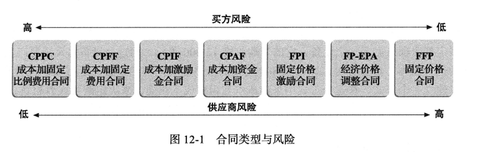
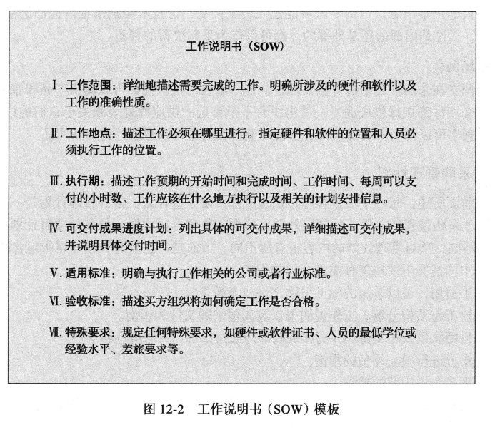
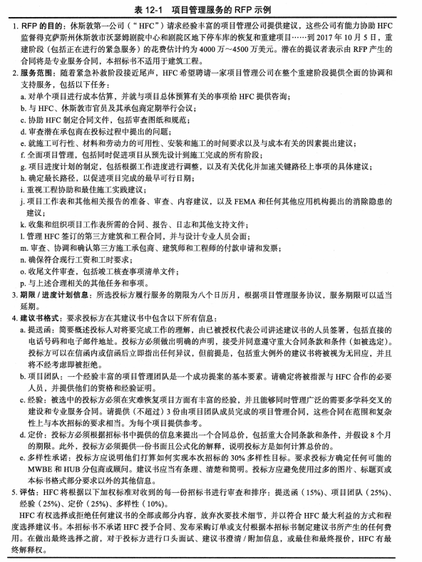
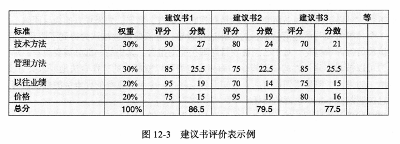

## 讨论问题

1. 项目采购管理的3个过程
2. 规划采购的工具和技巧？
3. 采购管理计划包括的内容？
4. 常见的采购文件？
5. 实施采购的过程？

## 项目采购管理

- 采购(procurement)意味着从外部来源获得产品或者服务。采购一词广泛用于政府,许多私人企业使用外购和外包。
- 项目采购管理(project precurement management)有3个主要过程：
    1. `计划采购管理`包括决定采购什么、何时采购和如何采购。在采购计划中,决策者需要明确外包什么、决定合同类型,并且向潜在卖方描述工作的内容。卖方(sellers)包括承包商或向其他组织和个人提供产品或服务的供应商。该过程的输出包括采购管理计划、采购策略、投标文件、采购工作说明书、来源选择标准、自制或购买决策、独立成本估算、变更请求、项目文档更新和组织过程资产更新。
    2. `实施采购`包括获得卖方回应、选择卖方并授予合同。该过程的输出包括选择卖方、达成协议、变更请求、项目管理计划更新、项目文档更新和组织过程资产更新。
    3. `控制采购`包括管理与卖方的关系、监控合同履行情况、适当地进行更改和结清合同。该过程的主要输出包括结束采购、工作绩效信息、采购文件更新、变更请求、项目管理计划更新、项目文档更新和组织过程资产更新。

## 计划采购管理

- 计划采购包括确定哪些项目需求可以通过使用组织外部的产品或服务得到最好的满足。这个过程的一个重要输出是`自制或购买决策(make-or-buy decision)`,即一个组织决定在组织内部生产某些产品并执行某些服务,还是从组织外部购买这些产品和服务的决策。

### 合同类型

- 合同的三大类型是：固定价格合同或总价合同、成本补偿合同、时间和材料合同。一份合同中可能包含以上三种类型

#### 固定价格合同或总价合同

- `固定价格合同(fixed-price contract)`或`总价合同(lump-sum contract)`包括定义明确的产品或服务的固定总价。在这种情况下,买方承担的风险很小,因为价格是预先确定的。
- 固定价格合同还不可能包括满足或超过选定项目目标的激励措施。例如,如果激光打印机在一个月内交付,合合同可能包括一笔奖励费用。`固定价格(Firm-Fixed-Price,FFP)`合同对买方的风险最小,其次是`固定价格激励(Fixed rice Incentive Fee,FPIF)合同`。`经济价格调整合同(Price Adjustment Contract, FP-EPA)`包括特别规定了预先确定好的、根据合同条件最终调整的价格,如通货膨胀或特定商品的成本变化。FP-EPA合同旨在保护买方和卖方免受其无法控制的的外部条件的影响。
- 合同还可以包括防止或减少成本超支的激励措施。例如,根据美国联邦采购条例(FAR)16.4,固定价格激励合同可以包括`总假设点(Point of Total Assuimption,PTA)`,即承包商对每增加额外的一美元合同成本承担全部责任的成本。
- 承包商不想触及PTA,因为这损害了他们的经济利益,所以他们有动力防止成本超支。PTA的计算公式如下:
$$\text{PTA}=(\text{ 最高限价}-\text{目标价格)/政府分担比例}+\text{目标成本}$$

#### 成本补偿合同

- `成本补偿合同(cost-reimbursable contract)`包括以直接和间接实际成本向供应商付款。
- 按买方风险从低到高的顺序,成本补偿合同分为3类:成本加激励金合同、成本加固定费用合同、成本加固定比例费用合同。
  - `成本加激励金(Cost Plus Incentive Fee,CPIF)`合同中,买方向供应商支付允许的成本(如合同中所定义)以及预先确定的费用和激励金。
  - `成本加固定费用(Cost Plus Fixed Fee,CPFF)`合同中,买方向供应商支付允许成本(如合同中所定义)加上一笔固定费用,这部分费用通常基于估计成本的百分比。
  - `成本加奖金(Cost Plus Award Fee,CPAF)`合同中,买方向供应商支付允许成本(如合同中定义的)加奖金(基于主观绩效标准的满意程度)。奖金没有固定的百分比
  - `成本加固定比例费用(Cost Plus Percentage of Costs,CPPC)`合同中,买方向供应商支付允许成本(如合同中所定义)以及基于总成本的百分比费用。从买方的角度来说，这是最不可取的，因为提供商会有动机增加成本

#### 时间和材料合同

- `时间和材料(Time and Material,T&M)`合同是固定价格合同科成本补偿合同的混合体。例如,一个计算机顾问可能与一家公司签订了一份合同,合同的基础是每小时80美元的服务费,外加10000美元的固定价格,用于提供特定的项目材料。

### 计划采购管理的工具和技术

- 包括自制或购买分析(一种数据收集方法)、专家判断和市场调查(一种数据收集方去)。

#### 自制或购买分析

- 简单来说就是判断买还是造，租还是买等等，就直接算哪个更省钱

#### 专家判断

- 由专家提供建议

#### 市场调查

- 挑选供应商

### 采购管理计划

- 采购管理计划是一份用来描述如何管理采购过程的文件,从制定外部采购的文件到合同收尾。像其他项目计划一样,根据项目的不同,项目管理计划的内容也有所不同。下面是一些采购管理计划所包含的内容:
  - 在不同情况下使用何种类型合同的指南。
  - 如果适用,可以采用的标准采购文件或者模板。
  - 创建工作结构分解、工作说明书以及其他采购文件的指南。
  - 项目团队以及相关部门(例如采购部门或法律部门)的角色和责任王。
  - 对卖方进行独立评估的指南。
  - 管理多个供应商的建议。
  - 协调采购决策(如自制或购买决策)与其他项目领域(如进度安排和绩效报告)的过程。
  - 与采购和获取相关的约束和假设。
  - 采购和获取的提前期。
  - 采购和获取的风险减轻策略,比如保险合同和保证金。
  - 制定指南以识别预先具有资格的供应商和组织的偏好供应商ศึ。
  - 用来帮助评估卖方和管理合同的采购矩阵。

### 工作说明书

- `工作说明书(Statement of Work,SOW)`是对采购所需工作的描述。有些组织使用工作说明书来描述内部工作。
- 如果SOW仅用于描述特定合同所需的为工作,则这个SOW称为合同工作说明书。
- 合同工作说明书是一种范围说明,它对工作进行了足够详细的描述,允许潜在供应商确定他们是否能够提供所需的商品和服务,并确定适当的价格。合同工作说明书应

### 采购或投标文件

- 采购文件的3个常见文件包括招标书(RFP)、询价书(RFQ)和信息请求书(RFI)。
  - 招标书(Request for Proposal,RFP)是一种用于向潜在供应商商征求建议书的文件。
  - 建议书(Proposal)是卖方准备,可以满足买方需要的不同方案的文件。例如,如果一个组织想要将
  - 询价书(Request for Quote,RFQ)是一种用于向潜在供应商征求报价或投标的文件。
- 投标书(bid),也称为报价书,是由卖方为买方明确定义的标准项目提供价格的文件。组织经常在涉及特定项目的招标中使用RFQ。
- 写一个好的RFP是项目采购管理的关键部分，RFP的主要部分通常包括其目的声明、发布RFP的组织背景信息、对所提议的产品和服务的基本要求、硬件和软件环境(通常对IT相关建议书很重要)、RFP过程的描述、工作说明和进度信息,以及可能的附录。一个简单的RFP可能有3~5页,但一个更大、更复杂的采购RFP可能需要数百页。
- RFQ和RFP使用的其他术语包括投标邀请书、谈判邀请书和承包商的初步回复。不管它们被称为什么,所有的采购文件都应该是书面的,以便于潜在的卖方做出准确和完整的答复

## 实施采购

- 在制定采购管理计划后,下一个过程包括
  1. 决定由谁来做这项工作
  2. 向潜在的卖方发送适当的文件
  3. 获得建议书或标书(在这之前可以召开投标人会议)
  4. 选择卖方：选择供应商或者卖方,经常称为资源选择,包括评价卖家的建议书或者投标书(使用如下所示的建议书评价表，可以先创建一个最佳的3~5个的候选列表，再深入考量候选列表中的例如管理方法、项目经理等因素，做进一步打分),选择最好的一个,并就合同进行谈判(在资源选择的过程中进行合同谈判是很平常的。在筛选名单上的供应商通常被要求准备一份最好的最终报价(Best and Final Offer,BAFO)。),然后签订合同。
  5. 授予合同
- 此过程的两个主要输出是选好的卖方和达成的协议。

## 控制采购

- 建设性变更指令(constructive change orders)是由拥有真正权利的人或明显得到授权的人作出的口头或书面的
变更指令,可以被认为和书面变更要求具有相同的效力。
- 控制来购还包括采购收尾,有时称为合同收尾。合同收尾包括合同的完成和处理,以及任何遗留问题的处置。项目团队应当确保正确并满意地完成了合同中要求的所有工作。
- 辅助合同收尾的工具包括采购审计、协商解决与记录管理系统。采购审计经常在合同收尾时进行,以总结在整个采购过程中学习到的经验教训。

## 小结

- 采购、购买或外购是指从外部来源获取产品和服务。IT 方面的外包在海内外持续增长。外包使组织降低成本、更加关注自己的核心业务、获取技能和技术、提供灵活性，以及提升责任度。对于IT 专业人员而言，了解项目采购管理已经变得越来越重要了。

- 项目采购管理包括计划采购管理、实施采购和控制采购。
- 计划采购管理包括决定采购什么或外包什么，使用什么类型的合同，以及如何在工作说明书中描述工作。自制或购买分析有助于组织确定是否可以以合理的成本采购产品或服务。由于项目采购经常涉及许多法律、组织和财务问题，项目经理应与组织内外部专家协商，请他们协助制定采购计划。

- 合同的基本种类有固定价格合同、成本补偿合同以及时间和材料合同。固定价格合同包括对于界定清晰的产品设定一个固定的总价，并使买方承担最小的风险。成本补偿合同包括支付给供应商实际发生的直接成本和间接成本，并要求买方承担一定的风险。时间和材料合同是固定价格合同和成本补偿合同的混合体，顾问乐于选择这种合同。单位价格是指每单位服务支付给供应商一个事先确定的价格，并根据合同的内容，使买家承担不同程度的风险。对于一个特定的采购，重要的是决定哪种合同是最合适的。所有的合同都应当包括特定的条款，阐明一个项目的独特方面，并描述终止合同的要求。

- 工作说明书 (SOW) 足够详细地描述采购所需要的工作，这可以让潜在的供应商决定他们是否有能力提供产品和服务，并决定一个合适的价格。

- 实施采购包括获得卖方回复、选择卖方和授予合同。组织在评估供应商时应使用正式的建议书评价表。在评估过程中，技术标准的权重不应超过管理或成本标准。

- 控制采购包括管理与卖方的关系、监控合同执行情况、根据需要进行更改，以及结束合同。项目经理和关键团队成员应参与合同的撰写与管理。项目经理必须意识到，如果他们不理解合同，可能会引起潜在的法律问题。在处理外部合同时，项目经理和团队应使用变更控制程序，并应特别注意建设性变更指令。

- 一些软件能够辅助做好项目采购管理。电子采购软件帮助组织在获取不同产品和服务时节省资金。组织也可以使用网络、行业出版物以及讨论小组来研究和比较不同的供应商。

- 一定要考虑项目采购管理在敏捷/自适应环境中的差异。

## 关键术语

投标(bid)
建设性变更指令(constructivechange orders)
合同(contract)
成本加固定比例费用(CPPC)合同(costplus percentage of costs (CPPC) contract)
成本补偿合同(cost-reimbursable contracts)
固定价格合同(fixed-price contract)
总价合同(lump-sumcontract)
自制或购买决策(make-or-buydecision)
总假设点(PTA)(PointofTotal Assumption(PTA))
采购(procurement)
项目采购管理(project procurement management)
成本加奖金(CPAF)合同(cost plus award fee(CPAF) contract)
成本加固定费用(CPFF)合同(cost plus fixed fee (CPFF) contract)
成本加激励金(CPIF)合同(cost plus incentive fee (CPIF) contract)
建议书(proposal)
招标书(RFP)(Request for Proposal (RFP))
询价书(RFQ)(Request for Quote (RFQ))
卖方(sellers)
工作说明书(WOS)(statement of work(SOW))
终止条款(termination clause)
时间和材料(T&M)合同(time and material(T&M) contracts)
单价(unit pricing)
