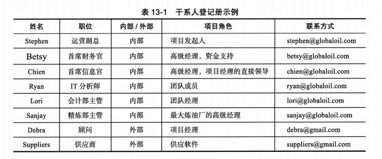
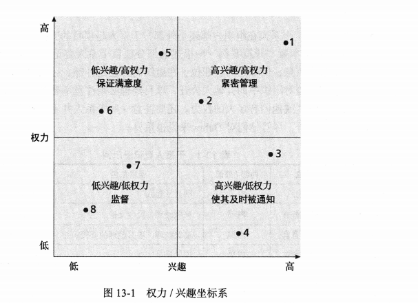
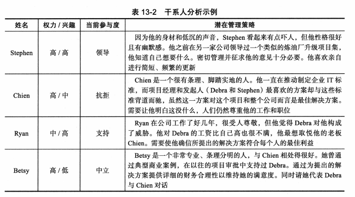
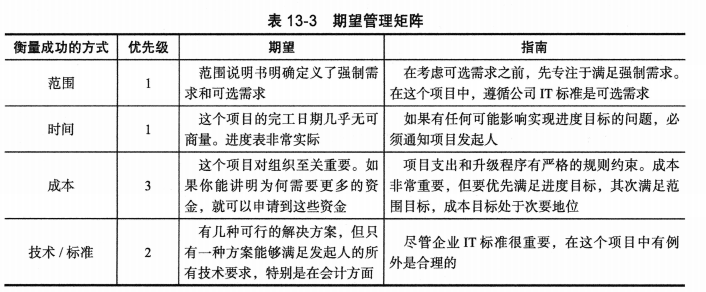
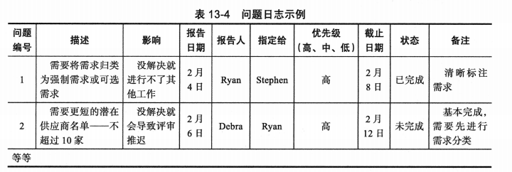

## 讨论问题

1. 项目干系人管理的4个过程
2. 干系人登记表包括哪些内容？
3. 干系人参与等级？
4. 干系人管理计划包括？
5. 参与度控制的方法？

## 项目干系人管理

- 项目干系人管理的目的是识别受项目影响的所有人员与组织、分析干系人的期望,并使干系人在项目的整个生命周期中有效参与项目决策。项目经理和他他们的团队必须与干系人进行良好的沟通,并及时解决问题使干系人满意。
- 项目干系人管理的4个过程如下:
    1. `识别干系人`是指识别参与项目或受项目影响的所有人员,并确确定管理干系人关系的最佳方式。这个过程的主要输出是干系人登记册。
    2. `计划干系人`参与是指根据干系人的需求、兴趣和潜在影响,硕确定使干系人有效参与项目决策和活动的策略。这个过程的输出是干系人参与计划。
    3. `管理干系人`参与是指与项目干系人沟通并一同工作,从人而满足他们的需求和期望、解决问题,并促进他们参与项目决策和活动。这个过程的输出是变更请求、项目管理计划更新和项目文档更新。
    4. `监督干系人`参与是指监督干系人关系,并根据干系人的需求调整计划和策略以吸引干系人参与。这个过程的输出是工作绩效信息、变更请求、项目管理计划更新和项目文档更新。

## 识别干系人

- 干系人可以在组织的内部,也可以在组织的外部。
  - `内部项目干系人`通常包括项目发起人、项目团队、支持人员和项目的内部客户。由于组织资源有限,其他内部干系人包括高层管理者、其他职能经理和其他项目经理。
  - `外部项目干系人`包括项目的客户(如果他们在组织外部)、竟争对手、供应商和其他潜在参与项目或受项目影响的外部团体,如政府官员和相关公民。
- 创建`干系人登记册(stakeholder register)`是记录项目干系人基本信息息的一种简单方式。该文件可以采取多种形式,其中包括以下信息:
  - `身份信息`:干系人的姓名、职位、所在地、在项目中的角色以及联系方式。
  - `评估信息`:干系人对项目的主要需求和期望、潜在影响,以及干系人最感兴趣的项目阶段。
  - `干系人分类`:干系人在组织内部还是外部?干系人是项目的的支持者还是反对者?

- `干系人分析(stakeholder analysis)`是一种技术,通过分析信息以确定干系人的关注点,
  - 你可以创建一个`权力/兴趣坐标系(power/interest grid)`,根据干系人的权力级别(权力)和对项目成果的关注级别(兴趣)对干系人进行分组。
  - 衡量整个项目中干系人的参与度(参与等级)同样重要。可以将干系人分为以下几类:
    - 无意识:没有意识到项目及其潜在影响。
    - 抗拒:意识到,但拒绝改变。
    - 中立:意识到,但不支持也不反对。
    - 支持:意识到,且支持改变。
    - 领导:意识到项目及其潜在影响,并积极参与以帮助项目取得成功。
  - 如果高兴趣和高权力的干系人也被归类为抗拒或无意识,项目团队应该采取纠正措施。

## 计划干系人参与

- 在识别和分析干系人之后,项目经理和团队应该制定干系人参与计划,以帮助他们有效地吸引干系人参与,并确保在项目的整个生命周期中做出良好的决策。根据项目的需要,可以是正式计划也可以是非正式计划
- 除了在干系人登记册中能找到的信息,如干系人识别信息、评估信息和分类情况,干系人参与计划还可以包括以下内容:
  - 当前参与水平和期望参与水平:如果这些水平不同,项目团队应该制定策略使之平衡。
  - 干系人之间的相互关系:正如前面章节中所学,在项目活动和干系人之间有多种相互关系。项目经理必须与组织的纲领保持一致。
  - 沟通需求:沟通管理计划应该详细列举干系人需求,干系人登记册可以根据特定人员的独特需求进行扩展。
  - 每个干系人的潜在管理策略:这个关键部分可能包含非常每数感的信息。
  - 干系人管理计划更新方法:所有计划都需要一些处理变更和更新的过程。当项目干系人在项目中发生变化时,灵活性变得十分重要。
- 因为干系人管理计划通常包含敏感信息,它不应该是官方项目文档的一部分,官方项目文档通常是所有干系人都可以查看的。多数情况下,只有项目经理和少数团队成员准备干系人管理计划。

## 管理干系人参与

- 项目发起人通常根据重要性对范围、进度和成本目标进行排序,并提供平衡三项约束的指南。这个排序显示在`期望管理矩阵(expectation management matrix)`中,它可用来辅助明确干系人的期望。不同干系人可能对优先级有不同的考量，这就需要大家达成共识

- 问题应该记录在`问题日志(issue log)`中,问题日志是用来记录、监督和跟踪需要解决的问题的一种工具。尚未解决的问题可能是发生冲突的主要原因,这会导致干系人的期望不能实现。请注意,PMI将问题日志作为项目整合管理的输出,而问题日志更新(项目文档的更新之一)是项目干系人管理的重要输出。问题也可以在其他知识领域成进行更新。

## 监督干系人参与

- 项目进度计划应该包括与干系人参与相关的活动和可交付成果。调查、评审、演示、签名和其他活动都需要干系人参与。

## 小结

- 管理干系人是《项目管理知识体系指南 (第6版)》的第十个知识领域。项目干系人管理包括识别干系人、计划干系人参与、管理干系人参与和监督干系人参与。

- 在识别项目干系人之前不能进行其他干系人管理的过程。干系人可以是组织的内部或外部人员，他们可能支持或反对你的项目。这个过程的主要输出是干系人登记册。

- 干系人分析是计划干系人参与的关键技术。有些信息，例如如何管理与干系人的关系， 可能是敏感信息，因此必须谨慎处理。干系人管理计划描述了干系人参与程度、相互关系、沟通需求、管理策略和更新计划的过程。

- 在管理干系人参与时，项目经理和他们的团队必须了解干系人的各种期望，并充分应用沟通和人际关系的技巧。鼓励干系人在项目早期参与和拥有需要干系人参与的可交付成果是非常重要的。这一过程的一个重要输出是更新问题日志，问题日志是用于辅助跟踪和解决项目问题的文档。

- 公开对话并跟踪可交付成果对于监督干系人参与是很重要的。有几种类型的软件可以用来辅助项目干系人管理。除了在其他章节中提到的改善沟通和协作的技术之外，社交媒体也有助于发展与干系人的关系。一些项目管理应用软件包含社交媒体的特性，比如“击掌庆祝”和发布评论。

- 一定要考虑项目干系人管理在敏捷/自适应环境中的差异。

## 关键术语

期望管理矩阵(expectations management matrix)
问题日志(issue log)
权力/兴趣坐标系(power/interest grid)
干系人分析(stakeholder analysis)
干系人登记册(stakeholder register)
