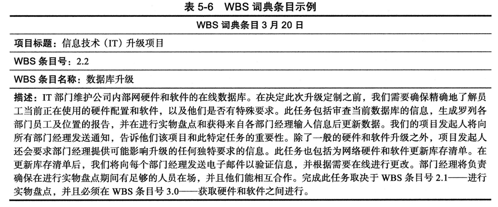

## 讨论问题

1. 项目范围管理涉及的6个主要过程
2. 范围管理计划包括哪些信息？
3. 收集需求的常用方法
4. 制定工作分解结构（WBS）的方法
5. 范围控制的目标
6. 公司应遵循哪些最佳实践来避免出现主要的范围问题？
7. 范围蔓延产生的原因？是否可以避免？如何预防范围蔓延的产生？

## 什么是项目范围管理

- 项目管理最重要也最难做的一项工作就是定义项目范围。范围是指开发项目产品所涉及的所有工作和用于开发产品的所有过程。
- 项目范围管理(projectscope management)是指界定和控制项目中应包括什么和不包括什么所涉及的过程。该过程确保了项目团队和干系人对项目的可交付成果以及生产这些可交付成果所进行的工作达成共识。项目范围管理包含6个主要过程:
    1. 计划范围管理：是指确定如何管理项目的范围和需求。
    2. 收集需求：是指定义并记录产品的特点和功能,以及开发这些品的过程。
    3. 定义范围：是指审查范围管理计划、项目章程、需求文档和组织过程资产来制定一份范围说明书,并且在需求的扩展和变更请求得到批准时增加更多的信息。
    4. 创建工作分解结构：是指将主要的项目可交付成果分解成更细小和更易管理的组成部分。
    5. 确认范围：是指项目可交付成果的正式验收。关键项目干系人,比如项目的客户以及项目发起人在这一过程中进行审查,然后正式验收项目的可交付成果。如果不接受现在的可交付成果,那么客户或项目发起人通常会请求变更。
    6. 控制范围：是指对项目范围的变化进行控制,这对许多IT项目而言是一种挑战。范围变更经常影响团队实现项目的时间目标和成本目标的能力,因此项目经理必须仔细权衡范围变更的成本及收益。

## 计划范围管理

一般来说,范围管理计划包括以下信息:

- 如何准备一个详细的项目范围说明书:例如,是否有模板或者指南可以遵循?需要多少细节来描述每个可交付成果?
- 如何创建一个WBS:创建一个好的WBS通常很难。本节的范围管理计划提供了用于创建WBS的建议、示例和资源。
- 如何维护和批准WBS:最初的WBS经常变化,并且项目目团队成员对WBS所包含的内容存在分歧。范围管理计划描述了维护WBS并获得批准的指南
- 如何获得已完成的项目可交付成果的正式验收:对已完成的项目可交付成果,了解其正式验收过程尤为重要,特别是对那些在正式验收后才付款的项目
- 如何控制项目范围的变更请求:如第4章所述,该过程与实施整合变更控制有关。组织经常有提交、评估和审批范围变更的指南,本节的范围管理计划会详细说明如何处理项目的变更请求。
- 范围管理计划的另外一个重要输出是需求管理计划。

IEEE软件工程标准术语表对"需求"的定义如下:

1. 用户解决问题或者达到目标所需要的一种条件或能力。
2. 一个系统或系统组件为了满足合同、标准、规范或者其他正式规定的文件所必须满足或具备的条件或能力。
3. 上述条件或能力的文档说明。

:::info 需求开发
对于软件项目而言,将需求开发划分为获取、分析、规范利确认4个软件工程步骤会很有帮助。这些步骤包括为软件或包含软件的产品收集、评估和记录需求所涉及的所有活动。
:::

`需求管理计划(requirement management plan)`记录了如何分析、记录和管理项目需求。需求管理计划包括以下信息:

- 如何计划、追踪和报告需求活动?
- 如何执行配置管理活动?
- 如何对需求进行优先级排序?
- 如何使用产品度量?
- 如何跟踪和捕获需求属性?

## 收集需求

- 项目范围管理的第二步是收集需求,这通常是最困难的。不能准确定义需求的主要后果是重复工作,这很可能会耗费过半的项目成本,尤其是对于软件开发项目。
- 困难的部分在于人们往往没有一个好的收集和记录项目需求的过程。

### 收集需求的方法

- 干系人一对一访谈：成本高，耗时长，有效
- 焦点小组会议、引导式研讨会、群体创新和决策技术：收集需求,比一对一访谈法更快、成本更低。
- 问卷调查法是一种行之有效的收集需求的方法,前提是关键干系人能够提供真实而全面的信息。
- 观察法也是收集需求的好方法,特别是对于需要改进工作过程或程序的项目。
- 对于软件开发项目,原型法和文档分析法是常见的收集需求的方法,和范围图一样,有助于明确一个项目或过程的界面或边界。
- 在敏捷软件开发项目中,正如第3章所示,产品负责人为每个冲刺创建有优先级的的产品待办事项列表。
- `标杆管理(benchmarking)`,是通过将特定的项目实践或产品特性与执行组织织内外部的其他项目或产品特性进行比较进而产生想法,也可以用于收集需求。

### 记录需求的方法

- 项目团队应该最先查阅项目章程,因为它包含了项目的高级需求
- 他们还应该参考项目范围与需求管理计划。
- 他们还应该查阅干系人登记册与干系人管理计划,以确保在所有关键干系人在决定需求时都有发言权。
- 记录干系人需求的文档既可以是在一页纸上列出全部需求的清单,也可以是堆满整个房间的记录各种需求的笔记本。参加过复杂项目的人,比如建造一架新飞机的人,深知一份记录飞机需求的文档比飞机本身更有价值。
- 需求文档通常由软件生成,包括文本、图像、图表、视频和其他媒介。需求经常被分为不同的类别,如功能需求、服务需求、性能需求、质量需求和培训需求。

除了准备需求文档作为收集需求的输出之外,项目团队经常创建需求跟踪矩阵。`需求跟踪矩阵(Requirement Traceability Matrix,RTM)`是一种列出各种需求、需求属性以及需求状态的表格,以确保所有需求得到解决。以表5-1为例。需求跟踪矩阵的主要目的是通过对需求的分解、执行和确认认来保持每个需求源的链接

## 定义范围

- 好的范围定义对项目的成功非常重要,因为好的项目定义有助于提高时间、成本及资源估算的为准确性。它定义了一个测量绩效和控制项目的基准,有助于传达明确的工作职责。
- 用于定义范围的主要工具和技术包括专家判断,数据分析,决策,人际关系和团队技能以及产品分析。
- 范围定义的主要输出是项目范围说明书和项目文档更新。表5-2展示了"开篇案例"中IT升级项目的章程。

## 创建工作分解结构

- 在收集需求和定义范围之后,项目范围管理的下一步是创建建一个工作分解结构。`工作分解结构(Work Breakdown Structure,WBS)`是项目中涉及的、以可交付成果为导向的工作分组,用于定义项目的总范围。
- 创建WBS的主要输入是项目管理计划、项目文档、企业环境因素和组织过程资产。
- 除了专家判断之外,主要的工具或技术是分解(decomposition),即将项目的可交付成果细分为更小的部分。
- 创建WBS过程的输出是范围基准和项目文档更新。范围基准包括已批准的项目范围说明书及其相关的WBS和WBS词典。

### WBS的形式

- 有图5-2所示的类似于组织结构图的形式

- 也有表5-4所示的表格形式

### WBS的内容

- 创建WBS时另外一个需要关注的问题是,如何组织一个VWBS使其为项目进度提供基础。你应该关注的是什么工作要做以及如何去做,而不是何时去做。换句话说,任务不用按照顺序列表一步一步完成。
- 所有的工作都必须包含在WBS中,包括项目管理

### 创建工作分解结构的方法

你可以使用若干方法来制定工作分解结构(WBS),这些方法包括:

- 使用指南
- 类比法：使用类似项目的WBS作为起点
- 自上而下法：较为常用，从最大的条目开始逐级分解
- 自下而上法：尽可能识别多的与项目相关的具体任务，然后再组合
- 思维导图法

### WBS 词典

- `WBS词典(WBS dictionary)`是一个为WBS每个条目提供详细信息的文档。不应该将WBS词典中的"词典"与定义术语或缩略词混淆。如表5-6所示

- 已批准的项目范围说明书和与之相关的WBS以及WBS词典构成了范围基准。满足项目范围目标的绩效就是基于这样的范围基准。

### 创建WBS和WBS词典的建议

- 一个工作单元应该在WBS中只出现一次。
- 一个WBS条目的工作内容是它下一级WBS条目工作内容的总和。
- 一个WBS条目都只对应一个负责人,虽然可能有很多人都在在为其工作。
- WBS必须与实际执行工作的方式保持一致:它首先要服务于于项目团队,并且只有在可行的情况下才能用于其他目的。
- 项目团队成员应该参与创建WBS,以确保一致性和认同。
- 每一个WBS条目都必须记录在WBS词典中,确保精确理解解条目中包含或不包含的工作范围。
- WBS必须是一个灵活变通的工具,以应对一些不可避免的变变更,同时根据范围说明书保持对项目工作内容的控制。

## 确认范围

- 为项目创建好的项目范围说明书和WBS是很困难的。特别到是对IT项目而言,要核实范围并使范围变更最小化更加困难。
- 即使界定了项目范围,许多IT项目还是会遭遇`范围蔓延(scopecreep)`——项目范围有不断扩大的趋势。有许多关于IT项目范围蔓延等问题导致ITI项目失败的可怕案例,包括下
- `范围确认(scopevalidation)`是指整个项目可交付成果的正式验收。这种验收通常通过客户检查实现,并在关键的可交付成果上签字。
- 范围确认的主要输入是项目管理计划、项目文档、验证的可交付成果以及工作绩效数据。执行范围确认的主要工具是检查和决策技术。
- 范围确认的主要输出出是验收的可交付成果、变更请求、工作绩效信息以及项目文档更新。

## 控制范围

- 范围控制的目的是影响那些导致范围变更的因素,确保变更能依据整体变更控制建立的过程有序进行,并在变更出现时对其进行管理。
- 范围控制的主要输入是项目管理计划、项目文档、工作绩效数据以及组织过程资产。执行范围控制的主要工具是数据分析,包括偏差分析。`偏差(variance)`是指计划与实际绩效之间的差别。

:::info 改进IT项目范围管理的建议

- 改善用户输入
- 减少不完善和不断变化的需求
- 使用软件辅助项目范围

:::

## 小结

- 项目范围管理包括确保识别并管理成功完成项目所必需的所有有工作的过程。主要过程包括计划范围管理、收集需求、定义范围、创建WBS、确认范围和控制范围。
- 项目范围管理的第一个步骤是计划范围管理。项目团队审查信息并采用专家评审会议,来帮助创建范围管理计划和需求管理计划。
- 下一个步骤是收集需求,它是许多IT项目的重要组成部分。重要的是在审查项目章程并且在收集需求时符合项目干系人登记表中列出的关键干系人的需求我。这个过程的主要输出是需求文档和需求跟踪矩阵。
- 项目范围说明书是在定义范围过程中创建的。该文档通常包含产品范围描述、产品用户接受标准、所有项目可交付成果的详细信息以及项目界限、限制条件和假设条件信息。通常有若干个版本的项目范围说明书以保证范围信息的详细和实时性
- 工作分解结构(WBS)是一个项目中以可交付成果为导向的步及所有工作的一种分组,它定义了项目的整体范围。WBS构成了计划和管理项目进度度、成本、资源及变更的基础。如果不先构建一个好的WBS,就无法使用项目管理软件。WVBS词典是描述每个工作分解结构条目的详细信息的文档。由于项目的复杂性,通常创建一个好的WBS非常困难。创建WBS有多种途径,包括使用指南、类比法、自上而下法、自下而上法和思维导图法。
- 范围确认是指干系人对项目范围的正式验收。范围控制是指控制颜目范围的变更。
- 糟糕的项目范围管理是项目失败的关键原因之一。对于IT项目,用户的深度参与、高层管理者的支持、一份明确的需求说明以及管理范围变更的过过程对于一个好的项目范围管理而言至关重要。
- 辅助项目范围管理的软件产品有很多种。WBS是恰当使用功目管理软件的关键概念,因为WBS为整个任务提供了基础。

## 关键术语

类比法(analogy approach)
标杆管理(benchmarking)
自下而上法(bottom-up approach)
分解(decomposition)
可交付成果(deliverable)
联合应用设计(JAD)(Joint Application Design,JAD)
项目范围管理(project scope management)
项目范围说明书(project scope statement)
原型法(prototyping)
需求(requirement)
需求管理计划(requirements management plan)
需求跟踪矩阵(RTM)(requirements traceability matrix,RTM)
范围(scope)
范围基准(scope base line)
范围蔓延(scope creep)
范围确认(scope validation)
自上而下法(top-down approach)
用例建模(use case modeling)
偏差(variance)
WBS词典(WBS dictionary)
工作分解结构(WBS)(work breakdown structure,WBS)
工作包(work package)
